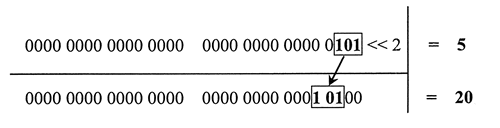
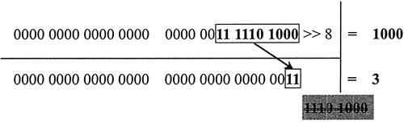

# 位运算
## 十进制转二进制
```js
function convertToBinary(num) {
  let str = num.toString(2)
  const length = 8 - str.length
  for (let i = 0; i < length; i++) { // 补 0 
    str = '0' + str
  }
  return str
}
console.log(convertToBinary(1)) // 00000001
```
## ArrayBuffer
`ArrayBuffer` 是一个普通的 `js` 构造函数，用于在内存中分配特定数量的字节空间
```js
const buf = new ArrayBuffer(16) // 在内存中分配 16 字节
console.log(buf.byteLength) // 16
```
## Uint8Array
[Uint8Array](https://developer.mozilla.org/zh-CN/docs/Web/JavaScript/Reference/Global_Objects/Uint8Array) 数组类型表示一个 8 位无符号整型数组，创建时内容被初始化为 0。创建完后，可以以对象的方式或使用数组下标索引的方式引用数组中的元素。
```js
new Uint8Array() // ES2017 最新语法
new Uint8Array(length) // 创建初始化为 0，包含 length 个元素的无符号整型数组
new Uint8Array(typedArray)
new Uint8Array(object)
new Uint8Array(buffer [, byteOffset [, length]])

const arraybuffer = new ArrayBuffer(8)
console.log(new Uint8Array(arraybuffer)) // Uint8Array(8) [0, 0, 0, 0, 0, 0, 0, 0]
```
## 移位运算
对二进制进行有规律低移位

:::warning 特点
"<<" 运算符执行左移位运算。在移位运算过程中，符号位始终保持不变。如果右侧空出位置，则自动填充 0，超出 32 位的值，则自动丢弃。

">>" 运算符执行有符号右移位运算。它把 32 位数字中的所有有效位整体右移，再使用符号位的值填充空位，移动过程中超出的值将被丢弃。
:::

### 左移演示
把数字 5 向左移动 2 位，返回值为 20。
```js
console.log(5 << 2); // 返回值 20
```
 

### 右移演示
把数值 1000 向右移 8 位，则返回值为 3
```js
console.log(1000 >> 8); // 返回值 3
```
 

以 `vue3` 里面的类型为例演示实际应用场景
```ts
const enum PatchFlags { 
  TEXT = 1, // 00000001
  CLASS = 1 << 1, // 00000010
  STYLE = 1 << 2, // 00000100
  PROPS = 1 << 3, // 8
  FULL_PROPS = 1 << 4, // 16
  HYDRATE_EVENTS = 1 << 5, // 32
  STABLE_FRAGMENT = 1 << 6, // 64
  KEYED_FRAGMENT = 1 << 7, // 128
  UNKEYED_FRAGMENT = 1 << 8, // 256
  NEED_PATCH = 1 << 9, // 512
  DYNAMIC_SLOTS = 1 << 10, // 1024
  DEV_ROOT_FRAGMENT = 1 << 11 // 2048
}
```
## 与、或
:::warning 特点
与运算(&): 两位同时为 1，结果才为 1，否则为 0
```js
00000001 & 00001000 = 00000000 
比如: 1 & 8 = 0
```

或运算(|): 两位只要有一位为 1，结果就为 1，否则为 0
```js
00000001 | 00001000 = 00001001 
比如: 1 | 8 = 9
```
:::