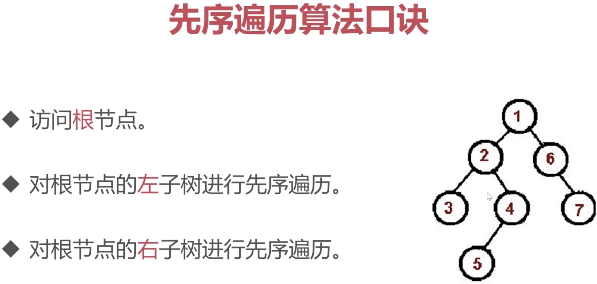
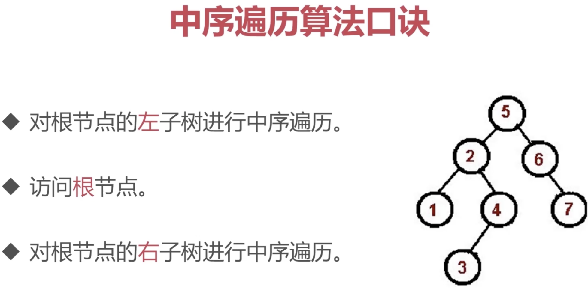
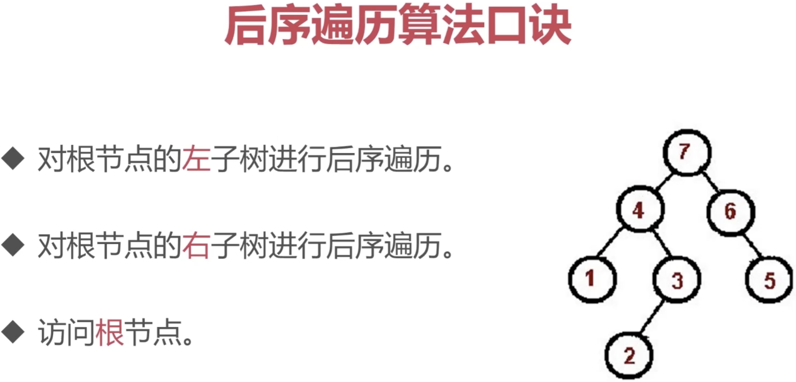

# 树
:::tip 简介
一种**分层**数据的抽象模型。

应用: `DOM` 树、级联选择、树形控件等

常用操作: 深度、广度遍历、二叉树的先中后序遍历
:::

```js
const tree = {
  val: 'a',
  children: [
    {
      val: 'b',
      children: [
        {
            val: 'd',
            children: [],
        },
        {
            val: 'e',
            children: [],
        }
      ]
    }
    {
      val: 'c',
      children: [
        {
            val: 'f',
            children: [],
        },
        {
            val: 'g',
            children: [],
        }
      ]
    }
  ]
}
```
## 深度优先遍历
:::tip 递归
- 1、访问根节点
- 2、对根节点的 children 挨个进行深度优先遍历
::: 
```js
const dfs = (root) => {
  console.log(root.val)
  root.children.forEach(dfs)
};

dfs(tree)
```
## 广度优先遍历
:::tip 队列
- 1、新建一个队列，把根节点入队

- 2、队头出队并访问

- 3、队头的 `children` 挨个入队

- 4、重复第二、第三步，直到队列为空
:::
```js
const bfs = (root) => {
  const queue = [root];
  while (queue.length > 0) {
    const n = queue.shift();
    console.log(n.val);
    n.children.forEach(child => {
        queue.push(child);
    })
  }
}

bfs(tree)
```
## 二叉树
:::tip 特点
树中每个节点最多只能有两个子节点
:::
新建 `bt.js` 文件，导出 `bt` 对象
```js
const bt = {
  val: 1,
  left: {
    val: 2,
    left: {
      val: 4,
      left: null,
      right: null,
    },
    right: {
      val: 5,
      left: null,
      right: null,
    }
  },
  right: {
    val: 3,
    left: {
      val: 6,
      left: null,
      right: null,
    },
    right: {
      val: 7,
      left: null,
      right: null,
    }
  }
}

module.exports = bt
```
## 先序遍历(根->左->右)

新建 `preorder.js`，导入 `bt` 对象
```js
const bt = require('./bt')

// 递归版
const preorder = (root) => {
  if (!root) return
  console.log(root.val) // 1 2 4 5 3 6 7
  preorder(root.left)
  preorder(root.right)
}

// 栈模拟递归
const preorder = (root) => {
  if (!root) return
  const stack = [root]
  while (stack.length) {
    const n = stack.pop()
    console.log(n.val)
    if (n.right) stack.push(n.right)
    if (n.left) stack.push(n.left)
  }
}
```
## 中序遍历(左->根->右)

新建 `inorder.js`，导入 `bt` 对象
```js
// 递归版
const inorder = (root) => {
  if (!root) return
  inorder(root.left)
  console.log(root.val) // 4 2 5 1 6 3 7
  inorder(root.right)
}

// 栈模拟递归
const inorder = (tree) => {
  if (!tree) return
  const stack = []
  let p = tree
  while(stack.length || p) {
    while(p) {
      stack.push(p)
      p = p.left
    }
    const n = stack.pop()
    console.log(n.val)
    p = n.right
  }
}
```
## 后序遍历(左->右->根)

新建 `postorder.js`，导入 `bt` 对象
```js
// 递归版
const postorder = (root) => {
  if (!root) return
  postorder(root.left)
  postorder(root.right)
  console.log(root.val) // 4 5 2 6 7 3 1
}

// 栈模拟递归
const postorder = (tree) => {
  if (!tree) return;
  const stack = [tree]
  const outputStack = []
  while(stack.length) {
    const n = stack.pop()
    outputStack.push(n)
    if (n.left) stack.push(n.left)
    if (n.right) stack.push(n.right)
  } 
  while(outputStack.length) {
    const n = outputStack.pop()
    console.log(n.val)
  }
}
```
## 最大深度
## 最小深度
## 二叉树层序遍历