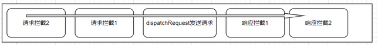

# 拦截器的设计与实现
## interceptors
```js
function Axios() {
  this.interceptors = {
    request: new InterceptorManager(),
    response: new InterceptorManager()
  };
}
```
`axios` 拥有 `interceptors` 对象属性，该属性又有 `request` 和 `response` 2 个属性，我们可以把这 2 个属性看做是一个拦截器管理对象。我们来看一下拦截器管理类的实现。
### InterceptorManager
入口文件在 `lib/core/InterceptorManager.js`；
```js
function InterceptorManager() {
  this.handlers = [];
}

// Add a new interceptor to the stack
InterceptorManager.prototype.use = function use(fulfilled, rejected) {
  this.handlers.push({
    fulfilled: fulfilled,
    rejected: rejected
  });
  return this.handlers.length - 1;
};

// Remove an interceptor from the stack
InterceptorManager.prototype.eject = function eject(id) {
  if (this.handlers[id]) {
    this.handlers[id] = null;
  }
};

// Iterate over all the registered interceptors
InterceptorManager.prototype.forEach = function forEach(fn) {
  utils.forEach(this.handlers, function forEachHandler(h) {
    if (h !== null) {
      fn(h);
    }
  });
};
```
`InterceptorManager` 类的内部维护了一个私有属性 `handlers`，它是一个数组，用来存储拦截器。该类还对外提供了 3 个方法，

- `use` 接口就是添加拦截器到 `handlers` 中，并返回一个 `id` 用于删除；

  该方法支持 2 个参数，第一个参数类似 `Promise` 的 `resolve` 函数，第二个参数类似 `Promise` 的 `reject` 函数，用户可以在 `resolve` 函数和 `reject` 函数中执行同步代码或者是异步代码逻辑。

  我们可以添加多个拦截器，拦截器的执行顺序是链式依次执行的方式。对于请求拦截器，后添加的拦截器会在请求前的过程中先执行；对于响应拦截器，先添加的拦截器会在响应后先执行。执行流程如下图: 

  
  
  使用方式如下：
  ```js
  axios.interceptors.request.use(function (config) { // 添加一个请求拦截器
    // 在发送请求之前可以做一些事情
    return config;
  }, function (error) {
    // 处理请求错误
    return Promise.reject(error);
  });
  axios.interceptors.response.use(function (response) { // 添加一个响应拦截器
    // 处理响应数据
    return response;
  }, function (error) {
    // 处理响应错误
    return Promise.reject(error);
  });
  ```


- `forEach` 接口就是遍历 `handlers` 用的，它支持传入一个函数，遍历过程中会调用该函数，并把每一个 `interceptor` 作为该函数的参数传入；
  该方法会在 `request` 函数内部使用。

- `eject` 就是删除一个拦截器，通过传入拦截器的 `id` 删除。使用方式如下：
  ```js
  const myInterceptor = axios.interceptors.request.use(function () {/*...*/})
  axios.interceptors.request.eject(myInterceptor)
  ```

## Axios.prototype.request
回到 `request` 函数内部，该函数主要做了几件事：
``` js
Axios.prototype.request = function request(config) {
  // 1、序列化参数
  if (typeof config === 'string') {
    config = arguments[1] || {};
    config.url = arguments[0];
  } else {
    config = config || {};
  }

  // 配置合并
  config = mergeConfig(this.defaults, config);

  // Set config.method
  if (config.method) {
    config.method = config.method.toLowerCase();
  } else if (this.defaults.method) {
    config.method = this.defaults.method.toLowerCase();
  } else {
    config.method = 'get';
  }

  // Hook up interceptors middleware
  var chain = [dispatchRequest, undefined];
  var promise = Promise.resolve(config);

  this.interceptors.request.forEach(function unshiftRequestInterceptors(interceptor) {
    chain.unshift(interceptor.fulfilled, interceptor.rejected);
  });

  this.interceptors.response.forEach(function pushResponseInterceptors(interceptor) {
    chain.push(interceptor.fulfilled, interceptor.rejected);
  });

  while (chain.length) {
    promise = promise.then(chain.shift(), chain.shift());
  }

  return promise;
};
```
+ 1、**序列化参数，实现函数重载**

  用户调用 `axios` 时可以直接传入 `config`，如 
  ```js
  axios({
    url: '/extend/post',
    method: 'post',
    data: {
      msg: 'hi'
    }
  })
  ```
  也可以传递 2 个参数(第1个是 `url`，第2个是 `config`)。
  ```js
  axios('/extend/post', {
    method: 'post',
    data: {
      msg: 'hello'
    }
  })
  ```
  在函数体内我们判断 `config` 是否为字符串类型，一旦它为字符串类型，真正的配置对象会取 `arguments[1]` 的值，如果为空则构造一个空对象，然后把 `url` 添加到 `config.url`，取 `arguments[0]` 的值。如果 `config` 不是字符串类型，则说明我们传入的就是单个参数，且 `config` 就是配置对象 `config`。
  ```js
  if (typeof config === 'string') {
    config = arguments[1] || {};
    config.url = arguments[0];
  } else {
    config = config || {};
  }
  ```
+ 2、**配置合并**

  调用 `mergeConfig` 把传入的配置和默认配置做一层合并，此处不展开了，后面会有单独介绍。
  ```js
  config = mergeConfig(this.defaults, config);
  ```
+ 3、**设置 http 请求方法**

  先取 `config` 中的 `method` 字段，存在则调用 `toLowerCase` 转化为小写。如果用户没有配置，则取默认配置中的 `method`，存在则调用 `toLowerCase` 转化为小写。如果默认配置中也没有，默认指定为 `get`。
  ```js
  if (config.method) {
    config.method = config.method.toLowerCase();
  } else if (this.defaults.method) {
    config.method = this.defaults.method.toLowerCase();
  } else {
    config.method = 'get';
  }
  ```
+ 4、**拦截器的实现**。

  首先，构造一个数组 `chain`，并把 `dispatchRequest` 函数赋值给 `resolved` 属性；接着先遍历请求拦截器插入到 `chain` 的前面；然后再遍历响应拦截器插入到 `chain` 后面。
  ```js
  var chain = [dispatchRequest, undefined];
  this.interceptors.request.forEach(function unshiftRequestInterceptors(interceptor) {
    chain.unshift(interceptor.fulfilled, interceptor.rejected);
  });
  this.interceptors.response.forEach(function pushResponseInterceptors(interceptor) {
    chain.push(interceptor.fulfilled, interceptor.rejected);
  });
  ```

  接下来定义一个已经 `resolve` 的 `promise`，循环这个 `chain`，拿到每个拦截器对象，把它们的 `resolved` 函数和 `rejected` 函数添加到 `promise.then` 的参数中，这样就相当于通过 `Promise` 的链式调用方式，实现了拦截器一层层的链式调用的效果。最后返回了 `promise`。
  ```js
  var promise = Promise.resolve(config);
  while (chain.length) {
    promise = promise.then(chain.shift(), chain.shift());
  }
  return promise;
  ```

## 总结
本节我们介绍了拦截器管理类的实现，着重分析了 `request` 方法的执行流程，剖析了拦截器链式调用的实现原理。

通常我们在设计一个库的时候，可以允许用户在发送请求的时候传入配置，来决定请求的不同行为，而 `axios` 可以有默认配置，定义一些默认的行为。这样在发送每个请求时，用户传递的配置可以和默认配置做一层合并，下一节我们来分析合并配置的设计与实现。
   
   