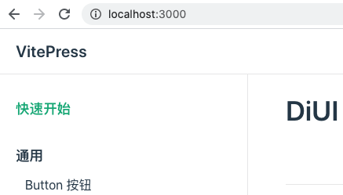
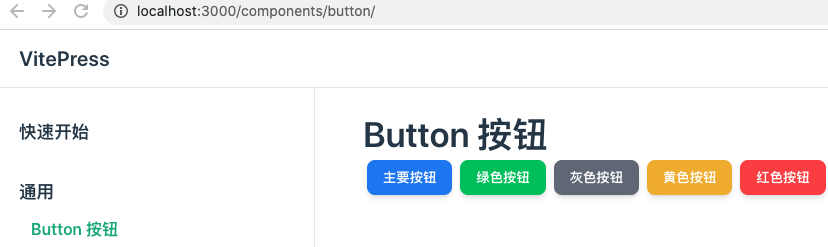
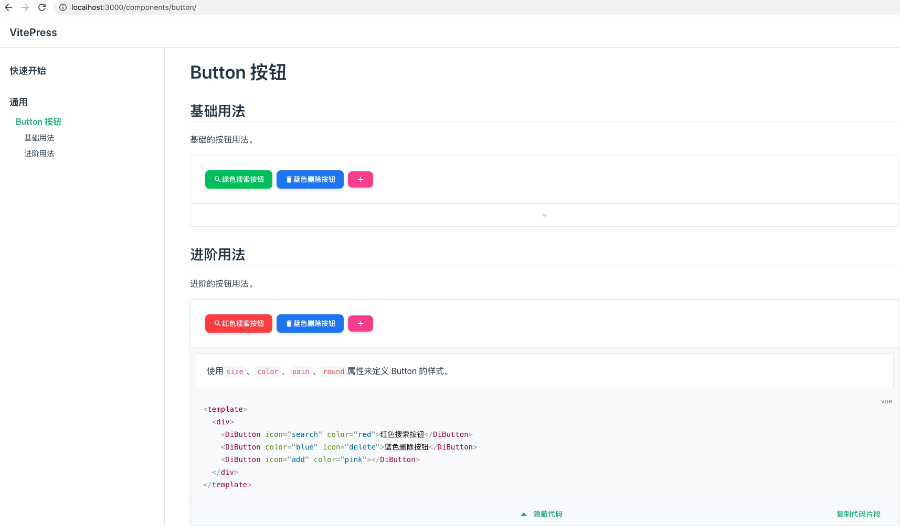

# 文档系统

## 搭建
- **步骤 1:** 安装 `vitepress`
```sh
pnpm i vitepress@0.22.4 -D
```
- **步骤 2:** 添加配置文件

`vitepress` 默认无需配置 `vite.config.ts`，但是组件库中需要支持 `JSX` 与 `unocss`，因此需要添加配置文件。

新建 `docs/vite.config.ts`
```ts
import { defineConfig } from "vite";
import vueJsx from "@vitejs/plugin-vue-jsx";
import Unocss from "../config/unocss";

export default defineConfig({
  plugins: [
    vueJsx(),
    Unocss(),
  ],
});
```
- **步骤 3:** 创建首页文档
```sh
echo '# DiUI' > docs/index.md
```

- **步骤 4:** 增加启动脚本
```json
"scripts": {
  "docs:dev": "vitepress dev docs",
  "docs:build": "vitepress build docs",
  "docs:preview": "vitepress preview docs"
}
```

- **步骤 5:** 菜单配置

新建`docs/.vitepress/config.ts`
```ts
import { defineConfig } from 'vitepress'

export default defineConfig({
  themeConfig: {
    sidebar: {
      '/': [
        { text: '快速开始', link: '/' },
        {
          text: '通用',
          children: [
            { text: 'Button 按钮', link: '/components/button/' },
          ]
        }
      ]
    }
  }
})
```
展示效果如下图所示：


## 展示组件

组件库文档一般都会有展示组件的需求，组件的展示实际上就是将组件引用到 `markdown` 页面中，那该如何将组件库引用并加载呢?

在 `vitepress` 中通过编写主题 `theme` 就可以获取 `vue` 实例，然后在注册组件库插件即可。

新建 `docs/.vitepress/theme/index.ts`
```ts
import DefaultTheme from 'vitepress/theme'
import DiUI from '../../../src/entry'

export default {
  ...DefaultTheme,
  enhanceApp({ app }) { // app 即为 vue 实例
    app.use(DiUI)
  }
}
```
新建 `docs/components/button/index.md`
```md
# Button 按钮

<div>
  <DiButton color="blue">主要按钮</DiButton>
  <DiButton color="green">绿色按钮</DiButton>
  <DiButton color="gray">灰色按钮</DiButton>
  <DiButton color="yellow">黄色按钮</DiButton>
  <DiButton color="red">红色按钮</DiButton>
</div>
```
展示效果如下图所示：


## 引入代码演示插件
若想同时演示组件和代码的酷炫效果，类似于 `ElementUI` 官网效果(`ElementUI` 实现了 `Markdown` 插槽，来实现同时显示组件与代码)，我们这里可以借助插件来实现。
- 1、安装插件
```sh
pnpm i vitepress-theme-demoblock@1.4.2 -D 
```
- 2、修改`docs/.vitepress/config.ts`，添加 `md` 配置
```ts
export default defineConfig({
  ...,
  markdown: {
    config: (md) => {
      const { demoBlockPlugin } = require('vitepress-theme-demoblock')
      md.use(demoBlockPlugin) // // 添加 demoBlock 插槽
    }
  }
})
```
- 3、修改`docs/.vitepress/theme/index.ts`，添加插件需要的组件
```ts
...
import 'vitepress-theme-demoblock/theme/styles/index.css' // 主题样式
// 插件的组件
import Demo from 'vitepress-theme-demoblock/components/Demo.vue'
import DemoBlock from 'vitepress-theme-demoblock/components/DemoBlock.vue'

export default {
  ...
  enhanceApp({ app }) {
    app.component('Demo', Demo)
    app.component('DemoBlock', DemoBlock)
  },
}
```
- 4、修改 `docs/components/button/index.md`
# Button 按钮

## 基础用法
基础的按钮用法。

:::demo 使用`size`、`color`、`pain`、`round`属性来定义 Button 的样式。
```vue
<template>
  <div>
    <DiButton icon="search">绿色搜索按钮</DiButton>
    <DiButton color="blue" icon="delete">蓝色删除按钮</DiButton>
    <DiButton icon="add" color="pink"></DiButton>
  </div>
</template>
```
:::
## 进阶用法
进阶的按钮用法。

:::demo 使用`size`、`color`、`pain`、`round`属性来定义 Button 的样式。
```vue
<template>
  <div>
    <DiButton icon="search" color="red">红色搜索按钮</DiButton>
    <DiButton color="blue" icon="delete">蓝色删除按钮</DiButton>
    <DiButton icon="add" color="pink"></DiButton>
  </div>
</template>
```
:::

展示效果如下图所示：


## 复盘
至此我们介绍完了如何为组件库搭建文档，我们着重讲述了以下3点：
- 1、引入 `vitepress`，搭建静态网站。
- 2、通过配置主题 `theme` 获取 `vue` 实例来加载组件库，实现展示组件库运行效果。
- 3、通过引入 `demoBlock(markdown 插槽)`，达到同时展示组件库和代码块的酷炫效果。

那么下一节我们将会为组件库添加单元测试。


