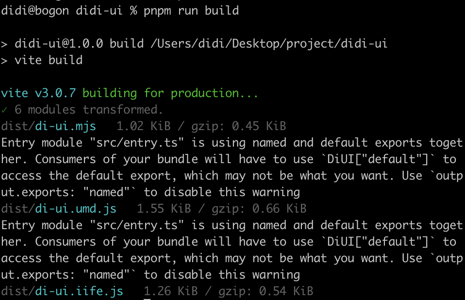
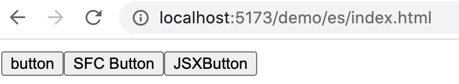

# 快速开始
## 环境搭建
- **步骤 1:** 创建一个新目录并进入
```sh
mkdir didi-ui && cd didi-ui
```
- **步骤 2:** 初始化
```sh
pnpm init
```
[pnpm](https://www.pnpm.cn/) 的优势: 快速、节省磁盘空间、支持单体仓库等
- **步骤 3**: 本地安装 `vite`、`vue`
```sh
pnpm i vite@3.0.7 -D
pnpm i vue@3.2.36
```
- **步骤 4:** 在 `package.json` 添加 `scripts`
```json
{
  "scripts": {
    "dev": "vite",
    "build": "vite build"
  }
}
```
- **步骤 5:** 新建 `index.html`
```html
<!DOCTYPE html>
<html lang="en">
<head>
  <meta charset="UTF-8">
  <meta http-equiv="X-UA-Compatible" content="IE=edge">
  <meta name="viewport" content="width=device-width, initial-scale=1.0">
  <title>测试 vite 站点</title>
</head>
<body>
  <div id="app"></div>
</body>
</html>
```
- **步骤 6:** 在本地服务器上启动站点
```sh
pnpm run dev
```
`vite` 会在 http://localhost:5173 启动一个热重载的开发服务器。

## 传统组件开发方式
新建 `src/button/index.tsx`，添加如下代码：
```tsx
import { defineComponent, h } from 'vue'

export default defineComponent({
  name: 'DiButton',
  render() {
    return h('button', null, 'button')
  }
  // template: '<button>button</button>'

  // 这里之所以用 render 函数 而不用 template，
  // 是因为 Vue3 默认的包是不支持模板编译功能的。
  // Vue3 中编译功能推荐在构建阶段完成，而不是放到浏览器中运行，具体报错如下:   
  
  // Component provided template option but runtime compilation is not supported in this build of Vue. 
  // Configure your bundler to alias "vue" to "vue/dist/vue.esm-bundler.js". 
})
```
新建 `src/index.ts`，添加如下代码
```ts
import DiButton from './button'
import { createApp } from 'vue'
createApp(DiButton).mount('#app')
```
在 `index.html` 中引用 `src/index.ts`
```html
...
<script src="./src/index.ts" type="module"></script>
<body>
  <div id="app"></div>
</body>
</html>
```
## 单文件组件
由于 `vue3` 默认的包是不支持模板编译功能的，如果想让 `vite` 来支持模版编译，我们可以安装 `vite` 的 `vue` 插件来实现。

- **步骤 1:** 安装 `vite` 的 `vue` 插件
```sh
pnpm i @vitejs/plugin-vue@3.0.3 -D
```
- **步骤 2:** 新建 `vite.config.ts`，配置插件
```ts
import { defineConfig } from "vite"
import vue from "@vitejs/plugin-vue"

export default defineConfig({
  plugins: [vue()]
})
```
- **步骤 3:** 新建 `src/SFCButton.vue`，添加如下代码
```vue
<template>
  <button>SFC Button</button>
</template>
<script lang="ts">
  export default {
    name: "SFCButton"
  }
</script>
```
- **步骤 4:** 在 `src/index.ts` 中引入，
```ts
import { createApp } from "vue"
import SFCButton from "./SFCButton.vue"

createApp(SFCButton).mount("#app")
```
- **步骤 5:** 新建 `shims-vue.d.ts`，添加类型声明
```ts
declare module '*.vue' {
  import { DefineComponent } from 'vue'
  const component: DefineComponent<{}, {}, any>
  export default component
}
```
## 支持 JSX

很多基于 `vue` 的组件库都在大量使用 `jsx` ，因为它的书写方式更加灵活，我们也要支持这种开发方式。
- **步骤 1:** 安装 `jsx` 插件
```sh
pnpm i @vitejs/plugin-vue-jsx@2.0.0 -D
```
- **步骤 2:** 修改 `vite.config.ts`，配置 `jsx` 插件
```ts
import { defineConfig } from 'vite'
import vue from '@vitejs/plugin-vue'
import vueJsx from '@vitejs/plugin-vue-jsx'

export default defineConfig({
  plugins: [
    vue(),
    vueJsx()
  ]
})
```
- **步骤 3:** 新建 `src/JSXButton.tsx`，添加如下代码：
```tsx
import { defineComponent, h } from 'vue'

export default defineComponent({
  name: 'JSXButton',
  render() {
    return <button>JSXButton</button>
  }
})
</script>
```
- **步骤 4:** 新建 `tsconfig.json`，配置如下
```json
{
  "compilerOptions": {
    "declaration": true, // 生成 .d.ts 文件
    "declarationDir": "./dist/types", // .d.ts 文件输出目录
    "jsx": "preserve"
  },
  "include": [
    "./**/*.*",
    "./shims-vue.d.ts",
  ],
  "exclude": ["node_modules"],
  "esModuleInterop": true,
  "allowSyntheticDefaultImports": true
}
```
- **步骤 5:** 在 `src/index.ts` 中引入
```ts
import { createApp } from "vue"
import JSXButton from './JSXButton'

createApp(JSXButton).mount('#app')
```

## 库文件封装
一般来说，组件库的引入形态有如下两种:
- 完整引入：一次性引入全部组件(使用 `Vue.use` 引入)
- 按需引入：按需引入单个组件(使用 `Vue.component` 注册)。

以 [ElementUI](https://element.eleme.cn/#/zh-CN/component/quickstart) 为例:
```js
import Vue from 'vue'

// 1、完整引入
import ElementUI from 'element-ui'
Vue.use(ElementUI)

// 2、按需引入
import { Button, Select } from 'element-ui'

Vue.component(Button.name, Button)
Vue.component(Select.name, Select)
```
综上所述，组件库的形态应该要满足以下需求: 1、默认导出为 `vue` 插件 2、支持组件单独导出

新建 `src/entry.ts`，添加如下代码：
```ts
import { App } from 'vue'
import DiButton from './button'
import JSXButton from './JSXButton'
import SFCButton from './SFCButton.vue'

export { 
  DiButton,
  SFCButton,
  JSXButton
}

export default {
  install(app: App) {
    app.component(DiButton.name, DiButton)
    app.component(SFCButton.name, SFCButton)
    app.component(JSXButton.name, JSXButton)
  }
}
```
## 编译构建
如果导出的是一个库文件的话，需要配置【导出模块类型】和导出文件名。在 `vite.config.ts` 中新增 `buid` 的配置项
```ts
...
const rollupOptions = {
  external: ["vue", "vue-router"],
  output: {
    globals: {
      vue: "Vue"
    }
  }
}

export default defineConfig({
  plugins: [
    vue(),
    vueJsx()
  ],
  build: {
    rollupOptions,
    minify: false,
    lib: {
      entry: "./src/entry.ts",
      name: "DiUI",
      fileName: "di-ui",
      formats: ["es", "umd","iife"] // 导出模块格式
    },
  },
})
```
执行 `pnpm run build`，会输出对应格式的 `js` 文件。



## 测试

首先测试加载全部组件，新建 `demo/es/index.html`，引用构建完的 `di-ui.mjs`
```html
<!DOCTYPE html>
<html lang="en">
<head>
  <meta charset="UTF-8">
  <meta http-equiv="X-UA-Compatible" content="IE=edge">
  <meta name="viewport" content="width=device-width, initial-scale=1.0">
  <title>测试加载全部组件</title>
</head>
<body>
  <div id="app"></div>
  <script type="module">
    import { createApp } from 'vue/dist/vue.esm-bundler.js'
    import DiUI, { 
      DiButton,
      JSXButton,
      SFCButton
    } from '../../dist/di-ui.mjs'
    createApp({
      template: `<DiButton/><SFCButton/><JSXButton/>`
    }).use(DiUI).mount('#app')
  </script>
</body>
</html>
```
测试按需加载组件，新建 `demo/es/button.html`
```html
<!DOCTYPE html>
<html lang="en">
<head>
  <meta charset="UTF-8">
  <meta http-equiv="X-UA-Compatible" content="IE=edge">
  <meta name="viewport" content="width=device-width, initial-scale=1.0">
  <title>测试按需加载组件</title>
</head>
<body>
  <div id="app"></div>
  <script type="module">
    import { createApp } from 'vue/dist/vue.esm-bundler.js'
    import { 
      DiButton,
      JSXButton,
      SFCButton
    } from '../../dist/di-ui.mjs'
    createApp({
      template: `<DiButton/><SFCButton/><JSXButton/>`
    })
    .component(DiButton.name, DiButton)
    .component(JSXButton.name, JSXButton)
    .component(SFCButton.name, SFCButton)
    .mount('#app')
  </script>
</body>
</html>
```


## 复盘
至此我们介绍完了如何使用 `vite` 来编写组件库，我们着重讲述了以下4点：
- 1、如何使用 `vite` 从零搭建 `vue` 开发环境
- 2、如何让 `vite` 支持 `SFC` 与 `JSX` 语法
- 3、分析组件库的封装形态
- 4、如何使用 `vite` 完成库文件的构建

那么下一节我们将会给组件库添加样式系统，让组件库可以拥有一套统一风格的样式。

