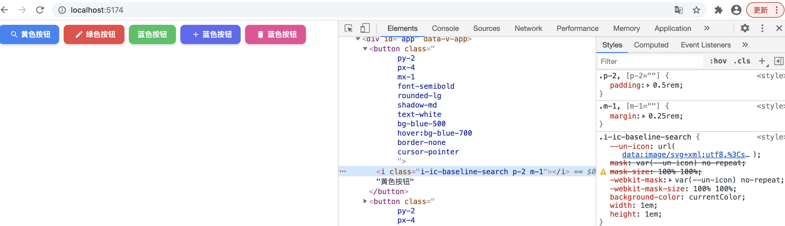

# 样式系统
每个组件库都有一套完备的样式系统，以此来确保组件样式风格的统一。`ElementUI` 基于 `sass + gulp` 搭建了一套 `css` 子工程，用于实现组件库的类型系统。

随着原子样式的出现，开发者无需搭建样式系统即可高效完成样式的定制。

## 何为原子化
2020 年一种叫做 `AtomicCSS` 的组件风格横空出世，代表作就是 `TailwindCSS`。最近两年，`TailwindCSS` 一直保持高热度。不过 `TailwindCSS` 虽好，但是性能上依然存在以下不足:

- 1、生成大量样式定义，导致全量的样式文件往往体积会多至数 `MB`，严重影响页面性能。
- 2、在开发时进行动态的按需剪裁，会影响编译性能，降低开发体验。

为了解决性能问题，这里我们采用 [unocss](https://github.com/unocss/unocss)。

## `unocss`
`unocss` 是一个拥有高性能且具灵活性的即时原子化 `css` 引擎，可以兼顾产物体积和开发性能，另外它有更强的可定制性和易用性，优势如下:

- 1、完全可定制(没有核心实用程序，所有功能都通过预设提供)
- 2、无需解析、无需 AST、无需扫描，它是即时的
- 3、快捷方式(动态别名实用程序)
- 4、`css scoping`
- 5、`css` 代码拆分
- 6、纯 `css` 图标
- 7、属性模式(在属性中分组实用程序)
- 8、检查器(以交互方式检查和调试)
- 9、`css-in-js` 运行时版本
- 10、库友好(随组件库提供原子样式并安全地限定范围)
- 11、零依赖和浏览器友好

另外基于 `vite` 良好的支持，也是选择 `unocss` 的一个重要原因。

- **步骤 1:** 安装。
```sh
pnpm i -D unocss@0.44.5
```
- **步骤 2:** 在 `vite.config.ts` 中添加 `unocss` 配置
```ts{5-11}
import { presetAttributify, presetIcons, presetUno} from 'unocss'
import Unocss from 'unocss/vite'

export default defineConfig({
  Unocss({
    presets: [ 
      presetUno(), 
      presetAttributify(), 
      presetIcons() // 字体图标预设
    ]
  })
})
```
- **步骤 3:** 修改 `src/button/index.tsx`代码
```tsx{22}
import { defineComponent } from "vue";
import "uno.css";

export default defineComponent({
  name: 'DiButton',
  setup(props, { slots }) {
    return () => <button
      class={`
        py-2 
        px-4 
        mx-1
        font-semibold 
        rounded-lg 
        shadow-md 
        text-white 
        bg-green-500 
        hover:bg-green-700 
        border-none 
        cursor-pointer
      `}
    > 
      { slots.default ? slots.default() : ''}
    </button>
  }
})
```
- **步骤 4:** 修改 `src/index.ts` 
```ts{5}
import DiButton from './button'
import { createApp } from 'vue/dist/vue.esm-bundler'

createApp({
  template: `<DiButton>自定义按钮</DiButton>`
}).component(DiButton.name, DiButton).mount('#app')
```


## 组件属性定制按钮样式
- 1、 通过 `color` 属性定制背景颜色

修改 `src/index.ts`
```ts{6-10}
import DiButton from './button'
import { createApp } from 'vue/dist/vue.esm-bundler'

createApp({
  template: `
    <DiButton color="blue">蓝色按钮</DiButton>
    <DiButton color="red">红色色按钮</DiButton>
    <DiButton>绿色按钮</DiButton>
    <DiButton color="purple">紫色按钮</DiButton>
    <DiButton color="pink">粉红按钮</DiButton>
  `
}).component(DiButton.name, DiButton).mount('#app')
```
修改 `src/button/index.tsx`
```tsx{15,20-21}
import { defineComponent, PropType } from 'vue'
import 'uno.css'

type IColor = 'gray' | 'red' | 'yellow' | 'green' | 'blue'| 'indigo' | 'purple' | 'pink'

export const props = {
  color: {
    type: String as PropType<IColor>,
    default: 'green' // 默认绿色
  }
}

export default defineComponent({
  ...,
  props, // 注册属性
  setup(props, { slots }) {
    return () => <button
      class={`
        ...
        bg-${props.color}-500 
        hover:bg-${props.color}-700
      `}
    > 
      { slots.default ? slots.default() : ''}
    </button>
  }
})
```

:::warning 颜色失效原因
由于 `unocss` 默认是按需生成方式，只会生成代码中使用过的样式。在 `class` 属性中使用变量的话是无法分析变量的取值的，因而无法动态生成样式。
:::

::: tip 解决方案
`unocss` 提供了安全列表选项，我们可以把变量的取值添加到 `safelist` 中。
:::

## 安全列表
修改 `vite.config.ts` 文件，新增 `safelist`
```ts{23}
const colors = [ // 定义颜色集合
  "white",
  "black",
  "gray",
  "red",
  "yellow",
  "green",
  "blue",
  "indigo",
  "purple",
  "pink"
];

const safelist = [
  ...colors.map(color => `bg-${color}-500`),
  ...colors.map(color => `bg-${color}-700`)
]

export default defineConfig({
  plugins: [
    ...
    Unocss({
      safelist, // 新增 safelist 选项
      presets: [
        presetUno(), 
        presetIcons(), 
        presetAttributify()
      ]
    })
  ],
  ...
})
```
最终效果如下: 


- 2、 通过 `size` 属性定制按钮大小(原理和 `color` 一致，此处不介绍了)

## 字体图标

**步骤 1：** 引入字体图标库

在 `unocss` 中引入图标，只需要加载 `@unocss/preset-icons` 预设即可。它提供了 [iconify](https://icones.js.org/) 图标框架中大量的图表集。由于我们在 `vite.config.ts` 中已经添加过了 `presetIcons` 的预设了，此处可以跳过。 

```sh
pnpm i -D @iconify-json/ic@1.1.4
```

**步骤 2：** 添加图标名到 `safelist` 中
```ts
const icons = [
  "search",
  "edit",
  "check",
  "message",
  "star-off",
  "delete",
  "add",
  "share"
]

const safelist = [
  ...,
  ...icons.map(icon => `i-ic-baseline-${icon}`) // 此处我们使用的是 ic:baseline-xxx 格式的图标
]
```

**步骤 3：** 修改 `src/button/index.tsx`
```tsx{13}
export const props = {
  ...,
  icon: {
    type: String,
    default: ''
  }
}

export default defineComponent({
  ...,
  setup(props, { slots }) {
    return () => <button class = { ... }> 
      { props.icon ? <i class = {`i-ic-baseline-${props.icon} p-2 m-1`}></i> : '' }
      { slots.default ? slots.default() : ''}
    </button>
  }
})
```
最终效果如下: 


## 打包抽离样式文件

更改 `vite.config.ts` 中的 `build` 配置项，新增 `cssCodeSplit` 配置项
```ts{5}
export default defineConfig({
  ...,
  build: {
    ...
    cssCodeSplit: true, // 在编译的时候是否要独立输出 css
    ...
  }
})
```
执行 `pnpm run build`，在 `dist/assets` 文件夹生成抽离后的样式文件。

## 测试
修改 `demo/es/index.html`，引用构建完的 `di-ui.mjs` 和 样式文件
```html
<head>
  ...
  <link rel="stylesheet" href="../../dist/assets/entry.3619f728.css">
</head>
<body>
  <div id="app"></div>
  <script type="module">
    import { createApp } from 'vue/dist/vue.esm-bundler.js'
    import DiUI, { 
      DiButton,
      JSXButton,
      SFCButton
    } from '../../dist/di-ui.mjs'
    createApp({
      template: `
        <DiButton color="yellow" icon="search">黄色按钮</DiButton>
        <DiButton color="blue" icon="edit">蓝色按钮</DiButton>
        <DiButton>绿色按钮</DiButton>
        <DiButton color="red" icon="add">红色按钮</DiButton>
        <DiButton color="pink" icon="delete">粉红按钮</DiButton>
      `
    }).use(DiUI).mount('#app')
  </script>
</body>
</html>
```

最终效果如下: 


## 复盘
至此我们介绍完了如何为组件库添加样式系统(通过引入 `unocss` 来实现)，我们着重讲述了以下3点：

- 1、引入 `unocss` 实现原子化 `css`
- 2、如何在 `unocss` 中使用变量定制样式(基于安全列表)
- 3、如何在 `unocss` 中引入字体图标

那么下一节我们将会给组件库添加文档系统，将开发的组件以文档的形式暴露在用户面前。
