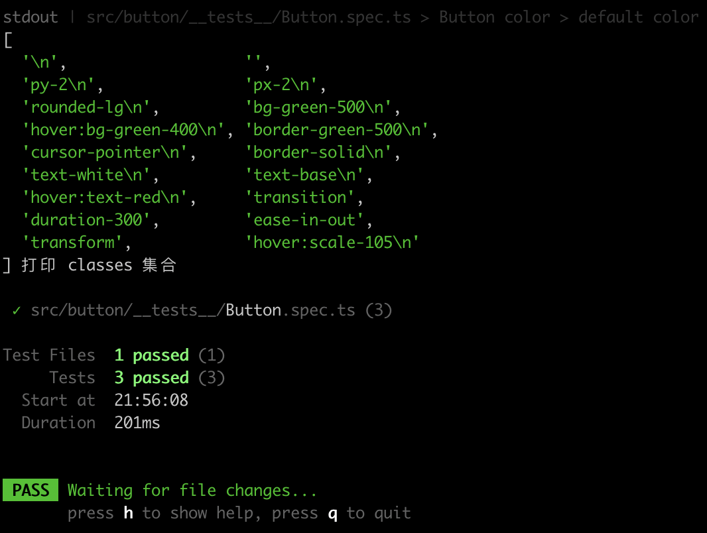

# vitest 测试组件
在 `vitest` 之前，前端普遍的测试框架是 `Jest`。`Jest` 是由 `Facebook` 开源的一款测试框架，它本身集成了断言库、`mock`、快照测试、覆盖率报告等功能。

那为什么要选择 `vitest` 作为组件的测试框架呢? [vitest 的优势猛戳这里](/structure/vite/environment)

## 编写测试用例
新建 `src/button/__tests__/Button.spec.ts`
```ts
import Button from "../Button"

import { shallowMount } from "@vue/test-utils"
import { describe, expect, test } from "vitest"


describe('Button', () => { // 测试分组
 test("测试组件挂载", () => {
    const wrapper = shallowMount(Button, {
      slots: {
        default: 'Button'
      }
    })
  
    expect(wrapper.text()).toBe("Button")
  })
})
```
### 测试按钮颜色
```ts
describe('测试组件颜色', () => {
  test("默认颜色", () => {
    const wrapper = shallowMount(Button, {
      slots: {
        default: 'Button'
      }
    });
    console.log(wrapper.classes(), '打印 classes 集合')
    expect(wrapper.classes().map(v => v.replace('\n','')).includes('bg-green-500')).toBe(true)
  });

  test('红色', () => {
    const wrapper = shallowMount(Button, {
      slots: {
        default: 'Button'
      },
      props: {
        color: 'red'
      }
    })
    expect(wrapper.classes().map(v => v.replace('\n', '')).includes('bg-red-500')).toBe(true)
  })
})
```
测试结果如下图:



