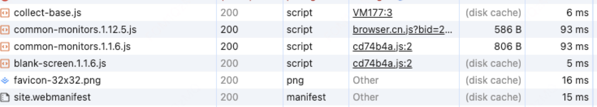
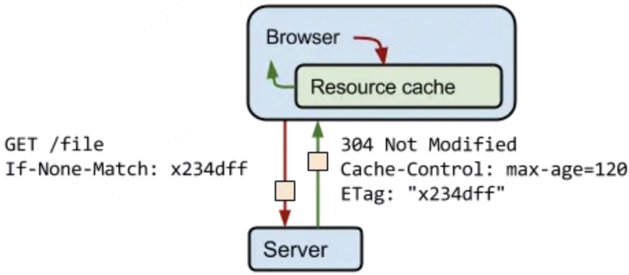

# 缓存位置
## Memory Cache

指的是**内存中的缓存**，读取内存中的数据肯定比磁盘快。虽然读取高效，但是缓存持续性很短，会随着进程的释放而释放。 一旦关闭 Tab 页面，内存中的缓存也就被释放了。

当我们访问过页面以后，再次刷新页面，可以发现很多数据都来自于内存缓存


## Disk Cache

指存储在**硬盘中的缓存**，读取速度慢，但是什么都能存储到磁盘中，相比内存缓存， Memory Cache 胜在 **容量和存储时效性上**。



# 缓存策略

通常浏览器缓存策略分为两种：**强缓存**和**协商缓存**，并且缓存策略都是通过设置 HTTP Header 来实现的

## 强缓存

强缓存通过设置两种 HTTP Header 实现：`Expires` 和 `Cache-Control` 。强缓存表示在缓存期间不需要请求，状态码为 200。

### Expires

Expires 是 HTTP/1 的产物，表示资源会在设置的时间后过期，需要再次请求。

**Expires 受限于本地时间，如果修改了本地时间，可能会造成缓存失效**

```js

import express from 'express'
const app = express()

app.get('/', (req, res) => {
  res.setHeader('Expires', new Date('2024-4-14 12:00:00').toUTCString()) // 设置过期时间
})
```

### Cache-Control

Cache-Control 出现于 HTTP/1.1，**优先级高于 Expires**。该属性值表示资源会在 xx 秒后过期，需要再次请求。

Cache-Control 可以在请求头或者响应头中设置，并且可以组合使用多种指令(如下)，达到多个目的

- `public`：表示响应可以被客户端和代理服务器缓存。
- `private`：表示响应只可以被客户端缓存。
- `max-age`：缓存的时长(秒)，过期后需要重新请求。
- `no-cache`：资源被缓存，但是立即失效，下次会发起请求验证资源是否过期。
- `no-store`：不缓存任何响应。
```js
app.get('/', (req, res) => {
  // 资源会在 30 秒后过期
  res.setHeader('Cache-Control', 'public, max-age=30') 
})
```
## 协商缓存

如果缓存过期了，就需要发起请求验证资源是否有更新。协商缓存可以通过设置两种 HTTP Header 实现：**Last-Modified** 和 **ETag**

当浏览器发起请求验证资源时，如果资源没有做改变，那么服务端就会返回 `304` 状态码，并且更新浏览器缓存有效期

 

### Last-Modified 和 If-Modified-Since

**Last-Modified 表示本地文件最后修改日期**，If-Modified-Since 会将 Last-Modified 的值发送给服务器，询问服务器在该日期后资源是否有更新，有更新的话就会将新的资源发送回来，否则返回 304 状态码。

但是 Last-Modified 存在一些弊端：

+ 如果本地打开缓存文件，即使没有对文件进行修改，但还是会造成 Last-Modified 被修改，服务端不能命中缓存导致发送相同的资源
+ 因为 Last-Modified 只能以秒计时，如果在不可感知的时间内修改完成文件，那么服务端会认为资源还是命中了，不会返回正确的资源

因为以上这些弊端，所以在 HTTP / 1.1 出现了 ETag
```js
import fs from 'node:fs'
const getModifyTime = () => { // 文件最后修改时间
  return fs.statSync('./index.js').mtime.toISOString()
}

app.get('/api', (req, res) => {
  res.setHeader('Cache-Control', 'no-cache, max-age=2592000')// 走协商缓存
  const ifModifiedSince = req.headers['if-modified-since']
  res.setHeader('Last-Modified', getModifyTime())

  if (ifModifiedSince && ifModifiedSince === getModifyTime()) {
    res.statusCode = 304
    res.end()
  } else {
    res.end('value')
  }
})
```
### ETag 和 If-None-Match

ETag 类似于文件指纹，If-None-Match 会将当前 ETag 发送给服务器，询问该资源 ETag 是否变动，有变动的话就将新的资源发送回来。

`ETag 优先级比 Last-Modified 高`

```js
import fs from 'node:fs'
import crypto from 'node:crypto'
const getFileHash = () => {
  return crypto.createHash('sha256').update(fs.readFileSync('index.js')).digest('hex')
}

app.get('/api', (req, res) => {
  res.setHeader('Cache-Control', 'no-cache, max-age=2592000')
  const etag = getFileHash()
  const ifNoneMatch = req.headers['if-none-match']
  if(ifNoneMatch && ifNoneMatch === etag) {
    res.sendStatus(304)
    return
  }

  res.setHeader('ETag', etag)
  res.send('Etag')  
})
```
## 实际场景应用缓存策略
### 频繁变动的资源
对于频繁变动的资源，首先需要使用 Cache-Control: no-cache 使浏览器每次都请求服务器，然后配合 ETag 或者 Last-Modified 来验证资源是否有效。这样的做法虽然不能节省请求数量，但是能显著减少响应数据大小。


