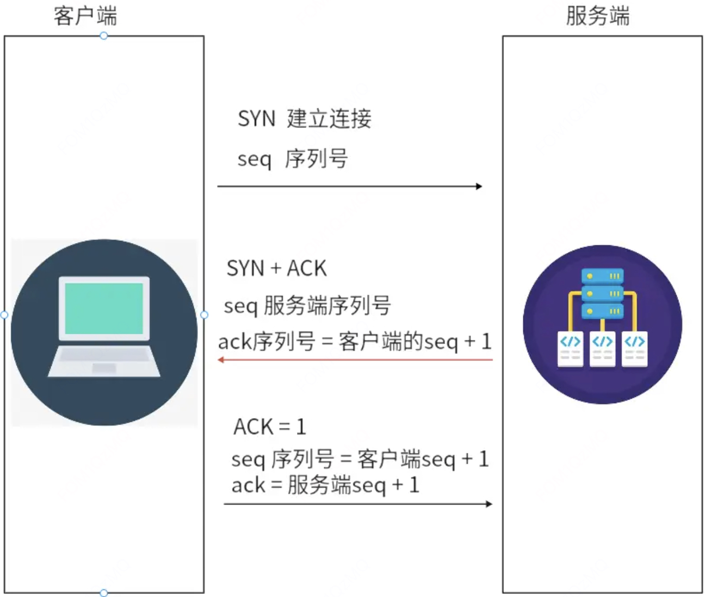
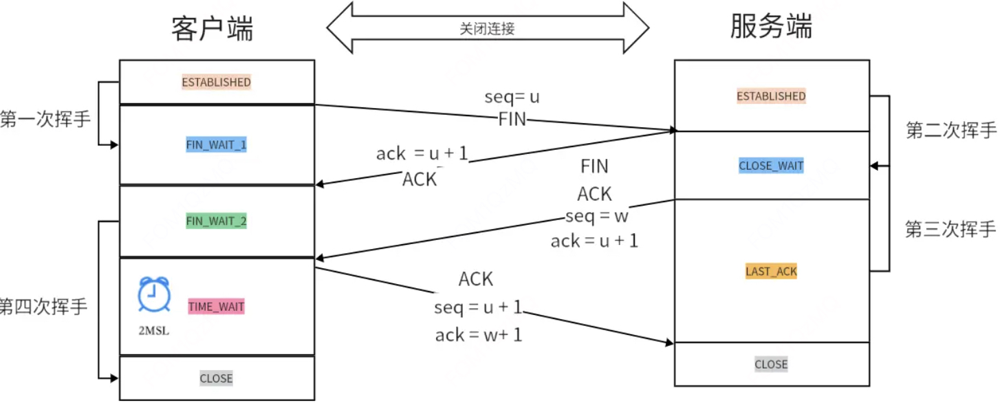

# 三次握手

TCP是面向连接的，通讯的时候需要进行三次握手，断开通信的时候进行四次挥手

名词描述:

`seq`: 序列号(随机生成)

`ack`: 确认号(ack = seq + 1)

`ACK`: 确定序列号有效

`SYN`: 发起新连接

`FIN`: 完成

 

流程描述:

1、客户端发送 SYN 报文，并且携带一个 seq 序列号。

2、服务端收到 SYN + seq 字段之后，生成一个 seq 序列号，这时候就会携带 ACK 确认号，表示之前的SYN 收到了，还有一个小写的 ack(值为客户端的 seq + 1)

3.客户端收到服务端的响应之后会发送一个 ACK 确定序列号有效,并且还会发送 seq(seq 会通过算法计算出来是否跟服务端的 ack 值相等)，然后会发送一个新的ack(值为服务端的 seq +1)。

# 四次挥手

流程描述:

断开连接服务端和客户端都可以主动发起。

1.以客户端举例，客户端先发送 FIN 包生成客户端的 seq 序列号随后进入 wait1 状态, 这是第一次挥手。

2.服务端收到 FIN 包表示自己进入了关闭等待状态，然后向客户端使用 ack 验证，验证成功打上 ACK 标记，随后生成服务端的 seq 值发送给客户端，这是第二次挥手，服务端此时还可以发送未完成的数据。

3.等待服务端所有任务操作完成之后服务端开始进入最后确认状态，向客户端发送 FIN 包,并且验证 ack，使用客户端第一次的 seq + 1 去验证，验证成功打上 ACK 标记，并且生成一个新的序列号 seq 发送给客户端，这是第三次挥手。

4.客户端收到之后进入`超时等待状态` 2MSL（1-4分钟），经过等到后客户端关闭连接，而服务端收到信息验证完成 ack 成功之后打上 ACk 标记随后将关闭连接。

> 为什么需要超时等待?

为了保证服务端收到 ACK 包，假设如果没有等待时间，ACK 包丢失了，那服务端永远不会断开连接，有了2MSL，如果一旦发生丢包将会进行超时重传，实现可靠连接。