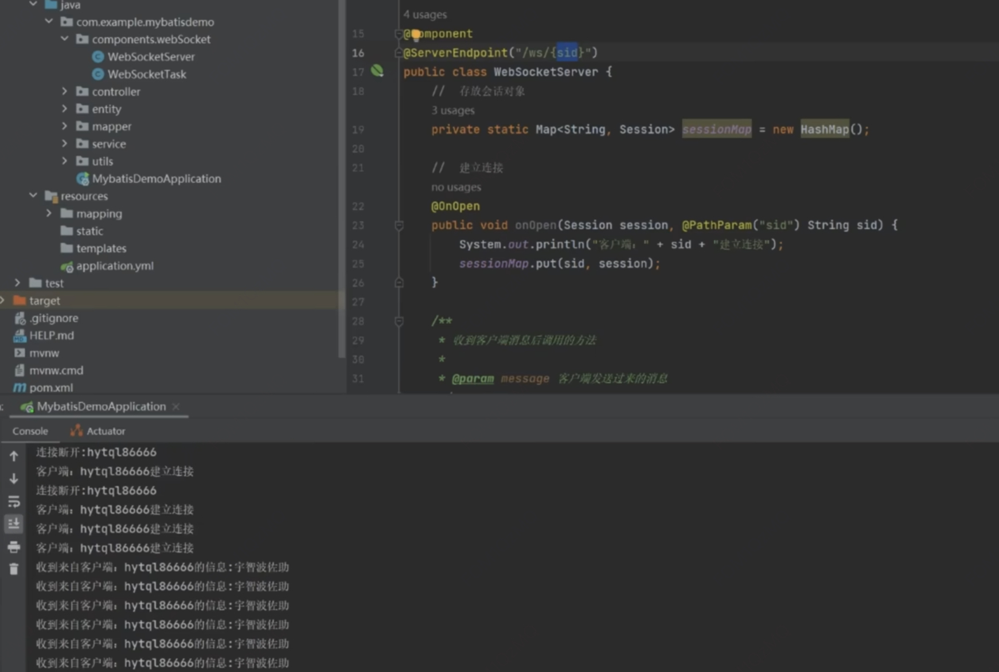

# WebSocket
## 什么是 Websocket
> HTML5 提供的一种浏览器与服务器进行`全双工通讯`的网络技术，属于应用层协议，可以直接在浏览器里使用。

## 建立连接
```js
const uid = "hytql86666"
const ws = new WebSocket(`ws://locahost:8081/ws/${uid}`)

const messageHandler = ({ data }) => {
  console.log(data) // 接收服务端推送的消息
}
ws.addEventListener('open', openHandler) // 建立连接
ws.addEventListener('close', closeHandler) // 关闭连接
ws.addEventListener('message', messageHandler)
ws.addEventListener('error', errorHandler) // 连接异常

// 关闭 ws
ws.close()
// 给服务端发消息
ws.send('宇智波佐助')
```
 
## 心跳检测

> 如果服务端重启，客户端如何自动重连

思路: 服务端关闭时，客户端监听到 close 事件，执行 restart，每 1 秒钟重连一次
```js
let timer = null
// setInterval restart
const restart = () => {
  timer = setInterval(() => {
    ws = new WebSocket(`ws://locahost:8081/ws/${uid}`)
    if (ws.readyState === 0) { // 重连成功
      clearInterval(timer)
      timer = null
      // ws 是新的 websocket实例，需要重新绑定事件
      ws.addEventListener('open', openHandler)
      ws.addEventListener('close', closeHandler)
      ws.addEventListener('message', messageHandler)
      ws.addEventListener('error', errorHandler)
    }
  }, 1000)
}

const closeHandler = () => {
  restart()
}
```
## 组件卸载关闭 ws
```vue
<script setup>
  import { onUnmounted } from 'vue'
  // 组件卸载时关闭 ws
  onUnmounted(() => {
    ws.close()
  })
</script>
```
