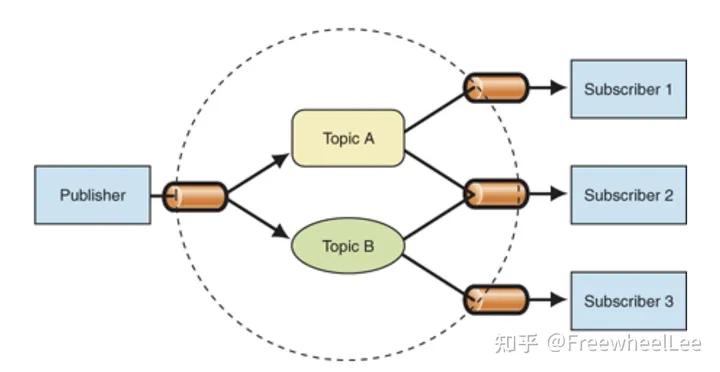
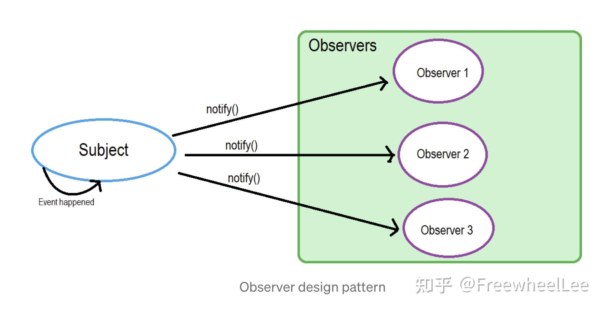
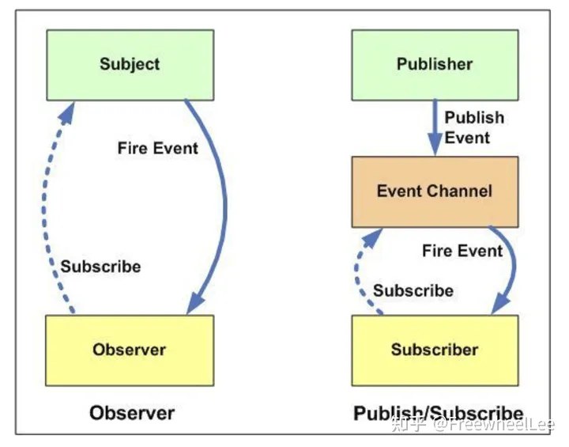

# 设计模式
## 单例模式
> 无论实例化多少次，得到的都是同一个实例。
```js
class Person {
  static instance
  constructor(name) {
    if (Person.instance) {
      return Person.instance
    }
    Person.instance = this
    this.name = name
  }
}

let p1 = new Person('张三')
let p2 = new Person('李四')
console.log(p1, p2)
```
## 发布订阅模式
> 发布订阅模式中有三种主体：`publisher`、`subscriber`、`broker`(通常还有另一个概念：`topic`)

::: details 一个例子
Lucy 最近想跳槽，她想去 A, B, C 三个公司中的任意一个。她发现这三家公司都在平台Y上发布岗位。于是她购买了平台Y的会员，只要这三个公司的任意一个公司发布了合适岗位，平台Y就会发短信通知她。一周后，平台Y给Lucy发了短信说公司A发了新岗位。又两天后，平台Y又通知Lucy公司B发了新岗位。

其实除了A、B、C公司，D、E、F公司也在平台Y上发布岗位，但是Lucy不感兴趣。

除了Lucy还有很多人购买了平台Y的会员，平台Y会针对他们感兴趣的公司岗位分别通知他们。

在上面这个场景中：

Lucy 是 subscriber(订阅者); A、B、C 公司是 publisher(发布者)；平台 Y 是 broker。

Lucy 购买会员就是向 broker 订阅，且她只对 A、B、C 公司的岗位感兴趣 —— A、B、C 公司的岗位 就是 topic

A、B、C公司在平台Y上发布岗位时，就是向 broker 发布消息。

平台Y 通知 Lucy 时，就是 broker 向 subscriber 通知。

`publisher 发布消息时通常会带上 topic，而 subscriber 会订阅感兴趣的 topic`

当 broker 收到发布者的消息时，会根据 topic 发给感兴趣的订阅者，其他订阅者则不会被通知到。
:::
:::tip
发布和订阅之前没有任何关系，不订阅也可以发布，两者不用耦合在一起。需要手动触发 `emit`
:::


```js
const broker = (function () {
  const topicSubscribers = {};

  function subscribe(topic, callback) {
    console.log(`New subscription for topic [${topic}] coming!`);
    if (topicSubscribers[topic]) {
      topicSubscribers[topic].push(callback);
    } else {
      topicSubscribers[topic] = [callback];
    }
  }

  function notify(topic, params) {
    if (topicSubscribers[topic]) {
      const subscribers = topicSubscribers[topic]

      for (let i = 0; i < subscribers.length; i++) {
        try {
          subscribers[i] && subscribers[i](params);
        } catch (error) {
          console.error(error);
        }
      }
    }
  }

  function fire(topic, params) {
    console.log(`Fire for topic [${topic}]!`);
    notify(topic, params);
  }

  return {
    subscribe,
    fire,
  }
})();

const subscriber1 = (args) => {
  console.log('This is Subscriber1, Let me process the event');
  console.log(JSON.stringify(args, null, 4));
}
broker.subscribe('topic1', subscriber1);

const subscriber2 = (args) => {
  console.log('This is Subscriber2, Let me process the event');
  console.log(JSON.stringify(args, null, 4));
}
broker.subscribe('topic2', subscriber2);

const publisher = (function () {
  return {
    publishTopic1: function () {
      broker.fire('topic1', {message: 'Hello World'})
    },
    publishTopic2: function () {
      broker.fire('topic2', {value: 2021})
    },
  }
})();

publisher.publishTopic1();
publisher.publishTopic2();
```
## 观察者模式
> 观察者模式中有两种主体：`Subject` 和 `Observer`
::: details 一个例子
Tony 是个非常向往 X 公司 的程序员，但是 X 公司 的 HR 跟他说：“非常抱歉，我们公司最近的 HC 不足。”

Tony 真诚地跟 HR 说“假如贵司有合适岗位，务必及时通知我！”

一个月后，HR 打电话通知 Tony：“我们公司现在有合适你的岗位了，欢迎来面试！”

上面这个场景中，HR 就是 Subject 而 Tony 是 Observer；当 Tony 跟 HR 说有岗位就通知他，作为 Observer Tony 正在向 Subject 订阅（subscribe）；而 HR 打电话通知Tony，就是 Subject 在 notify Observer
:::


```js
const subject = (function () {
  const observers = [];

  function subscribe(callback) {
    console.log('New subscription coming!');
    observers.push(callback);
  }

  function notify(params) {
    for (let i = 0; i < observers.length; i++) {
      try {
        observers[i] && observers[i](params);
      } catch (error) {
        console.error(error);
      }
    }
  }

  function fire(params) {
    notify(params);
  }

  return {
    subscribe,
    fire,
  }
})();

const observer1 = (args) => {
  console.log('This is Observer1, Let me process the event');
  console.log(JSON.stringify(args, null, 4));
}

const observer2 = (args) => {
  console.log('This is Observer2, Let me process the event');
  console.log(JSON.stringify(args, null, 4));
}

subject.subscribe(observer1)
subject.subscribe(observer2)

subject.fire({ message: 'hello world' });
```
## 观察者模式和发布订阅模式的特点和差异


- 观察者模式中，观察者 observers 必须知道 Subject 的存在，而 Subject 也保存了所有观察者的记录。
发布订阅模式中 publishers 发布者 和 subscribers 订阅者可能并不知道对方的存在。他们只是通过消息和broker进行沟通。
- 在发布订阅模式中，组件之间松耦合。而观察者模式中，组件之间强耦合。
- 观察者模式中，代码实现通常是同步的 —— Subject 通常会直接调用观察者 Observer 的方法（函数）；而发布订阅者模式中，代码实现可以是异步的。
- 广义的观察者模式和发布订阅模式中，观察者模式的代码实现通常在同一个应用中；而发布订阅模式则可以跨应用 —— 消息中间件。

参考: [【JS设计模式】观察者模式VS发布订阅模式](https://zhuanlan.zhihu.com/p/351750593)