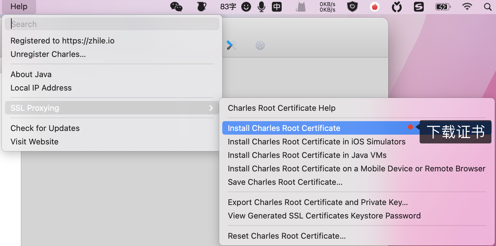
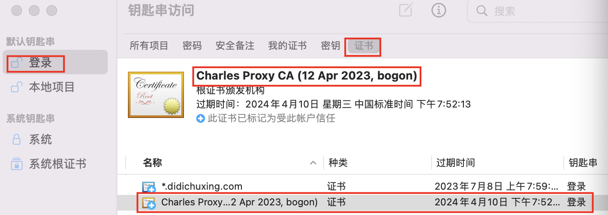
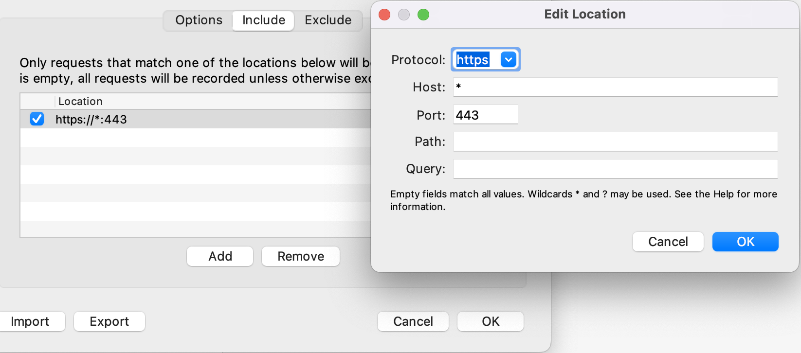
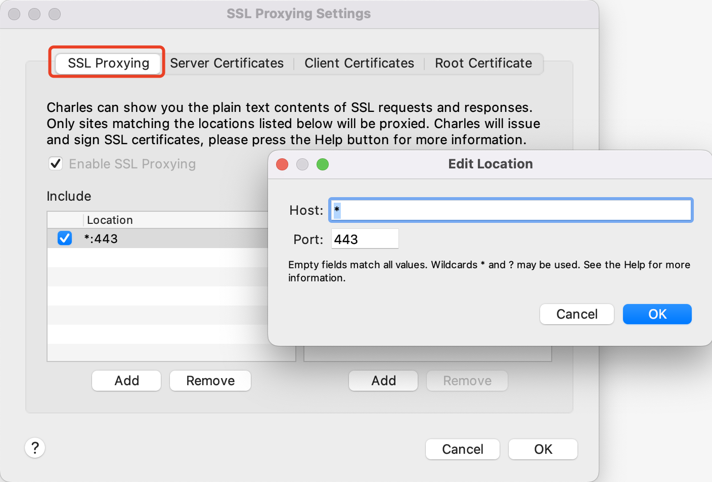
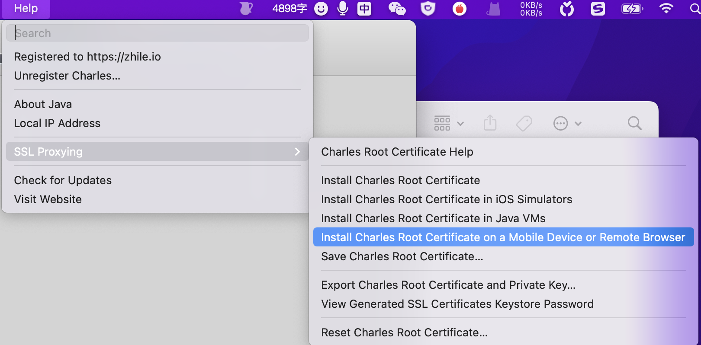
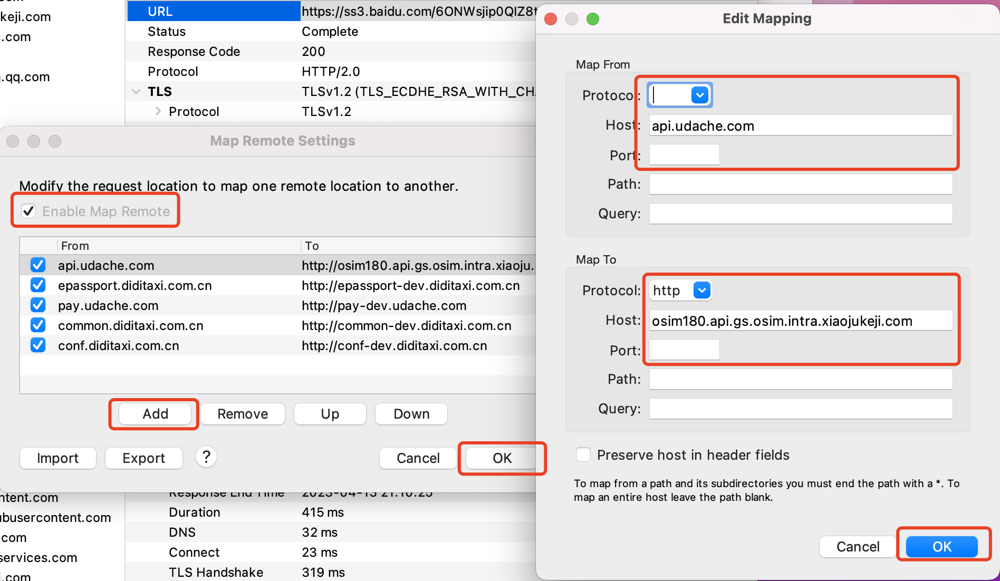

# charles
## 基于 `mac` + `ios` + `charles` 抓包小程序

- 1、安装证书：`Help` -> `SSL Proxying`

下载好的证书如下:

- 2、`Proxy` -> `Recording Settings` -> `include` -> `Add` -> 依次配置 https、*、443 -> `ok` -> `ok`

- 3、`Proxy` -> `SSL Proxying Settings` -> 依次配置 *、443 -> `ok` -> `ok`

- 4、`Help` -> `SSL Proxying` 

设置手机**手动代理**模式(输入 `ip` + 端口号(8888)) -> 在 `safari` 浏览器输入 `chls.pro/ssl` 下载证书 -> 设置-> 已下载描述文件 -> 安装描述文件

- 5、手机端下载完证书后的操作: 

设置 -> 通用 -> 关于手机 -> 证书信任设置 -> 针对根证书启用完全信任 -> 开启(开启后才能抓取数据包) -> 打开小程序即可抓取数据

:::danger 开启代理后没网
有的 app、网站做了反爬导致的
:::
## 远程映射
`Tools` -> `Map Remote` -> 勾选 `Enable Map Remote` 启用远程映射 -> `Add` -> 配置映射 -> `ok`

