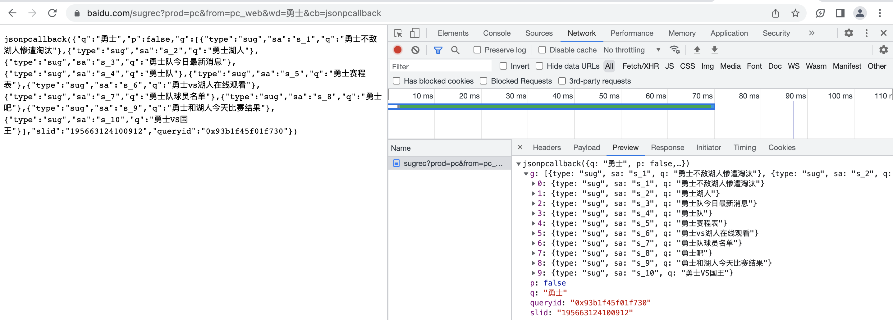
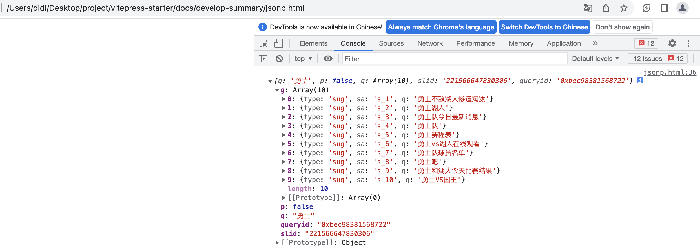
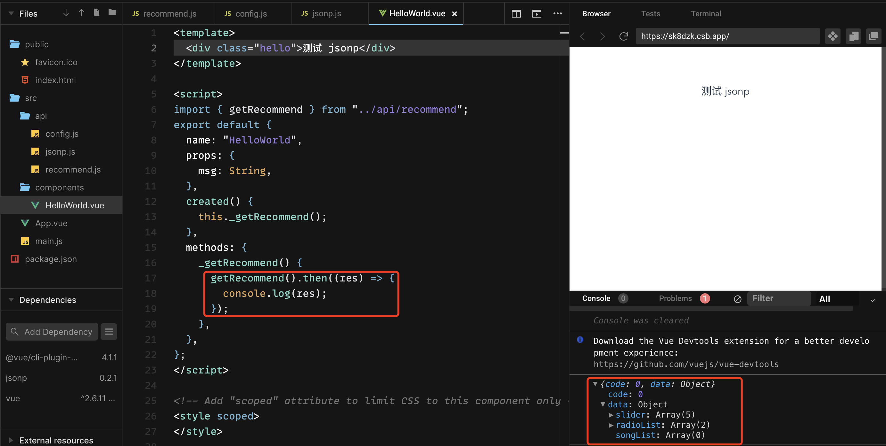
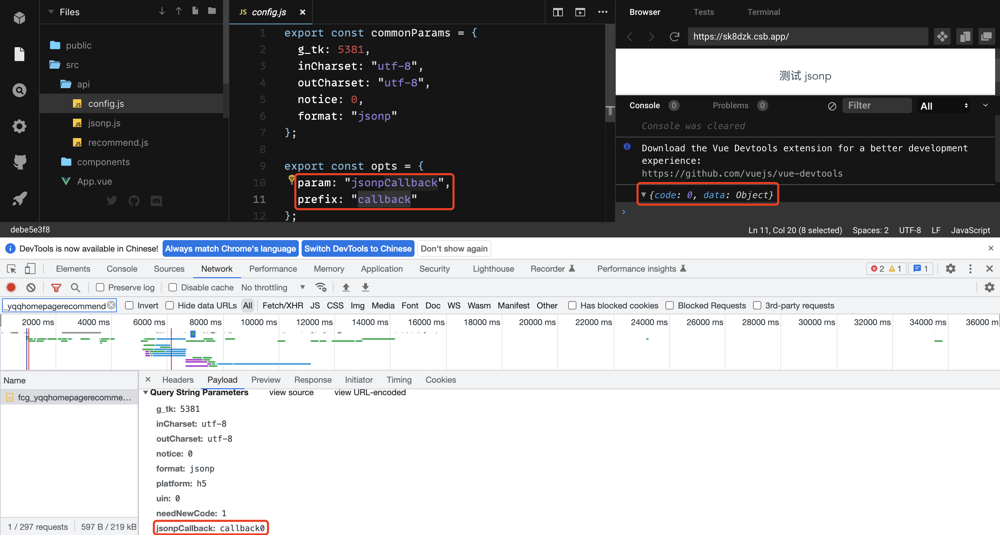
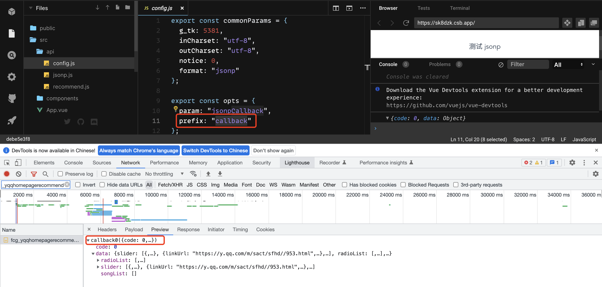
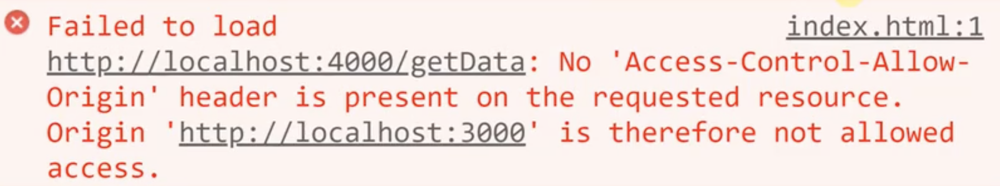

# 跨域
## jsonp
:::tip 原理
动态创建 `script` 标签(无同源策略限制，可以跨域)，`src` 指向真实的服务端地址(地址需要带 `callback` = `xxx` )，服务端可以解析 `callback` 对应的函数 `xxx`，在返回的逻辑中可以调用 `xxx` 包裹一段数据。在发送请求之前，需要在 `window` 上定义 `xxx` 方法。

eg:

:::
- 手动实现
```js
function jsonp({ url, params, cb }) {
  return new Promise((resolve,reject)=>{
    const script = document.createElement('script')
    window[cb] = function (data) {
      resolve(data)
      document.body.removeChild(script)
    }
    // 参数序列化
    params = { ...params, cb } 
    const arrs = []
    for(let key in params){
      arrs.push(`${key}=${params[key]}`)
    }
    
    script.src = `${url}?${arrs.join('&')}`
    document.body.appendChild(script);
  });
}

// 调用
jsonp({
  url: 'https://www.baidu.com/sugrec',
  params:{ wd:'勇士', prod: 'pc', from: 'pc_web' },
  cb: 'jsonpcallback'
}).then(data=>{
  console.log(data);
});
</script>
```
实现效果如下图: 

- 基于[jsonp](https://github.com/webmodules/jsonp)类库
```js
// 封装 jsonp.js 工具函数 
// npm install jsonp
import originJsonp from 'jsonp' // v0.2.1

export default function jsonp2(url, data, opts) {
  url += (url.indexOf('?') < 0 ? '?' : '&') + param(data)

  return new Promise((resolve, reject) => {
    originJsonp(url, opts, (err, data) => {
      if (!err) {
        resolve(data)
      } else {
        reject(err)
      }
    })
  })
}

export function param(data) {
  let url = ''
  for (var k in data) {
    const value = data[k] !== undefined ? data[k] : ''
    url += '&' + k + '=' + encodeURIComponent(value)
  }
  return url ? url.substring(1) : ''
}

// 封装请求方法 recommend.js
const commonParams = {
  g_tk: 5381,
  inCharset: 'utf-8',
  outCharset: 'utf-8',
  notice: 0,
  format: 'jsonp'
}

const opts = {
  param: 'jsonpCallback',
  prefix: "callback"
}

export function getRecommend() {
  const url = 'https://c.y.qq.com/musichall/fcgi-bin/fcg_yqqhomepagerecommend.fcg'

  const data = Object.assign({}, commonParams, {
    platform: 'h5',
    uin: 0,
    needNewCode: 1
  })

  return jsonp(url, data, opts)
}

// vue 组件内调用
created () {
  this._getRecommend()
},
methods: {
  _getRecommend() {
    getRecommend().then((res) => {
      console.log(res)
    })
  }
}
```
实现效果如下图: 



:::danger 缺点
- 只能发送 get 请求，不支持 post、put、delete 等

- 不安全(比如 xss攻击)，不建议采用
:::
## cors
> 跨域资源共享

构造跨域场景: 

基于 express 新建两个 server，第一个 server 启动 3000 端口，第二个 server 启动 4000 端口。新建 index.html，在 3000 端口下启动静态服务(浏览器中访问localhost:3000/index.html)，html 中发送 ajax 请求 4000 端口下的接口。
```js
// server1.js
let express = require('express');
let app = express();
app.use(express.static(__dirname));
app.listen(3000);

// server2.js
let express = require('express');
let app = express();

app.get('/getData', function (req, res) {
  console.log(req.headers);
  res.end("cors")
})

app.listen(4000);
```

```html
<body>
  <script>
    let xhr = new XMLHttpRequest();
    xhr.open('GET','http://localhost:4000/getData', true);
    xhr.onreadystatechange = function () {
      if(xhr.readyState === 4){
        if(xhr.status >= 200 && xhr.status < 300 || xhr.status === 304){
          console.log(xhr.response); // 服务端响应结果
        }
      }
    }
    xhr.send();
  </script>
</body>
```
此时会报如下错误，需要设置 origin 

- `Access-Control-Allow-Origin`
```js
// server2.js
let whitList = ['http://localhost:3000']

app.use(function (req, res, next) {
  let origin = req.headers.origin;
  if(whitList.includes(origin)){
    res.setHeader('Access-Control-Allow-Origin', origin) // 设置哪个源可以访问
  }
  next();
});
...
```
- `Access-Control-Allow-Headers`
```html
xhr.setRequestHeader('name', 'cors');
```
```js
// server2.js
res.setHeader('Access-Control-Allow-Headers', 'name');
```
- `Access-Control-Allow-Methods`
```html
xhr.open('PUT', 'http://localhost:4000/getData', true)
```
```js
res.setHeader('Access-Control-Allow-Methods', 'PUT');
```
- `Access-Control-Max-Age`
> 该字段用来指定本次预检请求的有效期，单位为秒。在有效期内，不用发出另一条预检请求。
```js
res.setHeader('Access-Control-Max-Age', 10); // 预检的存活时间(10秒)

if(req.method === 'OPTIONS') { // OPTIONS 请求不做任何处理
  res.end(); 
}
```
- `Access-Control-Allow-Credentials`
```html
document.cookie = 'name=cors'
xhr.withCredentials = true
```
```js 
res.setHeader('Access-Control-Allow-Credentials', true) // 允许携带cookie
```
- `Access-Control-Expose-Headers`
```js
res.setHeader('Access-Control-Expose-Headers', 'name');

app.get('/getData', function (req, res) {
  res.setHeader('name', 'test'); // 设置 
  res.end("cors")
})
```
```html
<script>
  console.log(xhr.getResponseHeader('name')) // test
</script>
```
完整代码如下
```js{6-11}
let whitList = ['http://localhost:3000']
app.use(function (req,res,next) {
  let origin = req.headers.origin;

  if (whitList.includes(origin)) {
    res.setHeader('Access-Control-Allow-Origin', origin);
    res.setHeader('Access-Control-Allow-Headers', 'name');
    res.setHeader('Access-Control-Allow-Methods', 'PUT');
    res.setHeader('Access-Control-Allow-Credentials', true);
    res.setHeader('Access-Control-Max-Age', 10);
    res.setHeader('Access-Control-Expose-Headers', 'name');
    if (req.method === 'OPTIONS') {
      res.end()
    }
  }
  next();
});

app.put('/getData', function (req, res) {
  res.setHeader('name', 'test');
  res.end("cors")
})

app.get('/getData',function (req,res) {
  console.log(req.headers);
  res.end("cors")
})
```
