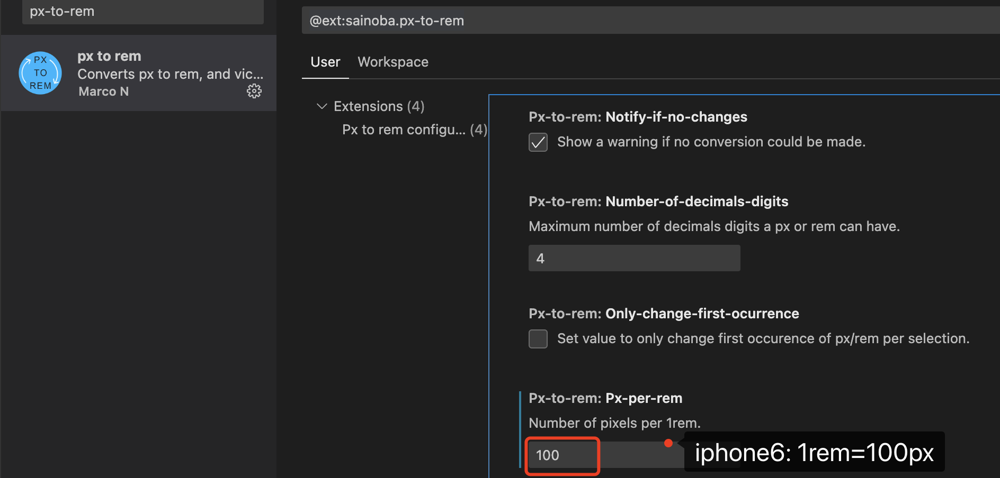
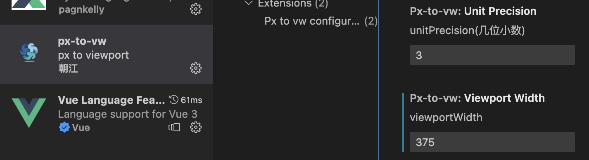

# 常用布局
## em
>相对单位，相对于**当前元素**或**父元素**进行换算。
:::tip 特点
1、值不是固定的。

2、会继承父元素的字体大小。
:::
### 相对于当前元素
```css
.box {
  font-size: 12px;
  border: 2em solid red; // 24px
}
```
### 相对于父元素
- 第一种情况
```css
body {
  font-size: 14px
}
.box {
  border: 2em solid red; // 28px
}
```

- 第二种情况
```css
body {
  font-size: 14px
}
.box {
  font-size: 2em;
  border: 2em solid red; // 56px
}
```
## rem
> 相对单位，相对于 **HTML** 根元素，只修改根元素就可以成比例的调整所有字体。
- 第一种方式 `flexible`
```js
(function flexible (window, document) {
  var docEl = document.documentElement
  var dpr = window.devicePixelRatio || 1

  // adjust body font size
  function setBodyFontSize () {
    if (document.body) {
      document.body.style.fontSize = (12 * dpr) + 'px'
    }
    else {
      document.addEventListener('DOMContentLoaded', setBodyFontSize)
    }
  }
  setBodyFontSize();

  // set 1rem = viewWidth / 10
  function setRemUnit () {
    var rem = docEl.clientWidth / 10
    docEl.style.fontSize = rem + 'px'
  }

  setRemUnit()

  // reset rem unit on page resize
  window.addEventListener('resize', setRemUnit)
  window.addEventListener('pageshow', function (e) {
    if (e.persisted) {
      setRemUnit()
    }
  })

  // detect 0.5px supports
  if (dpr >= 2) {
    var fakeBody = document.createElement('body')
    var testElement = document.createElement('div')
    testElement.style.border = '.5px solid transparent'
    fakeBody.appendChild(testElement)
    docEl.appendChild(fakeBody)
    if (testElement.offsetHeight === 1) {
    docEl.classList.add('hairlines')
    }
    docEl.removeChild(fakeBody)
  }
}(window, document))
```
> `pageshow` 在页面显示时触发，无论页面是否来自缓存。重新加载页面时，`pageshow` 会在 `load` 事件触发后触发，并根据事件对象的 `persisted` 来判断是否是缓存中的页面触发的 `pageshow`。若为 `true` 则表明是从缓存取过来的页面，此时需要重新计算 `rem` 的值

- 第二种方式 `vw`
> 页面可视区分成了100vw 和 100vh

以 `iphone6` 机型为例，100vw = 375px，那 100px ≈ 26.666667vw = 1rem；

当切换到 `iphone6 plus` 时，由于100vw = 414px，此时 1rem = 26.666667vw/(100/4.14)* 100px ≈ 110.4px
```css
html {
  font-size: 26.666667vw
}
body {
  font-size: 16px; // 重置 font-size
}
.box {
  width: 1rem; // iphone6: 100px，iphone6 plus: 110.4px
  height: 1rem;
  background: pink;
  border: 0.2rem solid red; // 6: 20px 6p: 22px
}
```
:::danger 警告
- `rem` 布局一定要在 `body` 重置 `font-size` 大小(如上)

- 由于量取的是物理像素，`css` 需要设置逻辑像素，因此需要对量取的值进行 **除2** 操作。比如量的是144px，最终转换成 0.72rem。
:::
### vscode 中使用辅助插件
- 安装 `px to rem` 扩展插件 



- 设置 1rem = 100(iphone6)，保留4位小数
- 快捷键 `alt` + `z` 批量把 px 转换成 rem，mac电脑(alt 为 option键)
## vw
以 `iphone6` 机型为例，100vw = 375px，那 1vw = 3.75px；100px ≈ 26.667vw。如果是44px，转换成vw则为: 44 * 26.667 / 100 ≈ 11.73348
```css
.box {
  width: 26.667vw; // iphone6: 100px，iphone6 plus: 110.4px
  height: 26.667vw;
  background: pink;
}
```
### vscode 中使用辅助插件
- 安装 `px-to-vw` 扩展插件 



- 设置 `viewportWidth` 为 375，`unitPrecision` 保留3位小数
- 快捷键 `alt` + `z` 批量把 px 转换成 vw，mac电脑(alt 为 option键)


