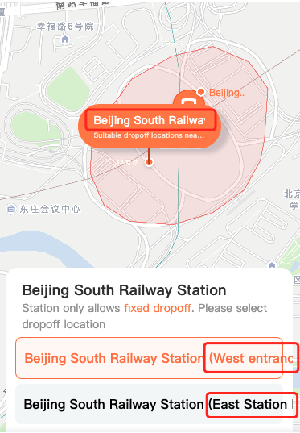
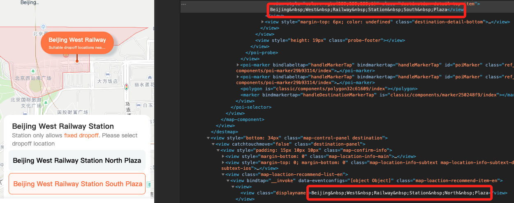
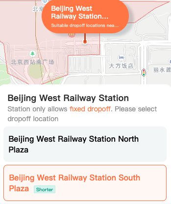

# 字符串转义
## 问题背景
在滴滴出行小程序某期英文版需求中，遇到了这样一个问题：

当后端返回的文案超出一行时，需要以单词作为一个整体进行折行(最多展示两行，超出2行溢出省略)。在调试过程中，发现有几个地名并没有折行。

展示效果如下图所示：


## 问题定位
由于只有几个地名会出现上述情况，那我们来对比一下不能折行和能折行模板层面的差异，不能折行的单词之间多了 `&nbsp;` 符号。



我猜想极大概率是后端返回的空格并不是标准空格，导致没有被小程序正确识别(识别成了 `&nbsp;`)，导致折行样式没有生效。

那我们再来看一下标准空格和非标准空格对应的 `ascii` 码(**非标准 160，标准 32**)。
:::tip String 静态方法
- 1、`charCodeAt`：返回字符串中指定索引处字符对应的 `unicode` 编码
- 2、`fromCharCode`：将 `unicode` 编码转为字符
- 3、`charAt`: 返回指定位置的字符
:::
```js
const original = 'Beijing West Railway Station North Plaza' // 非标准空格
const standard = 'Beijing West Railway Station North Plaza' // 标准空格

console.log(original.charCodeAt(7)) // 160
console.log(standard.charCodeAt(7)) // 32
```

## 问题解决
既然后端返回的空格为非标准空格，那我们可以在渲染之前做一层转化(统一转化为标准空格)，然后进行渲染。

- 1、正则匹配到所有的非标准空格(`&nbsp;`)
- 2、使用标准空格进行替换
```js
function formatSpace(text) {
  if (!text) return ''
  // return text.replace(new RegExp(String.fromCharCode(160), 'g'), ' ') 使用 replace 处理
  return text.replaceAll(String.fromCharCode(160), ' ') // 使用 replaceAll 处理
}
// 使用 
const formatStr = formatSpace(original)
```

至此问题完美解决。

## 溢出样式
```css
.content { // 多行文本显示省略号
  display: -webkit-box;
  -webkit-box-orient: vertical;
  -webkit-line-clamp: 2; // 行数
  overflow: hidden;
  width: 300px;
}
.content { // 单行文本显示省略号
  white-space: nowrap;
  overflow: hidden;
  text-overflow: ellipsis;
  width: 300px;
}
```


