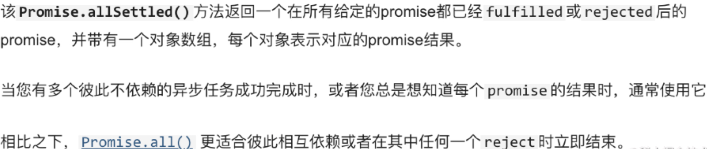

## 开发技巧汇总

## [allSettled]()


特点:
- 批处理 promise，返回 promise
- 存在失败结果也会拿到全部执行结果，不会走 catch
- 解决了 Promise.all 不能拿到失败执行结果的问题

```js
const promise1 = new Promise(resolve => {
  resolve('success')
})
const promise2 = new Promise((resolve, reject) => {
  reject('error')
})

Promise.allSettled([promise1, promise2]).then(res => {
 // res: [{status: 'fulfilled', value: 'success'}, {status: 'rejected', reason: 'error'}] 
})
```
自己实现 `allSettled`
```js
function allSettled(lists = []) {
  let result = new Array(lists.length)
  let num = 0
  return new Promise(resolve => {
    function callBack() { 
      if(num === lists.length) {
        resolve(result)
      }
    }
    lists.forEach((item, index) => {
      item.then(res => {
        const obj = {
          status: 'fulfilled',
          value: res
        }
        result[index] = obj
        num++
        callBack()
      }, err => {
        const obj = {
          status: 'rejected',
          reason: err
        }
        result[index] = obj
        num++
        callBack()
      })
    })
  })
}
```

