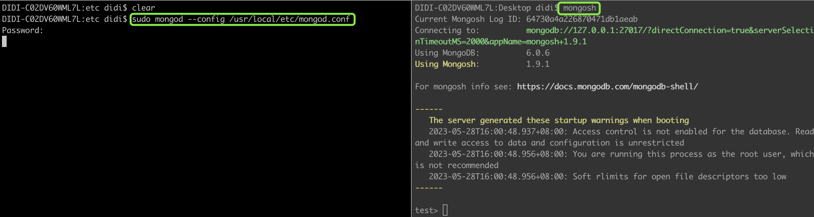

# MongoDB
## 安装 `Homebrew`
- 终端输入如下命令，按回车、输入镜像序号、输入Y，回车等待安装完成即可
```sh
/bin/zsh -c "$(curl -fsSL https://gitee.com/cunkai/HomebrewCN/raw/master/Homebrew.sh)"
```

## 安装 [mongodb](https://www.mongodb.com/docs/manual/tutorial/install-mongodb-on-os-x/)
```sh
- brew tap mongodb/brew
- brew update
- brew install mongodb-community@6.0
```

## 启动 `mongodb` 服务
- 打开终端窗口，输入以下命令及开机密码
```sh
sudo mongod --config /usr/local/etc/mongod.conf
```
- 新打开一个终端窗口，输入 `mongosh` 命令，表示连接成功


## 可视化平台 [Studio 3T](https://robomongo.org/)

## 命令行参数
```sh
show dbs: 显示所有的数据库
use local: 切换数据库
db: 当前数据库
# db.help()
# db.dropDatabase(): 删除数据库
```