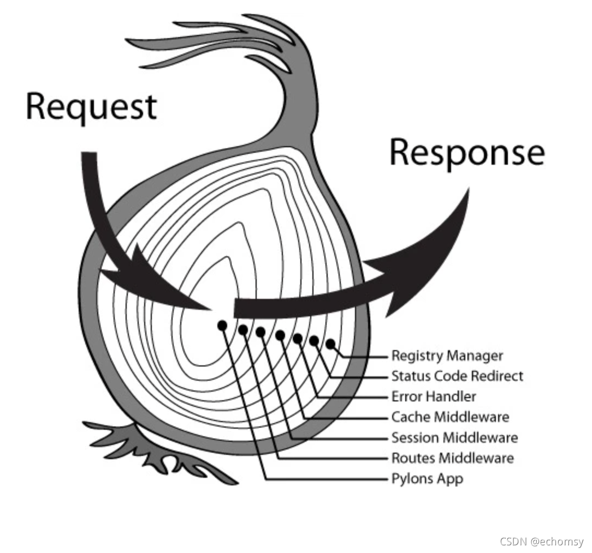

# 中间件与洋葱模型

## 代码执行
- 无异步(打印顺序为 1、3、5、6、4、2)
```js
const Koa = require('koa')
const app = new Koa()

app.use((ctx, next) => {
  console.log(1)
  next()
  console.log(2)
})

app.use((ctx, next) => {
  console.log(3)
  next()
  console.log(4)
})
app.use((ctx, next) => {
  console.log(5)
  next()
  console.log(6)
})

app.listen(3001, () => {
  console.log('server is running at 3001 port')
})
```
- 有异步无 `await` (打印顺序为1、3、2、sleep、5、6、4)
```js{12}
function sleep() {
  return new Promise((resolve) => {
    setTimeout(() => {
      console.log('sleep')
      resolve()
    }, 2000)
  })
}
...
app.use((ctx, next) => {
  console.log(1)
  next() // next 前面没加 await，不会等待 next 执行结束
  console.log(2)
})

app.use(async (ctx, next) => {
  console.log(3)
  await sleep()
  next()
  console.log(4)
})
app.use((ctx, next) => {
  console.log(5)
  next()
 console.log(6)
})
```
- 异步 `await` (打印顺序为1、3、sleep、5、6、4、2)
```js{4}
...
app.use(async (ctx, next) => {
  console.log(1)
  await next() // next 前面加了 await，会等待 next 函数执行完成
  console.log(2)
})

app.use(async (ctx, next) => {
  console.log(3)
  await sleep()
  next()
  console.log(4)
})
app.use((ctx, next) => {
  console.log(5)
  next()
 console.log(6)
})
```
- 异步 `return`(打印顺序为1、3、sleep、5、6、4)
```js
...
app.use(async (ctx, next) => {
  console.log(1)
  return next() // return 也会等待 next 执行完成，但不会执行 next 后面的代码
  console.log(2)
})

app.use(async (ctx, next) => {
  console.log(3)
  await sleep()
  next()
  console.log(4)
})
app.use((ctx, next) => {
  console.log(5)
  next()
 console.log(6)
})
```
## 源码解析

1、`Koa` 构造函数初始化时会声明 `middleware` 数组，用来存放所有的中间件函数。
```js
constructor() { // koa@2.14.2
  this.middleware = []
}
```
2、调用 `use` 把中间件函数添加到 `middleware` 中。
```js
use(fn) {
  if (typeof fn !== 'function') throw new TypeError('middleware must be a function!')
  this.middleware.push(fn)
  return this
}
```
3、调用 `listen` 创建 `server`。

```js
listen(...args) {
  const server = http.createServer(this.callback());
  return server.listen(...args);
}

callback() {
  const fn = compose(this.middleware); // 关键

  const handleRequest = (req, res) => {
    const ctx = this.createContext(req, res); // 创建 ctx 上下文
    ...
    return this.handleRequest(ctx, fn);
  };

  return handleRequest;
}

handleRequest(ctx, fnMiddleware) {
  ...
  return fnMiddleware(ctx).then(handleResponse).catch(onerror);
}
```
4、`compose` 函数
```js
const compose = require('koa-compose');

// koa-compose@4.1.0
'use strict'

module.exports = compose

function compose (middleware) {
  if (!Array.isArray(middleware)) throw new TypeError('Middleware stack must be an array!')
  for (const fn of middleware) {
    if (typeof fn !== 'function') throw new TypeError('Middleware must be composed of functions!')
  }

  return function (context, next) {
    let index = -1
    return dispatch(0) // 从第1个中间件函数开始调用
    function dispatch (i) {
      if (i <= index) return Promise.reject(new Error('next() called multiple times'))
      index = i
      let fn = middleware[i]
      if (i === middleware.length) fn = next
      if (!fn) return Promise.resolve()
      try {
        return Promise.resolve(fn(context, dispatch.bind(null, i + 1))); // dispatch 就是暴露给用户的 next 函数
      } catch (err) {
        return Promise.reject(err)
      }
    }
  }
}
```
::: danger `next() called multiple times` 报错时机：
```js
app.use(async (ctx, next) => {
  console.log(11111)
  await next()
  await next() // 一个中间件函数内多次调用 next
  console.log(22222)
})
```
:::
## `router` 路由导航守卫模拟
```js
class VueRouter {
  constructor() {
    this.beforeHooks = []
  }

  beforeEach (fn) {
    this.beforeHooks.push(fn)
  }

  confirmTransition() {
    const iterator = (hook, next) => {
      try {
        hook({ to: '即将要进入的目标，即路由对象' }, { from: '当前导航正要离开的路由' }, () => { next() })
      } catch (e) {
        console.error(e)
      }
    }
    runQueue(this.beforeHooks, iterator, () => {
      console.log('completed')
    })  
  }
}

function runQueue (queue, fn, cb) {
  const step = index => {
    if (index >= queue.length) {
      cb()
    } else {
      if (queue[index]) {
        fn(queue[index], () => {
          step(index + 1)
        })
      } else {
        step(index + 1)
      }
    }
  }
  step(0)
} 

// 调用
const router = new VueRouter()

router.beforeEach((to, from , next) => {
  console.log(to, '执行了第 1 个导航守卫')
  next()
})
router.beforeEach((to, from , next) => {
  console.log(from, '执行了第 2 个导航守卫')
  next()
})

router.confirmTransition()
```
[参考链接 > 导航守卫](https://dingqiangqiang.github.io/vue/vue-router/transition-to.html#%E5%AF%BC%E8%88%AA%E5%AE%88%E5%8D%AB)