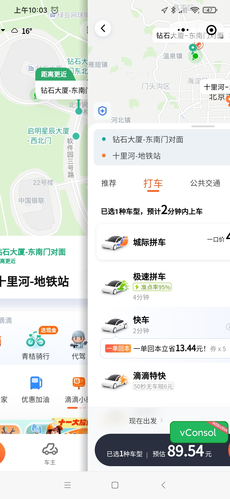
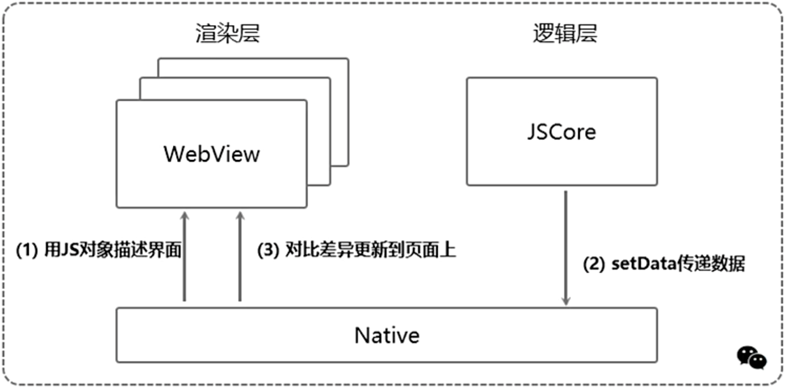
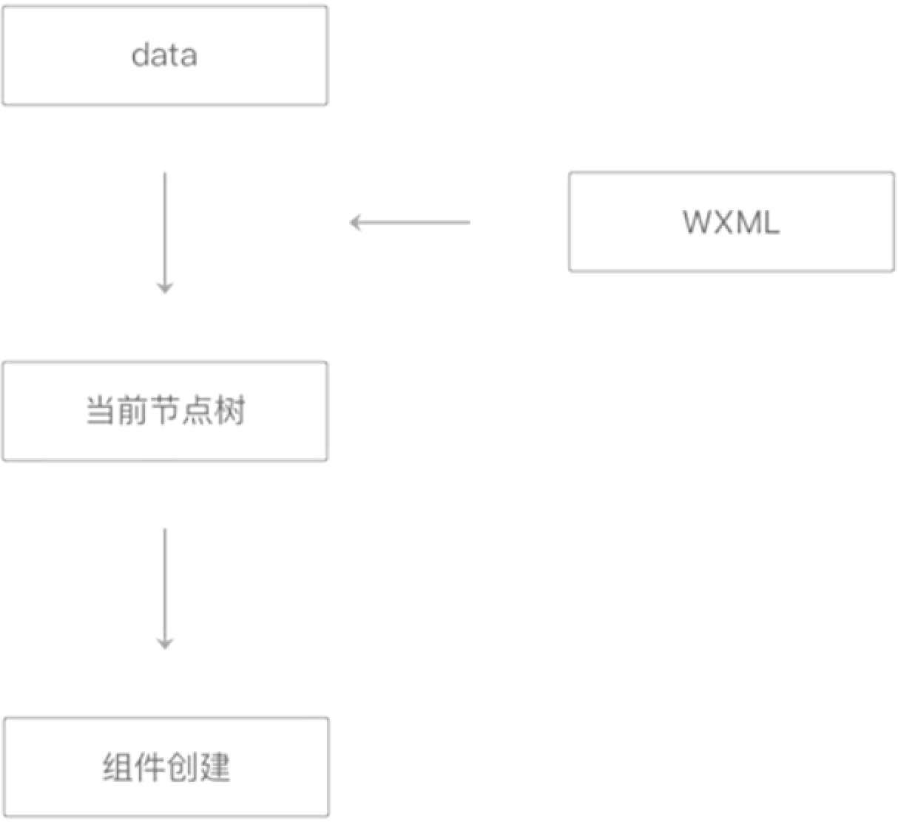
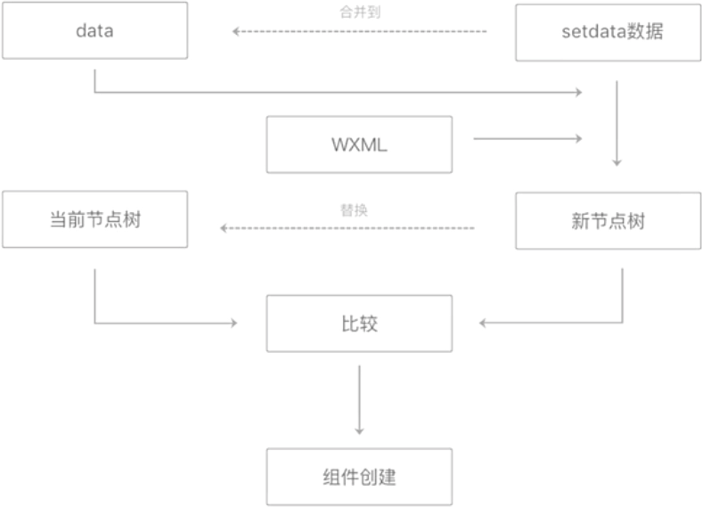

## 双线程模型
小程序的架构模型有别于传统 web 单线程架构，小程序为**双线程架构**。

小程序的运行环境分成渲染层和逻辑层，其中 WXML 模板和 WXSS 样式工作在渲染层，JS 脚本工作在逻辑层。

**小程序的渲染层和逻辑层分别由两个线程管理：渲染层的界面使用 WebView 进行渲染；逻辑层采用 JsCore 线程运行 Javascript 代码。**

架构图:

从上图可以看出，由于渲染层与逻辑层分开，一个小程序有多个界面，所以渲染层对应存在多个 webview。两个线程之间由 Native 层进行统一处理。无论是线程之间的通讯、数据传递、网络请求都由 Native 层做转发。

::: details 何为 webview
可以理解成在手机中内置了一款高性能的 webkit 内核浏览器(使用 webkit 渲染引擎来展示)，在 SDK 中封装的一个组件(嵌入在原生应用中)。
也可理解成用来展示网页的容器。
:::

::: details 为何需要多个 webview
**为了更加接近原生应用 APP 的用户体验**
多 webview 可以理解为多页应用，有别于单页面应用SPA，SPA渲染页面是通过路由识别随后动态将页面挂载到root节点中去，如果单页面应用打开一个新的页面，需要先卸载掉当前页面结构，并且重新渲染。很显然原生APP并不是这个样子，比较明显的特征为从页面右侧向左划入一个新的页面，并且我们可以同时看到两个页面。

多页应用就很好达到这个效果，新页面直接滑动出来并且覆盖在旧页面上即可，这也是小程序现在所做的形式。这样的用户体验是非常好的。
:::
::: details 进程与线程
本质上来说，这两个名词都是 CPU 工作时间片的一个描述。

进程描述了 CPU 在运行指令及加载和保存上下文所需的时间，放在应用上来说就代表了一个程序。线程是进程中的更小单位，描述了执行一段指令所需的时间。

在浏览器中，每当打开一个 Tab 页时，其实就是创建了一个进程，一个进程中可以有多个线程，比如渲染线程、JS 引擎线程、HTTP 请求线程等。每当发起一个请求，其实就是创建了一个线程，当请求结束后，该线程可能就会被销毁。
:::

## 双线程模型由来
> 基于用户安全和管控考虑
::: details 详情
- 小程序的主要开发语言是 Javascript(以下简称 js)，由于其非常灵活，开发者可以利用 js 脚本随意地跳转网页，或是通过操作 DOM 改变界面上的任意内容。但恶意攻击者也能利用这种遍历往页面注入任何内容，例如发起带有特殊目的的请求([CSRF](/secure/csrf.md))，利用一些漏洞往页面注入脚本操作 DOM([XSS](/secure/xss.md))，利用外挑 url 的 a 标签、动态注入的 img 标签的 src 属性、操作界面的 API、动态运行脚本的 API 等，危害用户和网站的安全。
- 开发者可以获取任何页面内容，包括用户敏感数据。小程序提供了一些可以展示敏感数据的组件，例如 open-data 组件能展示用户昵称、头像、性别、地理位置等信息(无需用户授权)。如果开发者可以操作 DOM，那么就意味者他们可以绕开系统的保护，随意获取用户的敏感信息，这是非常危险又不可控的。
- 常见的前端漏洞。前端常见的安全漏洞有 XSS 和 CSRF，在小程序中，XSS 在双线程设计中就被过滤了，CSRF 则通过 token 的方式被规避了。
:::

为了解决上述问题，小程序阻止开发者使用一些浏览器提供的比如跳转页面、操作DOM、动态执行脚本的开放性接口。如果这些接口一个一个地去禁用，那么势必会进入一个糟糕的循环，因为 javascript 实在是太灵活了，浏览器的接口也太丰富了，很容易就遗漏一些危险的接口，而且就算是禁用掉了所有感觉到危险的接口，也势必防不住浏览器内核的下次更新。指不定又会出现一些漏洞。

为了彻底解决这个问题，必须提供一个沙箱环境来运行开发者的 JavaScript 代码。这个沙箱环境不能有任何浏览器相关接口，只提供纯 JavaScript 的解释执行环境。

得益于客户端系统有 javaScript 的解释引擎（iOS下使用内置的 javaScriptCore 框架，安卓采用腾讯 x5 内核提供的 JsCore 环境），可以创建一个单独的线程去执行 javaScript，在这个环境下执行的都是小程序业务逻辑的代码，也就是前面提到的逻辑层。而界面渲染相关的任务全都在 webview 线程里执行，通过逻辑层代码去控制渲染哪些界面。这就是小程序双线程模型的由来。

双线程优势:
- 传统 web 网页开发的渲染线程和脚本线程是互斥的(线程阻塞(`defer`、`async`))，在小程序里，由于两者是分开的，分别运行在不同的线程中，好处是逻辑层的代码执行不会阻塞渲染层的渲染逻辑，页面会更加流畅。
- 小程序中不支持动态载入脚本，每个 WXML 元素在编译时会过滤掉不支持的危险属性，只通过 setData 的方式传递数据，这样在底层就筛选掉了可能存在的危害，XSS 漏洞自然无缝可钻。

[defer 和 async](https://blog.csdn.net/m0_56201092/article/details/128622661)
## Native 在双线程架构中的作用
- **负责资源的动态注入**

  我们可以想象下没有 Native 层的情景: 用户需要手动的注入某个版本的微信 SDK 到自身的项目中去，这种方式的用户体验并不是很好，因为加载js，并且解析js逻辑的时候是会抢占渲染资源的(线程阻塞)。微信客户端可以将微信SDK这样的资源放在客户端Native中，在加载页面的时候进行动态注入，由 Native 层注入到视图层。这样的做法的好处很明显，首先会使包的体积变小，其次，减少了网络请求的发送。另外底层基础库、Service 等都是事先放在 Native 层中的，当页面进行加载的时候再进行动态的注入。
- **负责请求的转发、离线存储、组件渲染等**。

  界面主要由成熟的 Web 技术渲染，辅之以大量的接口提供丰富的客户端原生能力。同时，每个小程序页面都是用不同的 WebView 去渲染，这样可以提供更好的交互体验，更贴近原生体验，也避免了单个 WebView 的任务过于繁重。此外，界面渲染这一块还定义了一套内置组件以统一体验，并且提供一些基础和通用的能力。值得一提的是，内置组件有一部分较复杂组件是用客户端原生渲染的，以提供更好的性能。

总结: 正是有了强大的 Native 层做背后支撑，逻辑层与渲染层才能更加专注于自身的职责。

## 双线程通信
小程序的渲染层使用 WebView 进行渲染，逻辑层运行在独立的 JSCore 上。在小程序的底层设计中，这两个模块是独立的，无法进行直接的通信，也无法进行数据共享。而业务代码在逻辑层执行，又需要将数据同步到渲染层，那通信是如何进行的呢？

👆🏻我们说过，逻辑层和渲染层的通信会由 Native 做中转，逻辑层发送网络请求也经由 Native 转发。这是不是意味着，我们可以把 DOM 的更新通过简单的数据通信来实现呢？

`Virtual DOM` 相信大家都已有了解，大概是这么个过程：**用 JS 对象模拟 DOM 树 -> 比较两棵虚拟 DOM 树的差异 -> 把差异应用到真正的 DOM 树上。**

<!-- 由于渲染层和逻辑层不在一个线程，要想拼成一个页面或组件，可以通过数据传递的方式。因此我们需要将组件或页面结构用数据的方式来表达(基于 **Virtual DOM**)。最后双线程通信时逻辑层可以使用 `setData` API 将数据同步到渲染层。流程如下: -->
流程如下图示意:

- 渲染层把 WXML 转化成 JS 对象。
- 逻辑层数据变更时，通过宿主环境提供的 `setData` API 把数据从逻辑层传到 Native，再转发到渲染层。
- 对比前后差异，把差异应用在原来的 DOM 树上，更新界面。

> 把 WXML 转化成 JS 对象、通过 Native 转发、实现逻辑层和渲染层的交互和通信。都是通过小程序的基础库来完成的。

## 小程序渲染过程
**初渲染**: 
> 渲染层接收到初始数据 data 时，需要进行渲染层渲染
- 初始渲染时，将初始数据套用在对应的 WXML 片段上生成节点树
- 初始渲染中得到的 data 和当前节点树会保留下来用于重渲染

> 减少 WXML 中节点的数量，可以有效降低初始渲染和重渲染的时间开销，提升渲染性能

**更新**: 
> 渲染层接收到更新数据 (setData 数据) 时，需要进行更新渲染
- 每次更新渲染时，将 data 和 setData 数据套用在 WXML 片段上，得到一个新节点树
- 将新节点树与当前节点树进行比较，这样可以得到哪些节点的哪些属性需要更新、哪些节点需要添加或移动(虚拟 DOM 设计)，最后把差异应用到真正的 DOM 树上。
- 最后，将 setData 数据合并到 data 中，并用新节点树替换旧节点树，用于下一次重渲染

> 去掉不必要设置的数据，减少 setData 的数据量也有助于提升这一步骤的性能

::: info 总结
- 模板代码转化成 JS 对象
- 基于 JS 对象进行 DOM 元素创建
- 数据更新后构造新的 JS 对象，比较两对象的差异，把差异应用到真正的 DON 树上。
:::

## setData 剖析
[合理使用 setData](https://developers.weixin.qq.com/miniprogram/dev/framework/performance/tips/runtime_setData.html)

> `setData` 是小程序开发中使用最频繁、也是最容易引发性能问题的接口。
::: details setData 调用过程
- 当开发者调用 setData 时，底层会使用 JSON.stringify 处理一遍数据。一些不可序列化的数据将会被移除。
- 由于数据的传输需要通过 Native 进行中转，因此并不能实时地到达渲染层，因而 setData 将数据从逻辑层发送到渲染层就是异步的。如果我们需要知道界面渲染完毕，可以在调用 setData 时通过传入 callback 回调进行监听。
- 由于用户传输的数据最终以转化为字符串的形式传递，所以 setData 仅支持可序列化的数据，并且单次设置的数据不能超过 1024KB(执行 JSON.stringify 后的大小)，我们应尽量避免将过大的数据设置到 setData 中。
:::
::: danger 警告
- 避免频繁地调用 setData
- 避免每次 setData 都传递大量新数据
- 控制后台态页面的 setData
:::

## 参考
小程序开发原理与实战一书

[微信小程序底层框架实现原理](https://juejin.cn/book/6982013809212784676)

<!-- 小程序内跳转

虽然每个页面都有一个渲染页面的 WebView 线程，但运行脚本的逻辑层线程是共享的。这就导致小程序页面被关闭 unload 之后，如果有原本在执行的逻辑，会继续执行完毕。

页面栈管理

小程序中有 10 个页面层级的限制，如果超过了10个，就没法再打开新的页面了。
- 每次使用 wx.navigateTo，就会推入一个新的页面
- 超过 10 个的情况下，小程序会表现出无响应的状态

[WXS](https://developers.weixin.qq.com/miniprogram/dev/framework/view/wxs/)
> 可内联在 WXML 中的脚本段。通过 WXS 可以在模版中内联少量处理脚本，丰富模板的数据预处理能力。语法层面来看的话类似于有少量限制的 JavaScript，**运行环境是在渲染层里面**
-->

 