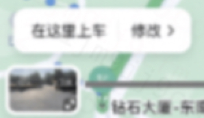
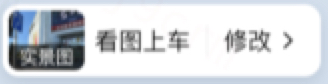
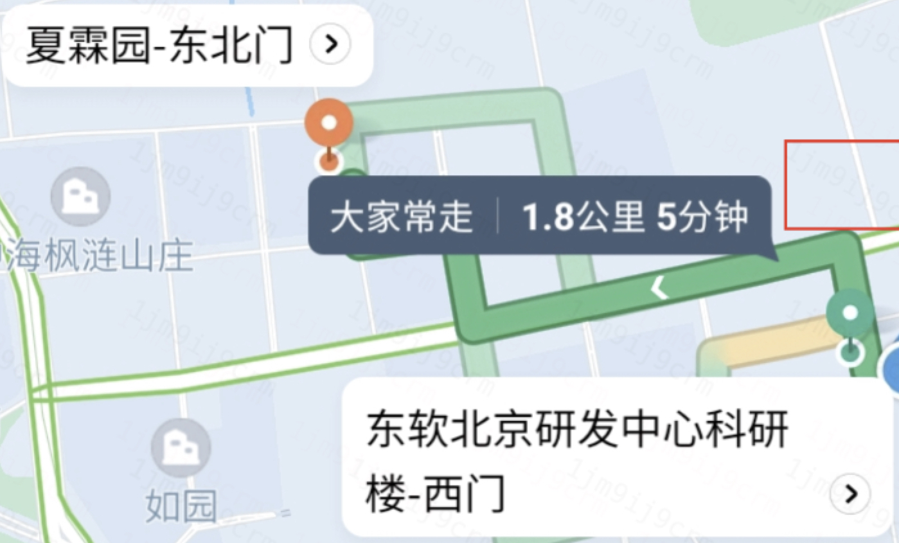

# 疑难杂症汇总

## 图区元素清除失败

## 自定义气泡相关
::: details 气泡与 marker 距离过远 (`anchorY` 失效?)


方案: 气泡外套一层标签，高度写死，背景设置为透明，内部的元素底部对齐


::: 
::: danger 气泡文案遮挡
**文案右侧被遮挡: 定宽；底部被遮挡: 设置行高**
:::
::: details 获取气泡宽高
:::
::: details 获取气泡点击位置

> 微信回调函数中的事件对象不会透出位置信息
  
方案一: **外层 view 标签捕获点击事件(事件冒泡)**
```txt
<view bindtap="handleTap">
  <map></map>
  <x-marker
    bindcallouttap="xxx"
    bindmarkertap="xxx"
  ></x-marker>
</view>
handleTap(e) { // e.detil: {x: number, y: number} }
```
兼容性:

微信: handleTap 在模拟器会触发(格式为: {x: 105.4036865234375, y: 192.92376708984375})，真机不会触发，需要开发者自行计算

原因: 由于自定义气泡模板外层使用 cover-view 标签，真机上 cover-view 比 view 层级高，事件冒泡不会触发。

支付宝: handleTap 在模拟器、真机均会触发(格式为: { clientX: 59, clientY: 125, pageX: 59, pageY: 125 })

方案二: 自己计算点击位置
:::

::: details 气泡融合方案

> 实景图气泡、起点气泡分别有自己的点击行为，由于自定义气泡没有透出点击标识，开发者无法区分是谁触发了点击事件，所以做成了 2 个气泡，如下图:



现在需要把 2 个气泡融合成 1 个气泡，如下图:



实现方案: 气泡上面 **绘制透明 marker**，监听 marker 的点击事件(确保透明 marker 压盖自定义气泡)。

注: 支付宝安卓透明 marker 绘制在自定义气泡下，该方案不生效。
:::

::: details 气泡偏移方案

> 自定义气泡位置可以随意摆放(在大头针左上、右上、左下、右下等)



实现方案:

微信: 调整 anchorX 可熟实现横向偏移(向右为正)；调整 anchorY 实现纵向偏移(向下为正)

支付宝: 
:::

## 其它
- 面板穿透方案
> map 上覆盖 view 标签，滑动 view 会穿透至地图

## 经验
- 自定义气泡内不支持自定义点击事件，可通过 `callouttap` 捕获点击事件
