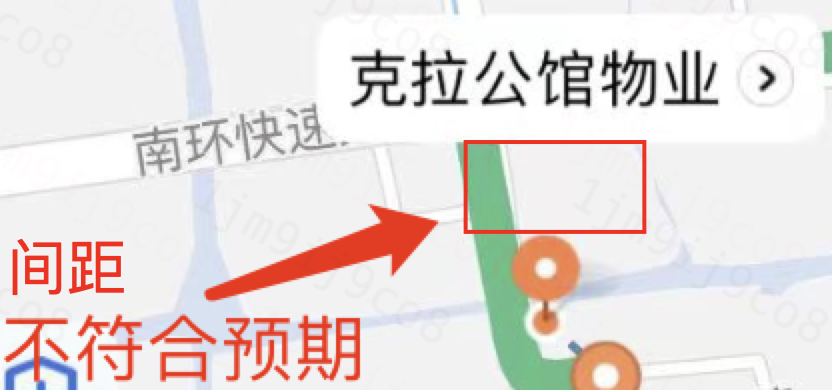
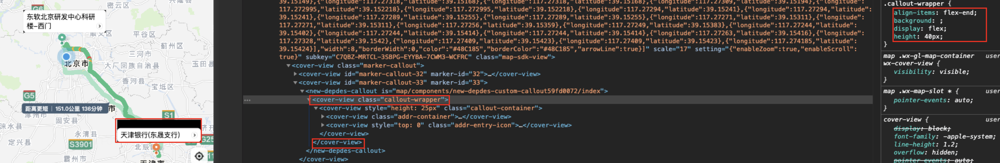
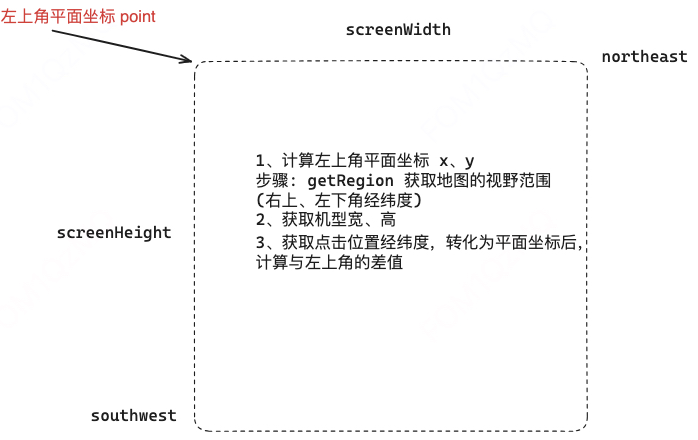
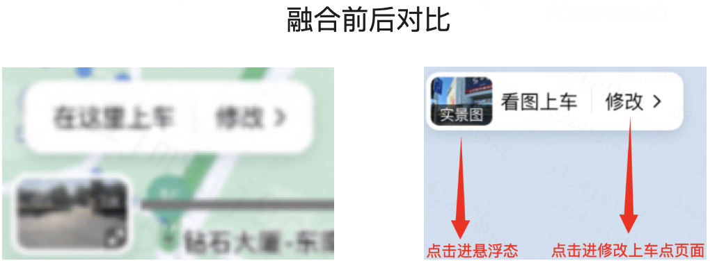
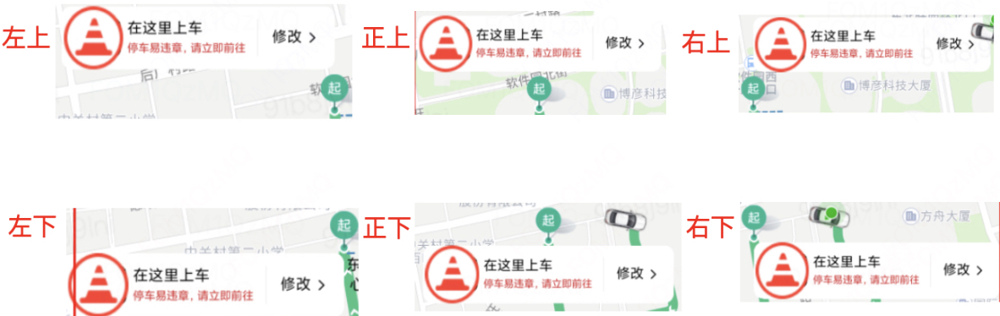

# 技术攻坚

## 图区元素清除失败

## 自定义气泡相关
::: details 自定义气泡与 marker 距离过远 (`anchorY` 失效?)


方案: 气泡外层在包一层标签，标签高度写死，背景设置为透明，子元素底部对齐。
::: code-group
```html
<cover-view class="wrapper" style="{{ wrapperStyle }}">
 // 气泡内容
</cover-view
```
```vue
computed: {
  wrapperStyle() {
    if (params.isBottomDir) { // 气泡偏移至在大头针下方
      return 'align-items: flex-start'
    }
    return 'align-items: flex-end' // 气泡在大头针上方
  }
}
```
```css
.wrapper {
  height: 40px
  background: transparent;
  display: flex;
  align-items: flex-end;
}
```
:::


::: 
::: danger 自定义气泡文案遮挡问题
**右侧文案被遮挡: 给气泡设置度宽**
:::
::: details 获取自定义气泡宽高
::: code-group
```html
<map>
  <cover-view slot="callout">
    <block wx:for="{{ callouts }}" wx:key="markerId">
      <block wx:if="{{item && item.markerId != null}}">
        <cover-view marker-id="{{ item.markerId }}" id="marker-callout-{{item.markerId}}">
          <xxx-callout></xxx-callout>
        </cover-view>
      </block>
    </block>
  </cover-view>
</map>
```
```vue
watch: {
  callouts: {
    deep: true,
    async handler() {
      wx.nextTick(async () => {
        const rects = await Promise.all(this.callouts.map(callout => {
          return new Promise((resolve) => {
            if (callout) {
              wx.createSelectorQuery().in(this).select(`#marker-callout-${callout.markerId}`)
                .boundingClientRect((rect) => {
                  if (rect) {
                    resolve(rect)
                  } else {
                    resolve({ width: 0, height: 0 })
                  }
                }).exec()
            } else {
              resolve({ width: 0, height: 0 })
            }
          })
        }))
        // 获取到 rects 集合
      })
    }
  }
}
```
:::
::: details 计算图区点击位置

> 小程序地图点击事件回调函数中的事件对象不会透出 x、y 信息
  
方案一: **外层 view 标签捕获点击事件(事件冒泡)**
```txt
<view bindtap="handleTap">
  <map></map>
  <x-marker
    bindcallouttap="xxx"
    bindmarkertap="xxx"
  ></x-marker>
</view>
handleTap(e) { // e.detil: {x: number, y: number} }
```
兼容性:

handleTap 在模拟器会触发(格式为: {x: 105.4036865234375, y: 192.92376708984375})，真机不会触发

原因: 由于自定义气泡模板外层使用 cover-view 标签，真机上 cover-view 比 view 层级高，事件冒泡不会触发。

支付宝: handleTap 在模拟器、真机均会触发(格式为: { clientX: 59, clientY: 125, pageX: 59, pageY: 125 })

方案二: 自己计算

:::

::: details 气泡融合(实景图气泡、起点气泡融合为 1 个气泡)



> 背景: 微信小程序中，无法识别一个气泡的不同位置的点击事件

方案: 气泡上 **绘制透明 marker**，监听 marker 点击事件(前提: marker 层级必须高于气泡，调整 zIndex)。
```javascript
// 透明 marker 位置计算(支持偏移)
// 1、已知大头针经纬度，宽高，把经纬度转为平面坐标 x、y
// latlng2xy
// 2、知道气泡宽高，可以获取气泡任意方向左边中心的x、y
let position = null
let bubbleWidth = 120
let bubbleHeight = 50
// 左上
position = { 
  x: point.x - bubbleWidth,
  y: point.y - (bubbleHeight / 2)
}
// 正上
position = {
  x: point.x - (bubbleWidth / 2),
  y: point.y - (bubbleHeight / 2)
}
// 右上
position = { 
  x: point.x,
  y: point.y - (bubbleHeight / 2)
}
// 左下
position = { 
  x: point.x - bubbleWidth,
  y: point.y + (bubbleHeight / 2)
}
// 正下
position = { 
  x: point.x - (bubbleWidth / 2),
  y: point.y + (bubbleHeight / 2)
}
// 右下
position = { 
  x: point.x,
  y: point.y + (bubbleHeight / 2)
}
// 3、已知透明 marker 宽高，计算扎点的平面坐标并转为经纬度
// xy2latlng
```

备注: 支付宝安卓 marker 层级比气泡低(方案: 元素添加唯一标识，回调事件中根据标识来区分)。

:::

::: details 气泡偏移

> 气泡位置可以随意摆放(左上、正上、右上、左下、正下、右下)



实现方案:

微信: 调整 customCallout 中的 anchorX 可实现横向偏移(向右为正)；调整 anchorY 实现纵向偏移(向下为正)
```javascript
const anchorXThreshold = 0 // anchorX 偏移阈值
const anchorYThreshold // anchorY 偏移阈值，默认为 marker 高度
const bubbleWidth = 200 // 气泡宽度
const bubbleHeight = 60 // 气泡高度
let anchorX = 0
let anchorY = 0

// 左上
anchorX = -(bubbleWidth / 2) + anchorXThreshold
// 正上
anchorX = 0
// 右上
anchorX = (bubbleWidth / 2) - anchorXThreshold
// 左下
anchorX = -(bubbleWidth / 2) + anchorXThreshold
anchorY = bubbleHeight + anchorYThreshold
// 正下
anchorX = 0
anchorY = bubbleHeight + anchorYThreshold
// 右下
anchorX = (bubbleWidth / 2) - anchorXThreshold
anchorY = bubbleHeight + anchorYThreshold
```
支付宝: 
```javascript
let anchor = { x: 0.5, y: 1 }
// 左上
anchor = { x: 1, y: 1 }
// 正上
anchor = { x: 0.5, y: 1 }
// 右上
anchor = { x: 0, y: 1 }
// 左下
anchor = { x: 1, y: 0 }
// 正下
anchor = { x: 0.5, y: 0 }
// 右下
anchor = { x: 0, y: 0 }
```
:::

## 其它
- 面板穿透方案
> map 上覆盖 view 标签，view 上滑动会穿透至地图
