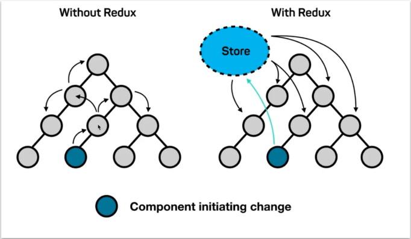
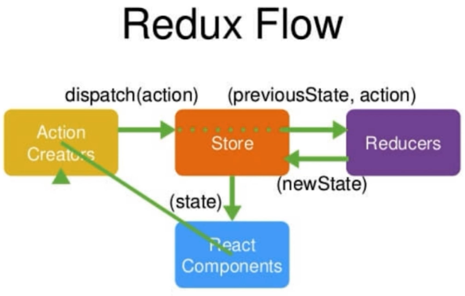
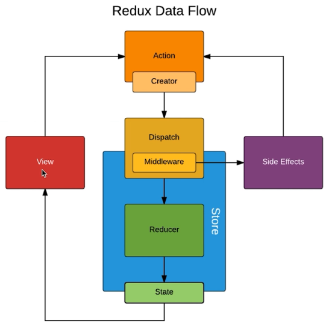
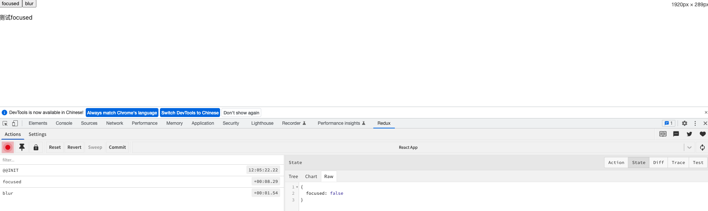

# redux


## 原理


## 使用
- **store**
```js
import { createStore } from 'redux'
import reducer from './reducer'
const store = createStore(reducer)
// getState、dispatch、subscribe

export default store
```
- **reducer**

```js
import { ADD, DELETE } from "./actionTypes"

const initState = { // 初始状态
  list: [0, 1]
}

function reducer(state = initState, action) {
  switch (action.type) {
    case DELETE:
      const newState = JSON.parse(JSON.stringify(state))
      newState.list.splice(action.index, 1)
      return newState;
    case ADD:
      const copyState = JSON.parse(JSON.stringify(state))
      copyState.list.push(action.value)
      return copyState
    default:
      return state
  }
}

export default reducer
```
- **actionTypes**
```js
export const DELETE = 'DELETE'
export const ADD = 'ADD'
```

- **actionCreators**
```js
import * as types from './actionTypes'

export const createDeleteAction = (index) => ({
  type: types.DELETE,
  index
})

export const createAddAction = (value) => ({
  type: types.ADD,
  value  
})
```
- **组件连接 store**
```js
import store from './store'
import { createDeleteAction, createAddAction } from './store/actionCreators'

class App extends Component {
  constructor(props) {
    super(props)
    this.state = store.getState() // 连接 store
  }
  componentDidMount() {
    // 监听 store 变化，重新设置 state
    store.subscribe(this.handleStoreChange)
  }

  handleStoreChange = () => {
    this.setState(store.getState())
  }

  handleAddItem = () => {
    // 派发 action 修改 store
    store.dispatch(createAddAction(this.state.list.length)) 
  }

  handleDeleteItem = (index) => {
    store.dispatch(createDeleteAction(index))
  }
  
  render() {
    return (
      <div>
        <ul>
            { this.state.list.map((item, index) => 
                <li key= { index } onClick = {() => this.handleDeleteItem(index)}>点击删除: { item }</li>)
            }
        </ul>
        <button onClick = { this.handleAddItem }>添加</button>
      </div>
    )
  }
}
export default App;
```
## `middleware` 中间件

:::warning 原理
- 本质是对 `dispatch` 方法的封装。因为 `actionCreators` 默认返回普通对象，使用中间件后可以返回函数，这就使的 `dispatch` 即可以接收对象，也可以接受函数做为参数。

- 常用的中间件有 `redux-thunk`、`redux-saga` 等。
:::
## redux-thunk
**可以将异步逻辑放到 `actionCreators`中执行**，使用方式如下：
```js{16-20}
// store.js
import { createStore, applyMiddleware } from 'redux'
import reducer from './reducer'
import thunk from 'redux-thunk'

const store = createStore(reducer, applyMiddleware(thunk))

export default store

// actionCreators.js
const initStateAction = (list) => ({
  type: types.INIT,
  list
})

export const createThunkAction = () => {
  return (dispatch) => {       
    dispatch(initStateAction(['redux', 'redux-thunk']))
  }
}

// App.js
componentDidMount() {
  const action = createThunkAction()
  // dispatch action 的过程中，action 对应的函数会主动执行
  store.dispatch(action)
}
```
## redux-saga
## redux devTools 
- 创建 `store` 时添加，配置如下
```js
import { createStore, compose, applyMiddleware } from 'redux';
import thunk from 'redux-thunk';
import reducer from './reducer';

const composeEnhancers = window.__REDUX_DEVTOOLS_EXTENSION_COMPOSE__ || compose;
const store = createStore(reducer, composeEnhancers(
	applyMiddleware(thunk)
));

export default store;
```
- 效果如下图

## react-redux
- `Provider` 提供
```js{11-13}
// index.js
import React from 'react';
import ReactDOM from 'react-dom/client';
import App from './App';
import { Provider } from 'react-redux'
import store from './store'

const root = ReactDOM.createRoot(document.getElementById('root'));
root.render(
  <React.StrictMode>
    <Provider store = { store }>
      <App />
    </Provider>
  </React.StrictMode>
);
```
- `connect` 连接
```js{18-31}
import { connect } from 'react-redux';
import { createDeleteAction, createAddAction } from './store/actionCreator'

function App(props) {
  const {list, handleAddItem, handleDeleteItem } = props 

  return (
    <div>
      <ul>
        { list.map((item, index) => 
            <li key={index} onClick={() => handleDeleteItem(index)}>点击删除: {item}</li>)}
      </ul>
      <button onClick={handleAddItem}>添加</button>
    </div>
  )
}

const mapStateToProps = (state) => ({ // store state 映射到组件 props
  list: state.list
})

const mapDispatchToProps = (dispatch) => ({ // store dispatch 映射到组件 props
  handleAddItem () {
    dispatch(createAddAction())
  },
  handleDeleteItem (index) {
    dispatch(createDeleteAction(index))
  }
})

export default connect(mapStateToProps, mapDispatchToProps)(App)
```
## `combineReducers`
```js{6-7}
import { combineReducers } from 'redux';
import { reducer as headerReducer } from 'xxx'
import { reducer as homeReducer } from 'xxx'

const reducer = combineReducers({
  header: headerReducer,
  home: homeReducer
})
export default reducer
```
组件使用时需要加上对应 `reducer` 前缀
```jsx{2}
const mapStateToProps = (state) => ({
  focused: state.header.focused
})
```
## [immutable](https://immutable-js.com/)
:::warning 不可变数据

不可变数据就是一旦创建，就不能再被更改的数据。对 `immutable` 对象的任何修改或添加删除操作都会返回一个新的 `immutable` 对象。

实现原理是持久化数据结构。使用旧数据创建新数据时，要保证旧数据同时可用且不变。同时为了避免 `deepCopy` 把所有节点都复制一遍带来的性能损耗。

`immutable` 使用了结构共享，如果对象树中一个节点发生变化，只修改这个节点和受它影响的父节点，其它节点则进行共享。
:::
- 安装
```sh
cnpm i immutable --save
```
- 修改 `reducer.js`
```js
import { fromJS } from 'immutable'

const initState = fromJS({
  focused: false
})

function reducer(state = initState, action) {
  switch(action.type) {
    case FOCUSED:
      return state.set('focused', true)
    case BLUR:
      return state.set('focused', false)
    default:
      return state
  }
}
```
- 修改组件获取数据方式
```jsx{11}
function App (props) {
  return (
    <div>
      <p className={ props.focused ? 'focused': '' }>focused</p>
    </div>
  )
}

const mapStateToProps = (state) => {
  return {
    focused: state.header.get('focused')
  }
}

export default connect(mapStateToProps, ...)(App);
```
上述代码中，`state` 是普通对象， `state.header` 是 `immutable` 对象。为了保证 `state` 也是 `immutable` 对象(统一属性读取方式)，可以引入 `redux-immutable`。
## redux-immutable
- 安装
```sh
cnpm i redux-immutable --save
```
- 替换 `redux` 中的 `combineReducers` 函数
```js
import { combineReducers } from 'redux-immutable';
```
- 修改组件获取数据方式
```js
const mapStateToProps = (state) => {
  return {
    // focused: state.get('header').get('focused')
    focused: state.getIn(['header', 'focused']),
  }
}
```
