# [rollup](https://cn.rollupjs.org/)
## 简介
`rollup` 是一个用于 `JavaScript` 的模块打包工具。它可以将项目中散落的细小模块打包为整块代码，从而使得这些划分的模块可以更好地运行在浏览器环境或 `Node.js` 环境(**默认只能处理 `ESM` 模块**)。

::: details rollup vs webpack
从作用上来看，`rollup` 与 `webpack` 非常类似。不过相比之下，`rollup` 要小巧的多，`webpack` 在配合一些插件的使用下，几乎可以完成开发过程中绝大多数前端工程化的工作。而 `rollup` 可以说仅仅是一个 `ES Modules` 打包器，没有更多其他的功能了。
:::

**`rollup` 诞生的初衷是希望能够提供一个高效的 `JavaScript` 打包器，充分利用 `ES Modules` 的各项特性，构建出结构扁平，性能出众的类库**。
## 快速上手
- 安装 `rollup`
```sh
npm i rollup --save-dev
```
安装完成后，在 `node_modules/.bin` 目录中会提供一个 `CLI` 程序，我们可以通过 `CLI` 去运行 `rollup` 打包。具体命令如下：
```sh
npx rollup(node版本: v16.14.2)
```
- 案列结构如下：
```
├── src
|   ├── index.js  
|   ├── logger.js            
|   ├── message.js           
├── package.json
```
部分代码如下: 
```js
// ./src/message.js
export default {
  hi: 'Hey Guys, I am zce~'
}

// ./src/logger.js
export const log = msg => {
  console.log('---------- INFO ----------')
  console.log(msg)
  console.log('--------------------------')
}
export const error = msg => {
  console.error('---------- ERROR ----------')
  console.error(msg)
  console.error('---------------------------')
}

// ./src/index.js
import { log } from './logger'
import message from './message'
log(message.hi)
```
- 运行 `rollup` 打包
```js
npx rollup ./src/index.js // 指定打包入口是 src/index.js
```
执行结果如下图
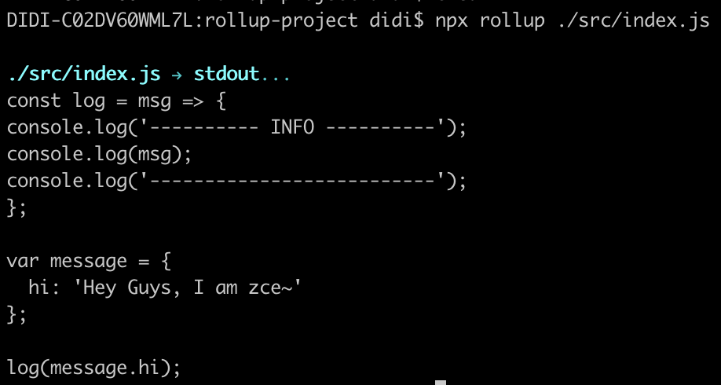
- 指定输出文件
```sh
npx rollup ./src/index.js --file ./dist/bundle.js
```
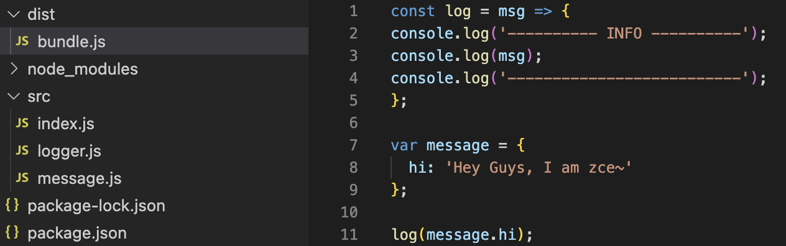

从上述图片可以看出，`rollup` 打包结果惊人的简洁，基本上就和我们手写的代码一样。相比于 `webpack` 大量的引导代码和一堆的模块函数，这里的输出结果没有任何多余代码，仅仅把打包过程中的各个模块按照依赖顺序，先后拼接到了一起。

另外在输出的结果中只会保留那些用到的部分，对于未引用部分不会输出。这是因为 `rollup` 默认会自动开启 `tree-shaking` 优化输出结果(`tree-shaking` 的概念最早由 `rollup` 提出)
## 配置文件
- 新建 `rollup.config.js`
```
├── src
|   ├── index.js  
|   ├── logger.js            
|   ├── message.js           
├── package.json
+└── rollup.config.js
```
配置文件需要导出一个配置对象，通过 `input` 指定打包的入口文件路径，`output` 指定输出相关配置，在 `output` 对象中使用 `file` 指定输出文件名，`format` 属性指定输出代码的格式。
```js
export default {
  input: 'src/index.js',
  output: {
    file: 'dist/bundle.js',
    format: 'es'
  }
}
```
- 基于 `rollup` 运行配置文件
```js
npx rollup --config // 使用默认配置文件
npx rollup --config rollup.prod.js // 指定配置文件路径
```
## 输出格式
`rollup` 支持输出多种格式的文件，具体配置如下：
```js
// ./rollup.config.js
const formats = ['es', 'amd', 'cjs', 'iife', 'umd', 'system']

export default formats.map(format => ({
  input: 'src/index.js',
  output: {
    file: `dist/bundle.${format}.js`,
    format
  }
}))
```
在上述配置中我们导出了一个数组，数组中的每个成员都是一个单独的打包配置，`rollup` 会按照每个配置单独打包。再次运行 `rollup` 命令打包，`dist` 目录下就会生成不同格式的输出结果，如下图所示：
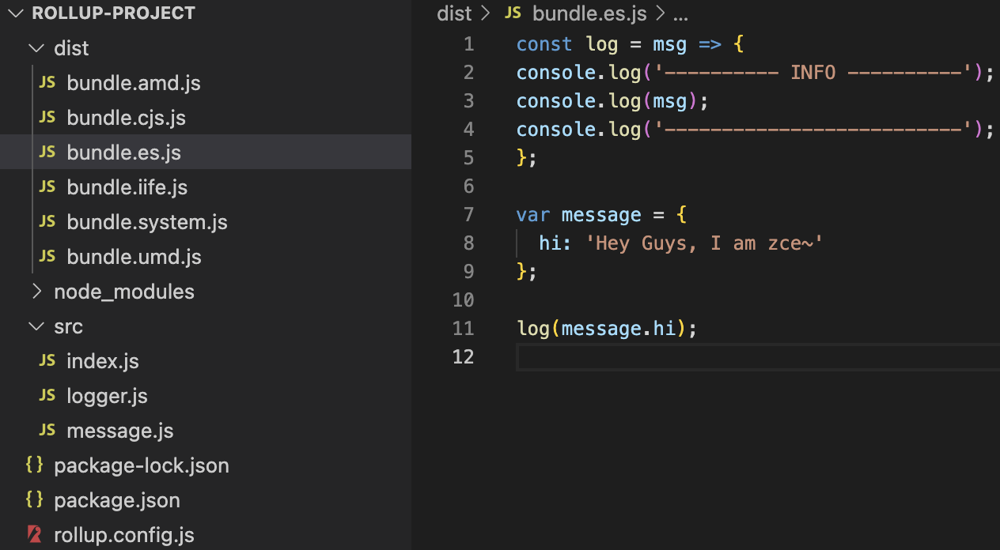
:::danger 注意
需要在 `package.json` 中声明 "type": "module" 属性，具体报错如下: 

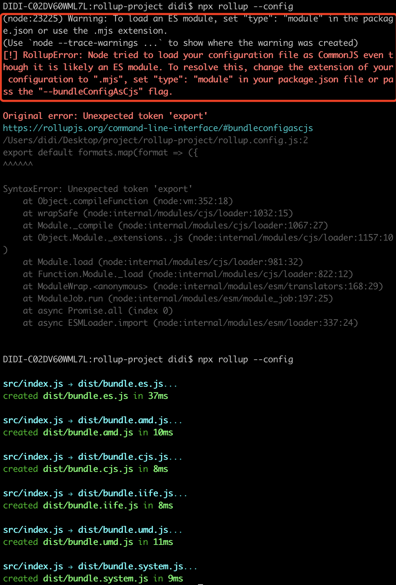
::: 
## 插件机制
> 由于 `rollup` 自身的功能就只是 `ES Modules` 模块的合并，如果有更高级的要求，例如加载其他类型的资源文件或者导入 `commonjs` 模块，或编译 `ES` 新特性，这些额外的需求需要借助插件去实现。

> 不同于 `webapck`，插件是 `rollup` 唯一的扩展方式。
### 1、导入 `json` 文件
- 安装插件
```sh
npm i @rollup/plugin-json --save-dev
```
- 配置插件
```js{9-11}
import json from '@rollup/plugin-json'

export default {
  input: 'src/index.js',
  output: {
    file: 'dist/bundle.js',
    format: 'es'
  },
  plugins: [
    json()
  ]
}
```
:::details `@rollup/plugin-json` 插件简介
该插件默认导出函数。我们可以将该函数的调用结果添加到配置对象的 `plugins `数组中，注意这里是将调用结果放到数组中，而不是将这个函数直接放进去。
:::
- 导入 `json` 文件
```js
// ./src/index.js
import { name, version } from '../package.json'
console.log(name, version)
```
- 打包测试

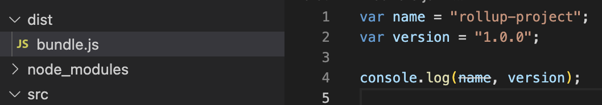
可以看到，`package.json` 中的 `name` 和 `version` 被打包进来了。
### 2、加载 `CommonJS` 模块
由于 `rollup` 默认只处理 `ES Modules` 模块的打包，如果在代码中导入 `CommonJS` 模块，默认是不被支持的。因此为了兼容 `CommonJS` 模块。我们可以使用 `@rollup/plugin-commonjs`

- 安装插件
```sh
npm i @rollup/plugin-commonjs --save-dev
```
- 配置插件
```js{9-11}
import commonjs from '@rollup/plugin-commonjs'

export default {
  input: 'src/index.js',
  output: {
    file: 'dist/bundle.js',
    format: 'es'
  },
  plugins: [
    commonjs()
  ]
}
```
- 导入 `commonjs` 文件
```js
// ./src/cjs-module.js
module.exports = { // 使用 CommonJS 的方式导出对象
  foo: 'bar'
}

// index.js
import cjs from './cjs-module' // 通过 ES Modules 的方式导入并使用模块成员
console.log(cjs) // cjs => { foo: 'bar' }
```
### 3、加载 `npm` 模块
由于 `rollup` 默认只能按照文件路径的方式加载本地的模块文件，对于 `node_modules` 中的第三方模块，并不能通过模块名称直接导入。
- 安装插件
```sh   
npm i @rollup/plugin-node-resolve --save-dev
```
- 配置插件
```js{9-11}
import resolve from '@rollup/plugin-node-resolve'

export default {
  input: 'src/index.js',
  output: {
    file: 'dist/bundle.js',
    format: 'es'
  },
  plugins: [
    resolve()
  ]
}
```
- 导入第三方模块
```js
// ./src/index.js
import { camelCase } from 'lodash-es'

console.log(camelCase('rollup'))  // helloRollup
```
> `lodash-es` 模块属于 `lodash` 的 `ESM` 版本，相比于普通的 `lodash`，`lodash-es` 可以更好地支持 `tree-shaking`。
## 代码拆分
```js
// ./src/index.js
import('./logger').then(({ log }) => { // 动态导入的模块会自动分包
  log('code splitting~')
})
```
:::danger 报错
由于 `rollup` 内部也会处理代码拆分。按照之前的配置方式，直接运行打包会报错：

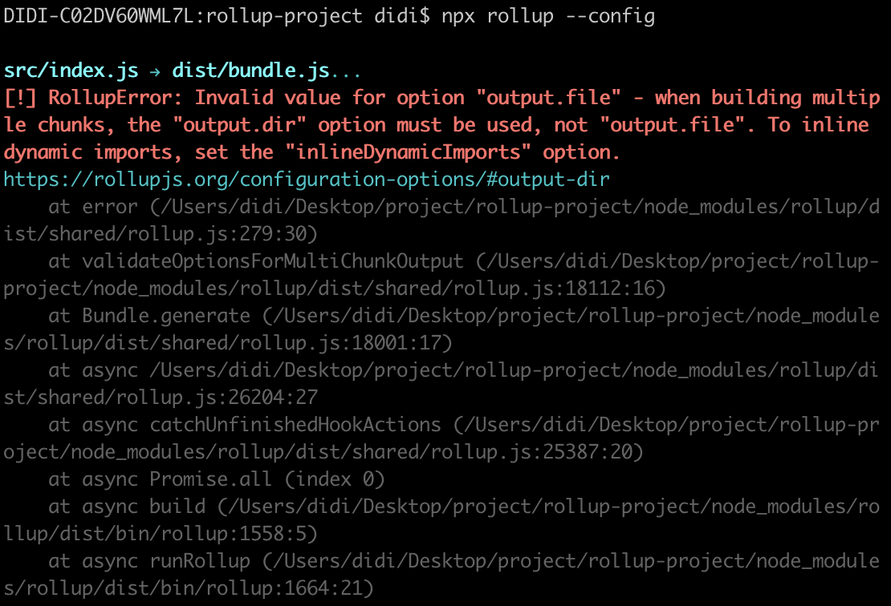
:::
由于 `rollup` 在分包过后会输出多个 `js` 文件，我们需要在配置中指定输出的目录，而不是一个具体的文件名，修改配置如下：
```js
export default {
  input: 'src/index.js',
  output: {
    // file: 'dist/bundle.js', // code splitting 输出的是多个文件
    dir: 'dist',
    format: 'es'
  }
}
```
再次打包就可以正常输出了。输出结果如下图（`rollup` 会自动提取动态导入的模块到单独的文件中）

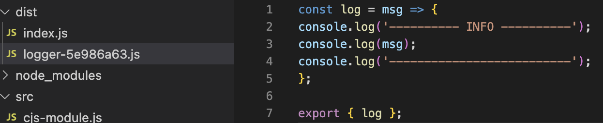

## 代码拆分输出格式
由于上面采用的输出格式是 `es`，自动分包过后，得到的代码还是使用 `ES Modules` 实现的动态模块加载:

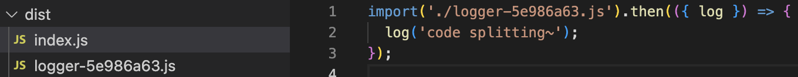
::: warning 缺陷
这种方式的代码仍然会存在环境兼容性问题，比如在低版本浏览器，这种输出结果是无法正常执行的。
:::
此时我们可以修改 `rollup` 打包输出的格式，目前所有支持动态导入的输出格式中，只有 `amd` 和 `system` 两种格式打包的结果适合于浏览器环境。

在这种情况下，我们可以选择以 `amd` 或者 `system` 格式输出。以 `amd` 为例，我们修改配置如下：
```js
export default {
  input: 'src/index.js',
  output: {
    dir: 'dist',
    format: 'amd'
  }
}
```
再次打包输出的结果就是采用 `amd` 标准组织的代码了，具体如下：

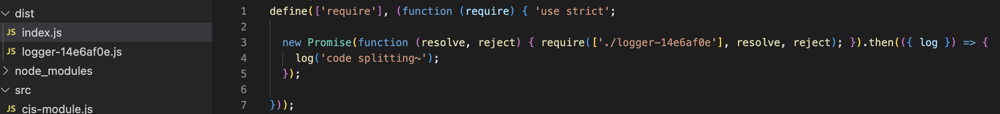

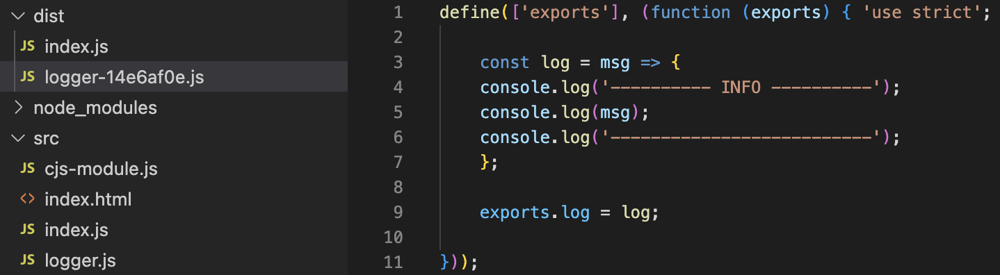

需要注意一点，这种 `amd` 标准在浏览器中也不是直接支持的，也就是说我们还是需要使用一个支持这个标准的库来加载这些输出的模块，例如 `require.js`，具体使用方式参考如下代码: 新建 `index.html`
```html
<!DOCTYPE html>
<html lang="en">
<head>
  <meta charset="UTF-8">
  <title>AMD Format output</title>
</head>
<body>
  <script src="https://unpkg.com/requirejs@2.3.6/require.js" data-main="../dist/index.js"></script>
</body>
</html>
```
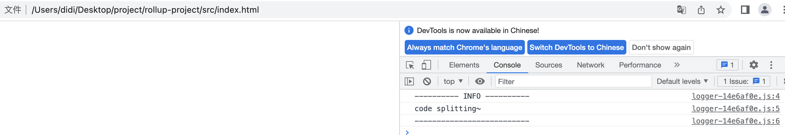
## 总结
:::tip `rollup` 优势
- 输出结果更加扁平，执行效率更高
- 自动移除未引用代码
- 打包结果依然完全可读
:::
::: warning `rollup` 缺陷
- 加载非 `ESM` 的第三方模块比较复杂
- 因为模块最终都被打包到全局中，所以无法实现 `HMR`
- 浏览器环境中，代码拆分功能必须使用 `require.js` 这样的 `AMD` 库
:::

**应用开发使用 webpack，类库或者框架开发使用 rollup**