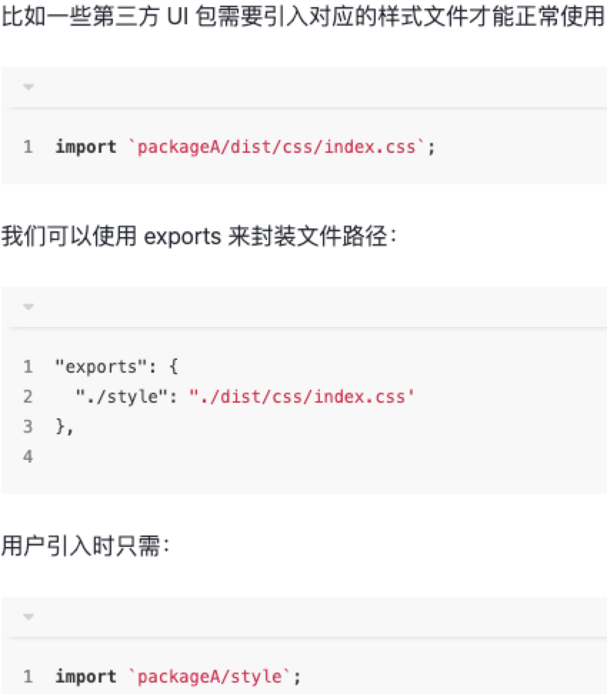

# package.json 解读
## 描述配置 
1、`name`: 项目的名称

2、`version`: 项目的版本号

3、`repository`: 项目的仓库地址以及版本控制信息。

4、`description`: 项目的描述

5、`keywords`: 项目的关键词(可以帮助别人在 npm 官网上更好地检索到该项目，增加曝光率)

6、`homepage`: 项目主页的链接

7、`bugs`: 项目 `bug` 反馈地址

8、`license`: 项目的开源许可证

9、`author`: 项目作者
```json
{
  "name": "vue-router",
  "version": "3.6.5",
  "repository": {
    "type": "git",
    "url": "https://github.com/vuejs/vue-router.git"
  },
  "description": "Official router for Vue.js 2",
  "keywords": ["vue", "router", "routing"],
  "homepage": "https://github.com/vuejs/vue-router#readme",
  "bugs": {
    "url": "https://github.com/vuejs/vue-router/issues"
  },
  "license": "MIT",
  "author": "Evan You"
}
```
## 文件配置
1、`files`
::: tip
项目发布时默认会包括 `package.json`，`license`，`README` 和 `main` 字段里指定的文件，

在此基础上，我们可以通过 `files` 指定需要跟随一起发布的内容（可以是单独的文件，整个文件夹，或者使用通配符匹配到的文件）

注: 一般情况下，files 里会指定构建出来的产物以及类型文件。
::: 
2、`main`:
项目的入口文件(不设置 `main` 字段，入口文件就是根目录下的 `index.js`)

3、`module`:
指定 `ES` 模块的入口文件

4、`unpkg`:
让 `npm` 上所有的文件都开启 `CDN` 服务。

5、`jsdelivr`:
与 `unpkg` 类似

6、`sideEffects`:
设置某些模块具有副作用，用于 `webpack` 的 `tree-shaking` 优化。

7、`types` 或者 `typings`:
指定 `TypeScript` 类型定义的入口文件

8、`browserslist`: 设置项目的浏览器兼容情况(`babel` 和 `autoprefixer` 等工具会使用该配置对代码进行转换)。另外我们也可以使用 .`browserslistrc` 文件进行配置。

9、`exports`
> 条件导出(node >= 14.13)。 该字段可以配置不同环境对应的模块入口文件，当它存在时，优先级最高。

比如使用 `require` 和 `import` 字段根据模块规范分别定义入口：
```json
"exports": {
  "require": "../dist/vue-router.common.js",
  "import": "./dist/vue-router.esm.js"
}
```
当使用 `import 'xxx'` 和 `require('xxx')` 时会从不同的入口引入文件。另外 `exports` 也支持使用 `browser` 和 `node` 字段定义 `browser` 和` node` 环境中的入口。

上方的写法其实等同于：
```json
"exports": {
  ".": {
    "require": "../dist/vue-router.common.js",
    "import": "./dist/vue-router.esm.js"
  }
}
```

之所以要加一个层级，把 `require` 和 `import` 放在 "." 下面，是因为 `exports` 除了支持配置包的默认导出，还支持配置包的子路径。

示例如下:


::: warning 注意
除了对导出的文件路径进行封装，`exports` 还限制了使用者不可以访问未在 `exports` 中定义的任何其他路径。

比如发布的 `dist` 文件里有一些内部模块 `dist/internal/module` ，被用户单独引入使用的话可能会导致主模块不可用。为了限制外部的使用，我们可以不在 `exports` 定义这些模块的路径，这样外部引入 `packageA/dist/internal/module` 模块的话就会报错。
:::

10、`lint-staged`:
对 `git` 暂存区的文件进行操作(一般用于在代码提交前执行 `lint` 校验)

11、`gitHooks`: 当 `git` 存储库中发生特定事件时会自动运行特定脚本，允许开发者定制 `git` 的内部行为。

我们来看看上述字段在 `vue-router` 中的配置情况: 
```json
{
  "files": [
    "src",
    "dist/*.js",
    "dist/*.mjs",
    "types/*.d.ts"
  ],
  "main": "dist/vue-router.common.js",
  "module": "dist/vue-router.esm.js",
  "unpkg": "dist/vue-router.js",
  "jsdelivr": "dist/vue-router.js",
  "sideEffects": false,
  "typings": "types/index.d.ts",
  "exports": {
    ".": {
      "import": {
        "node": "./dist/vue-router.mjs",
        "default": "./dist/vue-router.esm.js"
      },
      "require": "./dist/vue-router.common.js",
      "types": "./types/index.d.ts"
    },
    "./composables": {
      "import": "./composables.mjs",
      "require": "./composables.js",
      "types": "./composables.d.ts"
    },
    "./dist/*": "./dist/*",
    "./types/*": "./types/*",
    "./package.json": "./package.json"
  },
  "lint-staged": {
    "*.{js,vue}": [
      "eslint --fix",
      "git add"
    ]
  },
  "gitHooks": {
    "pre-commit": "lint-staged",
    "commit-msg": "node scripts/verifyCommitMsg.js"
  }
}
```

`scripts/verifyCommitMsg.js` 校验逻辑如下:
```sh
npm install yorkie --save-dev(^2.0.0)
```

```js
const chalk = require('chalk')  // eslint-disable-line
const msgPath = process.env.GIT_PARAMS
const msg = require('fs').readFileSync(msgPath, 'utf-8').trim()

const commitRE = /^(v\d+\.\d+\.\d+(-(alpha|beta|rc.\d+))?$)|((revert: )?(feat|fix|docs|style|refactor|perf|test|workflow|ci|chore|types|build)(\(.+\))?: .{1,50})/
// ^(build|chore|ci|docs|feat|fix|wip|perf|refactor|revert|style|test|temp|)(\(.+\))?: .{1,50}

if (!commitRE.test(msg)) {
  console.log()
  console.error(
    `  ${chalk.bgRed.white(' ERROR ')} ${chalk.red(`invalid commit message format.`)}\n\n` +
    chalk.red(`  Proper commit message format is required for automated changelog generation. Examples:\n\n`) +
    `    ${chalk.green(`feat(compiler): add 'comments' option`)}\n` +
    `    ${chalk.green(`fix(v-model): handle events on blur (close #28)`)}\n\n` +
    chalk.red(`  See .github/COMMIT_CONVENTION.md for more details.\n`) +
    chalk.red(`  You can also use ${chalk.cyan(`npm run commit`)} to interactively generate a commit message.\n`)
  )
  process.exit(1) // 以非 0 值退出，放弃提交
}
```

## 脚本配置
1、`scripts`: 指定项目的内置脚本命令，基于 `npm run xx` 运行，通常包含项目开发、构建、代码格式化、测试、发布、文档部署等命令。
```json
{
  "scripts": {
    "dev": "node examples/server.js",
    "dev:dist": "rollup -wm -c build/rollup.dev.config.js",
    "build": "node build/build.js",
    "lint": "eslint src examples test",
    "test": "npm run lint && npm run flow && npm run test:unit && npm run test:e2e && npm run test:types",
    "flow": "flow check",
    "test:unit": "jasmine JASMINE_CONFIG_PATH=test/unit/jasmine.json",
    "test:e2e": "node test/e2e/runner.js",
    "test:e2e:ci": "node test/e2e/runner.js --local -e ie,android44 -c test/e2e/nightwatch.browserstack.js test/e2e/specs/active-links.js",
    "test:e2e:ff": "node test/e2e/runner.js -e firefox -c test/e2e/nightwatch.config.js",
    "test:e2e:ie9": "node test/e2e/runner.js --local -e ie9 -c test/e2e/nightwatch.browserstack.js --skiptags history,ie9-fail",
    "test:types": "tsc -p types/test",
    "docs": "vuepress dev docs",
    "docs:build": "vuepress build docs",
    "changelog": "conventional-changelog -p angular -r 2 -i CHANGELOG.md -s",
    "release": "bash scripts/release.sh",
    "commit": "git-cz"
  }
}
```
## 依赖配置
1、`dependencies`: 项目运行依赖(项目生产环境下需要用到的依赖)。使用 `npm install xxx` 或则 `npm install xxx --save` 时，会被自动插入到该字段中。

2、`devDependencies`: 项目开发依赖(项目开发环境需要用到)，用于辅助开发。使用 `npm install xxx -D` 或者 `npm install xxx --save-dev` 时，会被自动插入到该字段中。

3、`peerDependencies`: 同伴依赖，一种特殊的依赖，不会被自动安装，通常用于表示与另一个包的依赖与兼容性关系来警示使用者。
```json
{
  "devDependencies": {},
  "dependencies": {},
  "peerDependencies": {}
}
```

## 发布配置
1、`private`: 设置为 `true` 表示私有项目，不希望发布到公共 `npm` 仓库上。

## 系统配置
1、`engines`: 项目由于兼容性问题会对 `node` 或者包管理器有特定的版本号要求。举例如下:
```json
"engines": {
  "node": ">=14 <16", // node 版本大于等于 14 且小于 16
  "pnpm": ">7" // pnpm 版本号需要大于 7
}
```

