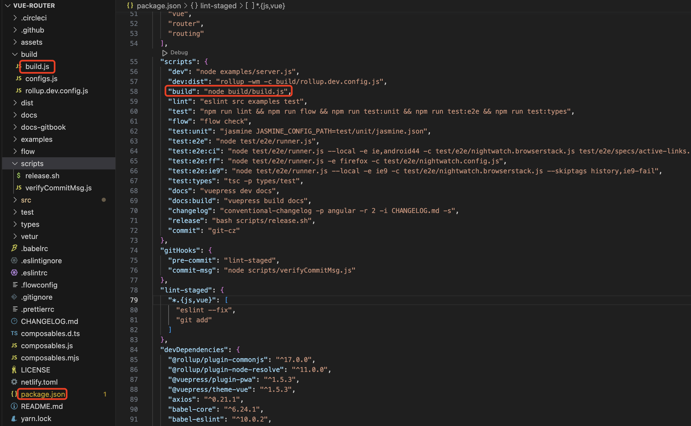
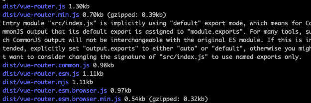
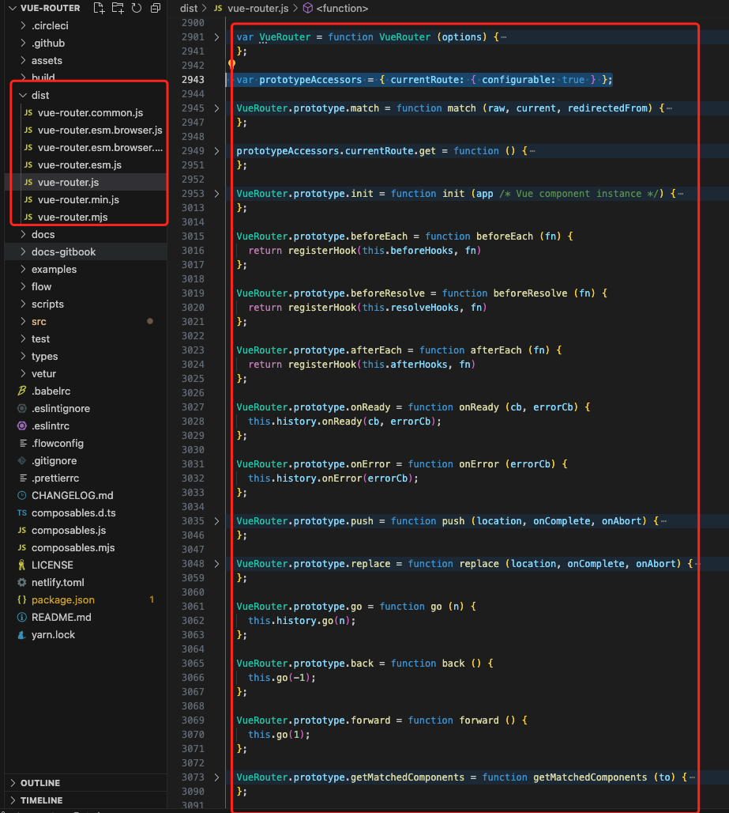
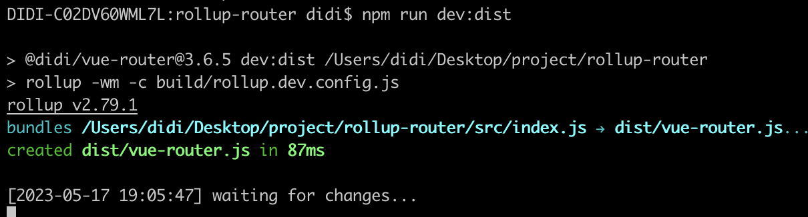
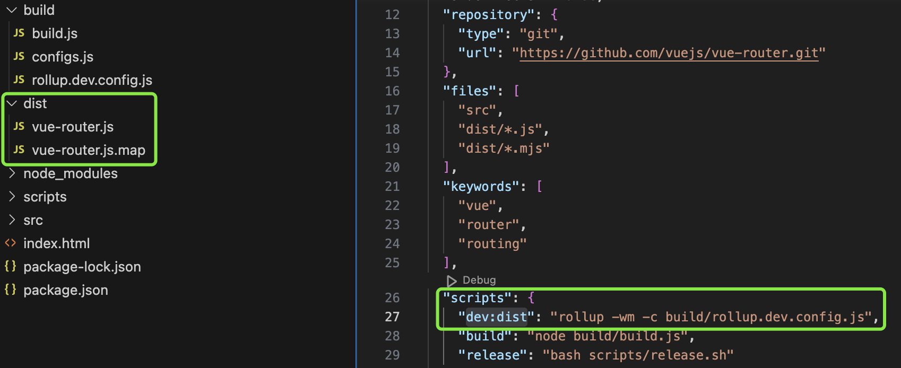

# 打包 vue-router(v3.6.5)
## 代码结构

## 定义打包指令
package.json 文件中定义了打包脚本，执行 npm run build 时，将会执行 build 目录下的 build.js。
```json
"scripts": {
  "build": "node build/build.js"
},
```
## build 目录分析
- configs.js
```js
const path = require('path')
const buble = require('rollup-plugin-buble')
const flow = require('rollup-plugin-flow-no-whitespace')
const cjs = require('@rollup/plugin-commonjs')
const node = require('@rollup/plugin-node-resolve').nodeResolve
const replace = require('rollup-plugin-replace')
const version = process.env.VERSION || require('../package.json').version
const banner = `/*!
  * vue-router v${version}
  * (c) ${new Date().getFullYear()} Evan You
  * @license MIT
  */`

const resolve = _path => path.resolve(__dirname, '../', _path)

module.exports = [
  {
    file: resolve('dist/vue-router.js'), // 打包文件最终输出的位置
    format: 'umd', // 打包格式
    env: 'development' // 环境变量
  },
  {
    file: resolve('dist/vue-router.min.js'),
    format: 'umd',
    env: 'production'
  },
  {
    file: resolve('dist/vue-router.common.js'),
    format: 'cjs'
  },
  {
    input: resolve('src/entries/esm.js'),
    file: resolve('dist/vue-router.esm.js'),
    format: 'es'
  },
  {
    input: resolve('src/entries/esm.js'),
    file: resolve('dist/vue-router.mjs'),
    format: 'es'
  },
  {
    input: resolve('src/entries/esm.js'),
    file: resolve('dist/vue-router.esm.browser.js'),
    format: 'es',
    env: 'development',
    transpile: false
  },
  {
    input: resolve('src/entries/esm.js'),
    file: resolve('dist/vue-router.esm.browser.min.js'),
    format: 'es',
    env: 'production',
    transpile: false
  },
  {
    input: resolve('src/composables/index.js'),
    file: resolve('./composables.mjs'),
    format: 'es'
  },
  {
    input: resolve('src/composables/index.js'),
    file: resolve('./composables.js'),
    format: 'cjs'
  }
].map(genConfig)

function genConfig (opts) {
  const config = {
    input: {
      input: opts.input || resolve('src/index.js'),
      plugins: [
        flow(),
        node(),
        cjs(),
        replace({
          __VERSION__: version
        })
      ],
      external: ['vue']
    },
    output: {
      file: opts.file,
      format: opts.format,
      banner,
      name: 'VueRouter'
    }
  }

  if (opts.env) {
    config.input.plugins.unshift(
      replace({
        'process.env.NODE_ENV': JSON.stringify(opts.env)
      })
    )
  }

  if (opts.transpile !== false) {
    config.input.plugins.push(buble())
  }

  return config
}
```
配置文件首先引入第三方模块，接着定义了 version 和 banner。然后定义了不同的打包配置项，它的值是一个数组，遍历数组(数组中的每一项都会执行 genConfig 来生成 rollup 所需要的打包配置)。
最终生成的打包配置函数如下所示:
```js
[{
  input: {
    input: '/Users/didi/Desktop/project/rollup-router/src/index.js',
    plugins: [Array],
    external: [Array]
  },
  output: {
    file: '/Users/didi/Desktop/project/rollup-router/dist/vue-router.js',
    format: 'umd',
    banner: '/*!\n  * vue-router v3.6.5\n  * (c) 2023 Evan You\n  * @license MIT\n  */',
    name: 'VueRouter'
  }, ...
}]
```
- build.js
```js{34-38}
const fs = require('fs')
const path = require('path')
const zlib = require('zlib')
const terser = require('terser')
const rollup = require('rollup')
const configs = require('./configs')

if (!fs.existsSync('dist')) {
  fs.mkdirSync('dist')
}

build(configs)

function build (builds) {
  let built = 0
  const total = builds.length
  const next = () => {
    buildEntry(builds[built])
      .then(() => {
        built++
        if (built < total) {
          next()
        }
      })
      .catch(logError)
  }

  next()
}

function buildEntry ({ input, output }) {
  const { file, banner } = output
  const isProd = /min\.js$/.test(file)
  return rollup
    .rollup(input)
    .then(bundle => bundle.generate(output))
    .then(bundle => {
      const code = bundle.output[0].code
      if (isProd) {
        const minified =
          (banner ? banner + '\n' : '') +
          terser.minify(code, {
            toplevel: true,
            output: {
              ascii_only: true
            },
            compress: {
              pure_funcs: ['makeMap']
            }
          }).code
        return write(file, minified, true)
      } else {
        return write(file, code)
      }
    })
}

function write (dest, code, zip) {
  return new Promise((resolve, reject) => {
    function report (extra) {
      console.log(
        blue(path.relative(process.cwd(), dest)) +
          ' ' +
          getSize(code) +
          (extra || '')
      )
      resolve()
    }

    fs.writeFile(dest, code, err => {
      if (err) return reject(err)
      if (zip) {
        zlib.gzip(code, (err, zipped) => {
          if (err) return reject(err)
          report(' (gzipped: ' + getSize(zipped) + ')')
        })
      } else {
        report()
      }
    })
  })
}

function getSize (code) {
  return (code.length / 1024).toFixed(2) + 'kb'
}

function logError (e) {
  console.log(e)
}

function blue (str) {
  return '\x1b[1m\x1b[34m' + str + '\x1b[39m\x1b[22m'
}

```
- 首先引入第三方模块，接着引入 configs 配置项(数组结构，如上分析)。

- 判断 dist 文件夹如果不存在，则会创建。

- 执行 build 函数，传入 configs， 自执行 next 函数

- next 内部会执行 buildEntry 函数，参数是 configs 中的每一项， buildEntry 函数内部会调用 rollup.rollup 方法进行打包，最终拿到打包后的代码(code)，接着使用 /min\.js$/ 来判断是否要将文件压缩，如果满足，则会调用 terser 工具进行压缩，拿到压缩后的代码调用 write 函数。否则直接调用 write 函数

- wrire 函数内部调用了 fs.writeFile，根据 dest 路径(此处指 output.file 字段) 写入对应的位置(dist/xxx)，如果文件是以 .min.js 结尾，还要通过 zlib.gzip 方法计算压缩后的体积，最后执行 report 函数做打印。
最终执行结果如下图:


打包完成后我们可以在 dist 文件夹下查看打包结果



## 监听模式
package.json 文件 scripts 中有如下打包命令:
```json
"dev:dist": "rollup -wm -c build/rollup.dev.config.js"
```
当我们运行 npm run dev:dist 时，此时 rollup 会以监听模式(-w 或 --watch)、以 build/rollup.dev.config.js 作为配置文件(-c 或 --config)进行打包，并且会生成源映射文件(-m 或 --sourcemap)

rollup.dev.config.js 配置如下
```js
const { input, output } = require('./configs')[0]

module.exports = Object.assign({}, input, { output })
```
首先导入 configs 集合中的第1项，然后通过 Object.assign 合并成一个新的配置。configs[0] 结构如下
```js
{
  input: {
    input: resolve('src/index.js'),
    plugins: [
      flow(),
      node(),
      cjs(),
      replace({
        __VERSION__: version
      }),
      buble()
    ],
    external: ['vue']
  },
  output: {
    file: resolve('dist/vue-router.js'),
    format: 'umd',
    banner,
    name: 'VueRouter'
  }
}
```
此时会以 src/index.js 为入口， dist/vue-router.js 为最终打包生成的目标文件，在命令行执行 npm run dev:dist，运行结果如下图:

我们来看一下 dist/vue-router.js


## 自动化部署
package.json 文件 scripts 中有如下自动部署命令:
```json
"release": "bash scripts/release.sh"
```
当我们执行 npm run release 时，此时会执行 scripts/release.sh 对应的 shell 脚本(shell 脚本就是封装了多行控制台命令)，我们来逐行解释它们的含义。其中 # 在 shell 脚本中表示注释。
```sh
set -e
echo "Current version:" $(grep version package.json | sed -E 's/^.*"(4[^"]+)".*$/\1/')
echo "Enter release version e.g. 3.3.0: "
read VERSION

read -p "Releasing v$VERSION - are you sure? (y/n)" -n 1 -r
echo    # (optional) move to a new line
if [[ $REPLY =~ ^[Yy]$ ]]
then
  echo "Releasing v$VERSION ..."

  # commit
  VERSION=$VERSION npm run build
  git add dist composables.*
  git commit -m "build: bundle $VERSION"
  npm version $VERSION --message "chore(release): %s"

  # changelog
  npm run changelog
  echo "Please check the git history and the changelog and press enter"
  read OKAY
  git add CHANGELOG.md
  git commit -m "chore(changelog): $VERSION"

  # publish
  git push origin refs/tags/v$VERSION
  git push
  npm publish --tag legacy
fi
```
- `set -e` 告诉脚本如果执行结果不为 true 则退出

- `echo "Current version:" $(grep version package.json)` 在控制台输出当前的版本号(版本号会 package.json > version 字段中读取)

- `echo "Enter release version e.g. 3.3.0: "` 在控制台输出 `Enter release version e.g. 3.3.0: `

- `read VERSION` 表示从标准输入读取值，并赋值给 `$VERSION` 变量。

- `read -p "Releasing v$VERSION - are you sure? (y/n)" -n 1 -r`，其中 `read -p` 表示给出提示符，后面接着 `Releasing v$VERSION - are you sure? (y/n)` 提示符；`-n 1` 表示限定最多可以有 1 个字符可以作为有效读入；-r 表示禁止反斜线的转义功能。因为我们的 `read` 并没有指定变量名，那么默认这个输入读取值会赋值给 `$REPLY` 变量。

- `echo` 输出空值表示跳到一个新行。

- `if [[ $REPLY =~ ^[Yy]$ ]]` 表示 `shell` 脚本中的流程控制语句，判断 `$REPLY` 是不是大小写的 `y`，如果满足，则走到后面的 `then` 逻辑。

- `echo "Releasing v$VERSION ..."` 在控制台输出 `Releasing v$VERSION ...`。

- 执行 `npm run build`，`git add dist composables.*` 把代码所有变化提交到暂存区， `git commit -m "build: bundle $VERSION"` 表示提交代码，提交注释是 `build: bundle $VERSION`。 `npm version $VERSION --message "chore(release): %s"` 是修改 `package.json` 中的 `version` 字段到 `$VERSION`，并且提交一条修改记录，提交注释是 `chore(release): %s`。

- 执行 `npm run changelog`，在控制台输出 `"Please check the git history and the changelog and press enter"`，提交 `changelog.md` 至暂存区，`git commit -m "chore(changelog): $VERSION"` 表示提交代码，提交注释是 `chore(changelog): $VERSION`

- `git push origin refs/tags/v$VERSIO`N 把代码发布到 `$VERSIO` 对应的分支，`npm publish` 是把仓库发布到 `npm` 上

::: tip shell 中获取当前分支并提交
```sh
function current_branch () {
  local folder="$(pwd)"
  # $1 为git项目源码位置，为空获则默认为当前文件夹
  [ -n "$1" ] && folder="$1"
  git -C "$folder" rev-parse --abbrev-ref HEAD | grep -v HEAD || 
  git -C "$folder" describe --exact-match HEAD || 
  git -C "$folder" rev-parse HEAD
}

git push origin $(current_branch .)
```

完整代码如下所示:
```json
"release": "sh scripts/release.sh"
```
scripts/release.sh: 
```sh
#!/usr/bin/env sh # 表示是一个 shell 脚本
set -e

function current_branch () {
  local folder="$(pwd)"
  [ -n "$1" ] && folder="$1"
  git -C "$folder" rev-parse --abbrev-ref HEAD | grep -v HEAD || 
  git -C "$folder" describe --exact-match HEAD || 
  git -C "$folder" rev-parse HEAD
}

echo "Current version:" $(grep version package.json)
echo "Enter release version e.g. 2.5.0: "
read VERSION

read -p "Releasing v$VERSION - are you sure? (y/n)" -n 1 -r
echo    # (optional) move to a new line
if [[ $REPLY =~ ^[Yy]$ ]]
then
  echo "Releasing v$VERSION ..."
  # commit 前提: 项目中需要有被更改的文件
   git add .
   git commit -m "build: bundle $VERSION"
   npm version $VERSION --message "chore(release): %s"

  # publish
   git push origin $(current_branch .)
   npm publish
fi
```
:::
