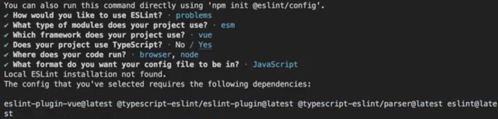
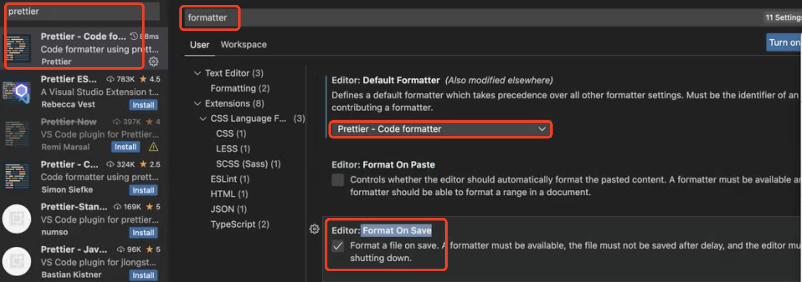
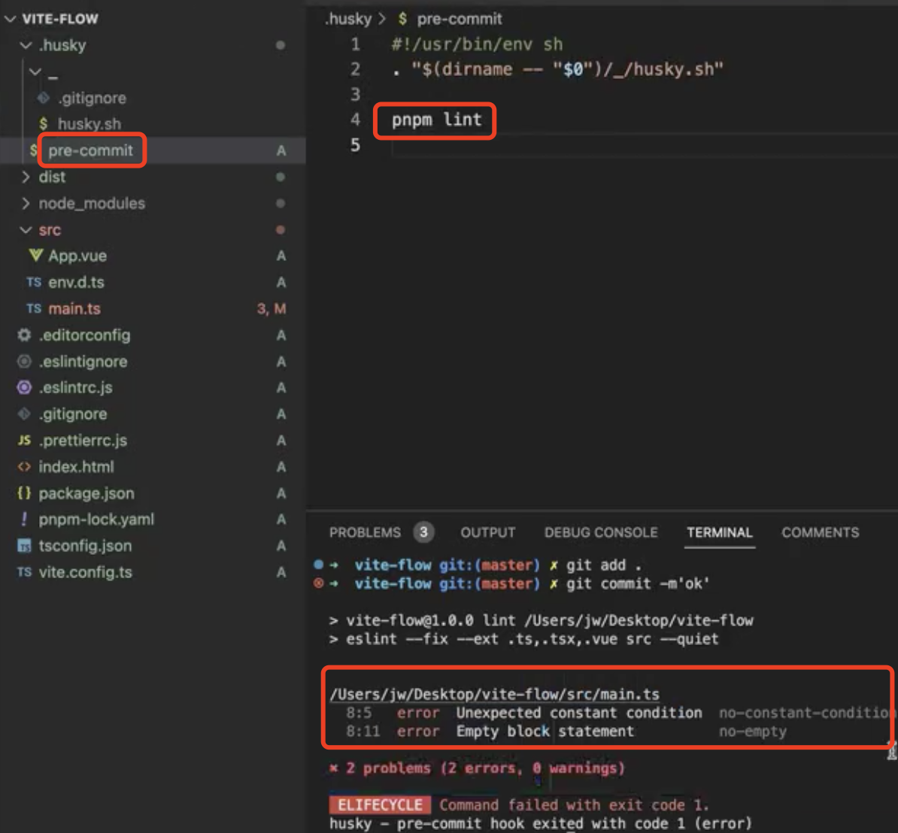
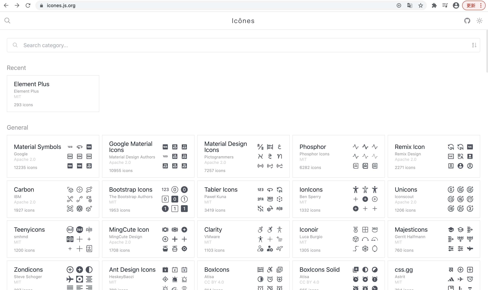
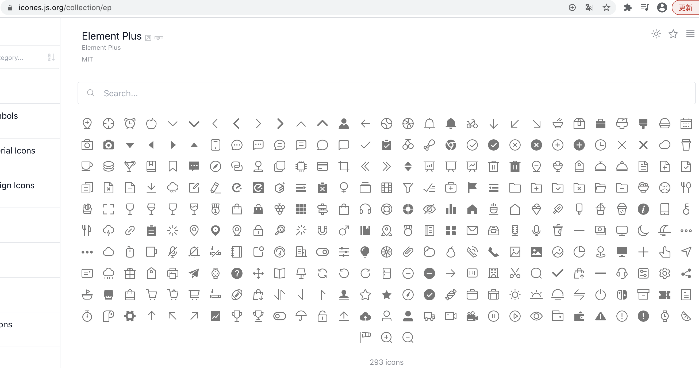

# 开发环境搭建(上)
## 包管理器 
:::tip [pnpm](https://pnpm.io/) 优势：
- 1、快: `pnpm` 是同类工具速度的将近 2 倍
- 2、高效: `node_modules` 中的所有文件均链接自单一存储位置
- 3、支持单体仓库(`monorepo`)，单个源码仓库中包含多个软件包的支持
- 4、权限严格: `node_modules` 默认并非扁平结构，代码无法对任意软件包进行访问
:::
## 项目初始化
```sh
pnpm init
pnpm install vite -D
pnpm install vue
```
- 1、增添启动命令
```json
"scripts": { 
  "dev": "vite",
  "build": "vite build"
}
```
- 2、新建 `index.html`
```html
<!DOCTYPE html>
<html lang="en">
<head>
  <meta charset="UTF-8">
  <meta http-equiv="X-UA-Compatible" content="IE=edge">
  <meta name="viewport" content="width=device-width, initial-scale=1.0">
  <title>vite</title>
</head>
<body>
  <div id="app"></div>
  <!-- vite 基于 esModule -->
  <script src="./src/main.ts" type="module"></script>
</body>
</html>
```
- 3、新建 `src/App.vue`
```vue
<template>
  <div>App</div>
</template>
```
- 4、新建 `src/main.ts`
```ts
import { createApp } from "vue";
import App from "./App.vue"; // 报错，需要添加 .vue 对应的声明文件
createApp(App).mount("#app");
```
- 5、新建 `src/env.d.ts`
```ts
declare module "*.vue" {
  import type { DefineComponent } from "vue"
  const component: DefineComponent<{}, {}, any>
  export default component
}
```
支持 `vite` 解析 `.vue` 文件(默认不支持)
- 6、新建 `vite.config.ts`
```sh
pnpm install @vitejs/plugin-vue -D
```
```ts
import { defineConfig } from "vite" 
import vue from "@vitejs/plugin-vue"

export default defineConfig({
  plugins: [vue()]
})
```
`vite` 仅执行 `.ts` 文件的转译，不支持类型检查。`vue-tsc` 可以对 `vue` 进行 `ts` 类型检查。
- 7、支持 `ts` 类型检查
```sh
pnpm install typescript vue-tsc -D
```
配置 `tsconfig.json`
```json
{
  "compilerOptions": {
    "target": "esnext", // 转化语法
    "module": "esnext", // 转化格式
    "moduleResolution": "node", // 模块解析规则
    "strict": true, // 严格模式
    "sourceMap": true, // 启动 sourcemap 调试
    "jsx": "preserve", // 不允许 ts 编译 jsx 
    "esModuleInterop": true, // es6 和 commonjs 转化
    "lib": ["esnext", "dom"] // 支持 esnext 和 dom 语法
  },
  "include": [
    "src/**/*.ts", 
    "src/**/*.d.ts",
    "src/**/*.tsx", 
    "src/**/*.vue"] 
  }
```
修改 `package.json` 中 `build` 执行命令
```json
"scripts": { 
  "build": "vue-tsc --noEmit && vite build" // --noEmit: 不生成 js 文件 
}
```
再次运行 `pnpm build` 则会对文件内容进行 `ts` 类型检查
## 集成 eslint
初始化 `eslint` 配置文件
```sh
npx eslint --init
```
选择交互项，展示效果如下图


生成的 `.eslintrc.js` 如下
```js
module.exports = {
  env: {
    browser: true,
    es2021: true,
    node: true
  },
  extends: [
    "eslint:recommended",
    "plugin:vue/vue3-essential", // eslint-plugin-vue
    "plugin:@typescript-eslint/recommended", // typescript 规则
  ],
  overrides: [], // 覆盖
  parser: "vue-eslint-parser", // 解析 .vue 文件
  parserOptions: {
    parser: "@typescript-eslint/parser", // 解析 ts 文件
    ecmaVersion: "latest",
    sourceType: "module"
  },
  plugins: ["vue", "@typescript-eslint"],
  rules: {}
}
```
安装 `eslint` 相关包
```sh
pnpm i eslint-plugin-vue@latest @typescript-eslint/eslint-plugin@latest @typescript-eslint/parser@latest eslint@latest -D
```
配置 `.eslintignore` 忽略文件
```
node_modules
dist
*.css
*.jpg
*.jpeg
*.png
*.gif
*.d.ts
```
`vscode` 编辑器安装 `eslint` 插件。`package.json` 中新增 `lint` 执行命令
```json
"scripts": {
  "lint": "eslint --fix --ext .ts,.tsx,.vue src --quiet" // --quiet 忽略 warning，只修复 error
}
```
## 集成 prettier
安装 `prettier` 相关包
```sh
pnpm install prettier eslint-plugin-prettier @vue/eslint-config-prettier -D
```
修改 `.eslintrc.js`
```js
module.exports = {
  extends: [
    ...,
    "@vue/prettier"
  ],
  ...,
  rules: {
    "vue/multi-word-component-names": "off",
    "prettier/prettier": [
      "error",
      {
        singleQuote: false, // 使用双引号
        semi: false, // 末尾不能添加分号
        tabWidth: 2,
        trailingComma: "none", // 不能添加尾逗号
        useTabs: false,
        endOfLine: "auto"
      }
    ]
  }
}
```
新建 `.prettierrc.js`
```js
module.exports = {
  singleQuote: false,
  semi: false,
  tabWidth: 2,
  trailingComma: "none",
  useTabs: false,
  endOfLine: "auto"
}
```
新建 `.prettierignore`
```
node_modules 
dist
```
`vscode` 编辑器安装 `Prettier` 插件， `Default Formatter` 选择 `Prettier - Code formatter`，启用 `Format On Save`。 截图如下:



新建 `.editorconfig` 编译器配置
```
root = true

[*]
charset = utf-8
indent_style = space
indent_size = 2
end_of_line = lf
```
`vscode` 编辑器安装 `EditorConfig for VS Code` 插件

## 集成 husky
```sh
git init
pnpm install husky -D
```
新建 `.gitignore`
```
node_modules
```
修改 `package.json`，执行 `pnpm prepare` 生成 `.husky` 文件夹
```json
"scripts": { 
  "prepare": "husky install"
}
```
执行如下命令
```sh
npx husky add .husky/pre-commit "pnpm lint"
```

这样在代码提交之前就会执行 `pnpm lint` 命令了，截图如下:


## 集成 commitlint
```sh
pnpm install @commitlint/cli @commitlint/config- conventional -D
npx husky add .husky/commit-msg "npx --no- install commitlint --edit $1"
```
新建 `commitlint.config.js`
```js
module.exports = {
  extends: ["@commitlint/config-conventional"]
}
```
提交代码 `message` 格式如下
```sh
git commit -m"feat: init project"
```

可提交类型如下：
| 类型        | 描述           |
| ----------- |:-------------:|
| build       | 修改项目构建系统(例如 `glup`、 `webpack` 、`rollup` 的配置)的提交 |
| chore       | 不属于以上类型的其他类型 |
| ci          | 修改项目集成流程(例如 `travis`、`jenkins`)的提交 |  
| docs        | 文档更新 | 
| feat        | 新功能、新特性 | 
| fix         | 修改 `bug` | 
| perf        | 更改代码，提高性能 | 
| refactor    | 代码重构 | 
| revert      | 代码回退 | 
| test        | 新增、修改测试用例 | 
| style       | 不影响程序逻辑的代码修改（修改空白字符，格式 缩进，补全缺失的分号）| 

## 集成路由
```sh
pnpm install vue-router
```
新建 `src/router/index.ts`
```ts
import { createRouter, createWebHistory } from "vue-router"

const getRoutes = () => {
  // 加载 views 文件夹下的以 .vue 结尾的文件
  const files = import.meta.glob("../views/*.vue") 
  // ../views/about.vue: () => import("/src/views/about.vue")
  // ../views/home.vue: () => import("/src/views/home.vue")
  return Object.entries(files).map(([file, module]) => {
    // 匹配 home、about
    const name = file.match(/\.\.\/views\/([^.]+?)\.vue/i)?.[1] 
    return {
      path: "/" + name,
      component: module
    }
  })
}

export default createRouter({
  history: createWebHistory(),
  routes: getRoutes()
})
```
:::tip 
为了支持上述 `import.meta.glob` 语法，`env.d.ts` 中需要引入 `vite/client`
```ts
/// <reference types="vite/client" />
```
:::
## 自动导入类库
不用主动引入 `vue`
```sh
pnpm install -D unplugin-auto-import
```
修改 `vite.config.ts`
```ts
import AutoImport from "unplugin-auto-import/vite"

export default defineConfig({
  plugins: [
    ...,
    AutoImport({
      // 自动引入 vue vue-router pinia，会生成 auto-imports.d.ts 文件
      imports: ["vue", "vue-router", "pinia"], 
      // 为了解决 eslint 报错，只执行一次即可，执行完了之后需要将 enabled 改为 false，会生成 .eslintrc-auto-import.json 文件
      eslintrc: { enabled: false } 
    })
  ]
})
```
为了解决 `eslint` 报错，在 `.eslintrc.js` 中引入 `.eslintrc-auto-import.json` 文件
```js
module.exports = {
   extends: [
    ...,
    "./.eslintrc-auto-import.json"
  ],
}
```
为了解决 `ts` 报错，在 `tsconfig.json` 中引入 `auto-imports.d.ts` 文件
```json
// 编译那些文件
"include": [
  ...,
  "./auto-imports.d.ts"
]
```
代码书写格式:
```ts
<script setup lang="ts">
const todo = ref("")
const todos = ref<string[]>([])

const addTodo = () => {
  if (!todo.value) return
  todos.value.push(todo.value)
}
</script>
```
## 配置别名
在 `vite.config.ts` 中新增 `resolve` 配置项
```ts
import path from "path"

export default defineConfig({
  resolve: {
    alias: [
      { find: "@", replacement: path.resolve(__dirname, "src") }
    ]
  }
})
```
代码书写格式:
```ts
<script setup lang="ts">
import Todo from "@/components/todo/index.vue"
</script>
```

为了支持点击 `@/components/todo/index.vue` 跳转到对应的 `vue` 文件，需要在 `tsconfig.json` 加入 `baseUrl` 和 `paths` 配置
```json
{
  "compilerOptions": {
    "baseUrl": ".",
    "paths": {
      "@/*": ["src/*"]
    }
  },
}
```
## 支持 TSX
```sh
pnpm install @vitejs/plugin-vue-jsx -D
```
配置 `vite.config.ts`
```ts
import jsx from "@vitejs/plugin-vue-jsx" // 支持tsx 语法

export default defineConfig({
  plugins: [jsx()]
})
```

代码书写格式:
```tsx
// TodoList.tsx
import { PropType } from "vue"

export default defineComponent({
  props: {
    todos: {
      type: Array as PropType<string[]>,
      default: () => []
    }
  },
  render() {
    return (
      <ul>
        {
          this.todos.map((todo, index) => {
            return <li key = { index }>{ todo }</li>
          })
        }
      </ul>
    )
  }
})

// 调用 TodoList.tsx
<TodoList :todos="todos"></TodoList>
```
## unocss
`unocss` 是原子 `CSS` 引擎，规则定义简单易读，支持预设、 属性、`css` 图标。

:::tip `unocss` 的优势：
[tailwindcss](https://www.tailwindcss.cn/) 依赖 `postcss` 和 `autoprefixer`，生产环境可以使用 `PurgeCSS` 压缩， 但开发环境的 `css` 体积大

[windicss](https://windicss.org/) 是 `tailwindcss` 的替代品，不依赖、按需使用、采用预扫描的方式生成样式。 但是自定义复杂
:::
```sh
pnpm install unocss -D
```
配置 `vite.config.ts`
```ts
import Unocss from "unocss/vite"
import { presetUno, presetAttributify, presetIcons } from "unocss"

export default defineConfig({
  plugins: [
    Unocss({
      presets: [
        presetUno(), // 默认使用的是 windicss
        presetAttributify(), // 支持将类名用属性的方式标识
        presetIcons() // 支持 css icon
      ]
    })
  ]
})
```
`main.ts` 中引入 `uno` 样式文件
```ts
import "uno.css"
```

代码书写格式:
```vue
<template>
  <h1 text-center text-red>
  <div flex items-center justify-center>
    <input type="text" h-25px shadow shadow-inset shadow-green-5 />
    <button class="py-2 px-3 inline-block bg-blue-100 rounded-lg text-#ccc">添加内容</button>
  </div>
  <ul class="bg-gray-3 w-50% m-auto mt-5"></ul>
</template>
```
### 引入图标
图标库链接: https://icones.js.org/



比如我们要使用 `Element Plus` 包中的图标:
- 1、首先需要安装 `Element Plus` 包
```sh
pnpm install @iconify-json/ep
```
- 2、在 `main.ts` 中引入
```ts
import "@iconify-json/ep"
```
- 3、从 `Element Plus` 包中找到对应的图标类名来使用

```html
<i class="i-ep-aim"></i>
```
- 4、修改图标属性
```ts
presetIcons({
  extraProperties: {
    display: "inline-flex",
    width: "2em",
    height: "2em",
    "vertical-align": "middle"
  }
})
```
### 自定义图标
配置 `vite.config.ts`，添加所属包名和图标类名
```ts
presetIcons({
  collections: {
    custom: {
      circle: `<svg  width="50" height="50"  viewBox="0 0 50 50">
        <circle  cx="25" cy="25" r="20" />
      </svg>`
    }
  }
})
```
使用方式如下:
```html
<i class="i-custom-circle"></i>
```


