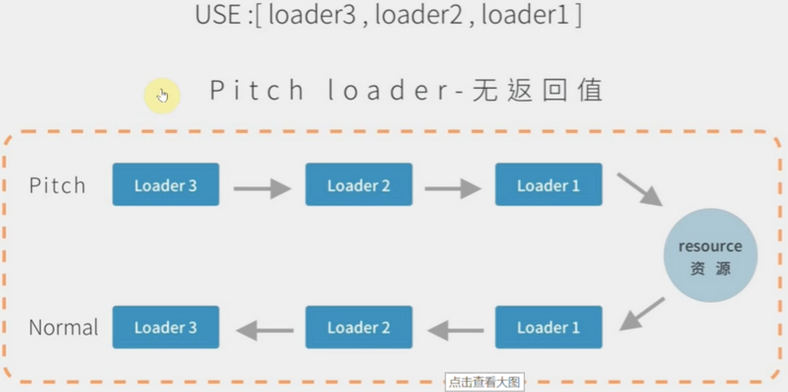
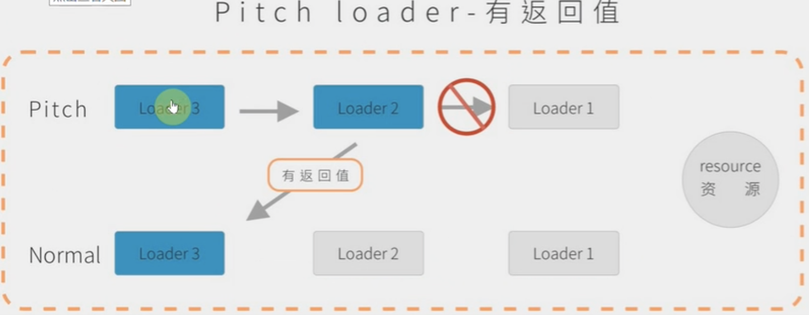
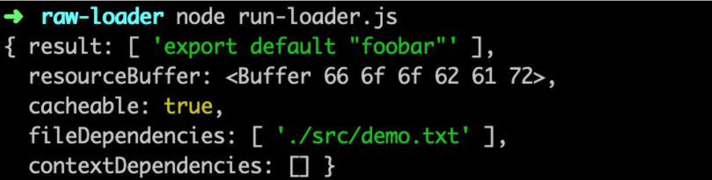
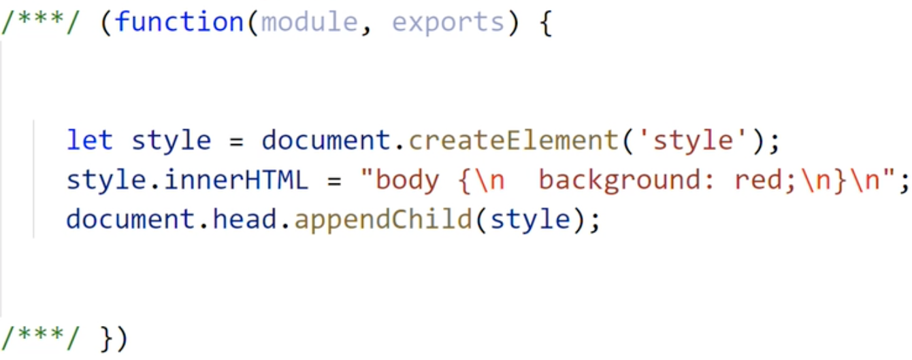
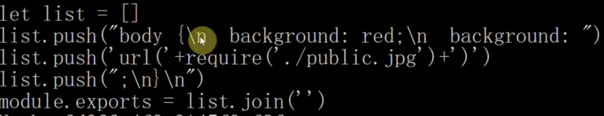

# loader
:::tip 定义
一个导出为函数的 `JavaScript` 模块
```js
module.exports = function(source) { // source: 源代码
  return source
} 
```
:::
## 引入 loader
新建 `loaders/loader1.js` 文件，在配置文件中引入
```js
let path = require('path');

module.exports = {
  mode: 'development',
  entry: './src/index.js',
  output: {
    filename: 'bundle.js',
    path: path.resolve(__dirname, 'dist')
  },
  resolveLoader: {
    // 查找 loader 的第1种方式
    modules:['node_modules', path.resolve(__dirname, 'loaders')] 
    // alias:{ // 查找 loader 的第2种方式
    //   loader1: path.resolve(__dirname, 'loaders', 'loader1.js') 
    // }
  },
  module: {
    rules: [
      {
        test: /\.js$/,
        use: 'loader1'
      }
    ]
  }
}
```
## 执行顺序

串行执行，顺序从后到前、从下到上(基于 `compose` 机制)
```js
const compose = (f, g) => (...args) => f(g(...args))
```
:::warning loader 分类
前置：**pre**；普通：**normal**；后置：**post**；行内：**inline**
:::
```js
{
  test: /\.js$/,
  use: { loader:'loader1' },
  enforce: 'pre' // 'post'。其中 'normal' 可以不写
},
// 使用 inline-loader
let str = require('inline-loader!./a.js');
// '-!inline-loader!./a.js'(不用 pre、normal 来处理)
// '!inline-loader!./a.js'(不用 normal 来处理 )
// '!!inline-loader!./a.js'(不用 pre、normal、post 来处理 )
```
`loader` 默认是由两部分组成: `pitch`、`normal`:

`pitch` 无返回值执行流程


`pitch` 有返回值执行流程

## 异常处理
+ 通过 `throw` 直接抛出
```js
throw new Error('Error');
```
+ 通过 `this.callback` 传递错误
```js
this.callback(new Error('Error'), result);
```
## 异步场景

通过 `this.async` 返回一个异步函数(第一个参数是 `Error`，第二个参数是处理的结果)
```js
module.exports = function(source) {
  const callback = this.async();

  fs.readFile(path.join(__dirname, './async.txt'), 'utf-8', (err, data) => { // 以文件读取为例
    if (err) {
      callback(err, '');
    }
    callback(null, data);
  })
}
```
## 缓存

`webpack` 中默认开启 `loader` 缓存，可以使用 `this.cacheable(false)` 关掉缓存。

缓存条件: `loader` 的结果在相同的输入下有确定的输出，有依赖的 `loader` 无法使用缓存。

## 文件输出

通过 `this.emitFile` 进行文件写入
```js
const loaderUtils = require("loader-utils")

module.exports = function(source) {
  const url = loaderUtils.interpolateName(this, '[name].[ext]', source);

  this.emitFile(url, source);
  return source;
}
```
## `loader-runner`
:::tip 
允许在不安装 `webpack` 的情况下运行 `loader`。作用: 

1、作为 `webpack` 的依赖，`webpack` 中使用它执行 `loader`。

2、进行 `loader` 的开发和调试。
:::
开发一个 `raw-loader`，新建 `src/raw-loader.js`
```js
const loaderUtils = require('loader-utils');
const fs = require('fs');
const path = require('path');

module.exports = function(source) {
    const { name } = loaderUtils.getOptions(this); // 获取 loader 参数

    const json = JSON.stringify(source)
        .replace(/\u2028/g, '\\u2028')
        .replace(/\u2029/g, '\\u2029');

    return `export default ${json}`;
}
```
新建 `src/demo.txt`，内容为: `foobar`

新建 `run-loader.js`
```js
const { runLoaders } = require('loader-runner');
const fs = require('fs');
const path = require('path');

runLoaders({
  resource: path.join(__dirname, './src/demo.txt'), // 资源的绝对路径
  loaders: [
    {
      loader: path.join(__dirname, './src/raw-loader.js'), // loader 的绝对路径
      options: {
        name: 'test' // 传递参数
      }
    }
  ],
  context: { // 基础上下文之外的额外 loader 上下文
    minimize: true
  },
  readResource: fs.readFile.bind(fs) // 读取资源的函数
}, (err, result) => {
    err ? console.log(err) : console.log(result)
});
```
执行 `node run-loader.js`，结果如下：

## banner-loader

作用: 给 `js` 代码添加文本注释，支持传入 `text` 和 `filename`(绝对路径)
```js
watch: true,
// 使用方式
module: {
  rules: [
    {
      test: /\.js$/,
      use: {
        loader: 'banner-loader',
        options: {
          text: 'banner',
          filename: path.resolve(__dirname, 'banner.js')
        }
      }  
    }
  ]
}
```
新建 `banner-loader.js`
```js
const loaderUtils = require('loader-utils')
cosnt validateOptions = require('schema-utils')
const fs = require('fs')

function loader(source) {
  this.cacheable && this.cacheable() // 开启缓存
  const options = loaderUtils.getOptions(this);

  const cb = this.async(); // 读取文件是异步操作
  const schema = {
    type: 'object',
    properties: {
      text: {
        type: 'string',
      },
      filename: {
        type: 'string'
      }
    }
  }
  validateOptions(schema, options, 'banner-loader') // 参数类型校验
  if (options.filename) {
    // 添加文件依赖，当 filename 内容变化时，webapck 会重新打包（需搭配 watch: true 来使用)
    this.addDependency(options.filename)

    fs.readFile(options.filename, 'utf8', function (err, data) {
      cb(err, `/**${data}**/${source}`)
    })
  }else{
    cb(null, `/**${options.text}**/${source}`)
  }
}

module.exports = loader
```
## file-loader

+ 1、根据图片生成 `md5` 发射到 `dist` 目录下
+ 2、返回当前的图片路径

```js{5-7}
const loaderUtils = require('loader-utils')

function loader(source) {
  // 根据图片内容生成 md5 戳
  const filename = loaderUtils.interpolateName(this, '[hash].[ext]', { content: source })
  this.emitFile(filename, source); // 发射文件到 dist 目录下
  return `module.exports="${filename}"`
}
loader.raw = true // 将 source 字符串转化为二进制 Buffer

module.exports = loader

// webapcck 配置 
{
  test: /\.(png|jpe?g|gif)$/,
  use: 'file-loader'
}

// 使用
import logoUrl from './logo.jpg'
let img = document.createElement('img')
img.src = logoUrl
document.body.appendChild(img)
```
## url-loader

支持传入 `limit` 参数，如果图片体积小于 `limit`，会产生 `base64` 格式，否则内部调用 `file-loader` 来进行处理。
```js
const loaderUtils = require('loader-utils');
const mime = require('mime'); // mime.getType()生成图片类型

function loader(source) {
  const { limit } = loaderUtils.getOptions(this);
  if (limit && limit > source.length) { // 转化为 base64
    return `module.exports="data:${mime.getType(this.resourcePath)};base64,${source.toString('base64')}"`
  } else { 
    return require('./file-loader').call(this, source) // 调用 file-loader 处理
  }
}
loader.raw = true // 将字符串转化为二进制

module.exports = loader

// 配置
{
  test: /\.(png|jpe?g|gif)$/,
  use: {
    loader: 'url-loader',
    options: {
      limit: 20 * 1024 // 大于 20k 产生文件，小于则变成 base64 格式
    }
  }
}
```
## less-loader
处理 `less` 文件
```js{12-14}
// less 配置
{
  test: /\.less$/,
  use:['style-loader', 'css-loader', 'less-loader']
}

// less-loader
const less = require('less')

function loader(source) {
  let css;
  less.render(source, function (err, r) {
    css = r.css
  })
  
  return css
}

module.exports = loader
```
新建 `index.less` 并使用
```less
@bgred: red;

body {
  background: @bgred
}
```

## style-loader
```js{5-9}
const loaderUtils = require('loader-utils');

function loader(source) {
  // JSON.stringify 会把回车、换行转化成 \r \n
  const str = `
    let style = document.createElement('style');
    style.innerHTML = ${JSON.stringify(source)};
    document.head.appendChild(style);
  `
  return str;
}

module.exports = loader
```

页面背景色变为红色。
## css-loader
修改 `index.less` 文件
```less
bgred: red

body{
  background: @bgred;
  background: url('./public.jpg');
}
```
```js
function loader(source) {
  let reg = /url\((.+?)\)/g // 匹配 url('./public.jpg')
  let pos = 0 
  let current
  let arr = ['let list = []']

  while (current = reg.exec(source)) {
    let [matchUrl, g] = current // matchUrl: url('./public.jpg'), g: ./public.jpg
    let last = reg.lastIndex - matchUrl.length
    arr.push(`list.push(${JSON.stringify(source.slice(pos, last))})`)
    pos = reg.lastIndex;
    // 把 g 替换成 require 的写法  => url(require('xxx'))
    arr.push(`list.push('url('+require(${g})+')')`)
  }
  // arr 打印结果看下图
  arr.push(`list.push(${JSON.stringify(source.slice(pos))})`)
  arr.push(`module.exports = list.join('')`)

  return arr.join('\r\n')
}

module.exports = loader
```
`css-loader` 执行完后的效果:


修改 `style-loader`，添加 `pitch`
```js
loader.pitch = function (remainingRequest) { // remainingRequest: 剩余的请求
  // require('!!css-loader!less-loader!index.less')
  let str = `
    let style = document.createElement('style');
    style.innerHTML = require(${loaderUtils.stringifyRequest(this, '!!' + remainingRequest)});
    document.head.appendChild(style);
  `
  return str;
}
```
## babel-loader
编译 `js` 代码，将高版本语法编译成低版本语法。
```sh
npm i @babel/core @babel/preset-env -D
```

```js
// 配置
{
  test: /\.js$/,
  use: {
    loader: 'babel-loader',
    options: {
      presets: [
        '@babel/preset-env'
      ]
    }
  }
}

// 实现
const babel = require('@babel/core')
const loaderUtils = require('loader-utils')

function loader(source) { 
  const options = loaderUtils.getOptions(this)
  const cb = this.async()

  babel.transform(source, {
    ...options, // 用配置的预设进行 transform 操作
    sourceMap: true, // webpack.config.js 需配置 devtool: 'source-map'
    filename: this.resourcePath.split('/').pop() // 代码对应的文件名
  }, function (err, result) {
    cb(err, result.code, result.map) 
  })
}


module.exports = loader
```