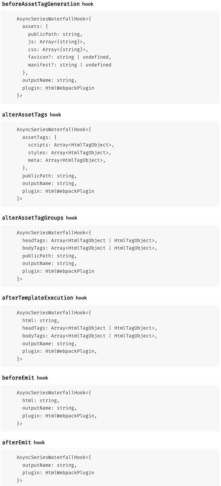
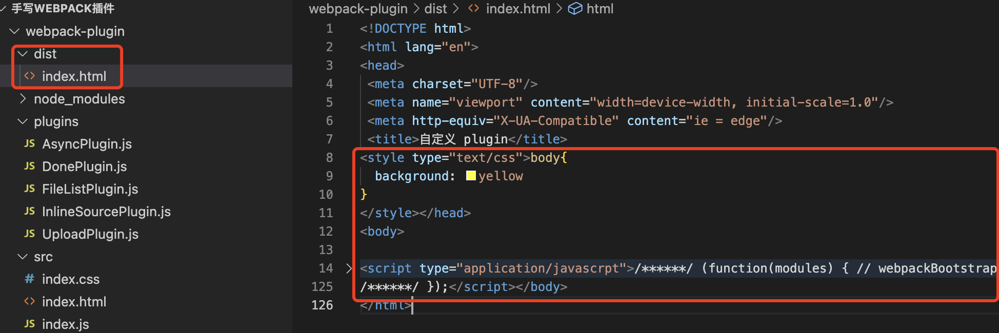
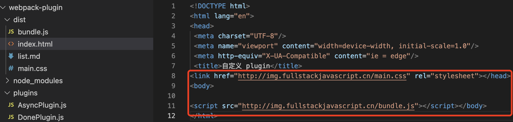
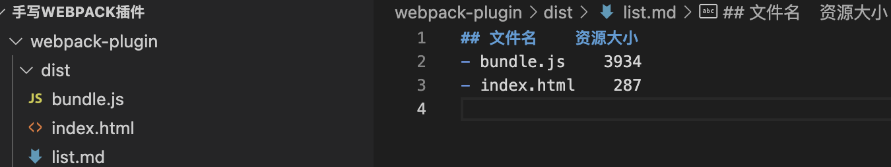

# plugin
## 插件的基本结构 
```js
class DonePlugin { // 插件名称
  constructor(options) { // 插件参数
    this.options = options // { name: 'test' }
  }

  apply(compiler) {  // apply 方法
    compiler.hooks.done.tap('DonePlugin', () => { // 插件处理逻辑
      console.log('编译完成~~~')
    })
  }
}
module.exports = DonePlugin
```
## 插件使用
```js
plugins: [new DonePlugin({name: 'test'})] // 传参
```
## 异步插件
```js
class AsyncPlugin {
  apply (compiler) {
    compiler.hooks.emit.tapAsync('AsyncPlugin', (compliation, cb) => {
      setTimeout(() => {
        cb()
      }, 1000)
    })
    
    compiler.hooks.emit.tapPromise('AsyncPlugin', (compliation) => { // 返回 promise
      return new Promise((resolve, reject) => { 
        setTimeout(() => {
          resolve()
        }, 1000)
      })
    })
  }
}

module.exports = AsyncPlugin
```
## Compilation
通过 `Compilation` 上的 `assets` 可以用于文件写入。
## 插件扩展(编写插件的插件)

插件自身也可以通过暴露 `hooks` 的方式进行自身扩展，以 [html- webpack-plugin](https://www.npmjs.com/package/html-webpack-plugin/v/5.2.0) 为例，提供了如下的钩子

我们可以通过以下方式获取相应的钩子并调用
```js
const HtmlWebpackPlugin = require('html-webpack-plugin')

class MyPlugin {
  apply (compiler) {
    compiler.hooks.compilation.tap('MyPlugin', (compilation) => {
      console.log('The compiler is starting a new compilation...')

      HtmlWebpackPlugin.getHooks(compilation).beforeEmit.tapAsync(
        'MyPlugin', (data, cb) => {
          data.html += 'The Magic Footer'
          cb(null, data)
        }
      )
    })
  }
}
```

## InlineSourcePlugin
:::warning 介绍
资源内敛插件，打包完成后 `index.html` 通过 `style` 和 `script` 内敛 `css` 和 `js`，不在通过 `link` 和 `script` 的方式去加载(减少 `http` 请求)。
:::
```js
const HtmlWebpackPlugin = require('html-webpack-plugin');

class InlineSourePlugin{
  constructor({ match }) {
    this.match = match
  }
  
  apply(compiler) {
    compiler.hooks.compilation.tap('InlineSourePlugin', (compilation) => {
      // 使用 alterAssetTagGroups(修改资源标签组) hooks，上文已有介绍
      // 获取内置钩子
      HtmlWebpackPlugin.getHooks(compilation).alterAssetTagGroups.tapAsync('alterPlugin', (data, cb) => {
        // 转换前 data: {
        //   headTags: [{ tagName: 'link', voidTag: true, attributes: { href: 'main.css', rel: 'stylesheet' }}],
        //   bodyTags: [{ tagName: 'script', voidTag: false, attributes: { defer: false, src: 'bundle.js' }}]
        // }
        data = this.processTags(data, compilation)
        cb(null, data)
      })
    });
  }

  processTags(data, compilation) { // 处理引入标签的数据  
    let headTags = []
    let bodyTags = []

    data.headTags.forEach(headTag => {
      headTags.push(this.processTag(headTag, compilation));
    });
    data.bodyTags.forEach(bodyTag => {
      bodyTags.push(this.processTag(bodyTag, compilation));
    });

    return { ...data, headTags, bodyTags}
  }

  processTag(tag, compilation) { // 处理某一个标签
    let newTag,url;
    if (tag.tagName === 'link' && this.match.test(tag.attributes.href)){
      newTag = {
        tagName: 'style',
        attributes: { type: 'text/css' }
      }
      url = tag.attributes.href // main.css
    }
    if (tag.tagName === 'script' && this.match.test(tag.attributes.src)) {
      newTag = {
        tagName: 'script',
        attributes: { type: 'application/javascript' }
      }
      url = tag.attributes.src // bundle.js
    }
    if (url) {
      newTag.innerHTML = compilation.assets[url].source(); // 文件内容放到 innerHTML 上
      delete compilation.assets[url]; // 删掉原有应该生成的资源(关键点，非常重要)
      return newTag
    }

    return tag;
  }
}
module.exports = InlineSourePlugin;
```
在 `webpack` 配置文件中使用
```js
const MiniCssExtractPlugin = require('mini-css-extract-plugin') // 提取 css 到单独文件中
const InlineSourcePlugin = require('./InlineSourcePlugin')

module: {
  rules: [
    { test: /\.css$/, use: [ MiniCssExtractPlugin.loader,'css-loader' ]}
  ]
},
plugins: [
  new MiniCssExtractPlugin({
    filename:'main.css'
  }),
  new InlineSourcePlugin({
    match: /\.(js|css)/ // 传入正则匹配对应的文件(此处只处理css、js)
  })
]
```
编写 `index.css`，在 `index.js` 中引入使用
```css
body{
  background: yellow
}
```
```js
import './index.css'
```
最终 `dist` 文件夹只会生成 `index.html`


## UploadPlugin
:::warning 介绍
打包后资源自动上传到七牛
:::
```js
let path = require('path')
let qiniu = require('qiniu') // "qiniu": "^7.2.1"

class UploadPlugin {
  constructor (options) {
    const { bucket = '', domain = "", accessKey = '', secretKey = '' } = options;

    // 生成七牛上传参数
    const mac = new qiniu.auth.digest.Mac(accessKey, secretKey);
    const putPolicy = new qiniu.rs.PutPolicy({ scope: bucket });
    this.uploadToken = putPolicy.uploadToken(mac);
    const config = new qiniu.conf.Config();
    this.formUploader = new qiniu.form_up.FormUploader(config);
    this.putExtra = new qiniu.form_up.PutExtra();
  }
  apply (compiler) {
    compiler.hooks.afterEmit.tapPromise('UploadPlugin', (compliation) => {
      const assets = compliation.assets;
      const promises = [];
      Object.keys(assets).forEach(filename => {
        promises.push(this.upload(filename));
      })
      return Promise.all(promises);
    })
  }

  upload (filename) {
    return new Promise((resolve, reject) => {
      const localFile = path.resolve(__dirname, '../dist', filename)

      this.formUploader.putFile(this.uploadToken, filename, localFile, this.putExtra, function (respErr, respBody, respInfo) {
        if (respErr) {
          reject(respErr)
        }
        if (respInfo.statusCode == 200) {
          resolve(respBody)
        }
      })
    })
  }
}
module.exports = UploadPlugin
```
在 `webpack` 配置文件中使用
```js
const UploadPlugin = require('./plugins/UploadPlugin')

output:{
  publicPath: 'http://img.fullstackjavascript.cn/'
},

new UploadPlugin({
  bucket: 'jwstatic', 
  domain: 'img.fullstackjavascript.cn', 
  accessKey: 'uimQ1Inof5KwcA5ETlLMnwoJzrIhigEEilWMpJtg', 
  secretKey: 'zNoP0z1XzHFGN0JMJsxSEvLRcFPXxAVaXEDWOwdH'
})
```

## FileListPlugin
:::warning 介绍
文件列表插件，可以统计每个资源的大小
:::
```js
class FileListPlugin {
  constructor ({ filename }) {
    this.filename = filename
  }
  apply (compiler) {
    compiler.hooks.emit.tap('FileListPlugin', (compilation) => {
      let assets = compilation.assets;
      let content = `## 文件名    资源大小\r\n`

      Object.entries(assets).forEach(([filename, statObj]) => {
        content += `- ${filename}    ${statObj.size()}\r\n`
      });
      // 资源对象
      assets[this.filename] = {
        source(){
          return content;
        },
        size(){
          return content.length;
        }
      }
    })
  }
}

module.exports = FileListPlugin
```
在 `webpack` 配置文件中使用
```js
const FileListPlugin = require('./plugins/FileListPlugin');

new FileListPlugin({
  filename: 'file.md'
})
```
此时 `dist` 文件夹会生成 `list.md`
