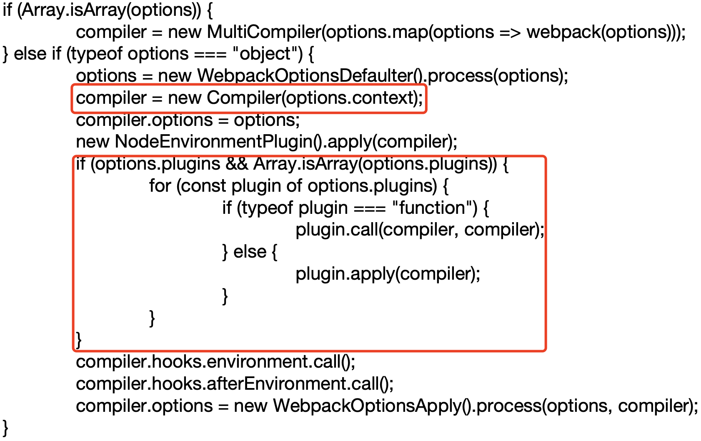
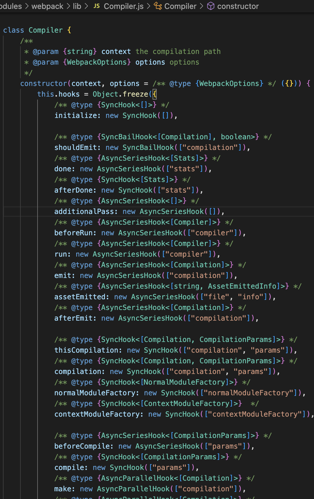

# tapable
[官网链接](https://github.com/webpack/tapable)

`tapable` 是一个类似于 `EventEmitter` 的库, 主要控制钩子函数的发布与订阅，控制着 `webpack` 的插件系统。

`tapable` 暴露了很多 `Hook`(钩子)类，为插件提供挂载的钩子
## hooks 
| 钩子名称           | 类型      
| -------------     | :-----------
| SyncHook          |   同步钩子 
| SyncBailHook      |   同步熔断钩子
| SyncWaterfallHook |   同步流水钩子
| SyncLoopHook      |   同步循环钩子
| AsyncParallelHook      |   异步并发钩子
| AsyncParallelBailHook |   异步并发熔断钩子
| AsyncSeriesHook      |   异步串行钩子
| AsyncSeriesBailHook      |   异步串行熔断钩子
| AsyncSeriesWaterfallHook |   异步串行流水钩子

## 使用方式
`tapable` 暴露出来的都是类方法
```js
const {
  SyncHook,
  SyncBailHook, 
  SyncWaterfallHook, 
  SyncLoopHook, 
  AsyncParallelHook, 
  AsyncParallelBailHook, 
  AsyncSeriesHook, 
  AsyncSeriesBailHook, 
  AsyncSeriesWaterfallHook
} = require("tapable")
```

`new` 一个类方法获得我们需要的钩子，参数可传可不传
## 钩子的绑定与执行
`tapable` 提供了同步、异步绑定钩子的方法，并且他们都有绑定事件和执行事件对应的方法。    
| 类型            |      绑定                |  执行 |
| -------------  | :----------------------: | :----: |
| Async          | tapAsync/tapPromise/tap  | callAsync/promise |
| Sync           |   tap                    |   call |
```js
const { SyncHook } = require('tapable')
const hook = new SyncHook(["arg1", "arg2"])

hook.tap('hook', (arg1, arg2) => console.log(arg1, arg2)) //绑定事件
hook.call(1, 2) // 触发事件
```
## tapable 关联 webpack 


`options` 是我们定义的 `webpack` 配置文件，通常都会配置对象形式。其中 `plugins` 是数组，可以看到每一个 `plugin` 都会接受 `compiler` 实例作为参数(如下配置)。
```js
module.exports = { // webpack.config.js
  plugins: [
    new xxxPlugin()
  ]
}
```
`compiler` 实例上有 `hooks` 对象，代码如下截图




## 流程模拟
### 模拟 Compiler
```js
const {
  SyncHook,
  AsyncSeriesHook
} = require('tapable');

module.exports = class Compiler {
  constructor() {
    this.hooks = {
      accelerate: new SyncHook(['newspeed']),
      brake: new SyncHook(),
      calculateRoutes: new AsyncSeriesHook(["source", "target"])
    }
  }
  run() {
    this.accelerate(10)
    this.break()
    this.calculateRoutes('Async', 'hook')
  }
  accelerate(speed) {
    this.hooks.accelerate.call(speed);
  }
  break() {
    this.hooks.brake.call();
  }
  calculateRoutes(...args) {
    this.hooks.calculateRoutes.promise(...args).then(() => {
    }, err => {
        console.error(err);
    })
  }
}
```
### 模拟 plugin
```js
const Compiler = require('./Compiler')
 
class MyPlugin {
  apply (compiler) {
    compiler.hooks.brake.tap("brake", () => console.log('brake'))
    compiler.hooks.accelerate.tap("accelerate", newSpeed => console.log(`accelerate to ${newSpeed}`))
    compiler.hooks.calculateRoutes.tapPromise("calculateRoutes", (source, target) => {
      return new Promise((resolve, reject) => {
        setTimeout(() => {
          console.log(`calculateRoutes to ${source} ${target}`)
          resolve();
        },1000)
      })
    });
  }
}
```
### 模拟插件执行
```js
const options = {
  plugins: [new MyPlugin()]
}

const compiler = new Compiler();

for (const plugin of options.plugins) {
  if (typeof plugin === "function") {
    plugin.call(compiler, compiler)
  } else {
    plugin.apply(compiler)
  }
}
compiler.run()
```