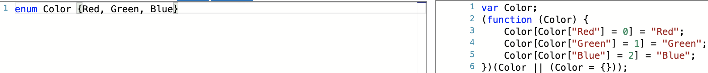
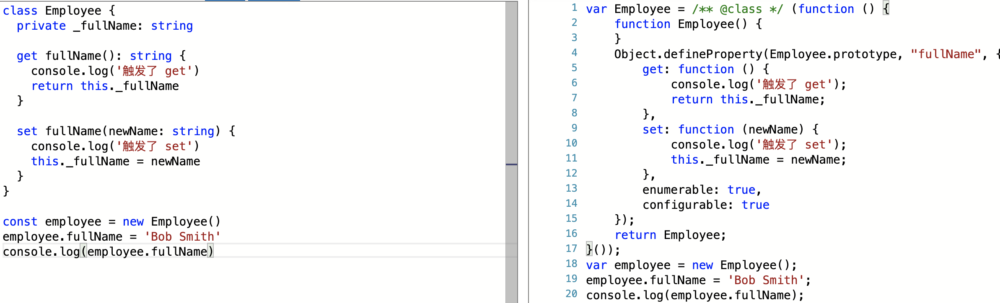

# 常用语法
[[toc]]
## 基础类型
- 数组
```ts
let list: number[] = [1, 2, 3]
let list: Array<number> = [1, 2, 3]
```
- 元组
> 元组类型允许表示一个已知元素数量和类型的数组，各元素的类型不必相同
```ts
let x: [string, number] = ['hello', 10]
x[0].substr(1) // OK
x[1].substr(1) // Error, 'number' 不存在 'substr' 方法
```
- 枚举
> 枚举是对 `js` 标准数据类型的一个补充，使用枚举类型可以为一组数值赋予友好的名字。
```ts
enum Color { Red, Green, Blue }
let c: Color = Color.Green // 1
let colorName: string = Color[2] // 'Blue'
```
编译后的内容如下:

- 类型断言
```ts
let someValue: any = 'this is a string'

let strLength: number = (<string>someValue).length // '尖括号'语法
let strLength: number = (someValue as string).length // as 语法
```
两种形式是等价的，至于使用哪个大多数情况下是凭个人喜好。不过在 `ts` 里使用 `JSX` 时，只有 `as` 语法断言是被允许的。
- `unknown`
> **不可预先定义的类型**，可替代 `any` 同时保留静态检查的能力(`any` 放弃了静态检查)

不同点: 在静态编译的时候，`unknown` 不能调用任何方法，而 `any` 可以

使用场景: 避免使用 `any` 作为函数的参数类型而导致缺失静态类型检查
```ts
function test(input: unknown): number {
  if (Array.isArray(input)) {
    return input.length
  }
  return input.length; // error: input是unknown类型，静态检查报错
}
```
- `never`
> 没法正常结束返回的类型，一个必定会报错或者死循环的函数会返回这样的类型(是所有类型的子类型)
```ts
type Test = never extends boolean ? string : number; // string

function foo(): never { throw new Error('error message') }
function foo(): never { while(true){} }
```

任何类型联合上 `never` 类型，还是原来的类型

在函数中调用了返回 `never` 的函数后，之后的代码都会变成 `deadcode`

无法把其他类型赋给 `never`

```ts
type P<T> = T extends 'x' ? string : number;
type Test2 = P<never> // never
```
`never` 被认为是空的联合类型，也就是没有任何项的联合类型，所以还是会满足分配条件类型。但没有任何联合项可以分配，所以 `P<T>`根本就没有执行，就和永远没有返回的函数一样，属于 `never` 类型。

## 接口
>  可以对值所具有的结构进行类型检查，又被称做'鸭式辨型法'或'结构性子类型化'。作用就是为类型命名和为你的代码或第三方代码定义契约。

- 接口初探
```ts
interface LabelledValue {
  label: string
}

function printLabel(labelledObj: LabelledValue) {
  console.log(labelledObj.label)
}

let myObj = { size: 10, label: 'Size 10 Object' }
printLabel(myObj)
```
- 可选属性
> 接口里的属性不全都是必需的，属性后面加一个 ? 即表述该属性可选。
```ts
interface SquareConfig {
  color?: string
  width?: number
}
```
- 只读属性
```ts
interface Point {
  readonly x: number
  readonly y: number
}
```
- 额外的属性检查
```ts
interface SquareConfig {
  color?: string
  width?: number
  [propName: string]: any
}
```
- 函数类型
> 接口除了描述带有属性的普通对象外，还可以描述函数类型

> 为了使用接口表示函数类型，我们需要给接口定义一个调用签名。它就像是一个只有参数列表和返回值类型的函数定义。参数列表里的每个参数都需要名字和类型。

```ts
interface SearchFunc {
  (source: string, subString: string): boolean
}

let mySearch: SearchFunc
mySearch = function(source: string, subString: string): boolean {
  let result = source.search(subString);
  return result > -1
}
```
- 可索引的类型
> 可索引类型具有一个索引签名，它描述了对象索引的类型，还有相应的索引返回值类型
```ts
interface StringArray {
  [index: number]: string
}

let myArray: StringArray
myArray = ['Vue', 'React']

let myStr: string = myArray[0]
```
- 接口继承
> 接口可以相互继承，这让我们能从一个接口里复制成员到另一个接口里，可以更灵活地将接口分割到可重用的模块里。
```ts
interface Shape {
  color: string
}

interface Square extends Shape {
  sideLength: number
}

let square = {} as Square
square.color = 'blue'
square.sideLength = 10
```
- 混合类型
> 一个对象可以同时做为函数和对象使用，并带有额外的属性。
```ts
interface Counter {
  (start: number): string
  interval: number
  reset(): void
}

function getCounter(): Counter {
  let counter = (function (start: number) { }) as Counter
  counter.interval = 123
  counter.reset = function () { }
  return counter
}
```
- 类类型
> 接口还可以用来明确的强制一个类去符合某种契约
```ts
interface ClockInterface {
  currentTime: Date
  setTime(d: Date)
}

class Clock implements ClockInterface {
  currentTime: Date
  setTime(d: Date) {
    this.currentTime = d
  }
  constructor(h: number, m: number) { }
}
```
不过接口描述了类的公共部分，而不是公共和私有两部分。
:::danger
当类实现接口时，只会对其实例部分进行类型检查。`constructor` 存在于类的静态部分，因此不在检查的范围内。因此用构造器签名去定义一个接口并试图定义一个类去实现这个接口时会得到一个错误：
```ts
interface ClockConstructor {
  new (hour: number, minute: number)
}

// error
class Clock implements ClockConstructor {
  currentTime: Date
  constructor(h: number, m: number) { }
}
// Class 'Clock' incorrectly implements interface 'ClockConstructor'. 
// Type 'Clock' provides no match for the signature 'new (hour: number, minute: number): any'.
```
:::
## 类
- 继承
```ts
class Animal { // 基类|超类
  name: string
  constructor(name: string) {
    this.name = name
  }
  move(distance: number = 0) {
    console.log(`${this.name} moved ${distance}m.`)
  }
}

class Snake extends Animal { // 子类|派生类
  constructor(name: string) {
    super(name) // 执行基类的构造函数
  }
  move(distance: number = 5) {
    console.log('Slithering...')
    super.move(distance)
  }
}

let sam = new Snake('Sammy')

sam.move(34)
```
- 公共、私有、受保护的修饰符(默认为 `public`)
> 当成员被标记成 `private` 时，不能在声明它的类的外部访问。
```ts
class Animal {
  private name: string
  constructor(name: string) {
    this.name = name
  }
}

new Animal('Cat').name // error: Property 'name' is private and only accessible within class 'Animal'.
```
>  `protected` 成员也不能在声明它的类的外部访问，但可以在派生类中访问
```ts
class Person {
  protected name: string
  constructor(name: string) {
    this.name = name
  }
}

class Employee extends Person {
  constructor(name: string) {
    super(name)
  }

  getName() {
    return `Hello, my name is ${this.name}`
  }
}

let howard = new Employee('Howard')
howard.name // error: Property 'name' is protected and only accessible within class 'Person' and its subclasses.
```
构造函数也可以被标记成 `protected`，这意味着这个类不能在包含它的类外被实例化，但是能被继承。
```ts{2-3}
class Person {
  protected name: string
  protected constructor(name: string) {
    this.name = name
  }
}

// Employee 能够继承 Person
class Employee extends Person {
  constructor(name: string) {
    super(name)
  }

  public getName() {
    return `Hello, my name is ${this.name}`
  }
}

let howard = new Employee('Howard')
let john = new Person('John') // 错误: 'Person' 的构造函数是被保护的.
```
- `readonly` 修饰符
> 使用 `readonly` 关键字可以将属性设置为只读，只读属性必须在声明时或构造函数里被初始化。
```ts
class Person {
  readonly name: string
  constructor(name: string) {
    this.name = name
  }
}

let john = new Person('John')
john.name = 'peter' // error: Cannot assign to 'name' because it is a constant or a read-only property.
```
- 参数属性

在上面的例子中，我们必须在 `Person` 类里定义一个只读成员 `name` 和一个参数为 `name` 的构造函数，并且立刻将 `name` 的值赋给 `this.name`，这种情况经常会遇到。 

**参数属性可以方便地让我们在一个地方定义并初始化一个成员**。我们使用参数属性来修改上面的例子，代码如下：
```ts
class Person {
  constructor(readonly name: string) {}
}
```
我们仅在构造函数里使用 `readonly name: string` 参数来创建和初始化 name 成员，我们把声明和赋值合并至一处。

参数属性通过给构造函数参数前面添加一个访问限定符来声明，使用 `private` 限定一个参数属性会声明并初始化一个私有成员，对于 `public` 和 `protected` 来说也是一样的。
- 存取器
> `ts` 支持通过 `getters/setters` 来截取对对象成员的访问
```ts
class Employee {
  private _fullName: string

  get fullName(): string {
    console.log('触发了 get')
    return this._fullName
  }

  set fullName(newName: string) { 
    console.log('触发了 set')
    this._fullName = newName
  }
}

const employee = new Employee()
employee.fullName = 'Bob Smith'
console.log(employee.fullName)
```
存取器会被编译成 `Object.defineProperty`，如下图:

> 只带有 `get` 不带有 `set` 的存取器自动被推断为 `readonly`, 此时不允许修改值
- 静态属性
> 静态属性存在于类本身上面而不是实例上，若想访问该属性，需要在属性前加上相应类名
```ts{5-6}
class Grid {
  static origin = { x: 0, y: 0 }

  calculateDistanceFromOrigin(point: { x: number; y: number }) {
    const xDist = point.x - Grid.origin.x
    const yDist = point.y - Grid.origin.y
    return Math.sqrt(xDist * xDist + yDist * yDist)
  }
}

new Grid().calculateDistanceFromOrigin({x: 3, y: 4})
```
- 抽象类
> 抽象类做为其它派生类的基类使用，一般不会直接被实例化。不同于接口，抽象类可以包含成员的实现细节。 `abstract` 关键字是用于定义抽象类和在抽象类内部定义抽象方法
```ts
abstract class Animal {
  abstract makeSound(): void
  move(): void {
    console.log('roaming the earth...')
  }
}
```
> **抽象类中的抽象方法不包含具体实现并且必须在派生类中实现**。 抽象方法的语法与接口方法相似，两者都是定义方法签名但不包含方法体。 抽象方法必须包含 `abstract` 关键字并且可以包含访问修饰符。
```ts
abstract class Department {
  name: string

  constructor(name: string) {
     this.name = name
  }

  printName(): void {
    console.log('Department name: ' + this.name)
  }

  abstract printMeeting(): void // 必须在派生类中实现
}

class AccountingDepartment extends Department {
  constructor() {
    super('Accounting and Auditing') // 在派生类的构造函数中必须调用 super()
  }

  printMeeting(): void {
    console.log('The Accounting Department meets each Monday at 10am.')
  }

  generateReports(): void {
    console.log('Generating accounting reports...')
  }
}

const department: Department // 创建一个对抽象类型的引用
department = new Department() // 错误: 不能创建一个抽象类的实例(error: Cannot create an instance of an abstract class.)
department = new AccountingDepartment() // 允许对一个抽象子类进行实例化和赋值
department.printName()
department.printMeeting()
department.generateReports() // 错误: 方法在声明的抽象类中不存在(error: Property 'generateReports' does not exist on type 'Department'.)
```
- 构造函数
> 使用 `new` 创建类实例的时候构造函数将被调用
```ts
class Greeter {
  static standardGreeting = 'Hello, there'

  greet() {
    return Greeter.standardGreeting
  }
}

// let greeter: Greeter: 意思是 Greeter 类的实例的类型是 Greeter
let greeter: Greeter = new Greeter()
console.log(greeter.greet())

// typeof Greeter: 是取 Greeter 类的类型，而不是实例的类型。或者更确切的说，"告诉我 Greeter 标识符的类型"，也就是构造函数的类型
let greeterMaker: typeof Greeter = Greeter 
greeterMaker.standardGreeting = 'Hey there'

let greeter2: Greeter = new greeterMaker()
console.log(greeter2.greet())
```
- 类当做接口使用
```ts
class Point {
  x: number
  y: number
}

interface Point3d extends Point {
  z: number
}

let point3d: Point3d = {x: 1, y: 2, z: 3}
```
## 函数
- 为函数定义类型
```ts
function add(x: number, y: number): number { // 命名函数
  return x + y
}

const myAdd = function(x: number, y: number): number { // 匿名函数
  return x + y
}
```
- 书写完整函数类型
> 函数类型包含两部分：参数类型和返回值类型。 当书写完整函数类型的时候，这两部分都是需要的。
```ts
const myAdd: (x: number, y: number) => number = function(x: number, y: number): number {
  return x + y
}
```
- 推断类型
> `ts` 编译器会自动识别出类型
```ts
const myAdd: (baseValue: number, increment: number) => number = function(x, y) {
  return x + y
}
```
- 可选参数
```ts
function buildName(firstName: string, lastName?: string): string {}
```
- 默认参数
```ts
function buildName(firstName: string, lastName = 'default'): string {}
```
- 剩余参数
> 剩余参数会被当做个数不限的可选参数，可以一个都没有，也可以有任意个。 编译器创建参数数组，名字是你在省略号 `...` 后给定的名字，我们可以在函数体内使用这个数组。
```ts
function buildName(firstName: string, ...rest: string[]): string {
  return firstName + ' ' + rest.join(' ')
}

let employeeName = buildName('Joseph', 'Samuel', 'Lucas', 'MacKinzie')
```
> 这个省略号也会在带有剩余参数的函数类型定义上使用到
```ts
const buildNameFun: (fname: string, ...rest: string[]) => string = buildName
```
- 重载

有些函数需要根据传入参数的不同而返回不同的类型，此时我们需要为该函数提供多个函数类型定义来进行函数重载，编译器会根据这个列表去处理函数的调用，比如下面的例子:
```ts
const suits = ['hearts', 'spades', 'clubs', 'diamonds']
const myDeck = [
  { suit: 'diamonds', card: 2 },
  { suit: 'spades', card: 10 },
  { suit: 'hearts', card: 4 }
]

// 函数重载
function pickCard(x: {suit: string; card: number }[]): number // 接收对象数组
function pickCard(x: number): {suit: string; card: number } // 接收数字

function pickCard(x): any { // 不重载之前缺少类型检查，x 是 any 类型的
  if (Array.isArray(x)) {
    return Math.floor(Math.random() * x.length)
  } else if (typeof x === 'number') {
    const pickedSuit = Math.floor(x / 13)
    return { suit: suits[pickedSuit], card: x % 13 }
  }
}

myDeck[pickCard(myDeck)];
pickCard(15)
```
::: warning 注意事项
为了让编译器能够选择正确的检查类型，函数重载与 `js` 里的处理流程相似。它会查找重载列表，尝试使用第一个重载定义，如果匹配的话就使用这个。

**因此，在定义重载的时候，一定要把最精确的定义放在最前面**。
:::
- `this`
> **箭头函数保存的是函数创建时的 `this` 值，而不是调用时的值**
```ts{4}
let deck = {
  suits: ['hearts', 'spades', 'clubs', 'diamonds'],
  createCardPicker: function() {
    return () => { // 使用箭头函数
      let pickedCard = Math.floor(Math.random() * 52)
      let pickedSuit = Math.floor(pickedCard / 13)

      return { suit: this.suits[pickedSuit], card: pickedCard % 13 }
    }
  }
}

let cardPicker = deck.createCardPicker()
let pickedCard = cardPicker()
```
- `this` 参数

上述的例子中 `this.suits[pickedSuit]` 的类型为 `any`，这是因为 `this` 来自对象字面量里的函数表达式。 修改的方法是，提供一个显式的 `this` 参数
```ts
interface Card {
  suit: string
  card: number
}

interface Deck {
  suits: string[]
  createCardPicker (this: Deck): () => Card
}

let deck: Deck = {
  suits: ['hearts', 'spades', 'clubs', 'diamonds'],
  // 函数现在显式指定其被调用方必须是 Deck 类型，此时 this 是 Deck 类型，而非 any
  createCardPicker: function (this: Deck) {
    return () => {
      let pickedCard = Math.floor(Math.random() * 52)
      let pickedSuit = Math.floor(pickedCard / 13)

      return { suit: this.suits[pickedSuit], card: pickedCard % 13 }
    }
  }
}
```
> `this` 参数是个假的参数，它会出现在参数列表的最前面
```ts
function f(this: void) {}// 确保 this 在此函数中不可用
```
- `this` 参数在回调函数里
## 泛型
> 泛型可以创建可重用的组件，一个组件可以支持多种类型的数据，这样用户就可以以自己的数据类型来使用组件。
- 基础示例
```ts
function identity(arg: any): any {
  return arg
}
```
使用 `any` 类型会导致这个函数可以接收任何类型的 `arg` 参数，但是这样就丢失了一些信息：传入的类型与返回的类型应该是相同的。如果我们传入一个数字，我们只知道任何类型的值都有可能被返回。

因此，我们需要一种方法使返回值的类型与传入参数的类型是相同的。下面我们使用了类型变量，它是一种特殊的变量，只用于表示类型而不是值
```ts
function identity<T>(arg: T): T {
  return arg
}
```
我们给 `identity` 添加了类型变量 `T`，`T` 帮助我们捕获用户传入的类型（比如：number），之后我们就可以使用这个类型。 我们又使用了 `T` 当做返回值类型。现在我们可以知道参数类型与返回值类型是相同的了。这允许我们跟踪函数里使用的类型的信息。

我们把这个版本的 `identity` 函数叫做泛型，因为它可以适用于多个类型。 不同于使用 `any`，它不会丢失信息。
```ts
// 第一种使用方式，显式指定类型
identity<string>('myString')
// 第二种使用方式(基于类型推论)
identity('myString')
```
- 使用泛型变量
```ts
function loggingIdentity<T>(arg: T): T {
  console.log(arg.length) // error: Property 'length' does not exist on type 'T'
  return arg
}
```
改造如下:
```ts
function loggingIdentity<T>(arg: T[]): T[] {
  console.log(arg.length)
  return arg
}
```
我们可以这样理解：泛型函数 `loggingIdentity` 接收类型参数 `T` 和参数 `arg`，它是个元素类型是 `T` 的数组，并返回元素类型是 `T` 的数组。 如果我们传入数字数组，将返回一个数字数组，因为此时 `T` 的的类型为 `number`。 

这可以让我们把泛型变量 `T` 当做类型的一部分使用，而不是整个类型，增加了灵活性。
- 泛型类型
泛型函数的类型与非泛型函数的类型没什么不同，只是有一个类型参数在最前面，像函数声明一样：
```ts
function identity<T>(arg: T): T {
  return arg
}

let myIdentity: <T>(arg: T) => T = identity
```
我们还可以使用带有调用签名的对象字面量来定义泛型函数：
```ts
let myIdentity: {<T>(arg: T): T} = identity
```
这引导我们去写第一个泛型接口了。我们把上面例子里的对象字面量拿出来做为一个接口
```ts
interface GenericIdentityFn {
  <T>(arg: T): T
}

let myIdentity: GenericIdentityFn = identity
```
我们甚至可以把泛型参数当作整个接口的一个参数。 这样我们就能清楚的知道使用的具体是哪个泛型类型，这样接口里的其它成员也能知道这个参数的类型了。
```ts
interface GenericIdentityFn<T> {
  (arg: T): T
}

let myIdentity: GenericIdentityFn<number> = identity
```
- 泛型类
> 我们把泛型类型放在类后面，可以帮助我们确认类的所有属性都在使用相同的类型。不过泛型类指的是实例部分的类型，类的静态属性不能使用
```ts
class GenericNumber<T> {
  zeroValue: T
  add: (x: T, y: T) => T
}
new GenericNumber<number>()
new GenericNumber<string>()
```
- 泛型约束
我们定义一个接口来描述约束条件，创建一个包含 `.length` 属性的接口，使用这个接口和 `extends` 关键字来实现约束
```ts
interface Lengthwise {
  length: number
}

function loggingIdentity<T extends Lengthwise>(arg: T): T {
  console.log(arg.length)
  return arg
}

loggingIdentity({length: 10, value: 3})
```
- 在泛型约束中使用类型参数
> 我们可以声明一个类型参数，且它被另一个类型参数所约束。 比如我们想要用属性名从对象里获取这个属性，并且我们想要确保这个属性存在于对象上，因此我们需要在这两个类型之间使用约束
```ts
function getProperty<T, K extends keyof T> (obj: T, key: K ) {
  return obj[key]
}

let x = {a: 1, b: 2, c: 3, d: 4}

getProperty(x, 'a') // ok
getProperty(x, 'm') // error
```
## 高级类型
- 交叉类型
> 可以将多个类型合并为一个类型，可以把现有的多种类型叠加到一起成为一种类型，它包含了所需的所有类型的特性。
```ts
function extend<T, U> (first: T, second: U): T & U {
  let result = {} as T & U
  for (let id in first) {
    result[id] = first[id] as any
  }
  for (let id in second) {
    if (!result.hasOwnProperty(id)) {
      result[id] = second[id] as any
    }
  }
  return result
}

class Person {
  constructor (public name: string) {
  }
}

interface Loggable {
  log (): void
}

class ConsoleLogger implements Loggable {
  log () {}
}

const jim = extend(new Person('Jim'), new ConsoleLogger())
jim.name
jim.log()
```
- 联合类型
> 联合类型表示一个值可以是几种类型之一，我们用竖线（|）分隔每个类型，比如 `number` | `string` 表示一个值可以是 `number` 或 `string`
```ts
function padLeft(value: string, padding: any) {
  if (typeof padding === 'number') {
    return Array(padding + 1).join(' ') + value
  }
  if (typeof padding === 'string') {
    return padding + value
  }
  throw new Error(`Expected string or number, got '${padding}'.`)
}

padLeft('Hello world', 4)
```
`padLeft` 函数中的 `padding` 参数的类型指定成了 `any`，我们可以传入一个既不是 `number` 也不是 `string` 类型的参数，但是 `TypeScript` 却不报错。
```ts
let indentedString = padLeft('Hello world', true) // 编译阶段通过，运行时报错
```
为了解决这个问题，我们可以使用联合类型做为 `padding` 的参数：
```ts
function padLeft(value: string, padding: string | number) {}

let indentedString = padLeft('Hello world', true) // 编译阶段报错
```

> 如果一个值是联合类型，我们只能访问此联合类型的所有类型里共有的成员。
```ts
interface Bird {
  fly()
  layEggs()
}

interface Fish {
  swim()
  layEggs()
}

function getSmallPet(): Fish | Bird {}

let pet = getSmallPet()
pet.layEggs() // okay
pet.swim()    // error
```
如果一个值的类型是 `A | B`，我们能够确定的是它包含了 `A` 和 `B` 中共有的成员。这个例子里，`Fish` 具有 `swim` 方法，我们不能确定一个 `Bird` | `Fish` 类型的变量是否有 `swim`。 如果变量在运行时是 `Bird` 类型，那么调用 `pet.swim()` 就出错了。
- 类型保护
> 类型保护就是一些表达式，它们会在运行时检查以确保在某个作用域里的类型

- 用户自定义的类型保护

定义一个类型保护，我们只要简单地定义一个函数，它的返回值是一个类型谓词：
```ts{1}
function isFish(pet: Fish | Bird): pet is Fish {
  return (pet as Fish).swim !== undefined
}

// 调用
if (isFish(pet)) {
  pet.swim()
}
else {
  pet.fly()
}
```
上述例子里，`pet is Fish` 就是类型谓词，谓词为 `parameterName is Type` 这种形式， `parameterName` 必须是来自于当前函数签名里的一个参数名。
- `typeof` 类型保护
:::tip
 `typeof` 类型保护只有两种形式能被识别：typeof v === typename 和 typeof v !== typename，其中 typename 必须是 number、string、boolean、symbol。但是 ts 并不会阻止你与其它字符串比较，只是 ts 不会把那些表达式识别为类型保护。
:::
```ts{2,5}
function padLeft (value: string, padding: string | number) {
  if (typeof padding === 'number') {
    return Array(padding + 1).join(' ') + value
  }
  if (typeof padding === 'string') {
    return padding + value
  }
  throw new Error(`Expected string or number, got '${padding}'.`)
}
```
- `instanceof` 类型保护
> `instanceof` 类型保护是通过构造函数来细化类型的一种方式
```ts{15,18}
class Bird {
  fly () { console.log('bird fly')}
}

class Fish {
  swim () { console.log('fish swim')}
}

function getRandomPet () {
  return Math.random() > 0.5 ? new Bird() : new Fish()
}

let pet = getRandomPet()

if (pet instanceof Bird) {
  pet.fly()
}
if (pet instanceof Fish) {
  pet.swim()
}
```
- 字符串字面量类型
> 字符串字面量类型允许你指定字符串必须具有的确切值。在实际应用中，字符串字面量类型可以与联合类型，类型保护很好的配合。通过结合使用这些特性，你可以实现类似枚举类型的字符串。
```ts
type Easing = 'ease-in' | 'ease-out' | 'ease-in-out'

class UIElement {
  animate (dx: number, dy: number, easing: Easing) {
    if (easing === 'ease-in') {
    } else if (easing === 'ease-out') {
    } else if (easing === 'ease-in-out') {
    } else {
      // error! 不能传入 null 或者 undefined.
    }
  }
}

let button = new UIElement()
button.animate(0, 0, 'ease-in')
button.animate(0, 0, 'uneasy') // error
```
你只能从三种允许的字符中选择其一来做为参数传递，传入其它值则会产生错误。
## 内置类型
- 非空断言运算符 !
> 作用于**编译阶段的非空判断**，用在变量名或者函数名之后，用来强调对应的元素是非 null | undefined。适用于我们明确知道不会返回空值的场景，从而减少冗余的代码判断

- 可选链操作符
> `?.`用来判断左侧的表达式是否是 `null` 或 `undefined`，如果是则会停止表达式运行，可以减少大量的 `&&` 运算

- 空值合并运算符
> `??` 与 `||` 的功能相似，只不过 `??` 在左侧表达式结果为 `null` 或 `undefined` 时，才会返回右侧表达式，而 `||` 对 false、''、NaN、0 等逻辑空值也会生效

- 数字分隔符_
> 用来对长数字做任意的分隔，便于数字的阅读，编译出来的代码是没有下划线的

- `keyof`: 获取键名的联合类型
```ts
interface A { 
    name: string
    age: number
}
let a: keyof A // a: "name" | "age"
```
- `typeof`: 获取对象/实例类型
```ts
let person = {
    name: 'zhangsan',
    age: 10,
    hobby: ['play', 'run'],
    address: {
        province: '山东省',
        city: '东营市'
    }
}

type Person = typeof person
// type Person = { name: string; age: number; hobby: string[]; address: { province: string; city: string; } }
```
- 遍历属性 `in`
> `in` 可以对枚举类型进行遍历，只能用在类型的定义中
```ts
type Person = {
  name: string;
  age: number;
}

type TypeToNumber<T> = {
  [P in keyof T]: number
}

const obj: TypeToNumber<Person> = { name: 10, age: 10 }
```
- `extends`
  + 1、继承类型
  ```ts
  interface IName {
    name: string;
  }

  interface IPerson extends IName {
    age: number;
  }

  const person: IPerson = {
    name: 'name',
    age: 18
  }
  ```
  + 2、条件判断(类似三元表达式)

    > 当 `extends` 左边的类型可以赋值给右边的类型时，你会在第一个分支中获取获得这个类型，否则会在第二个个分支中获得这个类型
    ```ts
    interface IAnimal {
      name: string;
    }

    interface IDog extends IAnimal {
      color: string;
    }

    // Test 的类型为 string
    type Test = IDog extends IAnimal ? string : number;
    ```
  + 3、分配条件类型

    当 `extends` 前面的参数是泛型类型并且参数是联合类型时，此时使用分配律计算最后的结果

    > 即把联合类型中的每个类型代入条件判断得到每个类型的结果，再把每个类型的结果联合起来，得到最后的类型结果
    ```ts
    type P<T> = T extends 'x' ? string : number;
    type Test = P<'x' | 'y'> // string | number

    // 分析如下:
    'x' extends 'x' ? string : number; // string
    'y' extends 'x' ? string : number; // number
    type Test3 = string | number
    ```
    注: 分配条件类型是系统默认的行为，我们可以使用 `[]` 把泛型类型包起来，此时 `extends` 前面的参数就变成这个样子 `['x' | 'y']`，不满足触发分配条件类型的条件，按照普通条件来判断，得到最后的结果为 `number`
- `infer` 
  > 推断：不用预先指定在泛型列表中，在运行时会自动判断，不过得先预定义好整体的结构
  + `demo1`
  ```ts
  type Foo<T> = T extends {t: infer Test} ? Test: string

  type One = Foo<number>  // string。因为 number 不是一个包含 t 的对象类型
  type Two = Foo<{ t: boolean }>  // boolean。因为泛型参数匹配上了，使用了 infer 推断的类型
  type Three = Foo<{ a: number, t: () => void }> // () => void。泛型定义是参数的子集，同样适配
  ```
  :::tip 通俗易懂的解释
  首先看 `extends` 后面的内容，`{ t: infer Test }` 可以看成是包含 `t` 属性的类型定义，`t` 属性的 `value` 类型通过 `infer`进行推断后会赋值给 `Test` 类型，如果泛型实际参数符合 `{ t: infer Test }` 的定义那么返回的就是 `Test` 类型，否则返回 `string`
  :::
  + `demo2`
  ```ts
  // infer P 表示待推断的函数参数
  type ParamType<T> = T extends (arg: infer P) => any ? P : T;
  // 如果 T 能赋值给 (arg: infer P) => any，则结果是 (arg: infer P) => any 类型中的参数 P，否则返回为 T。

  interface User {
    name: string;
    age: number;
  }

  type Func = (user: User) => void;

  type Param = ParamType<Func>; // Param = User
  type AA = ParamType<string>; // string
  ```
- `Partial<T>`
> 将泛型中全部属性变为可选的
```ts{2}
type Partial<T> = {
  [P in keyof T]?: T[P]
}
```
- `Record<K, T>`
> 可以将 `K` 中所有属性值转化为 `T` 类型，可以用它来申明一个普通 `object` 对象
```ts
// keyof any 对应的类型为 number | string | symbol
type Record<K extends keyof any, T> = {
  [key in K]: T
}

const obj: Record<string, string> = { 'name': 'zhangsan', 'sex': '男' }
```
- `Pick<T, K>`
> 可以将 `T` 类型中的 `K` 键列表提取出来，生成新的子键值对类型
```ts
type Person = {
  name: string
  age: number
}

type Pick<T, K extends keyof T> = {
  [P in K]: T[P]
}

const bird: Pick<Person, "name"> = { name: 'bird' }
```
- `Required<T>`
> 可以将类型 `T` 中所有的属性变为必选项
```ts
type Required<T> = {
  [P in keyof T]-?: T[P]
}
```
- `ReturnType<T>`:
> 获取 `T` 类型函数对应的返回值类型
```ts
type ReturnType<T extends (...args: any) => any>
  = T extends (...args: any) => infer R ? R : any;

function foo(x: string | number): string | number { /*..*/ }
type FooType = ReturnType<foo>;  // string | number
```
- `Exclude<T, U>`
> 从 `T` 中剔除可以赋值给 `U` 的类型
```ts
type Exclude<T, U> = T extends U ? never : T // 这里的 extends 返回的 T 是原来的 T 和 U 无交集的属性

type T1 = Exclude<"a" | "b" | "c", "a" | "b">   // "c"
type T2 = Exclude<string | number | (() => void), Function> // string | number
```
- `Extract<T, U>`
> 提取 `T` 中可以赋值给 `U` 的类型
```ts
type Exclude<T, U> = T extends U ? T : never;

type Test = Exclude<'A' | 'B', 'A'> // 'A' 
// 其实就是应用了分配条件类型，具体分析如下
type Test = Exclude<'A', 'A'> ｜ type Test = Exclude<'B', 'A'>
type Test = 'A' extends 'A' ? 'A' : never ｜ 'B' extends 'A' ? 'B' : never
type Test = 'A' ｜ never
type Test = 'A'
```
- `NonNullable<T>`
> 从 `T` 中剔除 `null` 和 `undefined`
- `InstanceType<T>`
> 获取构造函数类型的实例类型
