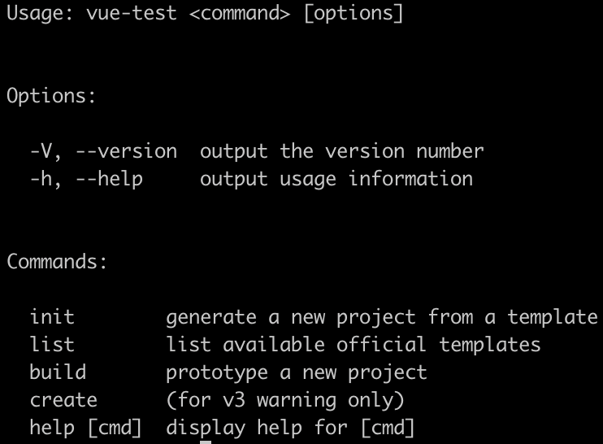

# vue-cli 技术揭秘
## 介绍
[Vue CLI](https://cli.vuejs.org/zh/) 是一个基于 Vue.js 进行快速开发的完整系统，致力于将 Vue 生态中的工具基础标准化。它确保了各种构建工具能够基于智能的默认配置即可平稳衔接，这样你可以专注在撰写应用上，而不必花好几天去纠结配置的问题。

## 源码目录
::: tip 注意
- 本次分析的版本号为: 2.9.6。
- [2.9.6 源码](https://github.com/vuejs/vue-cli/tree/v2)
- [GitHub模板链接](https://github.com/vue-templates)
- [vuejs-templates (webpack) ](https://vuejs-templates.github.io/webpack/)
:::
vue-cli 的源码目录结构如下：
```
vue-cli
├── bin            # 运行命令
├── lib            # 核心代码 
```

## 入口
在 `package.json` 中有 `bin` 配置，代码如下：
```js
"bin": {
  "vue": "bin/vue",
  "vue-init": "bin/vue-init",
  "vue-list": "bin/vue-list"
}
```
`bin/vue.js` 文件指定了版本号 `version`，又注册了如下几条命令，比如 `init`、`list`、`build`、`create` 等。这样当我们执行 `vue init` 时，此时会执行 `bin/vue-init`。执行 `vue list` 时，此时会执行 `bin/vue-list`.
```js
#!/usr/bin/env node

const program = require('commander')

program
  .version(require('../package').version)
  .usage('<command> [options]')
  .command('init', 'generate a new project from a template')
  .command('list', 'list available official templates')
  .command('build', 'prototype a new project')
  .command('create', '(for v3 warning only)')

program.parse(process.argv)
```


## init
`bin/vue-init` 注册了如下几条命令。然后执行 `help` 函数，当我们执行 `vue init` 不传参数时，会执行 `program.help` 打印提示信息。
```js
program
  .usage('<template-name> [project-name]')
  .option('-c, --clone', 'use git clone')
  .option('--offline', 'use cached template')

program.on('--help', () => {
  console.log('  Examples:')
  console.log()
  console.log(chalk.gray('    # create a new project with an official template'))
  console.log('    $ vue init webpack my-project')
  console.log()
  console.log(chalk.gray('    # create a new project straight from a github template'))
  console.log('    $ vue init username/repo my-project')
  console.log()
})
function help () {
  program.parse(process.argv)
  if (program.args.length < 1) return program.help()
}
help()
```
+ 1、**解析命令行参数获取配置**
```js
const home = require('user-home')

let template = program.args[0] // 模板类型: 如 webpack
const rawName = program.args[1] // 自定义项目名称
const inPlace = !rawName || rawName === '.' // rawName存在或者为“.”的时候，视为在当前目录下构建

// path.relative（）:根据当前工作目录返回相对路径 
const name = inPlace ? path.relative('../', process.cwd()) : rawName
// 合并路径
const to = path.resolve(rawName || '.') // /Users/didi/Desktop/vue-cli/demo
const clone = program.clone || false // 检查参数是否clone

const tmp = path.join(home, '.vue-templates', template.replace(/[\/:]/g, '-')) // tmp: /Users/didi/.vue-templates/webpack

console.log()
process.on('exit', () => {
  console.log()
})
```
当我们执行 `vue init webpack projectname` 时，program.args[0] 是 `webpack`，program.args[1] 是 `projectname`。
同时我们也可以不传项目名称，比如: `vue init webpack` 或者 `vue init webpack .`

以上几个变量的含义: `name` 是创建的项目名， `to` 是该项目在系统中的绝对路径，`tmp` 是 `.vue-templates/webpack` 在系统中的路径。

+ 2、**判断项目是否存在**
```js
const inquirer = require('inquirer')
const exists = require('fs').existsSync

if (inPlace || exists(to)) {
  inquirer.prompt([{
    type: 'confirm',
    message: inPlace
      ? 'Generate project in current directory?' // 是否在当前目录下构建项目
      : 'Target directory exists. Continue?', // 构建目录已存在,是否继续
    name: 'ok'
  }]).then(answers => {
    if (answers.ok) {
      run()
    }
  }).catch(logger.fatal)
} else {
  run()
}
```
如果项目名在当前目录下已经存在了，此时会弹出对应的提示框，如果用户选择了 `y`，接着会执行 `run` 函数。

+ 3、 **检查、下载、生成项目**
```js
function run () {
  if (isLocalPath(template)) { // 本地模板
    const templatePath = getTemplatePath(template) // 获取绝对路径
    if (exists(templatePath)) {
      generate(name, templatePath, to, err => {
        if (err) logger.fatal(err)
        console.log()
        logger.success('Generated "%s".', name)
      })
    } else {
      logger.fatal('Local template "%s" not found.', template)
    }
  } else {
    ...
    const officialTemplate = 'vuejs-templates/' + template // 下载官方模板
    downloadAndGenerate(officialTemplate)
  }
}

// 对应辅助函数
module.exports = {
  isLocalPath (templatePath) {
    return /^[./]|(^[a-zA-Z]:)/.test(templatePath)
  },

  getTemplatePath (templatePath) {
    return path.isAbsolute(templatePath)
      ? templatePath
      : path.normalize(path.join(process.cwd(), templatePath))
  }
}
```
根据 `template` 来源来判断是使用本地缓存的模板还是使用线上的模板。如果是本地的模板，首先获取到模板的路径，如果模板存在，则调用 `generate` 函数去生成项目。否则会执行 `downloadAndGenerate` 函数去下载对应的模板、生成项目。


