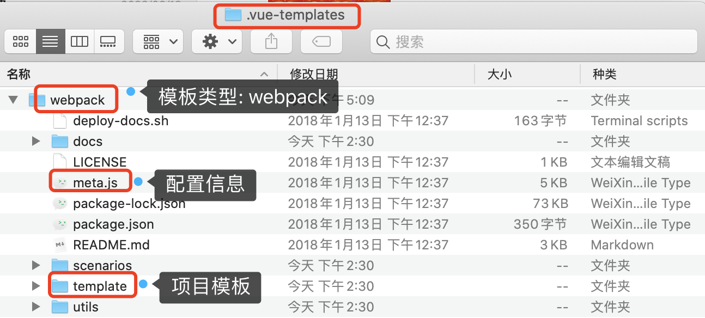

# 生成项目
## 下载模板：download
接上节，`downloadAndGenerate` 函数的执行流程如下：
```js
const ora = require('ora')
const download = require('download-git-repo')

function downloadAndGenerate (template) {
  const spinner = ora('downloading template')
  spinner.start()
  // Remove if local template exists
  if (exists(tmp)) rm(tmp)
  download(template, tmp, { clone }, err => {
    spinner.stop()
    if (err) logger.fatal('Failed to download repo ' + template + ': ' + err.message.trim())
    generate(name, tmp, to, err => {
      if (err) logger.fatal(err)
      console.log()
      logger.success('Generated "%s".', name)
    })
  })
}
```
+ 1、 **开启下载动画**
```js
const spinner = ora('downloading template')
spinner.start()
```
+ 2、 **删除本地模板**
```js
if (exists(tmp)) rm(tmp)
```
+ 3、 **下载模板**

调用 `download` 函数去 `github` 下载对应的模板，并把下载的模板存储到 `.vue-templates` 文件夹下。
在回调中关闭动画
```js
download(template, tmp, { clone }, err => {
  spinner.stop()
  if (err) logger.fatal('Failed to download repo ' + template + ': ' + err.message.trim())
  ...
})
```


+ 4、 **生成项目**

执行 `generate` 函数生成项目
```js
generate(name, tmp, to, err => {
  if (err) logger.fatal(err)
  console.log()
  logger.success('Generated "%s".', name)
})
```
## 生成项目：generate
代码入口在 `lib/generate`：

```js
const Handlebars = require('handlebars')

module.exports = function generate (name, src, dest, done) { // 项目名、模板路径、项目路径、回调
  const opts = getOptions(name, src)
  const metalsmith = Metalsmith(path.join(src, 'template'))
  // metalsmith: {
  //   plugins: [],
  //   ignores: [],
  //   _directory: '/Users/didi/.vue-templates/webpack/template',
  //   _metadata: { destDirName: 'demo', inPlace: false, noEscape: true },
  //   _source: 'src',
  //   _destination: 'build',
  //   _concurrency: Infinity,
  //   _clean: true,
  //   _frontmatter: true
  // }
  const data = Object.assign(metalsmith.metadata(), {
    destDirName: name, // 'demo'
    inPlace: dest === process.cwd(),
    noEscape: true
  })

  opts.helpers && Object.keys(opts.helpers).map(key => {
    Handlebars.registerHelper(key, opts.helpers[key])
  })

  const helpers = { chalk, logger }

  if (opts.metalsmith && typeof opts.metalsmith.before === 'function') {
    opts.metalsmith.before(metalsmith, opts, helpers)
  }

  metalsmith.use(askQuestions(opts.prompts))
    .use(filterFiles(opts.filters))
    .use(renderTemplateFiles(opts.skipInterpolation))

  if (typeof opts.metalsmith === 'function') {
    opts.metalsmith(metalsmith, opts, helpers)
  } else if (opts.metalsmith && typeof opts.metalsmith.after === 'function') {
    opts.metalsmith.after(metalsmith, opts, helpers)
  }

  metalsmith.clean(false)
    .source('.')
    .destination(dest)
    .build((err, files) => {
      done(err)
      if (typeof opts.complete === 'function') {
        const helpers = { chalk, logger, files }
        opts.complete(data, helpers)
      } else {
        logMessage(opts.completeMessage, data)
      }
    })

  return data
}
```
+ 1、 **获取配置信息**

执行 `getOptions` 获取配置信息
```js
module.exports = function options (name, dir) {
  const opts = getMetadata(dir)

  setDefault(opts, 'name', name)
  setValidateName(opts)

  const author = getGitUser()
  if (author) {
    setDefault(opts, 'author', author)
  }

  return opts
}
```
+ 1-1、 **获取 meta 数据**

`getMetadata` 函数接收模板路径作为参数，判断模板下的 `meta.js` 或者 `meta.json` 文件是否存在。由于 `webpack` 模板下配置的是 `meta.js`(见上图)，此处会引入该文件，并返回对应的配置项，赋值给 `opts`。

```js
function getMetadata (dir) {
  const json = path.join(dir, 'meta.json')
  const js = path.join(dir, 'meta.js')
  let opts = {}

  if (exists(json)) {
    opts = metadata.sync(json)
  } else if (exists(js)) {
    const req = require(path.resolve(js))
    if (req !== Object(req)) {
      throw new Error('meta.js needs to expose an object')
    }
    opts = req
  }

  return opts
}
```
`meta.js` 文件的导出:
```js
module.exports = {
  metalsmith: {
    // When running tests for the template, this adds answers for the selected scenario
    before: addTestAnswers
  },
  helpers: {
    if_or(v1, v2, options) {

      if (v1 || v2) {
        return options.fn(this)
      }

      return options.inverse(this)
    },
    template_version() {
      return templateVersion
    },
  },
  
  prompts: {
    name: {
      when: 'isNotTest',
      type: 'string',
      required: true,
      message: 'Project name',
    },
    description: {
      when: 'isNotTest',
      type: 'string',
      required: false,
      message: 'Project description',
      default: 'A Vue.js project',
    },
    author: {
      when: 'isNotTest',
      type: 'string',
      message: 'Author',
    },
    build: {
      when: 'isNotTest',
      type: 'list',
      message: 'Vue build',
      choices: [
        {
          name: 'Runtime + Compiler: recommended for most users',
          value: 'standalone',
          short: 'standalone',
        },
        {
          name:
            'Runtime-only: about 6KB lighter min+gzip, but templates (or any Vue-specific HTML) are ONLY allowed in .vue files - render functions are required elsewhere',
          value: 'runtime',
          short: 'runtime',
        },
      ],
    },
    router: {
      when: 'isNotTest',
      type: 'confirm',
      message: 'Install vue-router?',
    },
    lint: {
      when: 'isNotTest',
      type: 'confirm',
      message: 'Use ESLint to lint your code?',
    },
    lintConfig: {
      when: 'isNotTest && lint',
      type: 'list',
      message: 'Pick an ESLint preset',
      choices: [
        {
          name: 'Standard (https://github.com/standard/standard)',
          value: 'standard',
          short: 'Standard',
        },
        {
          name: 'Airbnb (https://github.com/airbnb/javascript)',
          value: 'airbnb',
          short: 'Airbnb',
        },
        {
          name: 'none (configure it yourself)',
          value: 'none',
          short: 'none',
        },
      ],
    },
    unit: {
      when: 'isNotTest',
      type: 'confirm',
      message: 'Set up unit tests',
    },
    runner: {
      when: 'isNotTest && unit',
      type: 'list',
      message: 'Pick a test runner',
      choices: [
        {
          name: 'Jest',
          value: 'jest',
          short: 'jest',
        },
        {
          name: 'Karma and Mocha',
          value: 'karma',
          short: 'karma',
        },
        {
          name: 'none (configure it yourself)',
          value: 'noTest',
          short: 'noTest',
        },
      ],
    },
    e2e: {
      when: 'isNotTest',
      type: 'confirm',
      message: 'Setup e2e tests with Nightwatch?',
    },
    autoInstall: {
      when: 'isNotTest',
      type: 'list',
      message:
        'Should we run `npm install` for you after the project has been created? (recommended)',
      choices: [
        {
          name: 'Yes, use NPM',
          value: 'npm',
          short: 'npm',
        },
        {
          name: 'Yes, use Yarn',
          value: 'yarn',
          short: 'yarn',
        },
        {
          name: 'No, I will handle that myself',
          value: false,
          short: 'no',
        },
      ],
    },
  },
  filters: {
    '.eslintrc.js': 'lint',
    '.eslintignore': 'lint',
    'config/test.env.js': 'unit || e2e',
    'build/webpack.test.conf.js': "unit && runner === 'karma'",
    'test/unit/**/*': 'unit',
    'test/unit/index.js': "unit && runner === 'karma'",
    'test/unit/jest.conf.js': "unit && runner === 'jest'",
    'test/unit/karma.conf.js': "unit && runner === 'karma'",
    'test/unit/specs/index.js': "unit && runner === 'karma'",
    'test/unit/setup.js': "unit && runner === 'jest'",
    'test/e2e/**/*': 'e2e',
    'src/router/**/*': 'router',
  },
  complete: function(data, { chalk }) {
    const green = chalk.green

    sortDependencies(data, green)

    const cwd = path.join(process.cwd(), data.inPlace ? '' : data.destDirName)

    if (data.autoInstall) {
      installDependencies(cwd, data.autoInstall, green)
        .then(() => {
          return runLintFix(cwd, data, green)
        })
        .then(() => {
          printMessage(data, green)
        })
        .catch(e => {
          console.log(chalk.red('Error:'), e)
        })
    } else {
      printMessage(data, chalk)
    }
  },
}
```
`meta.js` 导出的配置中包含 `metalsmith`、`helpers`、`prompts`、`filters`、`complete` 选项，执行完 `getMetadata` 函数后接着执行 `setDefault` 函数来设置默认的项目名和作者信息，并校验项目名是否合法。

+ 1-2、 **设置默认 name**
```js
setDefault(opts, 'name', name) // 设置默认 name

function setDefault (opts, key, val) {
  if (opts.schema) {
    opts.prompts = opts.schema
    delete opts.schema
  }
  const prompts = opts.prompts || (opts.prompts = {})
  if (!prompts[key] || typeof prompts[key] !== 'object') {
    prompts[key] = {
      'type': 'string',
      'default': val
    }
  } else {
    prompts[key]['default'] = val
  }
}
```
实际上就是修改了 `prompts.name` 对应的 `default` 属性的值。

+ 1-3、 **校验 name 是否合法**
```js
const validateName = require('validate-npm-package-name')
setValidateName(opts)
```
`setValidateName` 函数实现：
```js
function setValidateName (opts) {
  const name = opts.prompts.name
  const customValidate = name.validate
  name.validate = name => {
    const its = validateName(name)
    if (!its.validForNewPackages) {
      const errors = (its.errors || []).concat(its.warnings || [])
      return 'Sorry, ' + errors.join(' and ') + '.'
    }
    if (typeof customValidate === 'function') return customValidate(name)
    return true
  }
}
```

+ 1-4、 **设置默认 author**
```js
const author = getGitUser()
if (author) {
  setDefault(opts, 'author', author)
}
```
`getGitUser` 函数实现：
```js
function getGitUser() => {
  let name
  let email

  try {
    name = exec('git config --get user.name')
    email = exec('git config --get user.email')
  } catch (e) {}

  name = name && JSON.stringify(name.toString().trim()).slice(1, -1)
  email = email && (' <' + email.toString().trim() + '>')
  return (name || '') + (email || '')
}
```
+ 2、**Metalsmith**

+ 2-1、 拼接 `webpack` 模板下的 `template` ，使用 `Metalsmith` 处理后赋值给 `metalsmith`。
```js
const metalsmith = Metalsmith(path.join(src, 'template'))
```
+ 2-2、将 `destDirName`、`inPlace`、`noEscape` 拷贝到 `metalsmith.metadata` 上，并将返回值赋值给 `data`。
```js
const data = Object.assign(metalsmith.metadata(), {
  destDirName: name, // 'projectname'
  inPlace: dest === process.cwd(),
  noEscape: true
})
```
+ 2-3、遍历 `opts.helpers`， 使用 `Handlebars` 依次来注册辅助函数。

```js
opts.helpers && Object.keys(opts.helpers).map(key => {
  Handlebars.registerHelper(key, opts.helpers[key])
}) 
```
`opts.helpers` 是如下的结构，因此 `Handlebars` 会注册 `if_or`、`template_version` 对应的辅助函数。
```js
helpers: {
  if_or(v1, v2, options) {

    if (v1 || v2) {
      return options.fn(this)
    }

    return options.inverse(this)
  },
  template_version() {
    return templateVersion
  }
},
```

+ 2-4、执行 `opts.metalsmith` 对象中的 `before` 函数。
```js
const helpers = { chalk, logger }

if (opts.metalsmith && typeof opts.metalsmith.before === 'function') {
  opts.metalsmith.before(metalsmith, opts, helpers)
}
```
由于 `opts.metalsmith.before` 函数对应的是 `addTestAnswers` 函数，我们来分析一下 `addTestAnswers` 函数:
```js
const scenarios = [
  'full', 
  'full-karma-airbnb', 
  'minimal'
]

const index = scenarios.indexOf(process.env.VUE_TEMPL_TEST)

const isTest = exports.isTest = index !== -1

const scenario = isTest && require(`./${scenarios[index]}.json`)

exports.addTestAnswers = (metalsmith, options, helpers) => {
  Object.assign(
    metalsmith.metadata(),
    { isNotTest: !isTest },
    isTest ? scenario : {}
  )
}
```
由于我们一般不会主动设置 `process.env.VUE_TEMPL_TEST` 变量，此时 `index` 为 `-1`，`isTest` 为 `false`，当执行 `addTestAnswers` 函数时，
`metalsmith.metadata` 上会新添两个属性，如下：
```js
metalsmith.metadata: {
  ...metalsmith.metadata,
  isNotTest: true,
  isTest: {}
}
```
- 2-5、依赖 `metalsmith` 中间件的机制(`use`)，调用 `askQuestions` 函数， 传入 `opts.prompts` 配置项，和用户进行交互。

```js
metalsmith.use(askQuestions(opts.prompts))

function askQuestions (prompts) {
  return (files, metalsmith, done) => {
    ask(prompts, metalsmith.metadata(), done)
  }
}
```
`askQuestions` 接收 `prompts` 作为参数， 执行返回匿名函数。该匿名函数作为 `metalsmith` 的中间件函数，执行时依次会传入 `files`、`metalsmith`、`done` 等参数，内部调用 `ask` 函数。

`ask` 函数入口: `lib/ask.js`

```js
const async = require('async')
const inquirer = require('inquirer')

const promptMapping = {
  string: 'input',
  boolean: 'confirm'
}

function ask (prompts, data, done) {
  async.eachSeries(Object.keys(prompts), (key, next) => {
    prompt(data, key, prompts[key], next)
  }, done)
}
```
`ask` 函数内部获取到 `prompts` 对应的属性名数组，调用 `async.eachSeries` 遍历该数组，内部调用 `prompt` 函数，传入 `metalsmith.metadata`、属性名、属性值、`next` 回调。

```js
function prompt (data, key, prompt, done) {
  if (prompt.when && !evaluate(prompt.when, data)) {
    return done()
  }

  let promptDefault = prompt.default
  if (typeof prompt.default === 'function') {
    promptDefault = function () {
      return prompt.default.bind(this)(data)
    }
  }

  inquirer.prompt([{
    type: promptMapping[prompt.type] || prompt.type,
    name: key,
    message: prompt.message || prompt.label || key,
    default: promptDefault,
    choices: prompt.choices || [],
    validate: prompt.validate || (() => true)
  }]).then(answers => {
    if (Array.isArray(answers[key])) {
      data[key] = {}
      answers[key].forEach(multiChoiceAnswer => {
        data[key][multiChoiceAnswer] = true
      })
    } else if (typeof answers[key] === 'string') {
      data[key] = answers[key].replace(/"/g, '\\"')
    } else {
      data[key] = answers[key]
    }
    done()
  }).catch(done)
}
```
`prompt` 函数内部的执行逻辑就比较简单了，通过调用 `inquirer.prompt` 把对应的配置项传入。当用户选择完对应的配置项后，使用 `data` 来保存用户选择的对应配置。这里的 `data` 指的是 `metalsmith.metadata`。

- 2-6、继续依赖 `metalsmith` 中间件的机制(`use`)，调用 `filterFiles` 函数， 传入 `opts.filters` 配置项，用于过滤用户未选择的配置项对应的文件。
```js
metalsmith.use(filterFiles(opts.filters))

function filterFiles (filters) {
  return (files, metalsmith, done) => {
    filter(files, filters, metalsmith.metadata(), done)
  }
}
```
`filterFiles` 接收 `filters` 作为参数， 执行返回匿名函数。该匿名函数作为 `metalsmith` 的中间件函数，执行时依次会传入 `files`、`metalsmith`、`done` 等参数，内部调用 `filter` 函数，传入 `files`、`filters`、`metalsmith.metadata`、`done` 回调。

`filter` 函数入口: `lib/filter.js`

```js
const match = require('minimatch')
const evaluate = require('./eval')

module.exports = (files, filters, data, done) => {
  if (!filters) {
    return done()
  }
  const fileNames = Object.keys(files)
  Object.keys(filters).forEach(glob => {
    fileNames.forEach(file => {
      if (match(file, glob, { dot: true })) {
        const condition = filters[glob]
        if (!evaluate(condition, data)) {
          delete files[file]
        }
      }
    })
  })
  done()
}
```
`filter` 函数内部的执行逻辑就比较简单了。首先获取到 `files` 对应的属性值数组 `fileNames`，遍历 `filters` 对应的属性值数组，内部遍历 `fileNames`，调用 `minimatch` 库来判断当前要被过滤掉的属性值 `glob` 和 `fileNames` 中当前遍历的的属性值 `file` 是否匹配。如果能够匹配上，获取到 `glob` 对应的键值，如果 `evaluate` 函数的执行结果为假，则需要删除 `files` 中对应的文件。

我们来看一下 `evaluate` 函数的内部逻辑。

```js
module.exports = function evaluate (exp, data) {
  const fn = new Function('data', 'with (data) { return ' + exp + '}')
  try {
    return fn(data)
  } catch (e) {
    console.error(chalk.red('Error when evaluating filter condition: ' + exp))
  }
}
```
`evaluate` 通过 `new Function` 定义了函数，传入参数 `data`，再用 `with` 把函数体包裹起来。当函数内部访问 `exp` 时，此时访问的是 `data.exp`。

:::warning
举个例子: 比如用户没有选择安装路由，此时 `metalsmith.metadata` 记录的路由配置项 `router` 为 `false`。回到 `meta.js` 中的 `filters` 配置项，
```js
filters: {
  ...
  'src/router/**/*': 'router',
}
```
因为 `metalsmith.metadata` 中的 `router` 为 `false`，此时需要删除 `src/router/**/*`，因而路由文件就被过滤掉了。
:::
- 2-7、继续依赖 `metalsmith` 中间件的机制(`use`)，调用 `renderTemplateFiles` 函数， 传入 `opts.skipInterpolation` 配置项，用于替换模板中的表达式。我们首先来看一下模板中的 `package.json` 文件。
```json
{
  "name": "{{ name }}",
  "description": "{{ description }}",
  "author": "{{ author }}",
  "private": true,
  "scripts": {
    "dev": "webpack-dev-server --inline --progress --config build/webpack.dev.conf.js",
    "start": "npm run dev",
    {{#if_eq runner "jest"}}
    "unit": "jest --config test/unit/jest.conf.js --coverage",
    {{/if_eq}}
    {{#if_eq runner "karma"}}
    "unit": "cross-env BABEL_ENV=test karma start test/unit/karma.conf.js --single-run",
    {{/if_eq}}
    {{#e2e}}
    "e2e": "node test/e2e/runner.js",
    {{/e2e}}
    {{#if_or unit e2e}}
    "test": "{{#unit}}npm run unit{{/unit}}{{#unit}}{{#e2e}} && {{/e2e}}{{/unit}}{{#e2e}}npm run e2e{{/e2e}}",
    {{/if_or}}
    {{#lint}}
    "lint": "eslint --ext .js,.vue src{{#unit}} test/unit{{/unit}}{{#e2e}} test/e2e/specs{{/e2e}}",
    {{/lint}}
    "build": "node build/build.js"
  },
  "dependencies": {
    "vue": "^2.5.2"{{#router}},
    "vue-router": "^3.0.1"{{/router}}
  },
  "devDependencies": {
    {{#lint}}
    "babel-eslint": "^8.2.1",
    "eslint": "^4.15.0",
    "eslint-friendly-formatter": "^3.0.0",
    "eslint-loader": "^1.7.1",
    "eslint-plugin-vue": "^4.0.0",
    {{#if_eq lintConfig "standard"}}
    "eslint-config-standard": "^10.2.1",
    "eslint-plugin-promise": "^3.4.0",
    "eslint-plugin-standard": "^3.0.1",
    "eslint-plugin-import": "^2.7.0",
    "eslint-plugin-node": "^5.2.0",
    {{/if_eq}}
    {{#if_eq lintConfig "airbnb"}}
    "eslint-config-airbnb-base": "^11.3.0",
    "eslint-import-resolver-webpack": "^0.8.3",
    "eslint-plugin-import": "^2.7.0",
    {{/if_eq}}
    {{/lint}}
    {{#if_eq runner "jest"}}
    "babel-jest": "^21.0.2",
    "babel-plugin-dynamic-import-node": "^1.2.0",
    "babel-plugin-transform-es2015-modules-commonjs": "^6.26.0",
    "jest": "^22.0.4",
    "jest-serializer-vue": "^0.3.0",
    "vue-jest": "^1.0.2",
    {{/if_eq}}
    {{#if_eq runner "karma"}}
    "cross-env": "^5.0.1",
    "karma": "^1.4.1",
    "karma-coverage": "^1.1.1",
    "karma-mocha": "^1.3.0",
    "karma-phantomjs-launcher": "^1.0.2",
    "karma-phantomjs-shim": "^1.4.0",
    "karma-sinon-chai": "^1.3.1",
    "karma-sourcemap-loader": "^0.3.7",
    "karma-spec-reporter": "0.0.31",
    "karma-webpack": "^2.0.2",
    "mocha": "^3.2.0",
    "chai": "^4.1.2",
    "sinon": "^4.0.0",
    "sinon-chai": "^2.8.0",
    "inject-loader": "^3.0.0",
    "babel-plugin-istanbul": "^4.1.1",
    "phantomjs-prebuilt": "^2.1.14",
    {{/if_eq}}
    {{#e2e}}
    "babel-register": "^6.22.0",
    "chromedriver": "^2.27.2",
    "cross-spawn": "^5.0.1",
    "nightwatch": "^0.9.12",
    "selenium-server": "^3.0.1",
    {{/e2e}}
  }
}
```
`renderTemplateFiles` 函数会根据 `metalsmith.metadata` 中对应的数据去替换模板中的变量，比如 `name`、`description`、`author` 等。另外还会存在 `if_eq`、`if_or` 这些判断语句，这些判断语句会根据用户选择的配置项来安装对应的包或者添加 `scripts` 对应的执行命令。

`if_eq` 对应的注册辅助函数
```js
Handlebars.registerHelper('if_eq', function (a, b, opts) {
  return a === b
    ? opts.fn(this)
    : opts.inverse(this)
})
```
`unless_eq` 对应的注册辅助函数
```js
Handlebars.registerHelper('unless_eq', function (a, b, opts) {
  return a === b
    ? opts.inverse(this)
    : opts.fn(this)
})
```
`renderTemplateFiles` 函数执行返回中间件函数， 内部首先获取到文件属性名组成的数组，再获取到 `metalsmith` 保存的数据。调用 `async.each` 遍历属性名数组，依次获取到属性名对应的文件内容，调用 `toString` 转为字符串。如果文件内没有匹配到双花差值，调用 `next` 进入下一轮循环，否则就会调用 `render` 库来替换模板中双花差值对应的内容，拿到转换结果 `res`，转换为 `Buffer`，赋值给对应的文件内容。
```js
const render = require('consolidate').handlebars.render

function renderTemplateFiles (skipInterpolation) {
  skipInterpolation = typeof skipInterpolation === 'string'
    ? [skipInterpolation]
    : skipInterpolation
  return (files, metalsmith, done) => {
    const keys = Object.keys(files)
    const metalsmithMetadata = metalsmith.metadata()
    async.each(keys, (file, next) => {
      if (skipInterpolation && multimatch([file], skipInterpolation, { dot: true }).length) {
        return next()
      }
      const str = files[file].contents.toString()
      if (!/{{([^{}]+)}}/g.test(str)) {
        return next()
      }
      render(str, metalsmithMetadata, (err, res) => {
        if (err) {
          err.message = `[${file}] ${err.message}`
          return next(err)
        }
        files[file].contents = new Buffer(res)
        next()
      })
    }, done)
  }
}
```
- 2-8、执行 `opts.metalsmith` 函数或者  `opts.metalsmith` 对象中的 `after` 函数(由于 `webpack` 模板中的 `metalsmith` 是一个对象，并且只有 `before` 函数，因而此处不会执行)。
```js
if (typeof opts.metalsmith === 'function') {
  opts.metalsmith(metalsmith, opts, helpers)
} else if (opts.metalsmith && typeof opts.metalsmith.after === 'function') {
  opts.metalsmith.after(metalsmith, opts, helpers)
}
```
- 2-9 `build` 构建项目
```js
metalsmith.clean(false)
  .source('.')
  .destination(dest)
  .build((err, files) => {
    done(err)
    if (typeof opts.complete === 'function') {
      const helpers = { chalk, logger, files }
      opts.complete(data, helpers)
    } else {
      logMessage(opts.completeMessage, data)
    }
  })
```
`metalsmith.destination` 会把生成好的项目模板拷贝到项目对应的路径，`build` 回调函数内部会执行 `opts.complete` 函数。回到 `meta.js`，我们来看一下 `complete` 函数的执行逻辑。
```js
function complete (data, { chalk }) {
  const green = chalk.green

  sortDependencies(data, green)

  const cwd = path.join(process.cwd(), data.inPlace ? '' : data.destDirName)

  if (data.autoInstall) {
    installDependencies(cwd, data.autoInstall, green)
      .then(() => {
        return runLintFix(cwd, data, green)
      })
      .then(() => {
        printMessage(data, green)
      })
      .catch(e => {
        console.log(chalk.red('Error:'), e)
      })
  } else {
    printMessage(data, chalk)
  }
},
```
`complete` 函数内部首先执行 `sortDependencies` 对项目中的依赖项进行排序。代码如下:

```js
exports.sortDependencies = function sortDependencies(data) {
  const packageJsonFile = path.join(
    data.inPlace ? '' : data.destDirName,
    'package.json'
  )
  const packageJson = JSON.parse(fs.readFileSync(packageJsonFile))
  packageJson.devDependencies = sortObject(packageJson.devDependencies)
  packageJson.dependencies = sortObject(packageJson.dependencies)
  fs.writeFileSync(packageJsonFile, JSON.stringify(packageJson, null, 2) + '\n')
}

function sortObject(object) {
  // Based on https://github.com/yarnpkg/yarn/blob/v1.3.2/src/config.js#L79-L85
  const sortedObject = {}
  Object.keys(object)
    .sort()
    .forEach(item => {
      sortedObject[item] = object[item]
    })
  return sortedObject
}
```

接着判断如果用户有选择对应的安装方式(`autoInstall` 不为 `false`)，则执行 `installDependencies` 函数。内部首先会打印绿色的 `Installing project dependencies ...`，接着执行 `runCommand` 函数。
```js
exports.installDependencies = function installDependencies(
  cwd,
  executable = 'npm',
  color
) {
  console.log(`\n\n# ${color('Installing project dependencies ...')}`)
  console.log('# ========================\n')
  return runCommand(executable, ['install'], {
    cwd,
  })
}
```

`runCommand` 返回了 `promise`， 内部会开启一个子进程来安装依赖项，安装完退出时调用 `resolve`。
```js
const spawn = require('child_process').spawn

function runCommand(cmd, args, options) {
  return new Promise((resolve, reject) => {
    const spwan = spawn(
      cmd,
      args,
      Object.assign(
        {
          cwd: process.cwd(),
          stdio: 'inherit',
          shell: true,
        },
        options
      )
    )

    spwan.on('exit', () => {
      resolve()
    })
  })
}
```


