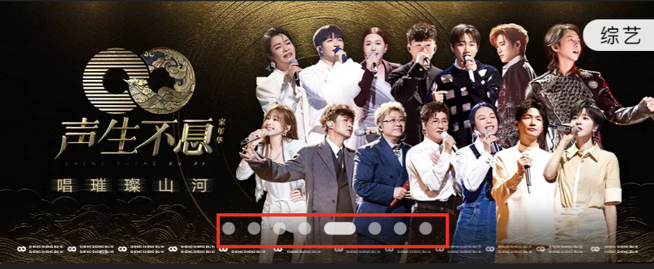
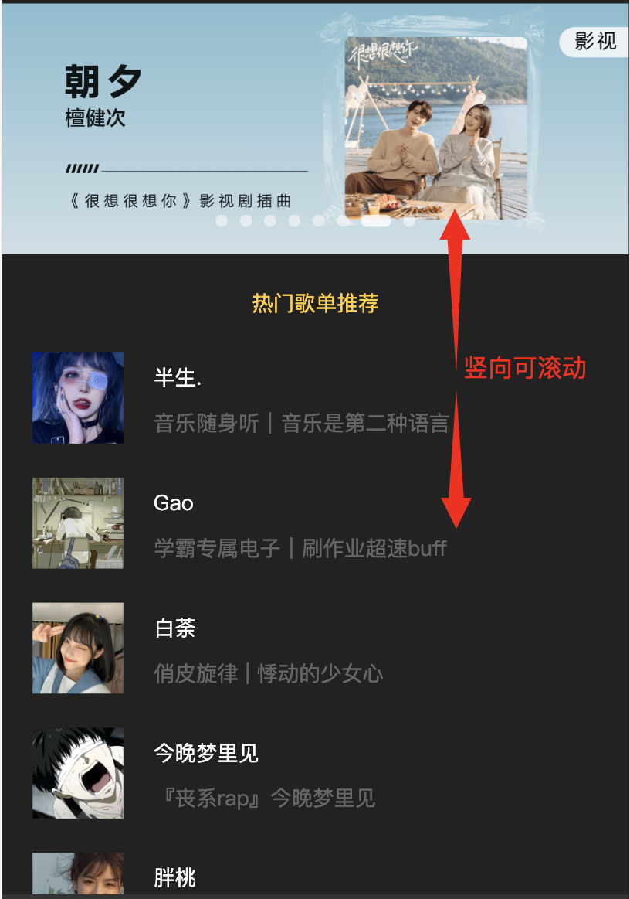
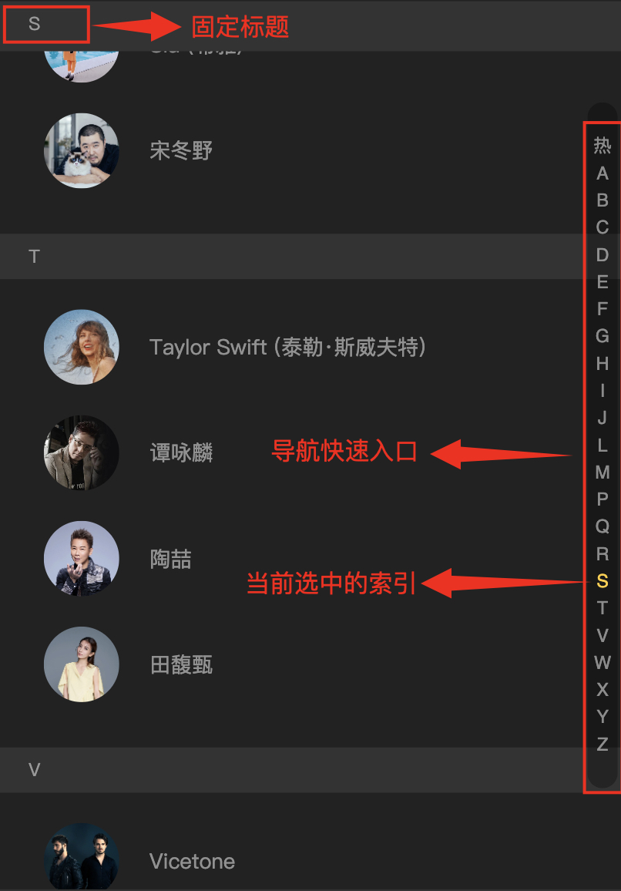

# 组件封装
## 轮播图组件

+ 封装
::: code-group

```vue
<template>
  <div class="slider" ref="rootRef">
    <div class="slider-group">
      <div
        class="slider-page"
        v-for="item in sliders"
        :key="item.id"
      >
        <a :href="item.link">
          
        </a>
      </div>
    </div>
    <div class="dots-wrapper">
      <span
        class="dot"
        v-for="(item, index) in sliders"
        :key="item.id"
        :class="{'active': currentPageIndex === index}">
      </span>
    </div>
  </div>
</template>
```
```javascript
<script>
  import { ref } from 'vue'
  import useSlider from './use-slider'

  export default {
    name: 'slider',
    props: {
      sliders: {
        type: Array,
        default() {
          return []
        }
      }
    },
    setup() {
      const rootRef = ref(null)
      const { currentPageIndex } = useSlider(rootRef)

      return {
        rootRef,
        currentPageIndex
      }
    }
  }
</script>
// use-slider.js
import BScroll from '@better-scroll/core'
import Slide from '@better-scroll/slide'

import { onMounted, onUnmounted, onActivated, onDeactivated, ref } from 'vue'

BScroll.use(Slide)

export default function useSlider(wrapperRef) {
  const slider = ref(null)
  const currentPageIndex = ref(0)

  onMounted(() => {
    const sliderVal = slider.value = new BScroll(wrapperRef.value, {
      click: true,
      scrollX: true,
      scrollY: false,
      momentum: false,
      bounce: false,
      probeType: 2,
      slide: true
    })

    sliderVal.on('slideWillChange', (page) => {
      currentPageIndex.value = page.pageX
    })
  })

  onUnmounted(() => {
    slider.value.destroy()
  })

  onActivated(() => {
    slider.value.enable()
    slider.value.refresh()
  })

  onDeactivated(() => {
    slider.value.disable()
  })

  return {
    slider,
    currentPageIndex
  }
}
```
```css
<style lang="scss" scoped>
  .slider {
    min-height: 1px;
    font-size: 0;
    touch-action: pan-y;
    .slider-group {
      position: relative;
      overflow: hidden;
      white-space: nowrap;
      .slider-page {
        display: inline-block;
        transform: translate3d(0, 0, 0);
        backface-visibility: hidden;
        a {
          display: block;
          width: 100%;
        }
        img {
          display: block;
          width: 100%;
        }
      }
    }
    .dots-wrapper {
      position: absolute;
      left: 50%;
      bottom: 12px;
      line-height: 12px;
      transform: translateX(-50%);
      .dot {
        display: inline-block;
        margin: 0 4px;
        width: 8px;
        height: 8px;
        transform: translateZ(1px);
        border-radius: 50%;
        background: $color-text-l;
        &.active {
          width: 20px;
          border-radius: 5px;
          background: $color-text-ll;
        }
      }
    }
  }
</style>
```

:::
+ 使用
::: code-group
```vue
<div class="slider-wrapper">
  <div class="slider-content">
    <slider v-if="sliders.length" :sliders="sliders"></slider>
  </div>
</div>
```
```javascript
<script>
export default {
  name: 'xx',
  data() {
    return {
       sliders: []
    }
  },
  async created() {
    const result = await xxx()
    this.sliders = result.sliders
  }
}
</script>
```
```css
<style lang="scss" scoped>
.slider-wrapper {
  position: relative;
  width: 100%;
  height: 0;
  padding-top: 40%;
  overflow: hidden;
  .slider-content {
    position: absolute;
    left: 0;
    top: 0;
    width: 100%;
    height: 100%;
  }
}
</style>
```
:::
## 滚动组件(竖向滚动)
  
+ 封装
::: code-group
```vue
<template>
  <div ref="rootRef">
    <slot></slot>
  </div>
</template>
```
```javascript
<script>
import useScroll from './use-scroll'
import { ref } from 'vue'

export default {
  name: 'scroll',
  props: {
    click: {
      type: Boolean,
      default: true
    },
    probeType: {
      type: Number,
      default: 0
    }
  },
  emits: ['scroll'],
  setup(props, { emit }) {
    const rootRef = ref(null)
    const scroll = useScroll(rootRef, props, emit)

    return {
      rootRef,
      scroll
    }
  }
}
</script>
// use-scroll.js
import BScroll from '@better-scroll/core'
import ObserveDOM from '@better-scroll/observe-dom'
import { onMounted, onUnmounted, onActivated, onDeactivated, ref } from 'vue'

BScroll.use(ObserveDOM)

export default function useScroll(wrapperRef, options, emit) {
  const scroll = ref(null)

  onMounted(() => {
    const scrollVal = scroll.value = new BScroll(wrapperRef.value, {
      observeDOM: true,
      ...options
    })

    if (options.probeType > 0) {
      scrollVal.on('scroll', (pos) => {
        emit('scroll', pos)
      })
    }
  })

  onUnmounted(() => {
    scroll.value.destroy()
  })

  onActivated(() => {
    scroll.value.enable()
    scroll.value.refresh()
  })

  onDeactivated(() => {
    scroll.value.disable()
  })

  return scroll
}
```
:::
+ 使用
::: code-group
```vue
<template>
  <div class="recommend">
    <scroll class="recommend-content">
      <!-- better-scroll 只会对第一个元素添加滚动效果，此处使用 div 包裹子元素 -->
      <div>
        <div class="slider-wrapper">
          <div class="slider-content">
            <!-- slide -->
          </div>
        </div>
        <div class="recommend-list">
          <!-- 列表 -->
        </div>
      </div>
    </scroll>
  </div>
</template>
```
```css
<style lang="scss" scoped>
.recommend {
  position: fixed;
  width: 100%;
  top: 88px;
  bottom: 0;
  overflow: scroll;
  .recommend-content { // 父元素定高，确保子元素高度超过父元素，即可实现滚动效果
    height: 100%;
    overflow: hidden;
  }
}
</style>
```
## 滚动组件(横向滚动)
:::
## 通讯录组件

::: code-group
```vue
<template>
  <scroll
    class="index-list"
    :probe-type="3"
    @scroll="onScroll"
    ref="scrollRef"
  >  
    <!-- 通讯录列表 -->
    <ul ref="groupRef">
      <li
        v-for="group in data"
        :key="group.title"
        class="group"
      >
        <h2 class="title">{{group.title}}</h2>
        <ul>
          <li
            v-for="item in group.list"
            :key="item.id"
            class="item"
            @click="onItemClick(item)"
          >
            
            <span class="name">{{item.name}}</span>
          </li>
        </ul>
      </li>
    </ul>
    <div
      class="fixed"
      v-show="fixedTitle"
      :style="fixedStyle"
    >
      <div class="fixed-title">{{fixedTitle}}</div>
    </div>
    <!-- 快速导航入口 -->
    <div
      class="shortcut"
      @touchstart.stop.prevent="onShortcutTouchStart"
      @touchmove.stop.prevent="onShortcutTouchMove"
      @touchend.stop.prevent
    >
      <ul>
        <li
          v-for="(item, index) in shortcutList"
          :key="item"
          :data-index="index"
          class="item"
          :class="{'current':currentIndex===index}">
          {{item}}
        </li>
      </ul>
    </div>
  </scroll>
</template>
```
```javascript
<script>
export default {
  import Scroll from '@/components/wrap-scroll/index'
  import useFixed from './use-fixed'
  import useShortcut from './use-shortcut'

  export default {
    name: 'index-list',
    components: { Scroll },
    props: {
      data: {
        type: Array,
        default() {
          return []
        }
      }
    },
    emits: ['select'],
    setup(props, { emit }) {
      const { groupRef, onScroll, fixedTitle, fixedStyle, currentIndex } = useFixed(props)
      const { shortcutList, scrollRef, onShortcutTouchStart, onShortcutTouchMove } = useShortcut(props, groupRef)

      function onItemClick(item) {
        emit('select', item)
      }

      return {
        onItemClick,
        groupRef,
        onScroll,
        fixedTitle,
        fixedStyle,
        currentIndex,
        shortcutList,
        scrollRef,
        onShortcutTouchStart,
        onShortcutTouchMove
      }
    }
  }
}
</script>
// use-fixed.js
import { ref, watch, computed, nextTick } from 'vue'

export default function useFixed(props) {
  const TITLE_HEIGHT = 30
  const groupRef = ref(null)
  const listHeights = ref([])
  const scrollY = ref(0)
  const currentIndex = ref(0)
  const distance = ref(0)
  // 固定标题逻辑 start
  const fixedTitle = computed(() => {
    if (scrollY.value < 0) { // 下拉列表
      return ''
    }
    const currentGroup = props.data[currentIndex.value]
    return currentGroup ? currentGroup.title : ''
  })

  const fixedStyle = computed(() => {
    const distanceVal = distance.value
    const diff = (distanceVal > 0 && distanceVal < TITLE_HEIGHT) ? distanceVal - TITLE_HEIGHT : 0
    return {
      transform: `translate3d(0,${diff}px,0)`
    }
  })
  // 固定标题逻辑 end

  watch(() => props.data, async () => {
    // 数据变化到 DOM 更新为异步过程，需要等一个 tick
    await nextTick()
    calculate()
  })
  // currentIndex 实现思路: 实时获取 scroll 的滚动距离，依次和每个子元素的高度区间做比较。
  watch(scrollY, (newY) => {
    const listHeightsVal = listHeights.value
    for (let i = 0; i < listHeightsVal.length - 1; i++) {
      const heightTop = listHeightsVal[i]
      const heightBottom = listHeightsVal[i + 1]
      if (newY >= heightTop && newY < heightBottom) {
        currentIndex.value = i
        distance.value = heightBottom - newY
        break
      }
    }
  })

  function calculate() { // 计算每个子元素的高度区间
    const list = groupRef.value.children
    const listHeightsVal = listHeights.value
    let height = 0

    listHeightsVal.length = 0
    listHeightsVal.push(height)

    for (let i = 0; i < list.length; i++) {
      height += list[i].clientHeight
      listHeightsVal.push(height)
    }
  }

  function onScroll(pos) {
    // 上拉列表 pos.y 为负值，负负得正
    scrollY.value = -pos.y
  }

  return {
    groupRef,
    onScroll,
    fixedTitle,
    fixedStyle,
    currentIndex
  }
}
// use-shortcut.js
import { ref, computed } from 'vue'

export default function useShortcut(props, groupRef) {
  const ANCHOR_HEIGHT = 18
  const scrollRef = ref(null)

  const shortcutList = computed(() => {
    return props.data.map((group) => {
      return group.title
    })
  })

  const touch = {}

  function onShortcutTouchStart(e) {
    const anchorIndex = parseInt(e.target.dataset.index)
    touch.y1 = e.touches[0].pageY
    touch.anchorIndex = anchorIndex

    scrollTo(anchorIndex)
  }

  function onShortcutTouchMove(e) {
    touch.y2 = e.touches[0].pageY
    const delta = (touch.y2 - touch.y1) / ANCHOR_HEIGHT | 0
    const anchorIndex = touch.anchorIndex + delta

    scrollTo(anchorIndex)
  }

  function scrollTo(index) {
    if (isNaN(index)) { // 滑动边界判断
      return
    }
    // index >= 0 && index <= 列表的长度
    index = Math.max(0, Math.min(shortcutList.value.length - 1, index))
    const targetEl = groupRef.value.children[index]
    const scroll = scrollRef.value.scroll
    scroll.scrollToElement(targetEl, 0)
  }

  return {
    shortcutList,
    scrollRef,
    onShortcutTouchStart,
    onShortcutTouchMove
  }
}
```
```css
<style lang="scss" scoped>
  .index-list {
    position: relative;
    width: 100%;
    height: 100%;
    overflow: hidden;
    background: $color-background;
    .group {
      padding-bottom: 30px;
      .title {
        height: 30px;
        line-height: 30px;
        padding-left: 20px;
        font-size: $font-size-small;
        color: $color-text-l;
        background: $color-highlight-background;
      }
      .item {
        display: flex;
        align-items: center;
        padding: 20px 0 0 30px;
        .avatar {
          width: 50px;
          height: 50px;
          border-radius: 50%;
        }
        .name {
          margin-left: 20px;
          color: $color-text-l;
          font-size: $font-size-medium;
        }
      }
    }
    .fixed {
      position: absolute;
      top: 0;
      left: 0;
      width: 100%;
      .fixed-title {
        height: 30px;
        line-height: 30px;
        padding-left: 20px;
        font-size: $font-size-small;
        color: $color-text-l;
        background: $color-highlight-background;
      }
    }
    .shortcut {
      position: absolute;
      right: 4px;
      top: 50%;
      transform: translateY(-50%);
      width: 20px;
      padding: 20px 0;
      border-radius: 10px;
      text-align: center;
      background: $color-background-d;
      font-family: Helvetica;
      .item {
        padding: 3px;
        line-height: 1;
        color: $color-text-l;
        font-size: $font-size-small;
        &.current {
          color: $color-theme
        }
      }
    }
  }
</style>
```
:::
