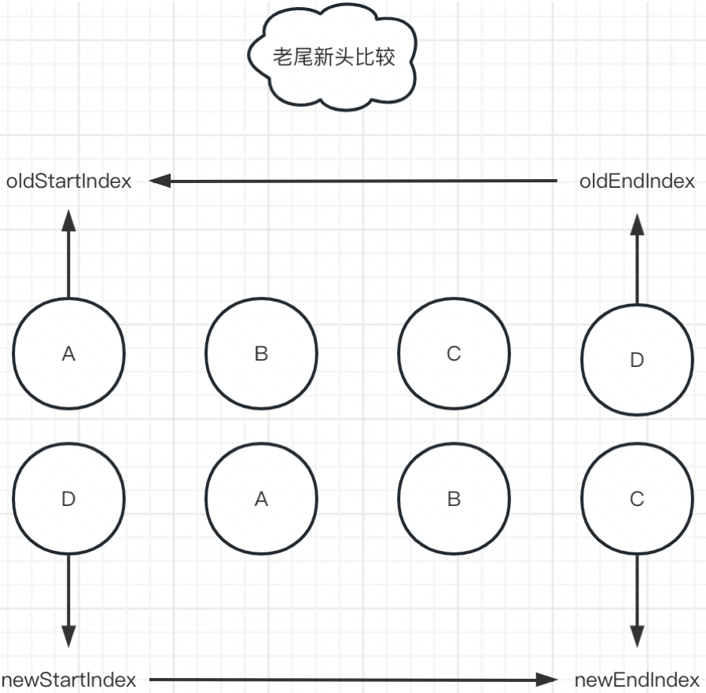

# diff 机制

## Vue2
- 1、新旧节点不同:

  

- 2、新旧节点相同:

  

- 3、`updateChildren`
  - 3-1、头头对比
  

  - 3-2、尾尾对比
  

  - 3-3、头尾对比
  

  - 3-3、尾头对比
  

- 4、完整 diff 流程: 


## Vue3
### `全量 diff: patchKeyedChildren`

该函数首先定义头指针 i = 0，获取到新老 children 的长度，并计算出尾指针 e1、e2。接着定义 isSameVNodeType 用于判断 vnode 节点的类型是否相同(type、key必须完全相同)。
```js
 function patchKeyedChildren(c1, c2, container, ...) {
  const l2 = c2.length;
  let i = 0;
  let e1 = c1.length - 1;
  let e2 = l2 - 1;
  ...
}

 function isSameVNodeType(n1, n2) {
   return n1.type === n2.type && n1.key === n2.key;
 }
```
> 源码在 diff 算法的最开始，会优先头部正序扫描和尾部倒序扫描，**以便排除类型一样的干扰项，进一步的提高效率**。

- 1、`头部正序扫描(sync from start)`


```js
 while (i <= e1 && i <= e2) {
  const n1 = c1[i]
  const n2 = c2[i]

  if (isSameVNodeType(n1, n2)) {
    patch(n1, n2, container, parentComponent, parentAnchor)
  } else {
    break
  }

  i++
}
```
- 2、`尾部倒序扫描(sync from end)`


```js
while (i <= e1 && i <= e2) {
  const n1 = c1[e1]
  const n2 = c2[e2]

  if (isSameVNodeType(n1, n2)) {
    patch(n1, n2, container, parentComponent, parentAnchor);
  } else {
    break
  }

  e1--
  e2--
}
```
- 3、`同序列 + 挂载(common sequence + mount)`
> 新节点比子节点数量多

**尾部添加**


**头部添加**


:::tip 新节点数量 > 子节点数量
满足条件: i > e1 && i <= e2。i 到 e2 之间的节点需要新增。

插入位置判断: 判断 e2 + 1 和 l2 的大小: e2 + 1 < l2 前插，anchor 为 e2 + 1 对应的 el，否则后插，anchor 为 null
:::

```js
if (i > e1) { 
  if (i <= e2) {
    const nextPos = e2 + 1;
    // anchor用来标识插入位置
    const anchor = nextPos < l2 ? c2[nextPos].el : null; 
    while (i <= e2) {
      patch(null, c2[i], container, parentComponent, anchor);
      i++;
    }
  }
}

// 插入 api
function insert(child, parent, anchor = null) {
  parent.insertBefore(child, anchor);
}
```

- 4、`同序列 + 卸载(common sequence + unmount)`
> 老节点比新节点数量多

**尾部移除**


**头部移除**


:::danger 老节点数量 > 新节点数量
满足条件: i > e2 && i <= e1。i 到 e1 之间的节点需要移除
:::

```js
else if (i > e2) {
  while (i <= e1) {
    hostRemove(c1[i].el);
    i++;
  }
}

function hostRemove(child) {
  const parent = child.parentNode;
  if (parent) {
    parent.removeChild(child);
  }
}
```
- 5、`乱序比对(unknown sequence)`


经过上述比对逻辑，头尾指针最终走到图示的位置：此时 i = 2、e1 = 4、e2 = 5。我们着重分析一下这块逻辑:
- 5-1、`构建 key 值到索引的映射`
```js
let s1 = i // 2
let s2 = i // 2
const toBePatched = e2 - s2 + 1 // 有多少节点需要比对，此处为 4 个
let patched = 0 // 记录比对的次数
const keyToNewIndexMap = new Map()
const newIndexToOldIndexMap = new Array(toBePatched).fill(0) // [0, 0, 0, 0]

for (let i = s2; i <= e2; i++) {
  const nextChild = c2[i]
  keyToNewIndexMap.set(nextChild.key, i)
  // keyToNewIndexMap: { e: 2, c: 3, d: 4. h: 5 }
}
```
- 5-2、查找旧节点在映射表中是否存在，不存在需要删除旧节点；存在返回对应索引，继续调用 patch 函数，patched 累加。并且更新 newIndexToOldIndexMap

```js
for (let i = s1; i <= e1; i++) {
  const prevChild = c1[i];
  
  // 比对过的次数大于要比对的节点数，直接移除即可
  if (patched >= toBePatched) { 
    hostRemove(prevChild.el);
    continue;
  }
  // 查找老节点在映射表中的索引值
  let newIndex;
  if (prevChild.key != null) { // 有key
    newIndex = keyToNewIndexMap.get(prevChild.key);
  } else {
    for (let j = s2; j <= e2; j++) { // 无 key
      if (isSameVNodeType(prevChild, c2[j])) {
        newIndex = j;

        break;
      }
    }
  }

  if (newIndex === undefined) { // 老节点在 c2 中不存在，移除
    hostRemove(prevChild.el);
  } else { // 老节点 存在于 c2 中，继续 patch
    newIndexToOldIndexMap[newIndex - s2] = i + 1;
    patch(prevChild, c2[newIndex], container, parentComponent, null);
    patched++;
  }
}
```
::: details `newIndexToOldIndexMap 更新过程解析`
先找到 c，newIndex 为 3，s2 为 2，i: 2, newIndexToOldIndexMap 更新为[0, 3, 0, 0], i++ 

在找到 d，newIndex 为 4，s2 为 2，i: 3, newIndexToOldIndexMap 更新为[0, 3, 4, 0], i++ 

在找到 e，newIndex 为 2，s2 为 2，i: 4, newIndexToOldIndexMap 更新为[5, 3, 4, 0], 遍历结束
:::
- 5-3、 `执行插入或移动操作`

```js
for (let i = toBePatched - 1; i >= 0; i--) { // 从后向前插入
  const nextIndex = i + s2
  const nextChild = c2[nextIndex]
  const anchor = nextIndex + 1 < l2 ? c2[nextIndex + 1].el : null

  if (newIndexToOldIndexMap[i] === 0) { // 没有被 patch 新增
    patch(null, nextChild, container, parentComponent, anchor)
  } else {
    // 移动节点（但有些节点可以不动）
    hostInsert(nextChild.el, container, anchor)
  }
}
```
::: warning 可优化点
hostInsert 会将每个元素移动 1 次，但有些节点可以不移动，多次移动 DOM元素会导致性能浪费。Vue3 采用最长递增子序列算法，来求解不需要移动的元素有哪些
:::

### 最长递增子序列优化 diff
```js
// 是否需要移动元素，如果后面的索引小于前面的，则需要移动，需要调用 getSequence 算法
const increasingNewIndexSequence = getSequence(newIndexToOldIndexMap) // 最长递增子序列 [1, 2]
let j = increasingNewIndexSequence.length - 1 // 1

for (let i = toBePatched - 1; i >= 0; i--) { // 从后向前插入
  const nextIndex = i + s2
  const nextChild = c2[nextIndex]
  const anchor = nextIndex + 1 < l2 ? c2[nextIndex + 1].el : null

  if (newIndexToOldIndexMap[i] === 0) {
    patch(null, nextChild, container, parentComponent, anchor)
  } else {
    if (j < 0 || i !== increasingNewIndexSequence[j]) {
      hostInsert(nextChild.el, container, anchor)
    } else {
      j--
    }
  }
}
```
[getSequence](/algorithm/other) 为最长递增子序列算法，接收 newIndexToOldIndexMap([5, 3, 4, 0]) ，返回结果为[1, 2]。然后比较 i  increasingNewIndexSequence[j] 是否相等进行对应操作。

### 全量 diff 完整代码
```js
function patchKeyedChildren(c1, c2, container, ...) {
  const l2 = c2.length;
  let i = 0;
  let e1 = c1.length - 1;
  let e2 = l2 - 1;

  function isSameVNodeType(n1, n2) {
    return n1.type === n2.type && n1.key === n2.key;
  }
  
  // sync from start
  while (i <= e1 && i <= e2) {
    const n1 = c1[i];
    const n2 = c2[i];

    if (isSameVNodeType(n1, n2)) {
      patch(n1, n2, container, parentComponent, parentAnchor);
    } else {
        break;
    }

    i++;
  }
  
  // sync from end
  while (i <= e1 && i <= e2) {
    const n1 = c1[e1];
    const n2 = c2[e2];

    if (isSameVNodeType(n1, n2)) {
      patch(n1, n2, container, parentComponent, parentAnchor);
    } else {
      break;
    }

    e1--;
    e2--;
  }
  
  // common sequence + mount
  if (i > e1) { 
    if (i <= e2) {
      const nextPos = e2 + 1;
      const anchor = nextPos < l2 ? c2[nextPos].el : null;
      while (i <= e2) {
        patch(null, c2[i], container, parentComponent, anchor);
        i++;
      }
    }
  } else if (i > e2) { // common sequence + unmount
    while (i <= e1) {
      hostRemove(c1[i].el);
      i++;
    }
  } else { // 中间对比
    let s1 = i;
    let s2 = i;
    const toBePatched = e2 - s2 + 1;
    let patched = 0;
    const keyToNewIndexMap = new Map();
    const newIndexToOldIndexMap = new Array(toBePatched).fill(0);
    let moved = false;
    let maxNewIndexSoFar = 0;

    for (let i = s2; i <= e2; i++) {
      const nextChild = c2[i];
      keyToNewIndexMap.set(nextChild.key, i);
    }

    for (let i = s1; i <= e1; i++) {
      const prevChild = c1[i];

      if (patched >= toBePatched) {
        hostRemove(prevChild.el);
        continue;
      }
      let newIndex;
      if (prevChild.key != null) {
        newIndex = keyToNewIndexMap.get(prevChild.key);
      } else {
        for (let j = s2; j <= e2; j++) {
          if (isSameVNodeType(prevChild, c2[j])) {
            newIndex = j;
            break;
          }
        }
      }

      if (newIndex === undefined) {
        hostRemove(prevChild.el);
      } else {
        if (newIndex >= maxNewIndexSoFar) {
          maxNewIndexSoFar = newIndex;
        } else {
          moved = true;
        }

        newIndexToOldIndexMap[newIndex - s2] = i + 1;
        patch(prevChild, c2[newIndex], container, parentComponent, null);
        patched++;
      }
    }

    const increasingNewIndexSequence = moved
      ? getSequence(newIndexToOldIndexMap)
      : [];
    let j = increasingNewIndexSequence.length - 1;

    for (let i = toBePatched - 1; i >= 0; i--) {
      const nextIndex = i + s2;
      const nextChild = c2[nextIndex];
      const anchor = nextIndex + 1 < l2 ? c2[nextIndex + 1].el : null;

      if (newIndexToOldIndexMap[i] === 0) {
        patch(null, nextChild, container, parentComponent, anchor);
      } else if (moved) {
        if (j < 0 || i !== increasingNewIndexSequence[j]) {
          hostInsert(nextChild.el, container, anchor);
        } else {
          j--;
        }
      }
    }
  }
}
```


