# 大杂脍汇总
## new Vue 过程中做了些什么


## v-once
> 内置指令: 只渲染一次元素或组件，重新渲染时，元素、组件及其所有的子节点将被视为静态内容并跳过(可以缓存虚拟节点)，用于优化更新性能。

使用场景:
```vue
<div v-once>我是静态内容 {{ msg }} </div>
```
编译结果如下:
```js
function render(_ctx, _cache) {
  return _cache[0] || (
    _setBlockTracking(-1),
    _cache[0] = _createElementVNode("div", null, [
      _createTextVNode("我是静态内容 " + _toDisplayString(_ctx.msg), 1 /* TEXT */)
    ]),
    _setBlockTracking(1),
    _cache[0]
  )
}
```
::: danger 缺点
 使用该指令后，如果 msg 发生变化，模板也不会重新渲染
:::
> vue3.2之后，新增了 v-memo 指令，通过依赖列表的方式控制页面渲染
```vue
<div v-memo="[msg]">
  <p v-once>我是静态内容 {{ msg }} </p>
</div>
```
编译结果如下:
```js
function render(_ctx, _cache) {
  return _withMemo([_ctx.msg], () => (_openBlock(), _createElementBlock("div", null, [
    _cache[0] || (
      _setBlockTracking(-1),
      _cache[0] = _createElementVNode("p", null, [
        _createTextVNode("我是静态内容 " + _toDisplayString(_ctx.msg), 1 /* TEXT */)
      ]),
      _setBlockTracking(1),
      _cache[0]
    )
  ])), _cache, 1)
}
```
## v-if 和 v-show 的区别
一、区别：

v-if: 条件不成立不会渲染当前指令所在节点的 dom 元素

v-show: 切换当前 dom 的显示或者隐藏(display: none)

二、模版编译:

[Vue2 链接](https://vue2-template-explorer.vercel.app/#%3Cdiv%20v-if%3D%22exist%22%3EHello%20World%3C%2Fdiv%3E)

[Vue3 链接](https://template-explorer.vuejs.org/#eyJzcmMiOiI8ZGl2IHYtaWY9XCJleGlzdFwiPkhlbGxvIFdvcmxkPC9kaXY+Iiwib3B0aW9ucyI6e319)

1、 v-if
```vue
<div v-if="exist">Hello World</div>
```
上述模板会被编译成如下 render 函数：
```js
// vue2
function render() {
  with(this) {
    return (exist) ? _c('div', [_v("Hello World")]) : _e()
  }
}
// vue3
import { openBlock as _openBlock, createElementBlock as _createElementBlock, createCommentVNode as _createCommentVNode } from "vue"

export function render(_ctx, ...) {
  return (_ctx.exist)
    ? (_openBlock(), _createElementBlock("div", { key: 0 }, "Hello World"))
    : _createCommentVNode("v-if", true)
}
```

2、 v-show
```vue
<div v-show="exist">Hello World</div>
```
上述模板会被编译成如下 render 函数：
```js
// vue2
function render() {
  with(this) {
    return _c('div', {
      directives: [{
        name: "show",
        rawName: "v-show",
        value: (exist),
        expression: "exist"
      }]
    }, [_v("Hello World")])
  }
}
// vue3
import { vShow as _vShow, withDirectives as _withDirectives, openBlock as _openBlock, createElementBlock as _createElementBlock } from "vue"

export function render(_ctx, ...) {
  return _withDirectives((_openBlock(), _createElementBlock("div", null, "Hello World", 512 /* NEED_PATCH */)), [
    [_vShow, _ctx.exist]
  ])
}
```

:::warning 区别
v-if 被编译成三元表达式， v-show 被编译成 v-show 指令
::: 

## v-if 和 v-for 的优先级
vue2 中: `v-for 优先级更高(先解析v-for，在解析v-if，导致先循环在判断，浪费性能)`

vue3 中: `v-if 优先级更高(会被移至外层标签)`

> 可以使用计算属性代替两者互相有依赖的场景

```vue
<ul><li v-for="item in list" v-if="exist"></li></ul>
```
上述模板会被编译成如下 render 函数：
```js
// vue2
function render() {
  with(this) {
    return _c('ul', _l((list), function (item) {
      return (exist) ? _c('li') : _e()
    }), 0)
  }
}

// vue3
export function render(_ctx, _cache, $props, $setup, $data, $options) {
  return (_openBlock(), _createElementBlock("ul", null, [
    (_ctx.exist)
      ? (_openBlock(true), _createElementBlock(_Fragment, { key: 0 }, _renderList(_ctx.list, (item) => {
          return (_openBlock(), _createElementBlock("li"))
        }), 256 /* UNKEYED_FRAGMENT */))
      : _createCommentVNode("v-if", true)
  ]))
}
```
## Vue.use 实现原理

> `用于安装 Vuejs 插件`: 如果插件是对象，必须提供 install 方法，如果是函数，它将被作为 install 方法。 install 方法调用时，会把 Vue 作为参数传入，这样插件中就不在需要依赖 Vue 了。

作用:
- 1、添加全局指令、全局过滤器、全局组件
- 2、通过全局混入来添加一些组件选项
- 3、添加 Vue 实例方法，通过把它们添加到 Vue.prototype 上实现

插件简单实现:
```js
const plugin1 = {
  install(_Vue, ...args) {
    console.log(_Vue, args)
  }
}
const plugin2 = (_Vue, ...args) => {
  console.log(_Vue, args)
}

Vue.use(plugin1, 1, 2, 3)
Vue.use(plugin2, 1, 2, 3)
```
源码实现:
```js
Vue.use = function (plugin: Function | Object) {
  const installedPlugins = (this._installedPlugins || (this._installedPlugins = []))
  if (installedPlugins.indexOf(plugin) > -1) { // 如果已经有插件，直接返回
    return this
  }

  const args = toArray(arguments, 1) // 除了第一项其它的参数整合成数组
  args.unshift(this) // 将 Vue 放入到数组中
  if (typeof plugin.install === 'function') {
    plugin.install.apply(plugin, args)
  } else if (typeof plugin === 'function') {
    plugin.apply(null, args)
  }
  installedPlugins.push(plugin) // 缓存插件
  return this
}
```
Vue.use 接受一个 plugin 参数，并且维护了一个 _installedPlugins 数组，它存储所有注册过的 plugin；
接着又会判断 plugin 有没有定义 install 方法，如果有的话则调用该方法，并且该方法执行的第一个参数是 Vue；最后把 plugin 存储到 installedPlugins 中。 

可以看到 Vue 提供的插件注册机制很简单，每个插件都需要实现一个静态的 install 方法。当我们执行 Vue.use 注册插件的时候，就会执行这个 install 方法，并且在这个 install 方法的第一个参数我们可以拿到 Vue 对象，这样的好处就是作为插件的编写方不需要再额外去 import Vue 了。

[vue-router install 实现](https://dingqiangqiang.github.io/vue/vue-router/install.html)

[vuex install 实现](https://dingqiangqiang.github.io/vue/vuex/init.html)
## Vue.set 实现原理
> 为了解决 Vue2 中新增属性无法实现响应式的问题，Object.defineproperty 只会劫持已经存在的属性，而且数组也没有处理索引和长度问题。

源码实现:
```js
function set (target: Array<any> | Object, key: any, val: any): any {
  // 开发环境 && target 没定义 或者 是基础类型则报错
  if (process.env.NODE_ENV !== 'production' && (isUndef(target) || isPrimitive(target))) {
    warn(`Cannot set reactive property on undefined, null, or primitive value: ${(target: any)}`)
  }
  // 数组调用 splice
  if (Array.isArray(target) && isValidArrayIndex(key)) {
    target.length = Math.max(target.length, key)
    target.splice(key, 1, val)
    return val
  }
  // 如果是对象本身的属性，直接添加即可
  if (key in target && !(key in Object.prototype)) {
    target[key] = val
    return val
  }
  // 如果是 Vue 实例或 根数据 $data 时报警告
  const ob = (target: any).__ob__
  if (target._isVue || (ob && ob.vmCount)) {
    process.env.NODE_ENV !== 'production' && warn(
      'Avoid adding reactive properties to a Vue instance or its root $data ' +
      'at runtime - declare it upfront in the data option.'
    )
    return val
  }
  // 如果对象本身不是响应式也不需要将其定义成响应式属性
  if (!ob) {
    target[key] = val
    return val
  }
  // 将属性定义成响应式的
  defineReactive(ob.value, key, val)
  // 通知视图更新
  ob.dep.notify()
  return val
}
```
## Vue.mixin 实现原理
> 用来扩展组件，将公共逻辑进行抽离，在需要该逻辑时进行'混入',采用策略模式针对不同的属性进行合并(混入的数据和组件本身的数据冲突，以组件数据为准)。缺陷: `命名冲突、数据来源不清晰`

> 组件的扩展除了 mixin 之外还有一个属性叫 extends, 但是不怎么常用。

::: tip 合并策略:

1、props、methods、inject、computed 同名时会被替换

2、data 会被合并

3、声明周期、watch 会被合并成队列

4、components、directives、filters 会创建原型链
:::

源码实现:
```js
Vue.mixin = function (mixin: Object) {
  this.options = mergeOptions(this.options, mixin)
  return this
}

function mergeOptions(parent: Object, child: Object) {
  ...
  const extendsFrom = child.extends
  if (extendsFrom) {
    parent = mergeOptions(parent, extendsFrom, vm)
  }
  if (child.mixins) { // 使用场景: 子组件定义了 mixins: [mixin] 选项
    for (let i = 0, l = child.mixins.length; i < l; i++) {
      parent = mergeOptions(parent, child.mixins[i], vm)
    }
  }
  const options = {}
  let key
  for (key in parent) {
    mergeField(key)
  }
  for (key in child) {
    if (!hasOwn(parent, key)) {
      mergeField(key)
    }
  }
  function mergeField (key) {
    const strat = strats[key] || defaultStrat
    options[key] = strat(parent[key], child[key], vm, key)
  }
  return options
}
// 不同的属性有不同的合并策略，以下是生命周期的合并逻辑
const LIFECYCLE_HOOKS = ['beforeCreate', 'created', 'beforeMount', ...]

LIFECYCLE_HOOKS.forEach(hook => {
  strats[hook] = mergeHook
})

/**
 * Hooks and props are merged as arrays.
 */
function mergeHook (parentVal, childVal){
  return childVal
    ? parentVal
      ? parentVal.concat(childVal)
      : Array.isArray(childVal)
        ? childVal
        : [childVal]
    : parentVal
}
```

## Vue.extend 实现原理
> 创建子类的构造函数，参数是一个包含组件选项的对象(data 必须是函数),子类继承 Vue 的构造函数。

```vue
const Profile = Vue.extend({
  template: '<p>{{ firstName }}</p>',
  data() {
    return {
      firstName: 'demo'
    }
  }
})
new Profile().$mount('#demo')
```
源码实现:
```js{4-8}
Vue.extend = function (extendOptions: Object): Function {
  const Super = this // Vue
  ...
  const Sub = function VueComponent (options) {
    this._init(options)
  }
  Sub.prototype = Object.create(Super.prototype)
  Sub.prototype.constructor = Sub
  ...
  return Sub
}
```
:::tip 优势
1、用于`手动挂载`组件。

2、所有组件创建时都会调用该方法进行创建。

3、后端存储的字符串模板可以通过该方法进行渲染，但是需要引入编译时。
::: 

## Vue.observable(object)
> 让一个对象可响应

源码实现:
```js
// 2.6 explicit observable API(2.6.0新增)
Vue.observable = <T>(obj: T): T => {
  observe(obj)
  return obj
}
```
返回的对象可以直接用于渲染函数和计算属性内，并且会在发生变更时触发相应的更新。

也可以作为最小化的跨组件状态存储器，用于简单的场景：
## 组件 data 为什么必须是函数?
- 1、根实例对象 data 可以是对象也可以是函数(单利)，不会产生数据污染的问题。

- 2、组件实例对象 data 必须为函数，防止多个组件实例对象之间公用一个 data，产生数据污染。所以需要通过工厂函数返回新的 data 作为组件的数据源。

- 3、`vue3 中的 data 都是函数`。

示例如下:
```js
// 对象版本如下
function Vue() {}
Vue.extend = function (options) {
  function Sub() {
    this.data = this.constructor.options.data
  }
  Sub.options = options
  return Sub
}
const Child = Vue.extend({
  data: { name: 'test' }
})
const child1 = new Child()
const child2 = new Child()
child1.data.name = 'haha'
// 修改 child1 中的 name，child2 中的 name 也变化了
console.log(child1.data.name, child2.data.name) // 'haha' 'haha'

// 函数版本如下
Vue.extend = function (options) {
  function Sub() {
    this.data = this.constructor.options.data()
  }
  ...
}
const Child = Vue.extend({
  data() { return {name: 'test'} }
})
...
child1.data.name = 'haha'
// 修改 child1 中的 name，child2 中的 name 不会变化
console.log(child1.data.name, child2.data.name) // 'haha' 'test'
```
## Vue 中的过滤器实现原理
> 过滤器本质不改变原始数据，只是对数据进行加工处理后返回过滤后的数据在进行调用处理，本质就是纯函数

使用场景: 单位转换、千分符、文本格式化、时间格式化等

```vue
<div>{{ message | filterA('arg1') }}</div>

Vue.filter('filterA', function (value) {})
```
上述模板编译结果如下:
```js
function render() {
  with(this) { 
    return _c('div', [_v(_s(_f("filterA")(message, 'arg1')))]) 
  }
}
```
源码实现:
```js
target._f = resolveFilter

function resolveFilter (id) {
  return resolveAsset(this.$options, 'filters', id)
}

function resolveAsset (options, type, id) {
  const assets = options[type]
  if (hasOwn(assets, id)) return assets[id]
  ...
}
```
`resolveAsset` 会在 filters 选项中根据过滤器的名称查找对应的函数，找到后返回。该函数会接收 message、arg1 作为参数(看上述编译结果)

::: warning 警告
Vue3 把过滤器移除了，它本质上是一个函数。我们可以使用函数来代替过滤器的功能，伪代码如下
```js
<p>{{ format(number) }}</p>
const format = (n) => { return ... }
```
::: 
## 响应式原理
> Vue 在初始化数据时，会给 data 中的属性使用 Object.defineProperty 重新定义所有属性：当获取对应属性时，会进行依赖收集(收集当前组件的watcher)；当属性发生变化时，会通知相关依赖进行更新操作。

流程如下:
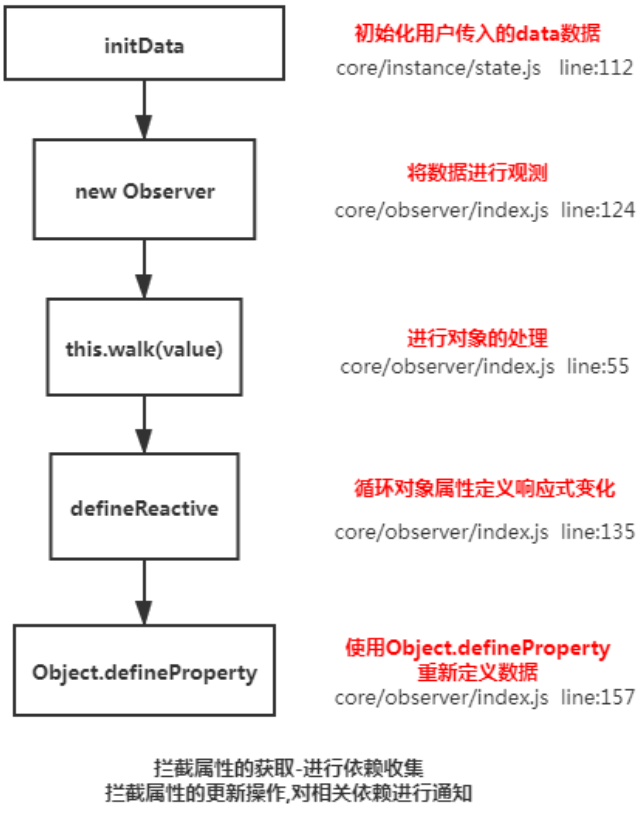

源码实现:
```js
// initState
function initState (vm: Component) {
  const opts = vm.$options
  if (opts.data) {
    initData(vm)
  }
}
// initData
function initData (vm: Component) {
  let data = vm.$options.data
  data = typeof data === 'function' ? getData(data, vm) : data || {}
  ...
  observe(data, true /* asRootData */)
}
// observe
export function observe (value, ...) {
  if (!isObject(value) || value instanceof VNode) {
    return
  }
  let ob = new Observer(value)
  ...
  return ob
}
// Observer
class Observer {
  constructor (value) {
    this.value = value
    this.dep = new Dep()
    if (Array.isArray(value)) { // 数组
      ...
    } else { // 对象
      this.walk(value)
    }
  }

  walk (obj: Object) {
    const keys = Object.keys(obj)
    for (let i = 0; i < keys.length; i++) {
      defineReactive(obj, keys[i])
    }
  }
}
// defineReactive
export function defineReactive (obj, key, val, shallow) {
  const dep = new Dep()
  ...
  if (arguments.length === 2) {
    val = obj[key]
  }

  let childOb = !shallow && observe(val) // 递归
  Object.defineProperty(obj, key, {
    enumerable: true,
    configurable: true,
    get: function reactiveGetter () {
      const value = val
      if (Dep.target) {
        dep.depend() // 依赖收集
        if (childOb) {
          childOb.dep.depend() // 子节点依赖收集
          if (Array.isArray(value)) {
            dependArray(value) // 数组依赖收集
          }
        }
      }
      return value
    },
    set: function reactiveSetter (newVal) {
      const value = val
      /* eslint-disable no-self-compare */
      if (newVal === value) {
        return
      }
      ...
      val = newVal
      childOb = !shallow && observe(newVal)
      dep.notify()
    }
  })
}
```
## 如何检测数组变化？
> 使用函数劫持的方式，重写了数组的方法(对数组进行了原型链重写，指向自定义的原型方法)。当调用数组 api 时，可以通知依赖更新。如果数组中包含着引用类型，会对数组中的引用类型再次进行监控。

流程如下:
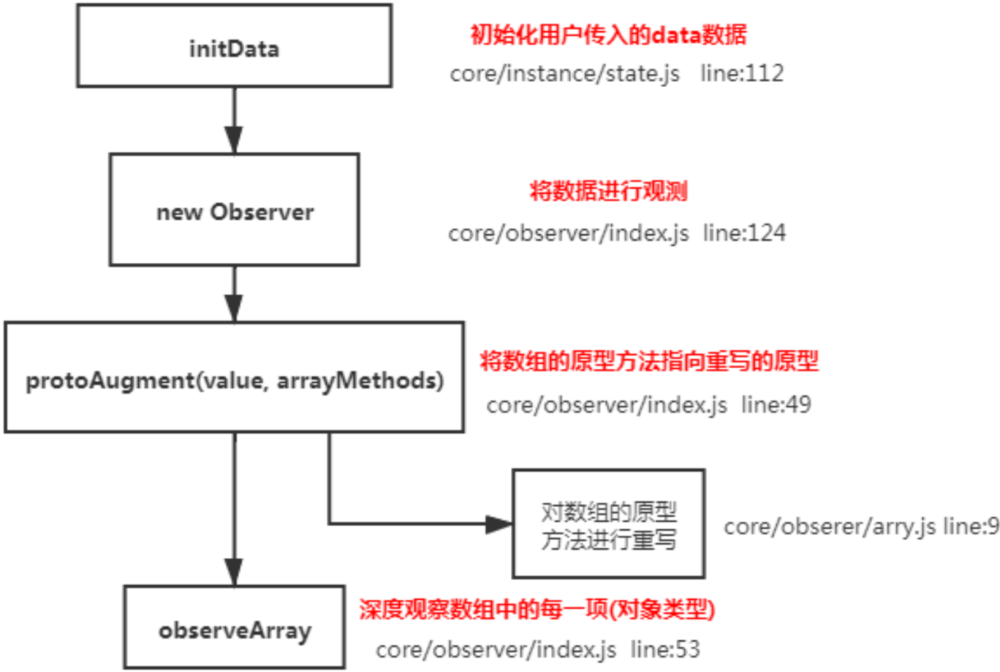

```js
class Observer {
  constructor (value) {
    this.value = value
    this.dep = new Dep()
    if (Array.isArray(value)) { // 数组
      protoAugment(value, arrayMethods)
      this.observeArray(value)
    } else {...}
  }

  observeArray (items: Array<any>) {
    for (let i = 0, l = items.length; i < l; i++) {
      observe(items[i])
    }
  }
}

function protoAugment (target, src) {
  target.__proto__ = src
}

const arrayProto = Array.prototype
const arrayMethods = Object.create(arrayProto)

const methodsToPatch = ['push', 'pop', 'shift', 'unshift', 'splice', 'sort', 'reverse']

methodsToPatch.forEach(function (method) {
  const original = arrayProto[method]
  def(arrayMethods, method, function mutator (...args) {
    const result = original.apply(this, args)
    const ob = this.__ob__
    let inserted
    switch (method) {
      case 'push':
      case 'unshift':
        inserted = args
        break
      case 'splice':
        inserted = args.slice(2)
        break
    }
    if (inserted) ob.observeArray(inserted)
    ob.dep.notify()
    return result
  })
})

// def
function def (obj, key, val, enumerable) {
  Object.defineProperty(obj, key, {
    value: val,
    enumerable: !!enumerable,
    writable: true,
    configurable: true
  })
}
```
## 插槽实现原理及使用场景？
> 可以让用户更好的对组件进行扩展和定制化，利用 slot 占位，在使用组件时，组件标签内部内容会分发到对应的 slot 中。

插槽分类及原理: 
- 1、具名插槽(默认插槽)
> 原理: 普通插槽是在父组件渲染完毕后，直接替换掉子组件中的slot占位符，本质是**替换**。

```vue
// 组件内插槽代码
<div>
  <slot name="header"></slot>
  <slot name="content"></slot>
</div>

// 编译结果如下
function render() {
  with(this) {
    return _c('div', [_t("header"), _t("content")], 2)
  }
}

// 组件使用
<Comp>
  <h1 slot="header">header</h1>
  <div slot="content">content</div>
</Comp>

// 编译结果如下
function render() {
  with(this) {
    return _c('Comp', [
      _c('h1', { attrs: { "slot": "header" }, slot: "header" }, [_v("header")]),
      _c('div', { attrs: { "slot": "content" }, slot: "content" }, [_v("content")])])
  }
}
```
- 2、作用域插槽
> 原理: 把父组件渲染内容编译成函数，子组件会调用该函数并传递数据，用函数的返回值替换 slot 占位符。作用域插槽可以向父级传递数据，拿到数据后再渲染对应内容。
```vue
// 组件内插槽代码
<div><slot :data="{ header: 'header', content: 'content' }"></slot></div>

// 编译结果如下
function render() {
  with(this) {
    return _c('div', [_t("default", null, {
      "data": { header: 'header', content: 'content' }
    })], 2)
  }
}

// 组件使用
<Comp>
  <template v-slot="{ data }">
    <h1>{{ data.header }}</h1>
    <div>{{ data.content }}</div>
  </template>
</Comp>

// 编译结果如下
function render() {
  with(this) {
    return _c('Comp', {
      scopedSlots: _u([{
        key: "default", fn: function ({ data }) {
          return [_c('h1', [_v(_s(data.header))]), _c('div', [_v(
            _s(data.content))])]
        }
      }])
    })
  }
}
```
## 双向绑定的实现原理？
> 双向绑定靠的是v-model指令，是 value + input 的语法糖(不严谨)
- 1、表单元素:

根据不同的标签解析出不同的语法，并且有额外的处理逻辑: 文本框(value+input)，复选框(checked+change)
```vue
<input v-model="val" />
// 编译结果如下: 会被解析成指令
function render() {
  with(this) {
    return _c('input', {
      directives: [{ name: "model", rawName: "v-model", value: (val), expression: "val" }],
      domProps: { "value": (val) },
      on: {
        "input": function ($event) {
          if ($event.target.composing) return; // 处理中文输入的问题
          val = $event.target.value
        }
      }
    })
  }
}
```
- 2、组件:
> 对组件而言 v-model 就是 value + input 的语法糖，用于组件中数组的双向绑定。属性名可以修改(通过model属性)
```vue
Vue.component('test', {
 model: { prop: 'checked', event: 'change' }
})
```
- 3、sync 修饰符的原理:
> v-model默认只能双向绑定一个属性，.sync修饰符可以绑定多个属性。vue3中.sync语法被移除。
```vue
<Comp :value.sync="val" :a.sync="a"/>
// 编译结果如下:
function render() {
  with(this) {
    return _c('Comp', {
      attrs: { "value": val,  "a": a },
      on: {
        "update:value": function ($event) {
          val = $event
        },
        "update:a": function ($event) {
          a = $event
        }
      }
    })
  }
}
```
## 自定义指令的的应用场景?
> 将操作 DOM 的逻辑进行复用。用户提前写好方法，元素被创建时会依次执行这些方法。

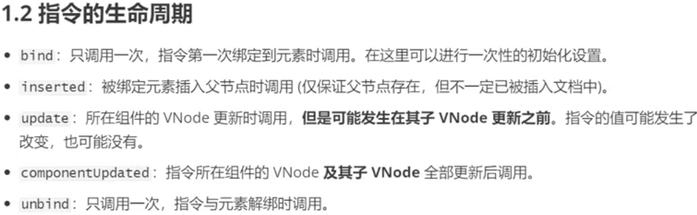

常见指令编写: v-loading、v-lazy、v-debounce、v-has、v-draggable、v-click-outside

## keep-alive使用场景?

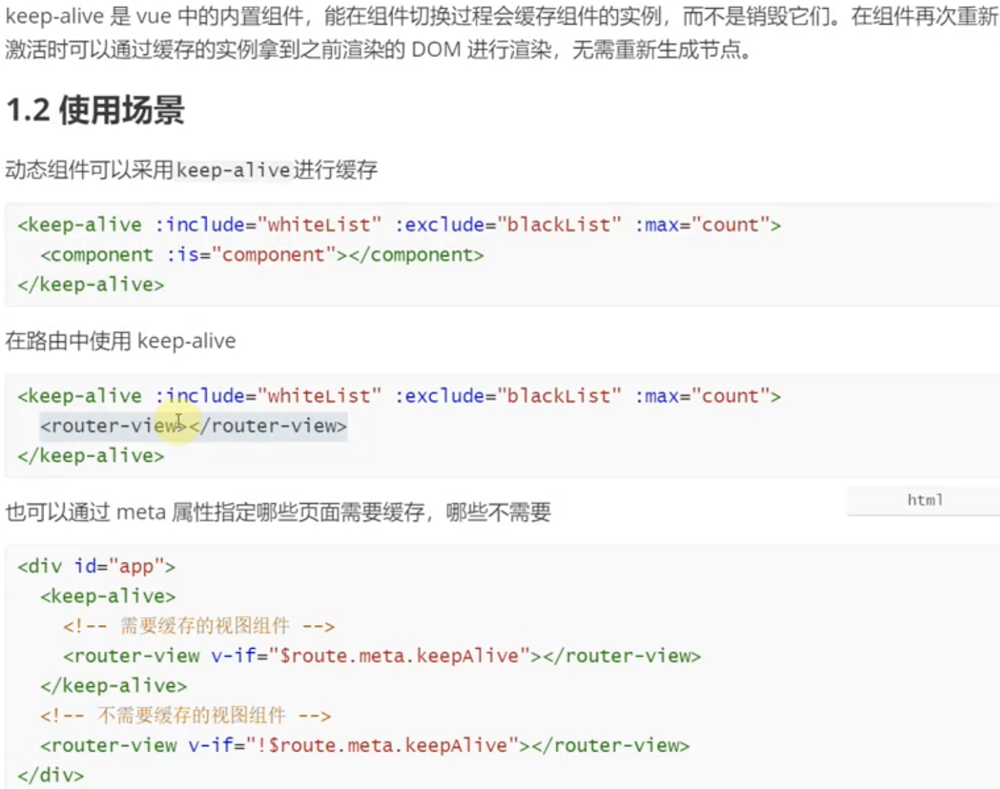

源码如下:
```js
function matches (pattern: string | RegExp | Array<string>, name: string): boolean {
  if (Array.isArray(pattern)) {
    return pattern.indexOf(name) > -1
  } else if (typeof pattern === 'string') {
    return pattern.split(',').indexOf(name) > -1
  } else if (isRegExp(pattern)) {
    return pattern.test(name)
  }

  return false
}

function pruneCacheEntry (cache, key, keys, current) {
  const cached = cache[key]
  if (cached && (!current || cached.tag !== current.tag)) {
    cached.componentInstance.$destroy()
  }
  cache[key] = null
  remove(keys, key)
}

const patternTypes: Array<Function> = [String, RegExp, Array]

export default {
  name: 'keep-alive',
  abstract: true,

  props: {
    include: patternTypes,
    exclude: patternTypes,
    max: [String, Number]
  },

  created () {
    this.cache = Object.create(null)
    this.keys = []
  },

  destroyed () {
    for (const key in this.cache) {
      pruneCacheEntry(this.cache, key, this.keys)
    }
  },

  mounted () {
    this.$watch('include', val => {
      pruneCache(this, name => matches(val, name))
    })
    this.$watch('exclude', val => {
      pruneCache(this, name => !matches(val, name))
    })
  },

  render () {
    const slot = this.$slots.default
    const vnode: VNode = getFirstComponentChild(slot)
    const componentOptions: ?VNodeComponentOptions = vnode && vnode.componentOptions
    if (componentOptions) {
      const name: ?string = getComponentName(componentOptions)
      const { include, exclude } = this
      if (
        // not included
        (include && (!name || !matches(include, name))) ||
        // excluded
        (exclude && name && matches(exclude, name))
      ) {
        return vnode
      }

      const { cache, keys } = this
      const key: ?string = vnode.key == null
        // same constructor may get registered as different local components
        // so cid alone is not enough (#3269)
        ? componentOptions.Ctor.cid + (componentOptions.tag ? `::${componentOptions.tag}` : '')
        : vnode.key
      if (cache[key]) {
        vnode.componentInstance = cache[key].componentInstance
        // make current key freshest
        remove(keys, key)
        keys.push(key)
      } else {
        cache[key] = vnode
        keys.push(key)
        // prune oldest entry
        if (this.max && keys.length > parseInt(this.max)) {
          pruneCacheEntry(cache, keys[0], keys, this._vnode)
        }
      }

      vnode.data.keepAlive = true
    }
    return vnode || (slot && slot[0])
  }
}
```
[源码链接](https://dingqiangqiang.github.io/vue/extend/keep-alive.html)

[LRU算法实现](https://blog.csdn.net/weixin_51431277/article/details/129939296)

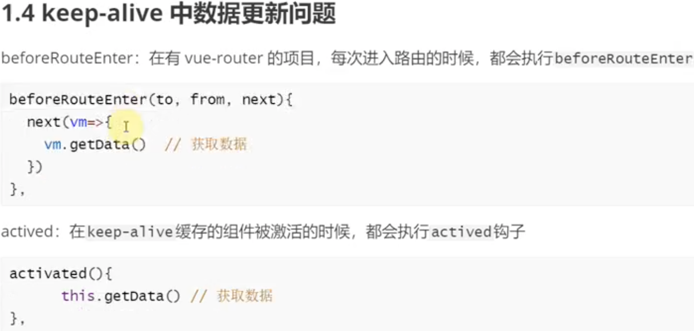
## nextTick 实现原理?
> 在下次 DOM 更新循环结束之后执行延迟回调。在修改数据之后立即使用这个方法，获取更新后的 DOM。

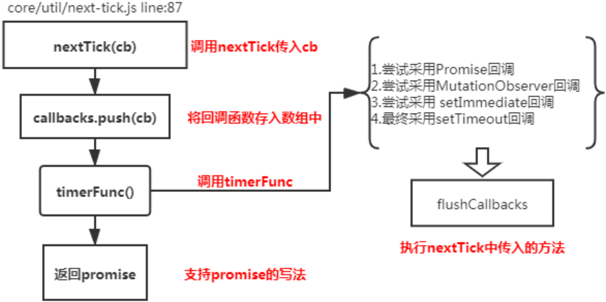

[源码链接](https://dingqiangqiang.github.io/vue/reactive/next-tick.html)
## Vue 中的设计模式?

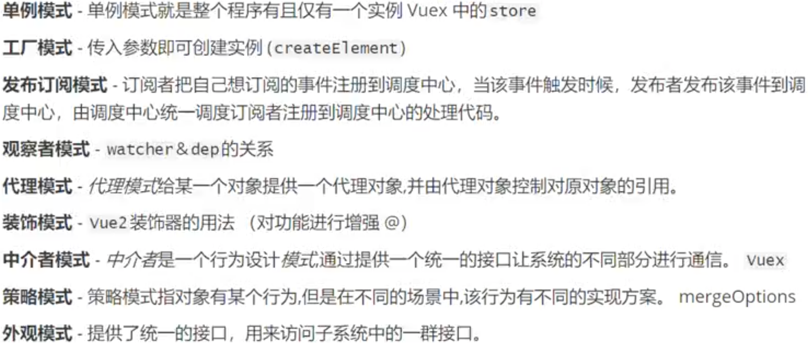
## Vue 中的性能优化?

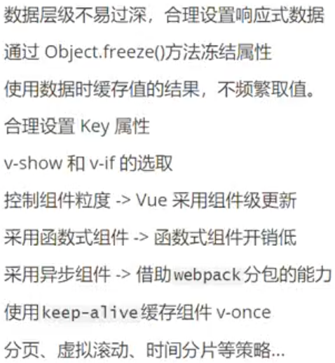
## 单页应用首屏加载速度慢的解决方案?

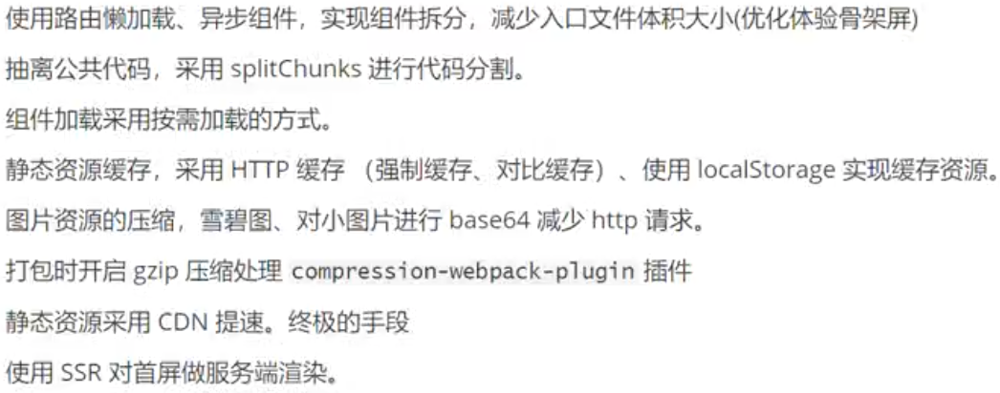
## 项目中如何解决跨域？

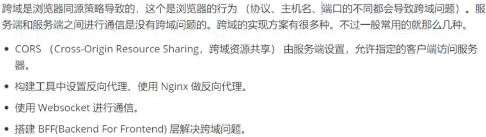

websocket无跨域问题
## axios 封装

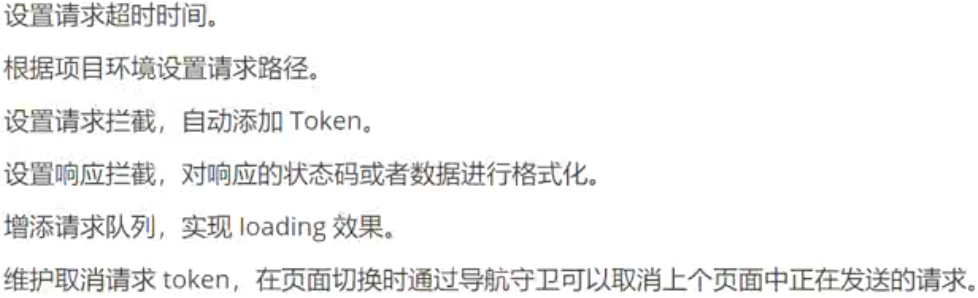
## 权限校验(菜单、按钮)

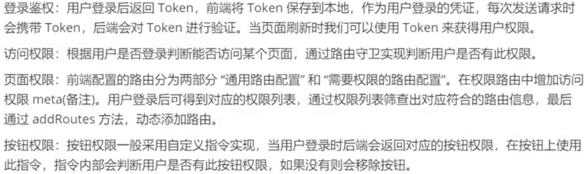
## Vue-Router 钩子函数及执行流程
[完整的导航解析流程](https://router.vuejs.org/zh/guide/advanced/navigation-guards.html)

- 1、导航被触发。
- 2、在失活的组件里调用 `beforeRouteLeave` 守卫。
- 3、调用全局的 `beforeEach` 守卫。
- 4、在重用的组件里调用 `beforeRouteUpdate` 守卫(2.2+)。
- 5、在路由配置里调用 `beforeEnter`。
- 6、解析异步路由组件。
- 7、在被激活的组件里调用 `beforeRouteEnter`。
- 8、调用全局的 `beforeResolve` 守卫(2.5+)。
- 9、导航被确认。
- 10、调用全局的 `afterEach` 钩子。
- 11、触发 DOM 更新。
- 12、调用 `beforeRouteEnter` 守卫中传给 next 的回调函数，创建好的组件实例会作为回调函数的参数传入。

代码如下
```js
const queue: Array<?NavigationGuard> = [].concat(
  extractLeaveGuards(deactivated),
  this.router.beforeHooks,
  extractUpdateHooks(updated),
  activated.map(m => m.beforeEnter),
  resolveAsyncComponents(activated)
)

runQueue(queue, iterator, () => {
  ...
  const enterGuards = extractEnterGuards(activated, postEnterCbs, isValid)
  const queue = enterGuards.concat(this.router.resolveHooks)
  runQueue(queue, iterator, () => {
    ...
    onComplete(route)
    if (this.router.app) {
      this.router.app.$nextTick(() => {
        postEnterCbs.forEach(cb => { cb() })
      })
    }
  })
})
```
## Vue-Router 几种模式的区别?

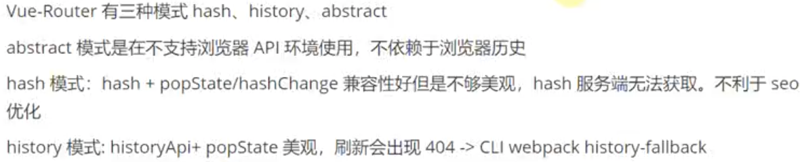

hash模式:

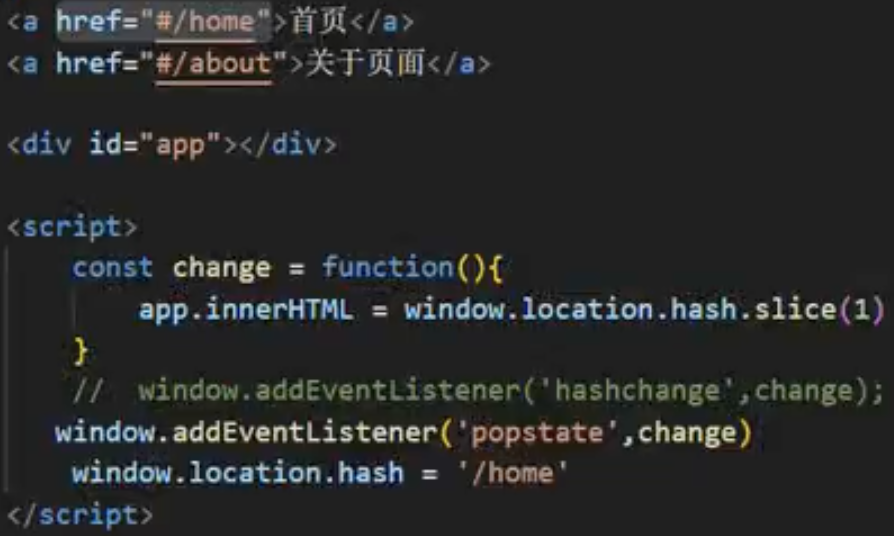

history模式:

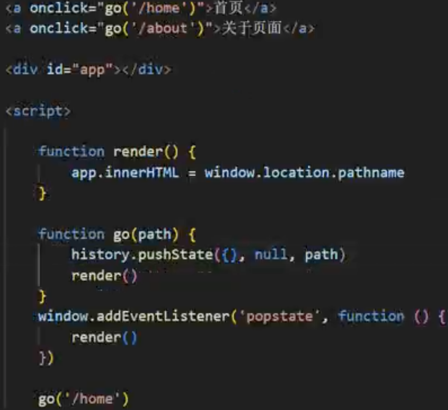

## 项目部署到服务器报 404?
> history 模式刷新时会向服务端发起请求，服务端无法响应到对应的资源，所以出现了 404。

解决方案: 服务端返回项目首页，浏览器接收后，会根据路径匹配到对应组件进行渲染。

[服务器配置示例](https://router.vuejs.org/zh/guide/essentials/history-mode.html#%E6%9C%8D%E5%8A%A1%E5%99%A8%E9%85%8D%E7%BD%AE%E7%A4%BA%E4%BE%8B)
## 对 Vuex 的理解
> 专为 Vue.js 应用程序开发的状态管理模式。采用集中式存储管理应用的所有组件的状态，并以相应的规则保证状态以一种可预测的方式发生变化。

::: tip 原理
vuex3: 通过 new Vue() 创建 vue 实例，进行数据共享

vuex4: 通过 reactive 创建响应式对象进行数据共享
:::
运作流程:


修改状态的方式:
- 1、组件中 commit -> mutation -> 修改 state

- 2、组件中 dispatch -> action(封装公共逻辑，解决复用问题) -> commit -> mutation -> 修改 state

缺陷:

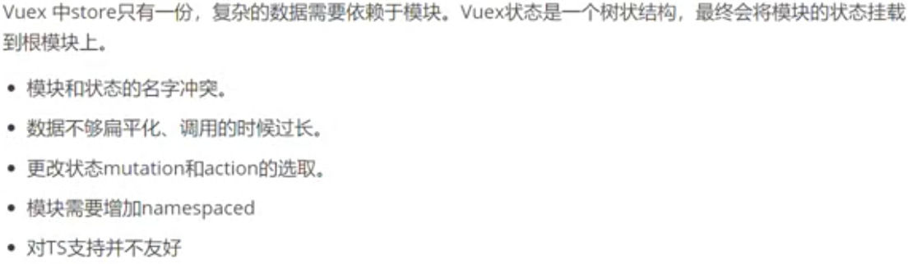
## 如何监听 vuex 中的数据变化?
- 1、watch

- 2、store.subscribe

源码如下
```js
class Store {
  constructor (options = {}) {
    ...
    this._subscribers = []
  }

  subscribe (fn) {
    return genericSubscribe(fn, this._subscribers)
  }

  commit (_type, _payload, _options) {
    ...
    this._subscribers.forEach(sub => sub(mutation, this.state))
  }
}

function genericSubscribe (fn, subs) {
  if (subs.indexOf(fn) < 0) {
    subs.push(fn)
  }
  return () => {
    const i = subs.indexOf(fn)
    if (i > -1) {
      subs.splice(i, 1)
    }
  }
}
```
