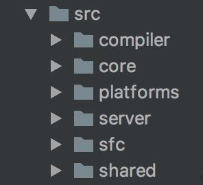
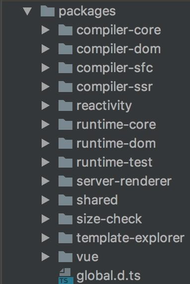
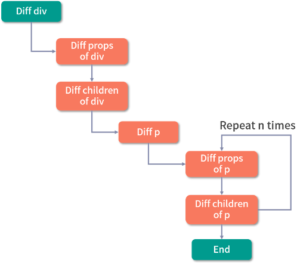
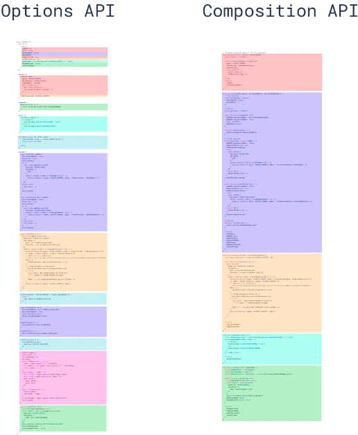

# Vue.js 3.0 的优化
## 源码
源码优化主要体现在使用 `monorepo` 和 `TypeScript` 管理和开发源码，可以提升代码可维护性，让代码更易于开发和维护。
### 更好的代码管理方式
2.x 源码托管在 `src` 目录，依据功能做了以下拆分:
| 目录名           | 含义      
| -------------     | :-----------
| compiler          |   模板编译 
| core      |   与平台无关的通用运行时代码
| platforms |   平台专有代码
| server      |   服务端渲染
| sfc      |   .vue 单文件解析相关代码
| shared |   共享工具代码



3.x 源码通过 `monorepo` 方式维护，根据功能将不同的模块拆分到 `packages` 目录下面不同的子目录中：

每个模块有各自的 `API`、类型定义和测试，使得模块拆分更细化，职责划分更明确，模块之间的依赖关系也更加明确，开发人员也更容易阅读、理解和更改所有模块源码，提高代码的可维护性。

另外 `reactivity` 是可以独立于 `Vue.js` 使用的，如果用户只想使用3.0的响应式能力，可以单独依赖这个响应式库而不用去依赖整个 `Vue.js`，减小了引用包的体积大小，而 2.x 是做不到这一点的。
###  更好的 TypeScript 支持
3.x 源码采用了 `TypeScript` 开发。由于 `TypeScript` 提供了更好的类型检查，能支持复杂的类型推导，省去了单独维护 `d.ts` 文件的麻烦。

::: danger Flow 的不足
`Flow` 是 `Facebook` 出品的 `js` 静态类型检查工具，它可以以非常小的成本对已有的 `js` 代码迁入，非常灵活，这也是 2.x 当初选型它时一方面的考量。但是 `Flow` 对于一些复杂场景类型的检查，支持得并不好。

2.x 源码在在组件更新 `props` 的地方出现了对 `Flow` 的吐槽: 
```js
const propOptions: any = vm.$options.props // wtf flow?
```

由于 `Flow` 没有正确推导出 `vm.$options.props` 的类型 ，开发人员不得不强制声明 `propsOptions` 的类型为 `any`，显得很不合理。
:::

## 性能
### 源码体积优化
- 移除一些冷门的 `feature`(如 `filter`、`inline-template` 等)
- 引入 `tree-shaking`，减少打包体积。
:::warning 原理
依赖 ES2015 模块语法的静态结构（即 `import` 和 `export`），通过编译阶段的静态分析，找到没有引入的模块并打上标记。

压缩阶段会利用如 `uglify-js`、`terser` 等压缩工具真正地删除没有用到的代码。
:::

举个例子，`math` 模块定义了 2 个方法 `square` 和 `cube`
```js
export function square(x) {
  return x * x
}
export function cube(x) {
  return x * x * x
}
```
只引入了 `cube` 方法并使用
```js
import { cube } from './math.js'
console.log(cube(1))
```
`math` 模块被 `webpack` 打包生成如下代码：未被引入的 `square` 函数被打上了标记
```js
(function(module, __webpack_exports__, __webpack_require__) {
  'use strict';
  /* unused harmony export square */
  /* harmony export (immutable) */ __webpack_exports__['a'] = cube;
  function square(x) {
    return x * x;
  }
  function cube(x) {
    return x * x * x;
  }
})
```
### 数据劫持优化
实现前提: 必须劫持数据的访问和更新。

2.x 通过 `Object.defineProperty` 来劫持数据的 `getter` 和 `setter`，具体是这样的：
```js
Object.defineProperty(data, 'a',{
  get () {// track
  },
  set () { // trigger
  }
})
```
::: danger 缺陷
- 必须要预先知道要拦截的 `key` 值，因此不能检测对象属性的添加和删除(虽然 `Vue.js` 提供了 `$set` 和 `$delete`，不过对于用户来说，还是增加了一定的心智负担）
- 对于嵌套层级比较深的对象，如果要劫持它内部深层次的对象变化，就需要递归遍历这个对象，执行 `Object.defineProperty` 把每一层对象都变成响应式。如果用户定义的响应式数据过于复杂，此时会有相当大的性能负担。
::: 
3.x 使用了 `Proxy` 来做数据劫持，具体是这样的：
```js
const proxy = new Proxy(data, {
  get () {// track
  },
  set() { // trigger
  }
})
```
::: tip 优势
- 由于劫持的是整个对象，因此对于对象属性的增加和删除都能检测到。
- 由于 `Proxy` 并不能监听内部深层次的对象变化，3.x 实现了在 `getter` 中去递归响应式。只有真正访问到的内部对象才会变成响应式，而不是无脑递归，这样无疑在很大程度上提升了性能。
::: 
### 编译优化
通过数据劫持和依赖收集，2.x 的数据更新并触发重新渲染的粒度是组件级的。虽然能保证触发更新的组件最小化，但在单个组件内部依然需要遍历该组件的整个 `vnode` 树。举个例子，比如我们要更新这个组件：
```vue
<template>
  <div id="content">
    <p class="text">static text</p>
    <p class="text">static text</p>
    <p class="text">{{ message }}</p>
    <p class="text">static text</p>
    <p class="text">static text</p>
  </div>
</template>
```
整个 diff 过程如图所示：

由于这段代码中只有一个动态节点，所以这里有很多 `diff` 和遍历其实都是不需要的，这就导致了 `vnode` 的性能跟模版大小正相关，跟动态节点的数量无关，当一些组件的整个模版内只有少量动态节点时，这些遍历都是性能的浪费。

对于上述例子，理想状态只需要 `diff` 这个绑定 `message` 动态节点的 `p` 标签即可。

3.x 通过编译阶段对静态模板的分析，编译生成了 `Block tree`。它是一个将模版基于动态节点指令切割的嵌套区块，每个区块内部的节点结构是固定的，而且每个区块只需要以一个 `Array` 来追踪自身包含的动态节点。借助 `Block tree`，Vue.js 将 `vnode` 更新性能由与模版整体大小相关提升为与动态内容的数量相关，这是一个非常大的性能突破。

除此之外，3.x 在编译阶段还包含了对 `slot` 的编译优化、事件侦听函数的缓存优化，另外在运行时重写了 `diff` 算法。

## 语法
### 优化逻辑组织
:::warning options vs Composition
`options`: 写法非常符合直觉思维，依照 `methods`、`computed`、`data`、`props` 进行分类。当组件小的时候，这种方式一目了然。在大型组件中，一个组件可能有多个逻辑关注点，此时每一个关注点都有自己的 `options`，如果需要修改一个逻辑点关注点，就需要在单个文件中不断上下切换和寻找。

`composition`: 1、将某个逻辑关注点相关的代码放在一个函数里。当需要修改一个功能时，不在需要在文件中跳来跳去。2、更好的类型支持(因为它们都是函数，在函数调用时，自然所有的类型就被推导出来了) 3、对 `tree-shaking` 友好，代码更容易压缩。
:::
通过下图，我们可以很直观地感受到 `Composition` 在逻辑组织方面的优势：


### 优化逻辑复用
2.x 通常会用 `mixins` 去复用逻辑，使用单个 `mixin` 似乎问题不大，但是当一个组件混入大量不同的 `mixins` 的时候，会带来两个非常明显的问题：**命名冲突和数据来源不清晰**。
> 命名冲突：每个 `mixin` 都可以定义自己的 `props`、`data`，它们之间是无感的，因此很容易定义相同的变量，导致命名冲突。

> 数据来源不清晰: 对组件而言，如果模板中使用不在当前组件中定义的变量，那么就不太容易知道这些变量是在哪里定义的。

- 用 `mixin` 的方式来复用侦听鼠标位置的例子，
```js
const mousePositionMixin = {
  data() {
    return {
      x: 0,
      y: 0
    }
  },
  mounted() {
    window.addEventListener('mousemove', this.update)
  },
  destroyed() {
    window.removeEventListener('mousemove', this.update)
  },
  methods: {
    update(e) {
      this.x = e.pageX
      this.y = e.pageY
    }
  }
}

export default mousePositionMixin
```
- 在组件中使用
```vue
<template>
  <div>
    Mouse position: x {{ x }} / y {{ y }}
  </div>
</template>

<script>
  import mousePositionMixin from './mouse'
  export default {
    mixins: [mousePositionMixin]
  }
</script>
```
在 3.x 中我们可以通过自定义 `hook` 的方式定义 `useMousePosition` 函数：
```js
import { ref, onMounted, onUnmounted } from 'vue'

export default function useMousePosition() {
  const x = ref(0)
  const y = ref(0)
  const update = e => {
    x.value = e.pageX
    y.value = e.pageY
  }
  onMounted(() => {
    window.addEventListener('mousemove', update)
  })
  onUnmounted(() => {
    window.removeEventListener('mousemove', update)
  })

  return { x, y }
}
```
在组件中使用
```vue
<template>
  <div>
    Mouse position: x {{ x }} / y {{ y }}
  </div>
</template>
<script>
  import useMousePosition from './mouse'

  export default {
    setup() {
      const { x, y } = useMousePosition()
      return { x, y }
    }
  }
</script>
```
可以看到，整个数据来源清晰了，即使去编写更多的 `hook`，也不会出现命名冲突的问题。
:::tip 总结
`Composition` 属于 `API` 的增强，它并不是 3.x 版本组件开发的范式，如果组件足够简单，我们还是可以继续使用 `Options API` 的。
:::
### 引入 RFC
**保证每个版本改动可控**
::: tip 简介
全称 `Request For Comments`。旨在为新功能进入框架提供一个一致且受控的路径。当社区有一些新需求的想法时，可以提交一个 `RFC`，然后由社区和 `Vue.js` 核心团队一起讨论，如果这个 `RFC` 最终被通过了，那么它才会被实现。
:::
3.x 目前已被实现并合并的 `RFC` 都在[这里](https://github.com/vuejs/rfcs/pulls?q=is%3Apr+is%3Amerged+label%3A3.x)，通过阅读它们，你也可以大致了解 3.0 的一些变化，以及为什么会产生这些变化，帮助你了解它的前因后果。