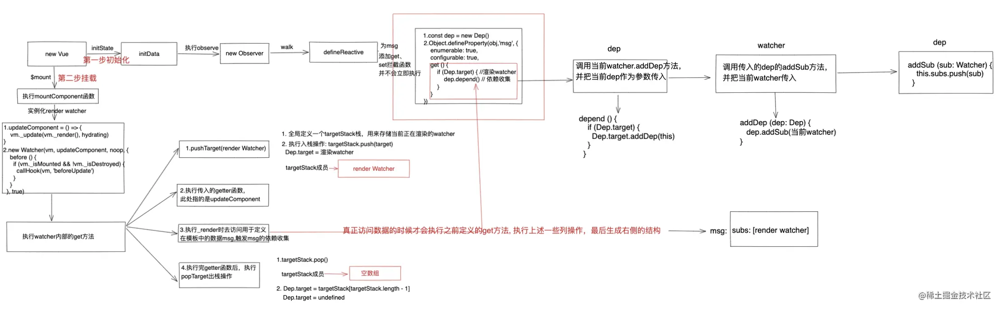
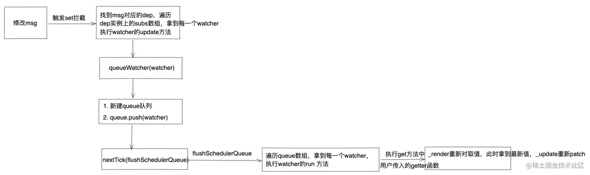
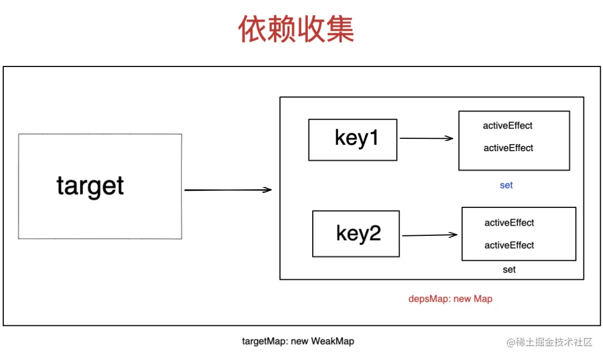

# 响应式原理

## Vue2

### 依赖收集

### 派发更新


[戳我 -> 掘金链接](https://juejin.cn/post/7123575720973959182)

## Vue3

### 依赖收集


[戳我 -> 掘金链接](https://juejin.cn/post/7142119932283600903)

## Vue2 响应式简版
```html
...
<body>
  <div id="app"></div>
  <script>
    const target = { count: 0, count1: 10 }
    const targetStack = []

    function isObject(value) {
      return typeof value === 'object' && value !== null 
    }
    
    // Dep: 收集 watcher
    class Dep {
      constructor() {
        this.subs = []
      }
      depend(watcher) {
        this.subs.push(watcher)
      }
      notify() {
        const subs = this.subs.slice()
        for (let i = 0, l = subs.length; i < l; i++) {
          subs[i].update()
        }
      }
    }

    Dep.target = null
    
    // 响应式数据初始化
    function observe (data) {
      if (!isObject(data)) {
        return data
      }
      walk(data)
    }

    function walk (data) {
      Object.keys(data).forEach(key => {
        defineReactive(data, key)
      })
    }

    function defineReactive(target, key) {
      let value = target[key]
      const dep = new Dep()

      Object.defineProperty(target, key, {
        get() {
          if (Dep.target) {
            dep.depend(Dep.target)
          }
          return value
        },
        set(newVal) {
          value = newVal
          dep.notify()
        }
      })
    }

    function pushTarget(watcher) {
       targetStack.push(watcher)  
       Dep.target = watcher
    }

    function popTarget() {
      targetStack.pop()   
      Dep.target = targetStack[targetStack.length - 1]
    }

    // Watcher 
    class Watcher {
      constructor(fn) {
        this.fn = fn
        this.get()
      }
      get () {
        pushTarget(this)  
        let value
        try {
          value = this.fn()
        } finally {   
          popTarget()
        }
        return value
      } 
      update () {
        this.get()
      }
    }

    observe(target)
    
    new Watcher(() => {
      app.innerHTML = `展示${target.count}`
    })
    
    // 2秒后 修改数据
    setTimeout(() => {
      target.count = 10
    }, 2000)

  </script>
</body>
...
```

## Vue3 响应式简版

- 1、Proxy 简版
```html
...
<body>
  <div id="app"></div>
  <script>
    const reactiveMap = new WeakMap()
    const targetMap = new WeakMap()
    const effectStack = []

    const target = { count: 0, count1: 10 }

    function isObject(value) {
      return typeof value === 'object' && value !== null 
    }
    
    function reactive(target) {
      if (!isObject(target)) {
        console.warn(`value cannot be made reactive: ${String(target)}`);
        return 
      }

      const existProxy = reactiveMap.get(target)
      if (existProxy) {
        return existProxy
      }

      const proxy = new Proxy(target, {
        get: function get(target, key, receiver) { 
          // proxy.key 知晓数据被访问
          const ret = Reflect.get(target, key, receiver)
          track(target, key)
          return ret
        },
        set: function set(target, key, value, receiver) { 
          // proxy.key = newVal 知晓数据被更改
          const result = Reflect.set(target, key, value, receiver)
          trigger(target, key)
          return result
        },
      })

      reactiveMap.set(target, proxy)

      return proxy
    }

    // track: 依赖收集(简版)
    function track(target, key) {
      if (!activeEffect) return;
      let depsMap = targetMap.get(target);
      if (!depsMap) {
        targetMap.set(target, (depsMap = new Map()));
      }
      let dep = depsMap.get(key);
      if (!dep) {
        depsMap.set(key, (dep = new Set()));
      }
      if (!dep.has(activeEffect)) {
        dep.add(activeEffect);
      }
    }

    // trigger: 派发更新(简版)
    function trigger(target, key) {
      let depsMap = targetMap.get(target);
      if (!depsMap) return
      let dep = depsMap.get(key)
      if (dep) {
        dep.forEach(effect => {
          effect()
        })
      }
    }
    
    // 使用高阶函数来模拟 vue3.0 中的 activeEffect
    function wrapper(fn) {
      const wrappered = function () {
        activeEffect = fn
        fn()
      }
      return wrappered
    }

    
    // 测试
    const state = reactive(target)
    
    function printCount() {
      app.innerHTML = `展示${state.count}`
    }

    const wrappered = wrapper(printCount)
    wrappered()

    // 2秒后 修改数据
    setTimeout(() => {
      state.count = 10
    }, 2000)
    
  </script>
</body>
...
```
- 2、Proxy 衍进版

> 新增 `ReactiveEffect` 替代高阶函数，新增 stack 管理嵌套 effect 场景
```html
...
<body>
  <div id="app"></div>
  <script>
    let activeEffect

    const reactiveMap = new WeakMap()
    const targetMap = new WeakMap()
    const effectStack = []

    const target = { count: 0, count1: 10 }

    function isObject(value) {
      return typeof value === 'object' && value !== null 
    }
    
    function reactive(target) {
      if (!isObject(target)) {
        console.warn(`value cannot be made reactive: ${String(target)}`);
        return 
      }

      const existProxy = reactiveMap.get(target)
      if (existProxy) {
        return existProxy
      }

      const proxy = new Proxy(target, {
        get: function get(target, key, receiver) { 
          // proxy.key 知晓数据被访问
          const ret = Reflect.get(target, key, receiver)
          track(target, key)
          return ret
        },
        set: function set(target, key, value, receiver) { 
          // proxy.key = newVal 知晓数据被更改
          const result = Reflect.set(target, key, value, receiver)
          trigger(target, key)
          return result
        },
      })

      reactiveMap.set(target, proxy)

      return proxy
    }

    // track: 依赖收集(简版)
    function track(target, key) {
      if (!activeEffect) return;
      let depsMap = targetMap.get(target);
      if (!depsMap) {
        targetMap.set(target, (depsMap = new Map()));
      }
      let dep = depsMap.get(key);
      if (!dep) {
        depsMap.set(key, (dep = new Set()));
      }
      if (!dep.has(activeEffect)) {
        dep.add(activeEffect);
      }
    }

    // trigger: 派发更新(简版)
    function trigger(target, key) {
      let depsMap = targetMap.get(target);
      if (!depsMap) return
      let dep = depsMap.get(key)
      if (dep) {
        dep.forEach(effect => {
          effect.run()
        })
      }
    }
    
    
    class ReactiveEffect {
      constructor(fn) {
        this.fn = fn
      }
      run () {
        try {
          effectStack.push(this)
          activeEffect = this;
          return this.fn();
        }  finally {
          effectStack.pop()
          activeEffect = effectStack[effectStack.length-1]
        }
      }
    }
    function effect(fn) {
      const _effect = new ReactiveEffect(fn)
      _effect.run()
    }

    
    // 测试
    const state = reactive(target)
    
    effect(() => {
      app.innerHTML = `展示${state.count}`
    })

    // 2秒后 修改数据
    setTimeout(() => {
      state.count = 10
    }, 2000)
  </script> 
</body>
...
```
[戳我 -> 掘金链接](https://juejin.cn/post/7143631606777905189)