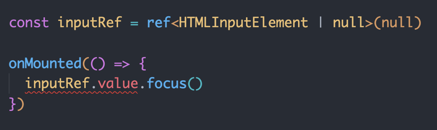

# 语法糖
3.2最新的使用方式
```vue
<script setup lang="ts">
  import { ref, computed } from 'vue'

  const count = ref(0)
  const doubleCount = computed(() => {
    return count.value * 2
  })
</script>

<template>
  <p>{{ count }}</p>
  <p>{{ doubleCount }}</p>
</template>
```
## defineProps
- 作用: 确保传递的 prop 类型校验正确；组件内部使用的时候会有类型提示
- 普通声明
```vue
<script setup lang="ts">
  defineProps({
    msg: { type: String, default: 'hello' },
    list: Array
  })
</script>
```
- 类型声明
```vue
<script setup lang="ts">
  type Props = {
    msg: string,
    list: Array<number>
  }
  const props = defineProps<Props>()
</script>
```
- 设置默认值
```vue
<script setup lang="ts">
  type Props = {
    msg: string,
    list: Array<number>
  }
  const props = withDefaults(defineProps<Props>(), {
    msg: 'vue',
    list: () => [1, 2]
  })
</script>
```
## defineEmits
- 作用：约束事件名称并给出自动提示，确保不会拼写错误；同时约束传参类型，不会发生参数类型错误

1、定义子组件 `son.vue`
```vue
<script setup lang="ts">
  type Emits = {
    (name: 'dispatch', payload: string) :void
  }
  const emit = defineEmits<Emits>()
  const click = () => {
    emits('dispatch', '子组件提交的数据')
  }
</script>

<template>
  <button @click="click">点击</button>
</template>
```
2、父组件引入

```vue
<script setup lang="ts">
  import Son from './son.vue'
  const handleDispatch = (msg: string) => {
    console.log(msg, 'msg')
  }
</script>

<template>
  <Son @dispatch="handleDispatch"></Son>
</template>
```
## useSlots 
```vue
<template>
  <Son>
    <template #header>
      <h1>我是父组件插槽</h1>
    </template>
  </Son>
</template>
```
定义子组件 `son.vue`
```vue
<script setup lang="ts">
  import { useSlots } from 'vue'
  const slots = useSlots()
</script>

<template>
  <slot name = "header" />
</template>
```
## useAttrs
父组件传递给子组件的属性(除了 `props`)
```vue
<template>
  <Son a="1" b="2" msg="hello">
    <template #header>
      <h1>我是父组件插槽</h1>
    </template>
  </Son>
</template>
```

定义子组件 `son.vue`
```vue
<script setup lang="ts">
  import { useSlots, useAttrs } from 'vue'
  defineProps({
    msg: String
  })
  const slots = useSlots()
  const attrs = useAttrs() // 不包含 msg
</script>

<template>
  <slot name="header" />
</template>
```
## defineExpose
有时候我们想获取组件内的属性和方法，只有给组件标注类型才能获取智能提示

定义子组件 `son.vue`
```vue
<script setup lang="ts">
  import { ref } from 'vue'

  const msg = ref('msg')
  const handle = () => {}

  defineExpose({
    msg,
    handle
  })
</script>
```
父组件引入 
```vue
<script setup lang="ts">
  import Son from './son.vue'
  import { ref, onMounted } from 'vue'

  const child = ref(null)
  onMounted(() => {
    child.value.handle()
  })

</script>

<template>
  <Son ref="child">点击</Son>
</template>
```
## ref
- 为 ref 标注类型后，既可以在给 ref 对象的 value 赋值时校验数据类型，同时在使用 value 的时候获得代码提示。

- **本质是给 ref 对象的 value 属性添加类型约束**。
```vue
<script setup lang="ts">
  import { ref } from 'vue'

  type list = { name: string, age: number }
  const data = ref<list[]>([{ name: 'haha', age: 20 }])
</script>

<template>
  <div class="about">
    <ul>
      <li v-for="item in data" :key="item.name">{{ item.age }}</li>
    </ul>
  </div>
</template>
```
## reactive
- 为 reactive 标注类型后，既可以在响应式对象修改属性值的时候约束类型，也可以在使用时获得代码提示

```vue
<script setup lang="ts">
  import { reactive } from 'vue'

  type Form = { username: string, password: string }
  const form: Form = { username: '张三', password: '123456' }
</script>
```
## 事件处理函数添加类型
- 原生 dom 事件处理函数的参数默认会自动标注为 any 类型，没有任何类型提示，为了获得良好的类型提示，需要手动标注类型
```vue
<script setup lang="ts">
  const handleChange = (e: Event) => { // e 默认推断为 any 类型
    console.log((e.target as HTMLInputElement).value)
  }
</script>

<template>
  <div>
    <input type="text" @change="handleChange">
  </div>
</template>
```
## 为模版引用标注类型
- 为模版引用标注类型，本质上是给 ref 对象的 value 属性添加类型约束，约定 value 属性中存放的是特定类型的 DOM 对象，从而在使用时获得相应的代码提示

```vue
<script setup lang="ts">
import { ref, onMounted } from 'vue'
const inputRef = ref<HTMLInputElement | null>(null)

onMounted(() => {
  inputRef.value?.focus()
})
</script>

<template>
  <div>
    <input type="text" ref="inputRef">
  </div>
</template>
```
## 给组件模板标注类型
- 有时候我们想获取一个模板，并且想调用模板内的属性和方法，这时候如果给组件模板标注了类型才能获取智能提示
```vue
<script setup lang='ts'>
import { ref } from 'vue'
const showDialog = ref(false)

const open = () => {
  showDialog.value = true
}
const close = () => {
  showDialog.value = false
}
defineExpose({
  open
})
</script>

<template>
  <div class="modal" v-if="showDialog">
    <div class="content">
      <button @click="close">关闭弹框</button>
    </div>
  </div>
</template>
```
父组件引入
```vue
<script setup lang="ts">
import Modal from './components/Modal.vue'
import { ref } from 'vue'
// 1.为了获取 Modal 类型，首先通过 typeof 得到其类型
// 2.使用 ts 内置的 InstanceType 来获取其实例类型
const modalRef = ref<InstanceType<typeof Modal> | null>(null)
const openDialog = () => {
  modalRef.value?.open()
}
</script>

<template>
  <div>
    <modal ref="modalRef"></modal>
    <button @click="openDialog">打开弹框</button>
  </div>
</template>

<style scoped></style>
```
## 空值检查
- 当对象的属性可能是 null 或 undefined 的时候，称之为“空值”，尝试访问空值身上的属性或者方法会发生类型错误(下图)


```js
// 1、可选链
inputRef.value?.focus()
// 2、逻辑判断
if (inputRef.value) { inputRef.value.focus() }
// 3、非空断言
inputRef.value!.focus()
```