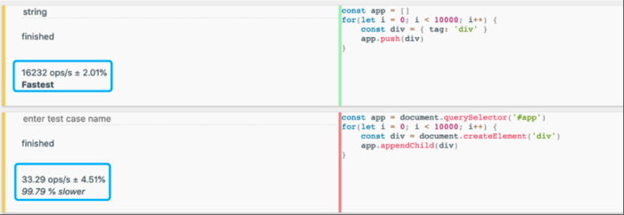
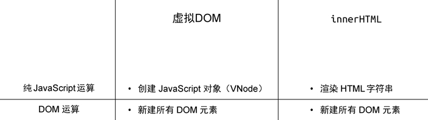
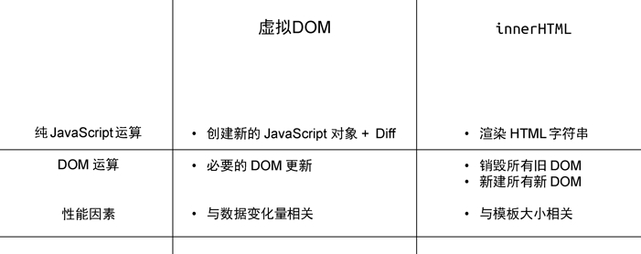
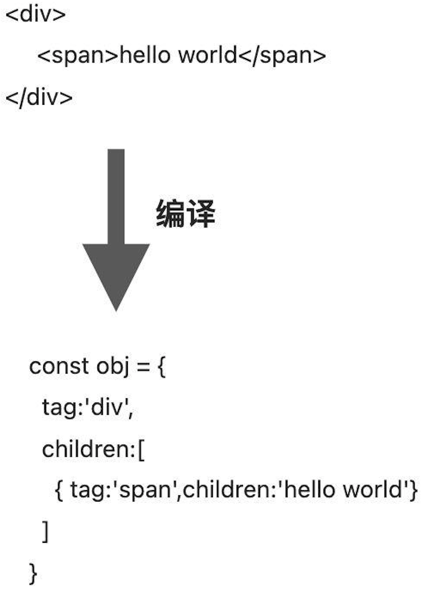
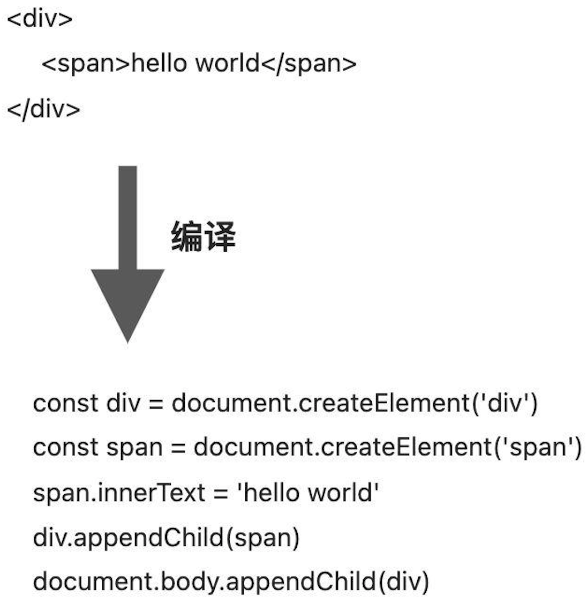

# 权衡的艺术
**框架的设计过程其实是一个不断取舍的过程**
<!-- 框架的设计过程其实是一个不断在**可维护性和性能**之间进行取舍的过程。 -->

## 编程范式
- 1、**命令式**

特点：**关注过程** 

例如: 获取 `id` 为 `app` 的 `div` 标签，它的文本内容为 `hello world`，为其绑定点击事件，当点击时弹出提示: `ok`
```js
const divEle = document.querySelector('#app')
divEle.innerText = 'hello world'
divEle.addEventListener('click', function () {
  alert('click')
})
```
自然语言描述能够与代码产生一一对应的关系，**代码本身描述的是做事的过程**。
- 2、**声明式**

特点：**关注结果**。

用 `Vue.js` 实现如上功能：
```vue
<div @click="() => alert('ok')">hello world</div>
```

可以看到，我们提供的是一个"结果"，至于如何实现这个"结果"，我们并不关心，实现该结果的**过程**，则是由 `Vue.js` 帮我们完成的。

换句话说， `Vue.js` 帮我们封装了**过程**。因此我们能够猜到 `Vue.js` 的内部实现一定是**命令式**的，而暴露给用户的却更加**声明式**。

:::tip 命令式 vs 声明式
**性能**： 命令式的性能 > 声明式的性能

**可维护性**：命令式的可维护性 < 声明式的可维护性
:::
## 企业应用的开发与设计原则
- 1、**项目成本**

决定项目成本的是**开发周期**，开发周期越长，所付出的人员成本就会越高，从而导致项目成本变的越高。

由于声明式的开发范式在可维护性上是大于命令式的，它从一定程度上就决定了，它会使项目的: **开发周期变短、升级变得更容易**，从而大量节约开发成本。
- 2、**开发体验**

心智负担可以作为衡量开发难易度的一个标准，心智负担高则证明开发的难度越高，低则表示开发的难度较低，开发更加舒服。

由于声明式的开发难度明显低于命令式的开发难度，所以对于开发体验而言，**声明式的开发体验更好**，也就是心智负担更低。

因此在企业级项目开发中，**声明式明显优于命令式**

## 虚拟DOM的性能到底如何
在早年使用 jQuery 或者直接使用 Javascript 编写页面的时候，使用 innerHTML 来操作页面非常常见。其实我们可以思考一下：**使用 innerHTML 操作页面和虚拟DOM相比性能如何**? 为了比较性能，我们需要了解两者创建、更新页面的过程。
### 创建页面

+ 1、innerHTML 

为了创建页面，我们需要构造一段 HTML 字符串：
```js
const html = `<div><span>...</span></div>`
```
接着将该字符串赋值给 DOM 元素的 innerHTML 属性:
```js
div.innerHTML = html
```
然而这句话远没有看上去那么简单。为了渲染出页面，首先要把字符串解析成 DOM 树，这是一个 DOM 层面的计算。我们知道，涉及 DOM 的运算要远比 JavaScript 层面的计算性能差，这有一个跑分结果可供参考(上边是纯 JavaScript 层面的计算，循环 10000 次，每次创建一个 JavaScript 对象并将其添加到数组中；下边是 DOM 操作，每次创建一个 DOM 元素并将其添加到页面中)。如下图所示:



跑分结果显示，纯 JavaScript 层面的操作要比 DOM 操作快得多，它们不在一个数量级上。基于这个背景，我们可以用一个公式来表达通过 innerHTML 创建页面的性能 = **HTML 字符串拼接的计算量 + innerHTML 的 DOM 计算量**

+ 2、虚拟 DOM

虚拟 DOM 创建页面的过程分为两步：第一步是创建 JavaScript 对象，这个对象可以理解为对真实 DOM 的描述；第二步是递归地遍历虚拟 DOM 树并创建真实 DOM。虚拟 DOM 创建页面的性能 = **创建 JavaScript 对象的计算量 + 创建真实 DOM 的计算量**

下图直观地对比了 innerHTML 和虚拟 DOM 在创建页面时的性能



可以看到，无论是纯 JavaScript 层面的计算还是 DOM 层面的计算，其实两者差距不大。这里我们从宏观的角度只看数量级上的差异：如果在同一个数量级，则认为没有差异，**两者在创建页面的时候，都需要新建所有 DOM 元素**。

刚刚我们讨论了创建页面时的性能情况，大家可能会觉得虚拟 DOM 相比 innerHTML 没有优势可言。别着急，接下来我们看看它们在更新页面时的差异。

### 更新页面

+ 1、innerHTML

  重新构建 HTML 字符串，重新设置 DOM 元素的 innerHTML 属性(哪怕只更改一个文字，也要重新设置 innerHTML)。重新设置 innerHTML 属性就等价于销毁所有旧的 DOM 元素，再全量创建新的 DOM 元素。

  特点: **全量更新**，页面越大，更新时的性能消耗越大。
+ 2、虚拟 DOM
  重新创建 JavaScript 对象，需要对比新旧虚拟 DOM，找到变化的元素并更新它。 在更新页面时，虚拟 DOM 在 JavaScript 层面的运算要比创建页面时多出一个 Diff 的性能消耗，然而它毕竟也是 JavaScript 层面的运算，所以不会产生数量级的差异。

  特点: **按需更新**，无论页面多大，只会更新变化的内容

下图直观地对比了虚拟 DOM 和 innerHTML 在更新页面时的性能



基于上述分析，我们粗略的总结一下 innerHTML、虚拟 DOM 在更新页面时的性能(从心智负担、可维护性、性能三方面)，如下图所示：


::: tip 总结
1、innerHTML：
编写页面的过程通过拼接字符串来实现，但字符串拼接总归是有一定心智负担的(避免拼接错误等)。如果模板很大，更新页面的性能更差，尤其是在只有少量更新时。另外可维护性不强(需重复拼接字符串)

2、虚拟 DOM:
心智负担小，可维护性强，性能虽然比不上极致优化的原生 JavaScript，但在保证心智负担和可维护性的前提下相当不错。
:::
## 运行时
比如框架提供 `Render` 函数，接收一个树型结构的数据对象，该函数会根据该对象递归地将数据渲染成 dom 元素。

```js
function Render(obj, root) { // 定义
  const el = document.createElement(obj.tag)
  if (typeof obj.children === 'string') {
    const text = document.createTextNode(obj.children)
    el.appendChild(text)
  } else {
    // 递归调用 Render，使用 el 作为 root 参数
    obj.children.forEach((child) => Render(child, el))
  }
  
  //将元素添加到root
  root.appendChild(el)
} 

const obj = {
  tag: 'div',
  children: [
    { tag: 'span', children: 'hello world'}
  ]
}
Render(obj, document.body) // 调用
```
这个 `Render` 函数，标志着这个框架就是一个纯运行时的框架。
:::warning 缺点:
- 1、手写树型结构的数据对象太麻烦，而且不直观。
- 2、不能支持用类似于 `HTML` 标签的方式描述树型结构的数据对象
:::

<!-- 总结：可以利用 `render` 把 `vnode` 渲染成真实 `dom` 节点(`runtime-core`)。 -->

## 运行时 + 编译时

引入 `Compiler` 函数首先把 `HTML` 标签编译成树型结构的数据对象，再让用户调用 `Render` 函数。



```js
const html = `
  <div>
    <span>hello world</span>
  </div>
`
const obj = Compiler(html)

//再调用Render进行渲染
Render(obj, document.body) 
```
此时我们的框架就变成了一个 `运行时 + 编译时` 的框架：
:::tip 特点
- 1、它既支持运行时，用户可以直接提供数据对象从而无需编译。
- 2、又支持编译时，用户可以提供 `HTML` 字符串，我们将其编译为数据对象后再交给运行时处理。
:::

<!-- 总结：可以利用 `compile` 把 `template` 编译成 `render` 函数，然后再利用 `运行时` 通过 `render` 挂载对应的 `dom`(`compile-core`) -->

## 编译时
把一段 `HTML` 字符串编译为**命令式**代码的过程。此时只需要 `Compiler` 函数即可， 不在需要 `Render`， 此时就变成了一个纯编译时的框架。



:::warning 缺点:
- 1、不需要任何运行时，直接编译成可执行的 `javascript`代码， 性能可能会更好。
- 2、这种做法有损灵活性，即用户的内容必须编译后才能用。
:::

## 总结 
- 1、`Vue.js` 封装了`命令式`的逻辑，而对外暴露了`声明式`的接口。
- 2、`Vue.js` 保持了`运行时 + 编译时`，在保证灵活的基础上能够尽可能地去优化。在编译优化阶段，你会看到 `Vue.js` 在保留运行时的情况下，其性能甚至不输纯编译时。
- 3、设计原则: **在保证可维护性的基础上，尽可能的减少性能的损耗**
