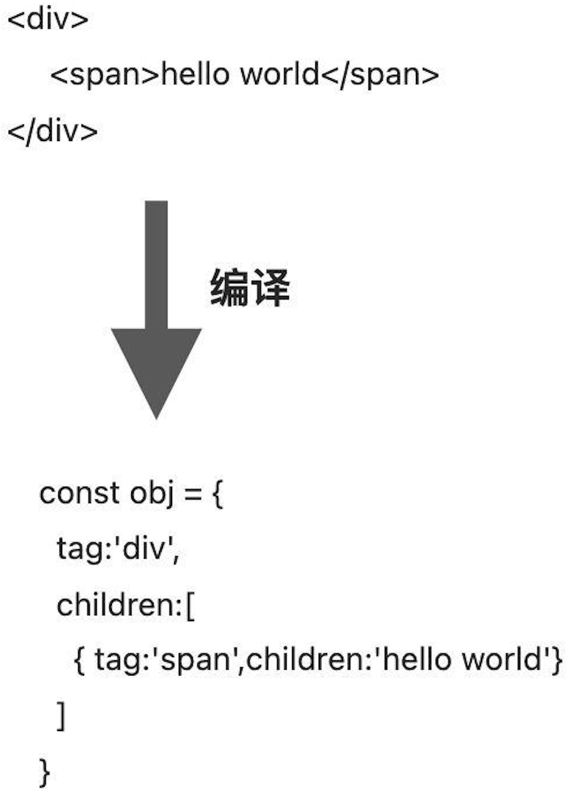
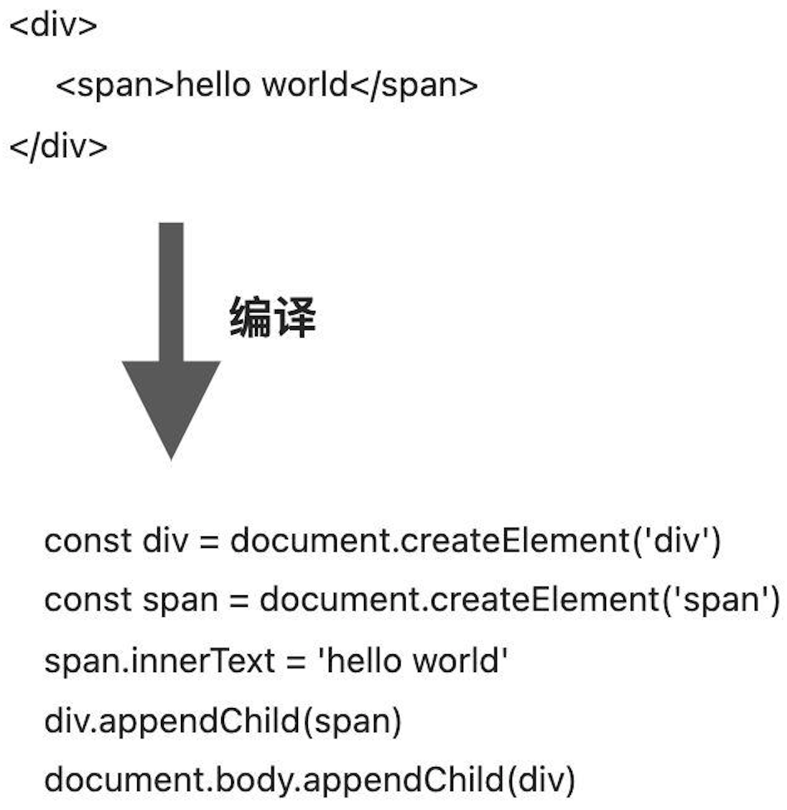

# 权衡的艺术
**框架的设计过程其实是一个不断取舍的过程**
<!-- 框架的设计过程其实是一个不断在**可维护性和性能**之间进行取舍的过程。 -->

## 编程范式
- 1、**命令式**

特点：**关注过程** 

例如: 获取 `id` 为 `app` 的 `div` 标签，它的文本内容为 `hello world`，为其绑定点击事件，当点击时弹出提示: `ok`
```js
const divEle = document.querySelector('#app')
divEle.innerText = 'hello world'
divEle.addEventListener('click', function () {
  alert('click')
})
```
自然语言描述能够与代码产生一一对应的关系，**代码本身描述的是做事的过程**。
- 2、**声明式**

特点：**关注结果**。

用 `Vue.js` 实现如上功能：
```vue
<div @click="() => alert('ok')">hello world</div>
```

可以看到，我们提供的是一个"结果"，至于如何实现这个"结果"，我们并不关心，实现该结果的**过程**，则是由 `Vue.js` 帮我们完成的。

换句话说， `Vue.js` 帮我们封装了**过程**。因此我们能够猜到 `Vue.js` 的内部实现一定是**命令式**的，而暴露给用户的却更加**声明式**。

:::tip 命令式 vs 声明式
**性能**： 命令式的性能 > 声明式的性能

**可维护性**：命令式的可维护性 < 声明式的可维护性
:::
## 企业应用的开发与设计原则
- 1、**项目成本**

决定项目成本的是**开发周期**，开发周期越长，所付出的人员成本就会越高，从而导致项目成本变的越高。

由于声明式的开发范式在可维护性上是大于命令式的，它从一定程度上就决定了，它会使项目的: **开发周期变短、升级变得更容易**，从而大量节约开发成本。
- 2、**开发体验**

心智负担可以作为衡量开发难易度的一个标准，心智负担高则证明开发的难度越高，低则表示开发的难度较低，开发更加舒服。

由于声明式的开发难度明显低于命令式的开发难度，所以对于开发体验而言，**声明式的开发体验更好**，也就是心智负担更低。

因此在企业级项目开发中，**声明式明显优于命令式**

## 运行时
比如框架提供 `Render` 函数，接收一个树型结构的数据对象，该函数会根据该对象递归地将数据渲染成 dom 元素。

```js
function Render(obj, root) { // 定义
  const el = document.createElement(obj.tag)
  if (typeof obj.children === 'string') {
    const text = document.createTextNode(obj.children)
    el.appendChild(text)
  } else {
    // 递归调用 Render，使用 el 作为 root 参数
    obj.children.forEach((child) => Render(child, el))
  }
  
  //将元素添加到root
  root.appendChild(el)
} 

const obj = {
  tag: 'div',
  children: [
    { tag: 'span', children: 'hello world'}
  ]
}
Render(obj, document.body) // 调用
```
这个 `Render` 函数，标志着这个框架就是一个纯运行时的框架。
:::warning 缺点:
- 1、手写树型结构的数据对象太麻烦，而且不直观。
- 2、不能支持用类似于 `HTML` 标签的方式描述树型结构的数据对象
:::

<!-- 总结：可以利用 `render` 把 `vnode` 渲染成真实 `dom` 节点(`runtime-core`)。 -->

## 运行时 + 编译时

引入 `Compiler` 函数首先把 `HTML` 标签编译成树型结构的数据对象，再让用户调用 `Render` 函数。



```js
const html = `
  <div>
    <span>hello world</span>
  </div>
`
const obj = Compiler(html)

//再调用Render进行渲染
Render(obj, document.body) 
```
此时我们的框架就变成了一个 `运行时 + 编译时` 的框架：
:::tip 特点
- 1、它既支持运行时，用户可以直接提供数据对象从而无需编译。
- 2、又支持编译时，用户可以提供 `HTML` 字符串，我们将其编译为数据对象后再交给运行时处理。
:::

<!-- 总结：可以利用 `compile` 把 `template` 编译成 `render` 函数，然后再利用 `运行时` 通过 `render` 挂载对应的 `dom`(`compile-core`) -->

## 编译时
把一段 `HTML` 字符串编译为**命令式**代码的过程。此时只需要 `Compiler` 函数即可， 不在需要 `Render`， 此时就变成了一个纯编译时的框架。



:::warning 缺点:
- 1、不需要任何运行时，直接编译成可执行的 `javascript`代码， 性能可能会更好。
- 2、这种做法有损灵活性，即用户的内容必须编译后才能用。
:::

## 总结 
- 1、`Vue.js` 封装了`命令式`的逻辑，而对外暴露了`声明式`的接口。
- 2、`Vue.js` 保持了`运行时 + 编译时`，在保证灵活的基础上能够尽可能地去优化。在编译优化阶段，你会看到 `Vue.js` 在保留运行时的情况下，其性能甚至不输纯编译时。
- 3、设计原则: **在保证可维护性的基础上，尽可能的减少性能的损耗**
